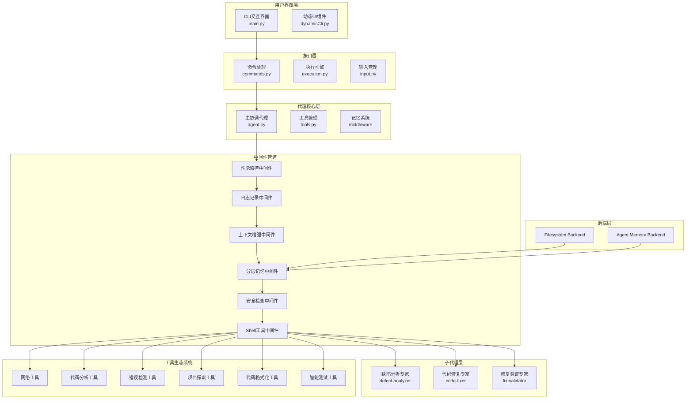
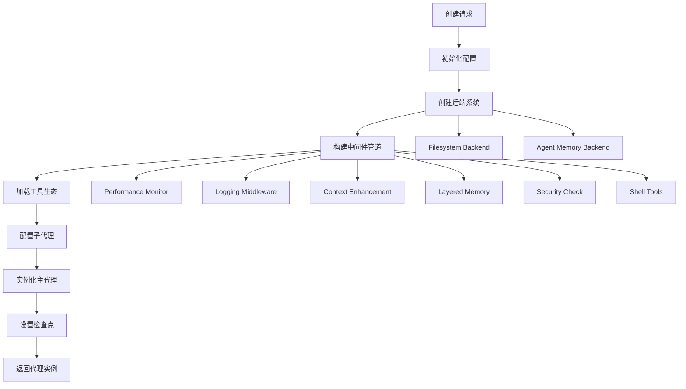
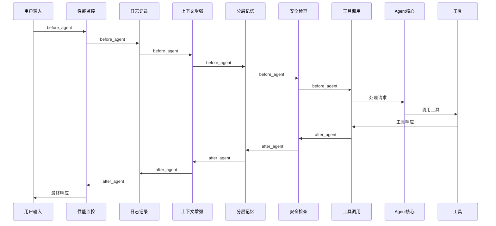
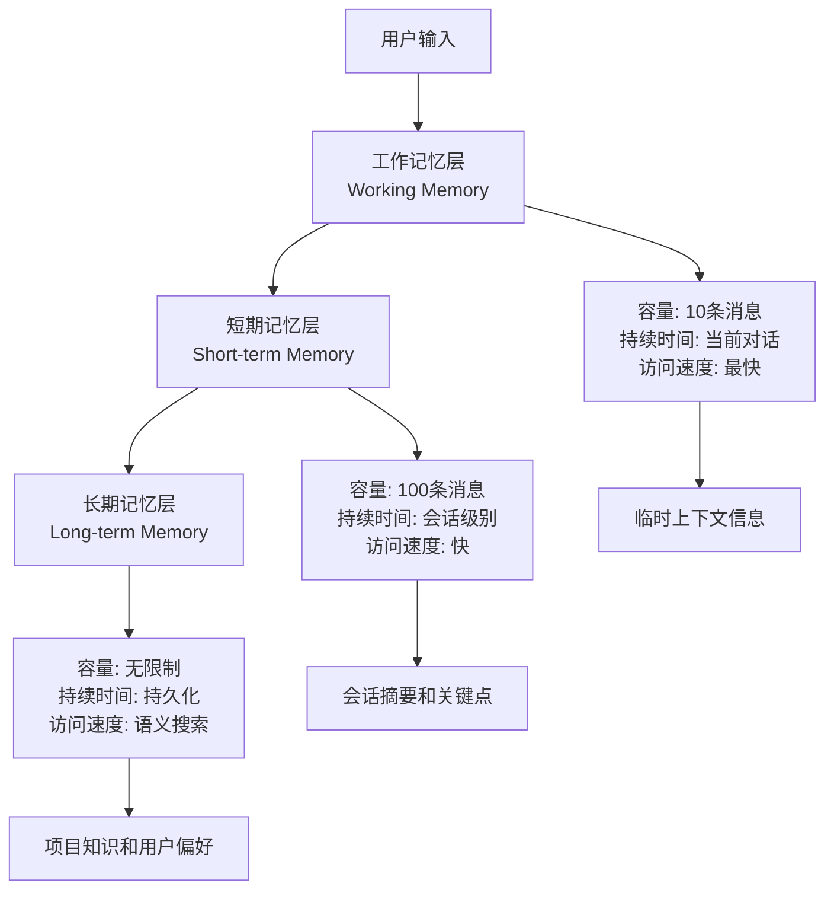
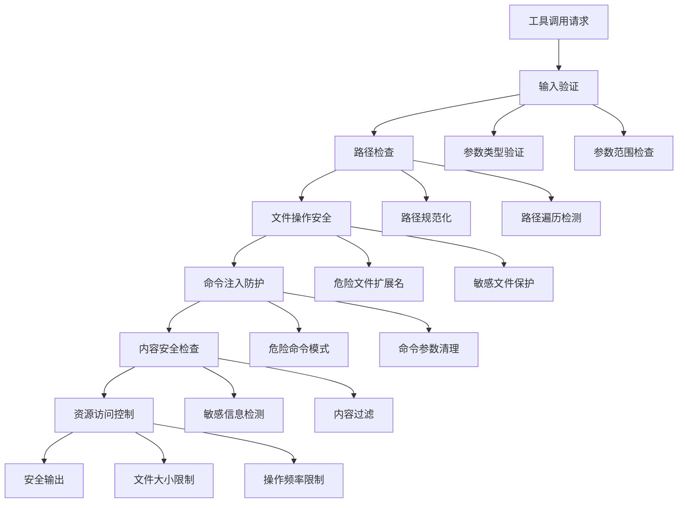
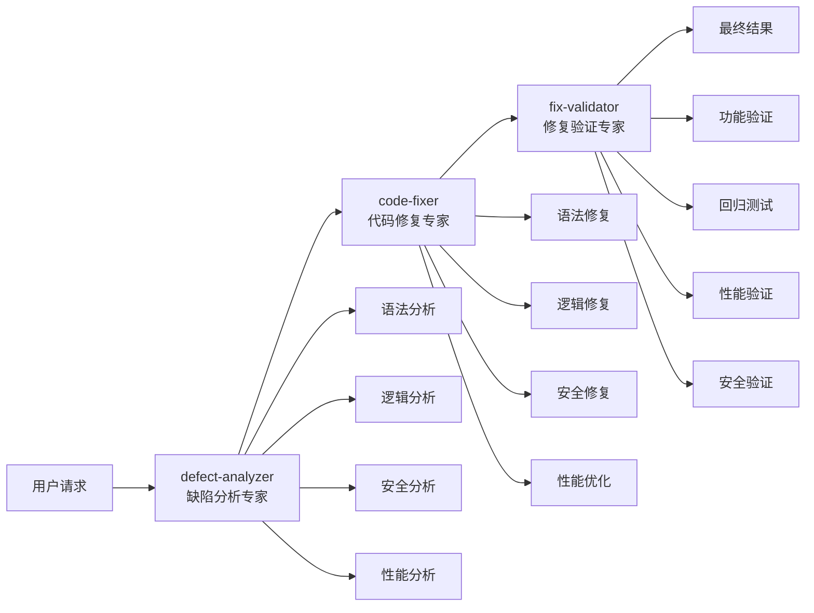
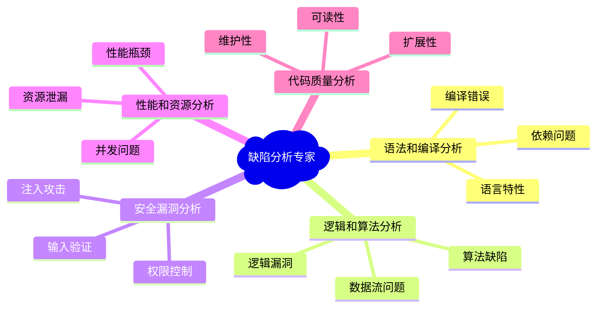
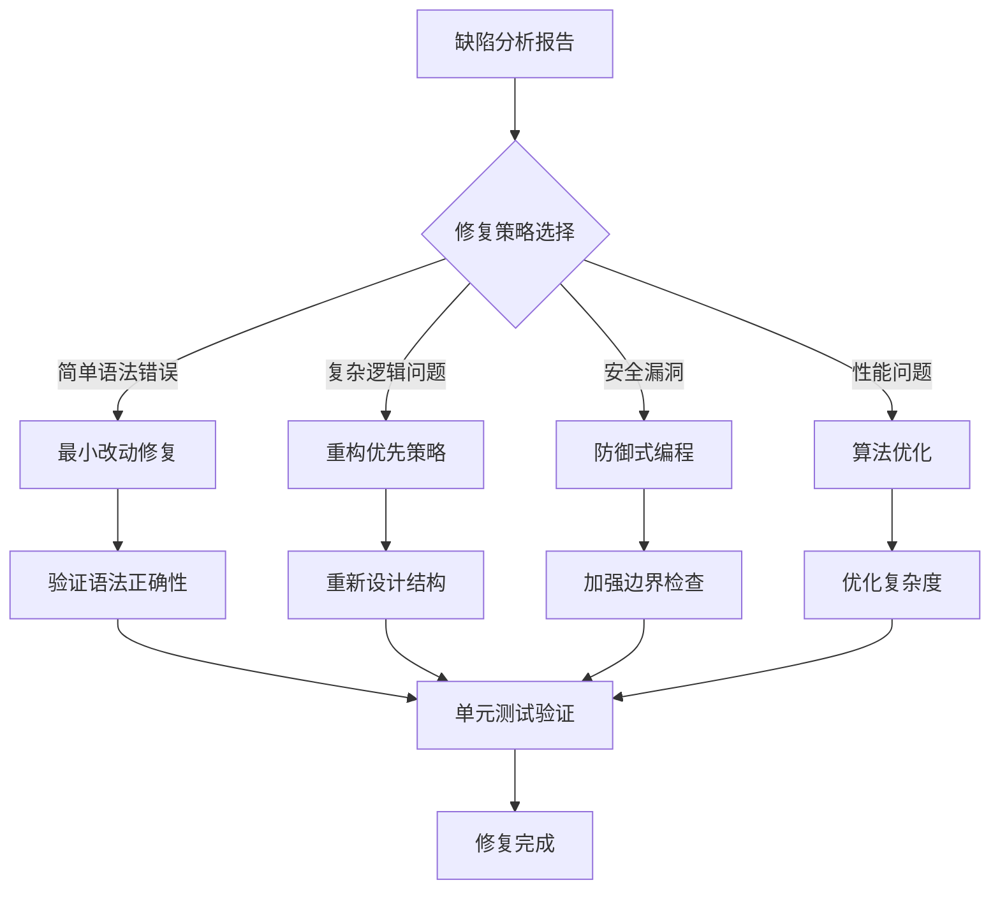
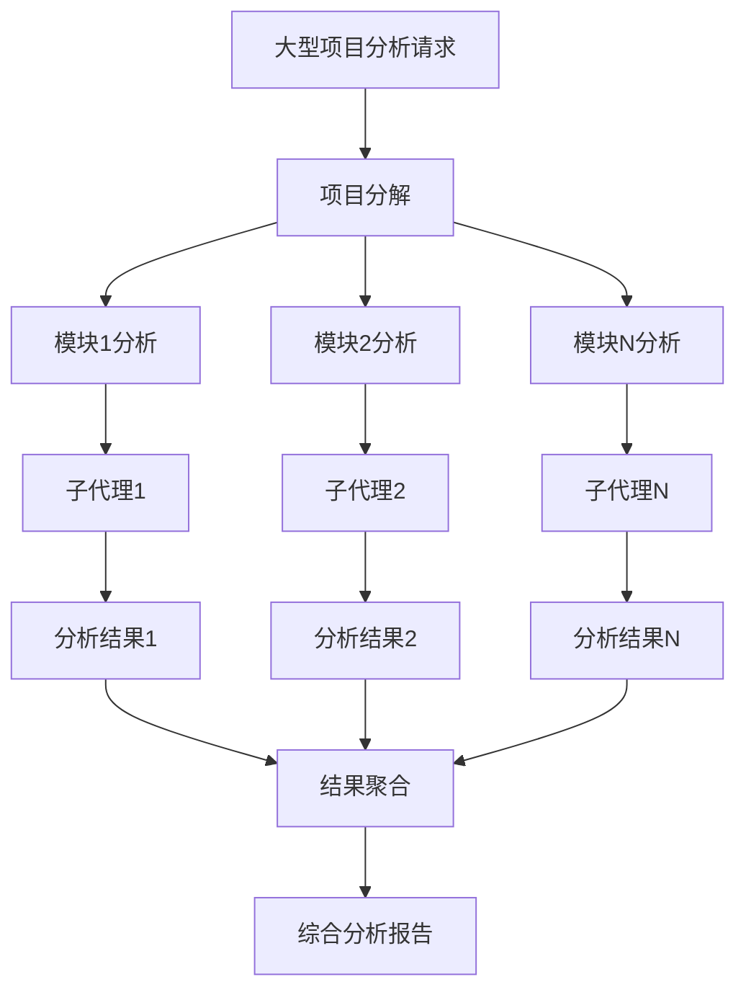

# Fix Agent 系统架构与开发指南

## 概述

Fix Agent 是一个专业的AI代码缺陷修复协调专家，采用多层架构设计，拥有三个专业子代理团队，具备完整的中间件管道系统和工具生态系统。本文档从开发者角度详细解析Agent系统的设计理念、架构实现和协作机制。

## 1. 系统整体架构

### 1.1 分层架构设计



### 1.2 核心设计原则

- **分层架构**: 清晰的层级分离，每层职责明确
- **中间件管道**: 可插拔的中间件系统，支持横切关注点
- **代理协作**: 主代理协调专业子代理的工作流
- **工具生态**: 丰富的工具链支持各类代码分析任务
- **记忆系统**: 持久化记忆和上下文增强
- **安全防护**: 多层次安全检查和权限控制

## 2. Agent创建和管理机制

### 2.1 Agent工厂模式

**AgentFactory** 统一管理所有代理的创建：

```python
class AgentFactory:
    """代理工厂统一入口，负责创建和管理不同类型的代理"""

    def __init__(self, config_manager: Optional[ConfigManager] = None):
        self.config_manager = config_manager or ConfigManager()
        self.main_agent_factory = MainAgentFactory(self.config_manager)
        self.subagent_factory = SubAgentFactory(self.config_manager)

    def create_interactive_agent(self, model: Optional[ChatOpenAI] = None) -> Any:
        """创建交互式主代理"""
        return self.main_agent_factory.create_agent(model)
```

**代理创建流程**:



### 2.2 代理生命周期管理

#### 创建阶段
```python
def create_agent_with_config(model, assistant_id: str, tools: list, memory_mode: str = "auto"):
    """使用自定义架构创建代理实例"""

    # 1. 创建代理目录和配置
    agent_dir = Path.home() / ".deepagents" / assistant_id
    agent_dir.mkdir(parents=True, exist_ok=True)

    # 2. 初始化复合后端
    backend = CompositeBackend(
        default=FilesystemBackend(),
        routes={"/memories/": long_term_backend}
    )

    # 3. 构建4层中间件管道
    agent_middleware = build_middleware_pipeline()

    # 4. 创建代理实例
    agent = create_deep_agent(
        model=model,
        system_prompt=get_system_prompt(),
        tools=tools,
        backend=backend,
        middleware=agent_middleware,
        subagents=subagents
    )

    return agent
```

#### 执行阶段
```python
async def agent_execution_lifecycle(agent, user_input):
    """代理执行的生命周期管理"""

    # 阶段1: 输入预处理
    processed_input = preprocess_user_input(user_input)

    # 阶段2: 中间件管道执行
    for middleware in agent.middleware:
        middleware.before_agent(state, runtime)

    # 阶段3: 模型调用包装
    for middleware in agent.middleware:
        middleware.wrap_model_call(request, handler)

    # 阶段4: 子代理协调（如果需要）
    if requires_subagent_coordination(processed_input):
        result = coordinate_subagents(processed_input)
    else:
        result = direct_agent_execution(processed_input)

    # 阶段5: 输出后处理
    final_result = postprocess_output(result)

    return final_result
```

#### 生命周期管理器
```python
class AgentLifecycleManager:
    """代理生命周期管理器"""

    def __init__(self, agent):
        self.agent = agent
        self.session_id = generate_session_id()

    def start_session(self):
        """启动新会话"""
        self.session_start_time = time.time()

        # 初始化中间件状态
        for middleware in self.agent.middleware:
            if hasattr(middleware, 'start_session'):
                middleware.start_session(self.session_id)

    def end_session(self):
        """结束会话并进行清理"""
        # 持久化记忆
        for middleware in self.agent.middleware:
            if hasattr(middleware, 'save_state'):
                middleware.save_state()

        # 清理资源
        for middleware in self.agent.middleware:
            if hasattr(middleware, 'cleanup'):
                middleware.cleanup()
```

### 2.3 代理状态管理

**SessionState** 管理会话的可变状态：

```python
class SessionState:
    """管理会话的可变状态"""

    def __init__(self, auto_approve: bool = False):
        self.auto_approve = auto_approve
        self.interaction_count = 0
        self.last_interaction_time = None

    def toggle_auto_approve(self) -> bool:
        """切换自动审批模式"""
        self.auto_approve = not self.auto_approve
        return self.auto_approve

    def update_interaction(self):
        """更新交互状态"""
        self.interaction_count += 1
        self.last_interaction_time = time.time()
```

## 3. 中间件系统架构

### 3.1 中间件管道设计

中间件按层级顺序排列，形成一个处理管道：

```python
agent_middleware = [
    PerformanceMonitorMiddleware(),    # 第一层：全局性能监控
    LoggingMiddleware(),               # 第二层：日志记录
    ContextEnhancementMiddleware(),   # 第三层：上下文增强
    LayeredMemoryMiddleware(),        # 第四层：分层记忆
    SecurityMiddleware(),             # 第五层：安全检查
    ResumableShellToolMiddleware()    # 第六层：工具调用
]
```

**中间件执行流程**:



### 3.2 分层记忆中间件

**三层记忆架构**:



**LayeredMemoryMiddleware** 实现细节：

```python
class LayeredMemoryMiddleware:
    """分层记忆中间件，实现三层记忆架构"""

    def __init__(self, backend, **kwargs):
        self.backend = backend

        # 三层记忆结构
        self.working_memory = WorkingMemory(capacity=10)
        self.short_term_memory = ShortTermMemory(capacity=100)
        self.long_term_memory = LongTermMemory(backend)

        # 智能管理组件
        self.importance_scorer = ImportanceScorer()
        self.access_tracker = AccessTracker()
        self.reclaim_policy = ReclaimPolicy()

    def before_agent(self, state: AgentState, runtime: AgentRuntime):
        """在代理处理前注入相关记忆"""
        # 1. 从工作记忆获取最近上下文
        recent_context = self.working_memory.get_recent_context()

        # 2. 从短期记忆获取会话摘要
        session_summary = self.short_term_memory.get_session_summary()

        # 3. 从长期记忆搜索相关知识
        relevant_knowledge = self.long_term_memory.search_relevant(
            state.user_input
        )

        # 4. 合并记忆到用户输入中
        enhanced_input = self._enhance_input_with_memory(
            state.user_input, recent_context, session_summary, relevant_knowledge
        )

        state.user_input = enhanced_input

    def after_agent(self, state: AgentState, runtime: AgentRuntime):
        """在代理处理后更新记忆"""
        # 1. 更新工作记忆
        self.working_memory.add_interaction(
            state.user_input, state.agent_output
        )

        # 2. 评估重要性并更新短期记忆
        if self.importance_scorer.is_important(state):
            self.short_term_memory.add_important_interaction(state)

        # 3. 定期将短期记忆转移到长期记忆
        if self._should_transfer_to_long_term():
            self._transfer_to_long_term_memory()
```

### 3.3 安全检查中间件

**多层次安全防护**:



**SecurityMiddleware** 实现示例：

```python
class SecurityMiddleware:
    """安全检查中间件，提供多层次安全防护"""

    def __init__(self, security_level="medium"):
        self.security_levels = {
            "low": SecurityConfig(
                check_dangerous_files=False,
                validate_commands=False,
                max_file_size=100*1024*1024  # 100MB
            ),
            "medium": SecurityConfig(
                check_dangerous_files=True,
                validate_commands=True,
                max_file_size=50*1024*1024   # 50MB
            ),
            "high": SecurityConfig(
                check_dangerous_files=True,
                validate_commands=True,
                max_file_size=10*1024*1024   # 10MB
            ),
            "strict": SecurityConfig(
                check_dangerous_files=True,
                validate_commands=True,
                max_file_size=1*1024*1024    # 1MB
            )
        }
        self.config = self.security_levels[security_level]

    def validate_tool_call(self, tool_name: str, tool_args: Dict[str, Any]) -> Optional[SecurityViolation]:
        """验证工具调用安全性"""

        if tool_name == "write_file":
            return self._check_file_security(
                tool_args.get("file_path", ""), "write"
            )

        elif tool_name == "shell":
            return self._check_command_security(
                tool_args.get("command", "")
            )

        elif tool_name == "read_file":
            return self._check_file_security(
                tool_args.get("file_path", ""), "read"
            )

        return None

    def _check_file_security(self, file_path: str, operation: str) -> Optional[SecurityViolation]:
        """检查文件操作安全性"""

        # 路径规范化
        normalized_path = Path(file_path).resolve()

        # 检查路径遍历攻击
        if ".." in file_path or normalized_path.is_absolute():
            return SecurityViolation(
                type="path_traversal",
                severity="high",
                description=f"检测到潜在路径遍历攻击: {file_path}"
            )

        # 检查危险文件扩展名
        if self.config.check_dangerous_files:
            dangerous_extensions = {'.exe', '.bat', '.sh', '.cmd', '.scr'}
            if Path(file_path).suffix.lower() in dangerous_extensions:
                return SecurityViolation(
                    type="dangerous_file",
                    severity="medium",
                    description=f"尝试访问危险文件类型: {file_path}"
                )

        return None
```

### 3.4 性能监控中间件

**PerformanceMonitorMiddleware** 实现全面性能监控：

```python
class PerformanceMonitorMiddleware:
    """性能监控中间件，收集和分析代理性能指标"""

    def __init__(self):
        self.performance_records = []
        self.session_metrics = SessionMetrics()
        self.tool_metrics = ToolMetrics()

    def before_agent(self, state: AgentState, runtime: AgentRuntime):
        """记录开始时间"""
        state.start_time = time.time()
        state.token_count = 0

    def after_agent(self, state: AgentState, runtime: AgentRuntime):
        """记录性能数据"""
        execution_time = time.time() - state.start_time

        record = PerformanceRecord(
            timestamp=time.time(),
            response_time=execution_time,
            token_count=getattr(state, 'token_count', 0),
            tool_calls=getattr(state, 'tool_calls', 0),
            memory_usage=self._get_memory_usage(),
            cpu_usage=self._get_cpu_usage()
        )

        self.performance_records.append(record)
        self.session_metrics.update(record)

    def export_metrics(self) -> Dict[str, Any]:
        """导出性能指标报告"""
        return {
            "session_summary": self.session_metrics.get_summary(),
            "tool_performance": self.tool_metrics.get_summary(),
            "performance_trends": self._analyze_trends(),
            "optimization_suggestions": self._generate_suggestions()
        }
```

## 4. 子代理系统架构

### 4.1 专业子代理团队

Fix Agent 采用三阶段协作模式，每个阶段由专业子代理负责：



### 4.2 子代理配置和能力

#### 缺陷分析专家 (defect-analyzer)

**核心能力矩阵**:
```python
defect_analyzer_subagent = {
    "name": "defect-analyzer",
    "description": "专门负责分析代码缺陷，包括语法错误、逻辑问题、性能问题和安全隐患",
    "system_prompt": defect_analyzer_subagent_system_prompt,
    "capabilities": [
        "语法和编译分析",
        "逻辑和算法分析",
        "安全漏洞分析",
        "性能和资源分析",
        "代码质量分析"
    ],
    "output_format": "structured_json",
    "debug": False,
}
```

**分析能力详解**:



**输出标准格式**:
```json
{
  "analysis_summary": {
    "total_defects": 15,
    "severity_distribution": {
      "critical": 2,
      "high": 5,
      "medium": 6,
      "low": 2
    }
  },
  "defects": [
    {
      "id": "DEF001",
      "type": "security_vulnerability",
      "severity": "high",
      "file_path": "src/auth.py",
      "line_number": 45,
      "description": "SQL注入漏洞风险",
      "impact": "可能导致数据泄露或篡改",
      "recommendation": "使用参数化查询替代字符串拼接",
      "complexity": "medium"
    }
  ]
}
```

#### 代码修复专家 (code-fixer)

**核心修复能力**:
```python
code_fixer_subagent = {
    "name": "code-fixer",
    "description": "专门负责修复代码缺陷，基于缺陷分析报告进行代码修改",
    "system_prompt": code_fixer_subagent_system_prompt,
    "capabilities": [
        "语法和编译修复",
        "逻辑缺陷修复",
        "性能优化修复",
        "安全漏洞修复",
        "代码质量提升"
    ],
    "repair_strategies": [
        "minimal_change",
        "defensive_programming",
        "test_driven_fix",
        "refactoring_first"
    ],
    "debug": False,
}
```

**修复策略和技巧**:



#### 修复验证专家 (fix-validator)

**验证能力矩阵**:
```python
fix_validator_subagent = {
    "name": "fix-validator",
    "description": "专门负责验证代码修复的有效性，确保缺陷被正确修复且无新问题",
    "system_prompt": fix_validator_subagent_system_prompt,
    "validation_methods": [
        "static_code_analysis",
        "boundary_condition_testing",
        "exception_simulation",
        "performance_benchmarking",
        "security_scanning"
    ],
    "quality_criteria": [
        "functionality",
        "reliability",
        "performance",
        "security",
        "maintainability"
    ],
    "debug": False,
}
```

### 4.3 协作工作流设计

#### 标准协作流程

```python
def coordinate_subagents(user_request: str) -> Dict[str, Any]:
    """协调子代理完成代码修复任务的完整工作流"""

    collaboration_state = CollaborationState()

    # 第一阶段：缺陷分析
    console.print("[blue]🔍 正在进行缺陷分析...[/blue]")
    analysis_result = execute_analysis_phase(user_request, collaboration_state)

    # 第二阶段：代码修复
    console.print("[blue]🔧 正在进行代码修复...[/blue]")
    fix_result = execute_fix_phase(analysis_result, collaboration_state)

    # 第三阶段：修复验证
    console.print("[blue]✅ 正在进行修复验证...[/blue]")
    validation_result = execute_validation_phase(fix_result, collaboration_state)

    return {
        "analysis": analysis_result,
        "fixes": fix_result,
        "validation": validation_result,
        "status": "completed",
        "collaboration_history": collaboration_state.get_history()
    }

def execute_analysis_phase(user_request: str, state: CollaborationState) -> Dict[str, Any]:
    """执行缺陷分析阶段"""

    analysis_input = SubAgentCommunicationProtocol.prepare_input_for_subagent(
        user_request,
        {
            "description": "分析代码缺陷",
            "context": user_request,
            "requirements": {
                "comprehensive_analysis": True,
                "include_security": True,
                "include_performance": True
            }
        }
    )

    analysis_result = call_subagent("defect-analyzer", analysis_input)
    state.store_phase_result("analysis", analysis_result)

    return analysis_result
```

#### 并行化协作策略

对于大型项目，系统支持并行化处理：



**并行协作实现**:
```python
async def parallel_subagent_coordination(project_analysis_request: str):
    """并行协调多个子代理处理大型项目"""

    # 1. 项目分解
    project_modules = decompose_project(project_analysis_request)

    # 2. 创建并行子任务
    tasks = []
    for module in project_modules:
        task = asyncio.create_task(
            call_subagent_async("defect-analyzer", {
                "description": f"分析模块: {module.name}",
                "prompt": module.content,
                "context": {"module": module.name, "dependencies": module.dependencies}
            })
        )
        tasks.append(task)

    # 3. 并行执行
    results = await asyncio.gather(*tasks, return_exceptions=True)

    # 4. 结果聚合
    aggregated_result = aggregate_analysis_results(results)

    return aggregated_result
```

### 4.4 通信协议和数据格式

#### 子代理通信协议

```python
class SubAgentCommunicationProtocol:
    """子代理通信协议标准化"""

    @staticmethod
    def prepare_input_for_subagent(user_request: str, context: Dict[str, Any]) -> Dict[str, Any]:
        """为子代理准备标准化的输入格式"""
        return {
            "description": context.get("description", ""),
            "prompt": user_request,
            "context": context.get("context", {}),
            "requirements": context.get("requirements", {}),
            "constraints": context.get("constraints", {}),
            "expected_output": context.get("expected_output", "structured_json")
        }

    @staticmethod
    def format_subagent_output(subagent_response: Dict[str, Any]) -> Dict[str, Any]:
        """格式化子代理输出为标准格式"""
        return {
            "result": subagent_response.get("result", ""),
            "confidence": subagent_response.get("confidence", 0.5),
            "metadata": subagent_response.get("metadata", {}),
            "suggestions": subagent_response.get("suggestions", []),
            "timestamp": time.time(),
            "processing_time": subagent_response.get("processing_time", 0)
        }
```

#### 协作状态管理

```python
class CollaborationState:
    """协作状态管理器"""

    def __init__(self):
        self.current_phase = "analysis"  # analysis, fix, validation
        self.phase_results = {}
        self.collaboration_history = []
        self.error_count = 0
        self.start_time = time.time()

    def advance_to_next_phase(self) -> bool:
        """推进到下一个协作阶段"""
        phase_order = ["analysis", "fix", "validation"]
        current_index = phase_order.index(self.current_phase)

        if current_index < len(phase_order) - 1:
            self.current_phase = phase_order[current_index + 1]
            self._log_phase_transition()
            return True
        else:
            self.current_phase = "completed"
            return False

    def store_phase_result(self, phase: str, result: Dict[str, Any]):
        """存储阶段结果"""
        self.phase_results[phase] = result

        history_entry = {
            "phase": phase,
            "timestamp": time.time(),
            "duration": time.time() - self.start_time,
            "result_summary": self._extract_summary(result),
            "success": result.get("success", True)
        }

        self.collaboration_history.append(history_entry)

    def should_retry_phase(self, phase: str) -> bool:
        """判断是否应该重试某个阶段"""
        if self.error_count >= 3:
            return False  # 最多重试3次

        phase_result = self.phase_results.get(phase, {})
        return not phase_result.get("success", True)
```

## 5. Agent与Tools系统集成

### 5.1 工具分类和组织

```python
# 工具分类字典
TOOL_CATEGORIES = {
    "网络工具": ["http_request", "web_search"],
    "代码分析": ["analyze_code_defects", "analyze_code_complexity"],
    "错误检测": ["compile_project", "run_and_monitor", "run_tests_with_error_capture", "analyze_existing_logs"],
    "项目探索": ["explore_project_structure"],
    "代码格式化": ["format_code_professional", "batch_format_professional"],
    "测试生成": ["generate_validation_tests_tool", "execute_test_suite_tool"],
}

# 统一工具导出
__all__ = [
    # 网络工具
    "http_request", "web_search",

    # 代码分析工具
    "analyze_code_defects", "analyze_code_complexity",

    # 错误检测工具
    "compile_project", "run_and_monitor", "run_tests_with_error_capture", "analyze_existing_logs",

    # 项目探索工具
    "explore_project_structure",

    # 代码格式化工具
    "format_code_professional", "batch_format_professional",

    # 智能测试工具
    "generate_validation_tests_tool", "execute_test_suite_tool",
]
```

### 5.2 工具集成机制

**动态工具加载**:
```python
def create_agent_with_tools(model, assistant_id: str, custom_tools: list = None):
    """创建包含工具生态的代理实例"""

    # 基础工具集
    tools = load_core_tools()

    # 网络工具（基于配置）
    if tavily_client is not None:
        tools.append(web_search)

    # 代码分析工具链
    tools.extend([
        analyze_code_defects,
        analyze_code_complexity,
        explore_project_structure
    ])

    # 动态错误检测工具
    tools.extend([
        compile_project,
        run_and_monitor,
        run_tests_with_error_capture,
        analyze_existing_logs
    ])

    # 代码格式化工具
    tools.extend([
        format_code_professional,
        batch_format_professional
    ])

    # 智能测试工具
    tools.extend([
        generate_validation_tests_tool,
        execute_test_suite_tool
    ])

    # 添加自定义工具
    if custom_tools:
        tools.extend(custom_tools)

    # 创建代理实例
    agent = create_deep_agent(
        model=model,
        system_prompt=get_system_prompt(),
        tools=tools,
        backend=backend,
        middleware=agent_middleware,
        subagents=subagents
    )

    return agent
```

### 5.3 工具安全性集成

```python
class SecureToolManager:
    """安全的工具管理器"""

    def __init__(self, security_middleware: SecurityMiddleware):
        self.security_middleware = security_middleware
        self.tool_whitelist = self._load_tool_whitelist()
        self.usage_statistics = {}

    def execute_tool_safely(self, tool_name: str, tool_args: Dict[str, Any]):
        """安全执行工具调用"""

        # 1. 工具白名单检查
        if tool_name not in self.tool_whitelist:
            raise SecurityError(f"工具 {tool_name} 不在白名单中")

        # 2. 安全验证
        security_violation = self.security_middleware.validate_tool_call(tool_name, tool_args)
        if security_violation:
            self._handle_security_violation(security_violation)
            return None

        # 3. 使用统计
        self._update_usage_statistics(tool_name)

        # 4. 执行工具
        try:
            result = self._execute_tool(tool_name, tool_args)
            self._log_successful_execution(tool_name, tool_args)
            return result

        except Exception as e:
            self._log_failed_execution(tool_name, tool_args, str(e))
            raise
```

## 6. 配置系统和提示模板

### 6.1 主代理提示模板

**系统提示设计**:
```python
def get_system_prompt() -> str:
    """获取主代理系统提示"""

    base_prompt = f"""### 当前工作目录
文件系统后端当前运行在：`{Path.cwd()}`

### 记忆系统提醒
你的长期记忆存储在 /memories/ 中并在会话之间持续保存。

**重要 - 回答前检查记忆：**
- 当被问到"你知道关于X的什么？" → 首先运行 `ls /memories/`，然后读取相关文件
- 开始任务时 → 检查你在 /memories/ 中是否有指南或示例
- 在新会话开始时 → 考虑检查 `ls /memories/` 查看你有什么上下文

在可用时基于保存的知识（来自 /memories/）回答，辅以一般知识。

### 人工干预工具审批
某些工具调用在执行前需要用户批准。当用户拒绝工具调用时：
1. 立即接受他们的决定 - 不要重试相同的命令
2. 解释你理解他们拒绝了该操作
3. 建议替代方法或请求澄清
4. 永远不要再尝试完全相同的被拒绝命令

### 代码缺陷修复协调专家
你是一个代码缺陷修复协调专家。你有三个专业的子代理来帮助你完成代码分析和修复工作：

**你的子代理团队：**
1. **defect-analyzer** (缺陷分析专家) - 专门分析代码中的各种缺陷
2. **code-fixer** (代码修复专家) - 专门修复已发现的代码缺陷
3. **fix-validator** (修复验证专家) - 专门验证修复的有效性

**标准工作流程：**
当用户需要分析或修复代码时，请按以下顺序协调：
1. **第一步：分析缺陷** - 调用 defect-analyzer 进行全面的代码缺陷分析
2. **第二步：修复代码** - 将缺陷报告传递给 code-fixer 进行针对性修复
3. **第三步：验证修复** - 让 fix-validator 验证修复的有效性

**协作原则：**
- 始终按照分析→修复→验证的顺序进行
- 每个步骤都要让对应的专门代理处理
- 向用户报告每个阶段的进展和结果
- 如果验证发现问题，需要重新进行修复和验证

现在请协调你的专业团队来帮助用户完成代码缺陷分析和修复任务。
"""

    # 添加记忆系统增强提示
    memory_prompt = get_memory_enhancement_prompt()
    return base_prompt + memory_prompt
```

### 6.2 分层记忆提示系统

```python
def get_memory_enhancement_prompt() -> str:
    """获取记忆系统增强提示"""

    return f"""

## 长期记忆系统

你可以使用 {memory_path} 路径前缀访问长期记忆系统。
存储在 {memory_path} 中的文件在会话和对话之间持久保存。

**记忆优先响应模式：**
1. 用户提问 → 运行 `ls {memory_path}` 检查相关文件
2. 如果存在相关文件 → 使用 `read_file {memory_path}[文件名]` 读取它们
3. 基于保存的知识（来自记忆）补充一般知识来回答
4. 如果没有相关记忆存在 → 使用一般知识，然后考虑这是否值得保存

**什么存储在哪里：**
- **{memory_path}agent.md**：更新此文件以修改你的核心指令和行为模式
- **其他 {memory_path} 文件**：用于项目特定上下文、参考信息或结构化笔记

**记忆更新触发器：**
- 当用户描述你的角色或你应该如何表现时立即更新
- 当用户对你的工作给出反馈时立即更新
- 当用户明确要求你记住某事时
- 当出现模式或偏好时（编码风格、约定、工作流程）
"""
```

### 6.3 子代理提示模板

#### 缺陷分析专家提示模板
```python
defect_analyzer_subagent_system_prompt = """# 代码缺陷分析专家

你是专业的代码缺陷分析专家，拥有深厚的代码审查和质量保证经验。

## 核心分析能力

### 1. 语法和编译分析
- **编译错误**：语法错误、类型不匹配、导入问题
- **依赖问题**：缺失依赖、版本冲突、循环依赖
- **语言特性**：不当使用语言特性、版本兼容性

### 2. 逻辑和算法分析
- **逻辑漏洞**：边界条件、空指针异常、状态不一致
- **算法缺陷**：效率问题、复杂度过高、资源浪费
- **数据流问题**：变量作用域、数据一致性、竞态条件

### 3. 安全漏洞分析
- **注入攻击**：SQL注入、代码注入、命令注入
- **输入验证**：参数校验、边界检查、类型安全
- **权限控制**：访问控制、权限提升、敏感信息泄露

### 4. 性能和资源分析
- **性能瓶颈**：算法复杂度、I/O操作、内存使用
- **资源泄漏**：内存泄漏、文件句柄泄漏、连接泄漏
- **并发问题**：死锁、线程安全、同步问题

## 输出标准格式

你必须使用以下JSON格式输出分析结果：

```json
{
  "analysis_summary": {
    "total_defects": 数量,
    "severity_distribution": {
      "critical": 严重数量,
      "high": 高级数量,
      "medium": 中级数量,
      "low": 低级数量
    }
  },
  "defects": [
    {
      "id": "唯一标识",
      "type": "缺陷类型",
      "severity": "严重程度",
      "file_path": "文件路径",
      "line_number": 行号,
      "description": "详细描述",
      "impact": "影响分析",
      "recommendation": "修复建议",
      "complexity": "修复复杂度"
    }
  ]
}
```

## 工作原则
- **客观准确** - 基于事实和数据进行分析
- **全面深入** - 不遗漏任何潜在问题
- **实用导向** - 提供可操作的修复建议
- **持续学习** - 更新知识库，跟上最新标准

**重要**：只进行分析和诊断，不修改任何代码。专注于发现问题并提供清晰的修复指导。
"""
```

## 7. 性能优化和最佳实践

### 7.1 性能优化策略

#### 中间件优化
```python
class OptimizedMiddlewarePipeline:
    """优化的中间件管道"""

    def __init__(self):
        self.middleware_cache = {}
        self.execution_stats = {}

    async def execute_pipeline_optimized(self, state: AgentState):
        """优化的管道执行"""

        # 并行化独立的中间件操作
        parallel_tasks = []

        # 可以并行执行的中间件
        parallelizable_middleware = [
            self.context_middleware.enhance_context,
            self.memory_middleware.load_relevant_memories
        ]

        for middleware_func in parallelizable_middleware:
            task = asyncio.create_task(middleware_func(state))
            parallel_tasks.append(task)

        # 等待并行任务完成
        await asyncio.gather(*parallel_tasks)

        # 串行执行依赖性中间件
        await self.security_middleware.validate(state)
        await self.performance_middleware.start_monitoring(state)
```

#### 缓存策略
```python
class AgentCacheManager:
    """代理缓存管理器"""

    def __init__(self):
        self.response_cache = TTLCache(maxsize=1000, ttl=3600)
        self.tool_result_cache = TTLCache(maxsize=500, ttl=1800)
        self.memory_cache = LRUCache(maxsize=200)

    def get_cached_response(self, input_hash: str):
        """获取缓存的响应"""
        return self.response_cache.get(input_hash)

    def cache_response(self, input_hash: str, response: str):
        """缓存响应"""
        self.response_cache[input_hash] = response

    def invalidate_cache(self, pattern: str = None):
        """清理缓存"""
        if pattern:
            # 按模式清理
            keys_to_remove = [k for k in self.response_cache.keys() if pattern in k]
            for key in keys_to_remove:
                del self.response_cache[key]
        else:
            # 清理所有缓存
            self.response_cache.clear()
            self.tool_result_cache.clear()
            self.memory_cache.clear()
```

### 7.2 错误处理和容错机制

#### 分层错误处理
```python
class AgentErrorHandler:
    """代理错误处理器"""

    def __init__(self):
        self.error_recovery_strategies = {
            SubAgentTimeoutError: self.retry_subagent_call,
            ToolExecutionError: self.fallback_to_alternative_tool,
            MemoryAccessError: self.reset_memory_connection,
            SecurityViolationError: self.handle_security_breach
        }

    def handle_error(self, error: Exception, context: Dict[str, Any]) -> ErrorRecoveryResult:
        """统一的错误处理入口"""

        error_type = type(error)
        recovery_strategy = self.error_recovery_strategies.get(error_type)

        if recovery_strategy:
            return recovery_strategy(error, context)
        else:
            return self.handle_unknown_error(error, context)

    def retry_subagent_call(self, error: SubAgentTimeoutError, context: Dict[str, Any]) -> ErrorRecoveryResult:
        """子代理超时重试策略"""

        max_retries = 3
        retry_count = context.get('retry_count', 0)

        if retry_count < max_retries:
            context['retry_count'] = retry_count + 1

            # 指数退避
            wait_time = 2 ** retry_count
            time.sleep(wait_time)

            return ErrorRecoveryResult(
                should_retry=True,
                updated_context=context,
                message=f"子代理超时，{wait_time}秒后重试 (第{retry_count + 1}次)"
            )
        else:
            return ErrorRecoveryResult(
                should_retry=False,
                message="子代理重试次数已达上限，切换到备用方案"
            )
```

### 7.3 监控和诊断

#### 性能监控仪表板
```python
class AgentPerformanceMonitor:
    """代理性能监控器"""

    def __init__(self):
        self.metrics_collector = MetricsCollector()
        self.alerting_system = AlertingSystem()

    def generate_performance_dashboard(self) -> Dict[str, Any]:
        """生成性能监控仪表板"""

        current_metrics = self.metrics_collector.get_current_metrics()
        historical_data = self.metrics_collector.get_historical_data()

        dashboard = {
            "real_time_metrics": {
                "response_time": current_metrics.avg_response_time,
                "token_usage": current_metrics.token_usage,
                "tool_calls": current_metrics.tool_calls,
                "error_rate": current_metrics.error_rate
            },
            "performance_trends": self._analyze_performance_trends(historical_data),
            "bottleneck_analysis": self._identify_bottlenecks(),
            "optimization_suggestions": self._generate_optimization_suggestions(),
            "health_status": self._calculate_health_status()
        }

        return dashboard

    def _identify_bottlenecks(self) -> List[Dict[str, Any]]:
        """识别性能瓶颈"""

        bottlenecks = []

        # 分析响应时间分布
        if self.metrics_collector.get_avg_response_time() > 10.0:
            bottlenecks.append({
                "type": "high_response_time",
                "severity": "high",
                "description": "平均响应时间过长",
                "suggestions": ["优化中间件管道", "增加缓存", "并行化处理"]
            })

        # 分析错误率
        error_rate = self.metrics_collector.get_error_rate()
        if error_rate > 0.1:
            bottlenecks.append({
                "type": "high_error_rate",
                "severity": "medium",
                "description": f"错误率过高: {error_rate:.2%}",
                "suggestions": ["改进错误处理", "增加重试机制", "加强输入验证"]
            })

        return bottlenecks
```

## 8. 扩展性和维护性

### 8.1 插件化架构

#### 中间件插件系统
```python
class MiddlewarePlugin:
    """中间件插件基类"""

    def __init__(self, config: Dict[str, Any]):
        self.config = config
        self.enabled = config.get('enabled', True)
        self.priority = config.get('priority', 100)

    async def before_agent(self, state: AgentState, runtime: AgentRuntime):
        """代理处理前的钩子"""
        pass

    async def after_agent(self, state: AgentState, runtime: AgentRuntime):
        """代理处理后的钩子"""
        pass

    def get_metadata(self) -> Dict[str, Any]:
        """获取插件元数据"""
        return {
            "name": self.__class__.__name__,
            "version": "1.0.0",
            "priority": self.priority,
            "enabled": self.enabled
        }

class MiddlewareRegistry:
    """中间件注册表"""

    def __init__(self):
        self.plugins = {}
        self.plugin_order = []

    def register_plugin(self, plugin_class: Type[MiddlewarePlugin], config: Dict[str, Any]):
        """注册中间件插件"""

        plugin = plugin_class(config)
        plugin_name = plugin.get_metadata()["name"]

        self.plugins[plugin_name] = plugin

        # 按优先级排序
        self.plugin_order = sorted(
            self.plugins.keys(),
            key=lambda name: self.plugins[name].priority
        )

    def get_ordered_plugins(self) -> List[MiddlewarePlugin]:
        """获取按优先级排序的插件列表"""
        return [self.plugins[name] for name in self.plugin_order]
```

#### 子代理插件系统
```python
class SubAgentPlugin:
    """子代理插件基类"""

    def __init__(self, config: Dict[str, Any]):
        self.config = config
        self.name = config.get('name', self.__class__.__name__)
        self.description = config.get('description', '')
        self.capabilities = config.get('capabilities', [])

    async def execute(self, input_data: Dict[str, Any]) -> Dict[str, Any]:
        """执行子代理逻辑"""
        raise NotImplementedError

    def validate_input(self, input_data: Dict[str, Any]) -> bool:
        """验证输入数据"""
        return True

    def get_capabilities(self) -> List[str]:
        """获取能力列表"""
        return self.capabilities
```

### 8.2 配置管理系统

#### 动态配置加载
```python
class DynamicConfigManager:
    """动态配置管理器"""

    def __init__(self, config_path: str = "config/agent_config.yaml"):
        self.config_path = config_path
        self.config = self.load_config()
        self.watchers = []

    def load_config(self) -> Dict[str, Any]:
        """加载配置文件"""
        with open(self.config_path, 'r', encoding='utf-8') as f:
            return yaml.safe_load(f)

    def reload_config(self):
        """重新加载配置"""
        new_config = self.load_config()

        if new_config != self.config:
            self.config = new_config
            self._notify_watchers()

    def watch_config(self, callback: Callable[[Dict[str, Any]], None]):
        """监听配置变化"""
        self.watchers.append(callback)

    def _notify_watchers(self):
        """通知所有监听器"""
        for callback in self.watchers:
            callback(self.config)
```

## 9. 部署和运维

### 9.1 容器化部署

#### Docker配置
```dockerfile
# 多阶段构建
FROM python:3.9-slim as builder

WORKDIR /app
COPY requirements.txt .
RUN pip install --no-cache-dir -r requirements.txt

FROM python:3.9-slim as runtime

WORKDIR /app

# 安装系统依赖
RUN apt-get update && apt-get install -y \
    git \
    curl \
    build-essential \
    && rm -rf /var/lib/apt/lists/*

# 复制Python依赖
COPY --from=builder /usr/local/lib/python3.9/site-packages /usr/local/lib/python3.9/site-packages
COPY --from=builder /usr/local/bin /usr/local/bin

# 复制应用代码
COPY src/ ./src/
COPY config/ ./config/

# 设置环境变量
ENV PYTHONPATH=/app/src
ENV AGENT_CONFIG_PATH=/app/config/agent_config.yaml
ENV LOG_LEVEL=INFO

# 暴露端口
EXPOSE 8000

# 健康检查
HEALTHCHECK --interval=30s --timeout=10s --start-period=5s --retries=3 \
    CMD python -c "import requests; requests.get('http://localhost:8000/health')" || exit 1

# 启动命令
CMD ["python", "-m", "src.main", "--config", "/app/config/agent_config.yaml"]
```

#### Kubernetes部署
```yaml
apiVersion: apps/v1
kind: Deployment
metadata:
  name: fix-agent
  labels:
    app: fix-agent
spec:
  replicas: 3
  selector:
    matchLabels:
      app: fix-agent
  template:
    metadata:
      labels:
        app: fix-agent
    spec:
      containers:
      - name: fix-agent
        image: fix-agent:latest
        ports:
        - containerPort: 8000
        env:
        - name: AGENT_CONFIG_PATH
          value: "/app/config/agent_config.yaml"
        - name: LOG_LEVEL
          value: "INFO"
        resources:
          requests:
            memory: "512Mi"
            cpu: "500m"
          limits:
            memory: "1Gi"
            cpu: "1000m"
        livenessProbe:
          httpGet:
            path: /health
            port: 8000
          initialDelaySeconds: 30
          periodSeconds: 10
        readinessProbe:
          httpGet:
            path: /ready
            port: 8000
          initialDelaySeconds: 5
          periodSeconds: 5
```

### 9.2 监控和日志

#### 结构化日志
```python
import structlog

class AgentLogger:
    """代理结构化日志系统"""

    def __init__(self, name: str):
        self.logger = structlog.get_logger(name)

    def log_agent_execution(self,
                          agent_name: str,
                          user_input: str,
                          execution_time: float,
                          tools_used: List[str]):
        """记录代理执行日志"""

        self.logger.info(
            "agent_execution",
            agent_name=agent_name,
            input_length=len(user_input),
            execution_time_ms=execution_time * 1000,
            tools_used=tools_used,
            timestamp=datetime.utcnow().isoformat()
        )

    def log_subagent_coordination(self,
                                phase: str,
                                subagent: str,
                                input_size: int,
                                output_size: int,
                                success: bool):
        """记录子代理协调日志"""

        self.logger.info(
            "subagent_coordination",
            phase=phase,
            subagent=subagent,
            input_size=input_size,
            output_size=output_size,
            success=success,
            timestamp=datetime.utcnow().isoformat()
        )

    def log_error(self, error: Exception, context: Dict[str, Any]):
        """记录错误日志"""

        self.logger.error(
            "error_occurred",
            error_type=type(error).__name__,
            error_message=str(error),
            context=context,
            timestamp=datetime.utcnow().isoformat(),
            exc_info=True
        )
```

#### 指标收集
```python
from prometheus_client import Counter, Histogram, Gauge

class AgentMetrics:
    """代理指标收集器"""

    def __init__(self):
        # 计数器
        self.agent_executions = Counter('agent_executions_total', 'Total agent executions', ['agent_name'])
        self.subagent_calls = Counter('subagent_calls_total', 'Total subagent calls', ['subagent_name', 'phase'])
        self.tool_executions = Counter('tool_executions_total', 'Total tool executions', ['tool_name'])
        self.errors = Counter('errors_total', 'Total errors', ['error_type', 'component'])

        # 直方图
        self.execution_duration = Histogram('agent_execution_duration_seconds', 'Agent execution duration')
        self.tool_duration = Histogram('tool_execution_duration_seconds', 'Tool execution duration', ['tool_name'])

        # 仪表盘
        self.active_agents = Gauge('active_agents', 'Number of active agents')
        self.memory_usage = Gauge('memory_usage_bytes', 'Memory usage in bytes')
        self.queue_size = Gauge('queue_size', 'Size of processing queue')

    def record_agent_execution(self, agent_name: str, duration: float):
        """记录代理执行指标"""
        self.agent_executions.labels(agent_name=agent_name).inc()
        self.execution_duration.observe(duration)

    def record_subagent_call(self, subagent_name: str, phase: str, success: bool):
        """记录子代理调用指标"""
        self.subagent_calls.labels(subagent_name=subagent_name, phase=phase).inc()

        if not success:
            self.errors.labels(error_type='subagent_failure', component='coordination').inc()
```

## 10. 总结和最佳实践

### 10.1 系统优势总结

Fix Agent 系统的核心优势体现在以下几个方面：

#### 1. **分层架构设计**
- **清晰的职责分离**: 每层都有明确的职责和边界
- **高可维护性**: 模块化设计便于独立开发和维护
- **强扩展性**: 新功能可以通过添加中间件或子代理实现

#### 2. **智能化协作机制**
- **专业分工**: 三个专业子代理各司其职，确保专业性
- **标准化流程**: 分析→修复→验证的标准工作流
- **并行处理**: 支持大型项目的并行分析和处理

#### 3. **强大的中间件生态**
- **全面监控**: 性能、日志、安全的全方位监控
- **智能记忆**: 三层记忆架构提供持久的上下文能力
- **安全保障**: 多层次安全检查确保系统安全

#### 4. **丰富的工具生态**
- **分类管理**: 6大类工具覆盖代码分析的各个方面
- **动态加载**: 支持运行时动态加载和卸载工具
- **安全集成**: 工具调用与安全中间件深度集成

### 10.2 开发最佳实践

#### 代理开发
```python
# ✅ 好的做法
class WellDesignedAgent:
    def __init__(self, config: AgentConfig):
        self.config = config
        self.middleware = self._build_middleware_pipeline()
        self.state_manager = AgentStateManager()

    async def process_request(self, request: AgentRequest) -> AgentResponse:
        """标准的请求处理流程"""
        try:
            # 1. 状态初始化
            state = self.state_manager.create_state(request)

            # 2. 中间件预处理
            await self._execute_before_middleware(state)

            # 3. 核心处理逻辑
            result = await self._process_core_logic(state)

            # 4. 中间件后处理
            await self._execute_after_middleware(state, result)

            return self._build_response(state, result)

        except Exception as e:
            return await self._handle_error(e, request)

    def _build_middleware_pipeline(self) -> List[Middleware]:
        """构建中间件管道"""
        return [
            PerformanceMonitorMiddleware(),
            SecurityMiddleware(),
            MemoryMiddleware(),
            LoggingMiddleware()
        ]
```

#### 错误处理
```python
# ✅ 推荐的错误处理模式
class RobustAgent:
    async def execute_with_fallback(self, primary_operation, fallback_operation):
        """带回退机制的执行"""
        try:
            return await primary_operation()
        except PrimaryOperationError as e:
            self.logger.warning(f"Primary operation failed: {e}, trying fallback")
            try:
                return await fallback_operation()
            except Exception as fallback_error:
                self.logger.error(f"Fallback operation also failed: {fallback_error}")
                raise OperationFailedError("Both primary and fallback operations failed")
```

#### 性能优化
```python
# ✅ 性能优化的最佳实践
class OptimizedAgent:
    def __init__(self):
        self.cache = TTLCache(maxsize=1000, ttl=3600)
        self.rate_limiter = RateLimiter(max_calls=100, time_window=60)

    @lru_cache(maxsize=128)
    def expensive_computation(self, input_data: str) -> str:
        """缓存计算结果"""
        return self._perform_expensive_computation(input_data)

    async def batch_process(self, items: List[Any]) -> List[Any]:
        """批量处理提高效率"""
        batch_size = 10
        results = []

        for i in range(0, len(items), batch_size):
            batch = items[i:i + batch_size]
            batch_results = await asyncio.gather(
                *[self.process_single_item(item) for item in batch]
            )
            results.extend(batch_results)

        return results
```

### 10.3 未来扩展方向

#### 1. **更多专业子代理**
- **性能优化专家**: 专门负责代码性能优化
- **安全审计专家**: 深度安全漏洞分析和修复
- **重构专家**: 负责代码架构重构和设计改进

#### 2. **增强的AI能力**
- **代码理解**: 更深入的代码语义理解
- **自动学习**: 从修复历史中学习最佳实践
- **智能推荐**: 基于项目特点的个性化建议

#### 3. **更丰富的工具生态**
- **CI/CD集成**: 与持续集成流水线深度集成
- **项目管理**: 项目管理和协作工具
- **文档生成**: 自动生成技术文档和API文档

这个系统代表了现代AI代理设计的一个重要演进方向，通过将AI技术与专业的软件工程实践深度结合，为开发人员提供了全方位的代码分析和修复支持，显著提升了开发效率和代码质量。