# Fix Agent 中间件管道架构详解

## 概述

Fix Agent 采用了一个精心设计的四层中间件管道架构，为AI代码缺陷修复和分析工具提供了企业级的可扩展性、安全性和可维护性。本文档深入解析了每个中间件的设计原理、实现细节以及整个管道系统的工作机制。

## 中间件管道架构概览

### 整体架构图

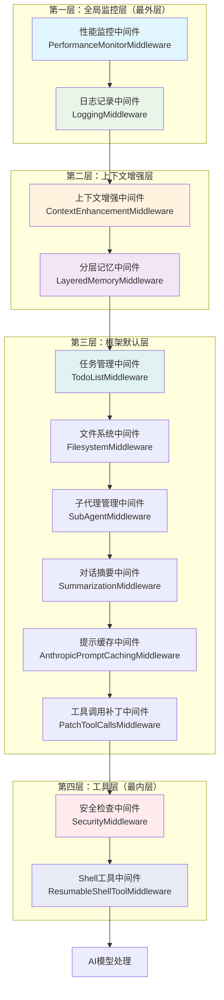

### 执行流程图

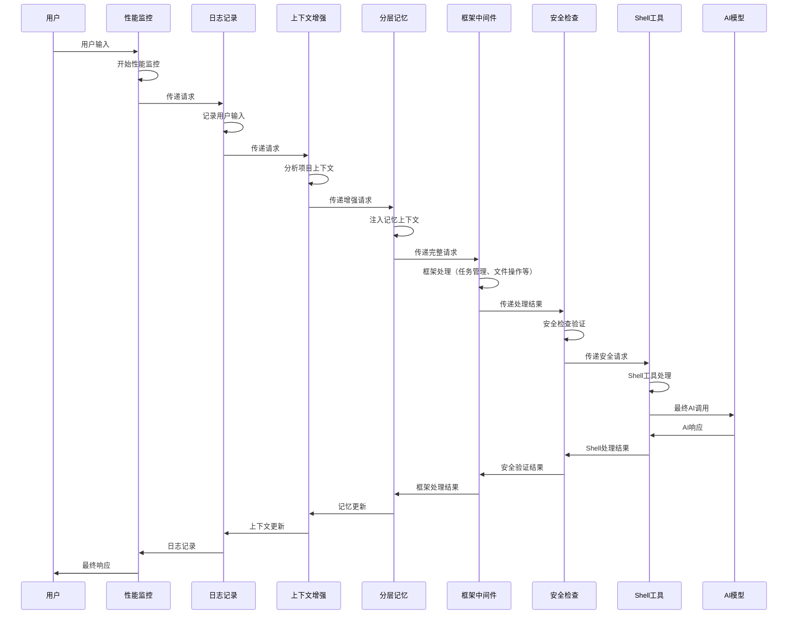

## 第一层：全局监控层

### 1.1 性能监控中间件 (PerformanceMonitorMiddleware)

#### 设计目标
- 监控整个代理系统的性能指标
- 收集响应时间、Token使用量、系统资源利用率
- 提供性能数据导出和分析功能

#### 核心功能


#### 关键实现细节

**性能记录数据结构**
```python
@dataclass
class PerformanceRecord:
    timestamp: float              # 时间戳
    response_time: float           # 响应时间
    token_count: int = 0           # Token数量
    tool_calls: int = 0             # 工具调用次数
    error_occurred: bool = False   # 是否发生错误
    memory_usage: float = 0.0      # 内存使用量(MB)
    cpu_usage: float = 0.0          # CPU使用率(%)
    session_id: str = ""            # 会话ID
    request_type: str = ""          # 请求类型
```

**系统监控机制**
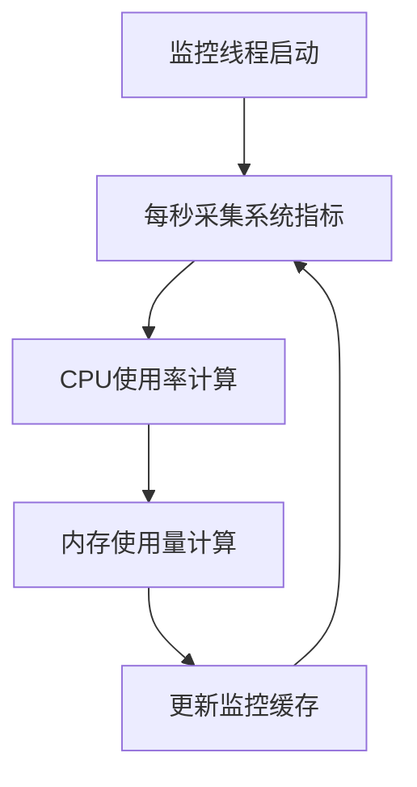

#### 使用场景
- 性能瓶颈识别
- 资源使用优化
- 系统容量规划
- SLA监控和报告

### 1.2 日志记录中间件 (LoggingMiddleware)

#### 设计目标
- 提供全面的操作审计跟踪
- 支持多维度日志分类
- 实现日志轮转和清理机制

#### 日志分类体系
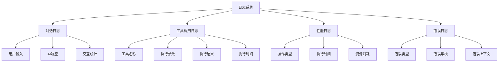

#### 日志数据结构
```python
class LoggingMiddleware(AgentMiddleware):
    def __init__(self, session_id: str, log_path: str = "/logs/"):
        self.conversation_log_path = f"{log_path}conversations/{session_id}.jsonl"
        self.tool_log_path = f"{log_path}tools/{session_id}.jsonl"
        self.performance_log_path = f"{log_path}performance/{session_id}.jsonl"
        self.error_log_path = f"{log_path}errors/{session_id}.jsonl"
```

#### 日志格式示例
```json
{
    "timestamp": "2024-11-13T21:32:15.123456",
    "type": "user_input",
    "content": "帮我分析这个代码问题",
    "metadata": {
        "source": "model_request",
        "interaction_count": 1
    },
    "length": 8
}
```

## 第二层：上下文增强层

### 2.1 上下文增强中间件 (ContextEnhancementMiddleware)

#### 设计目标
- 智能分析项目结构和特征
- 识别用户偏好和对话模式
- 为AI提供丰富的上下文信息

#### 项目分析功能
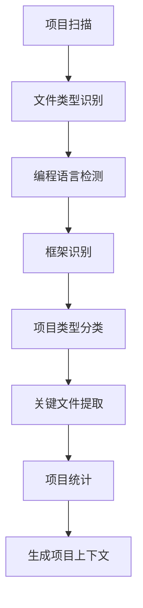

#### 项目检测算法
```python
def _detect_project_type(self, path: Path) -> str:
    indicators = {
        "web": ["package.json", "requirements.txt", "composer.json"],
        "mobile": ["Podfile", "build.gradle", "AndroidManifest.xml"],
        "data_science": ["requirements.txt", "environment.yml", "Dockerfile"],
        "desktop": ["CMakeLists.txt", "Cargo.toml", "pom.xml"],
    }

    files = [f.name for f in path.iterdir() if f.is_file()]
    for project_type, indicator_files in indicators.items():
        if any(indicator in files for indicator in indicator_files):
            return project_type
    return "general"
```

#### 对话模式分析
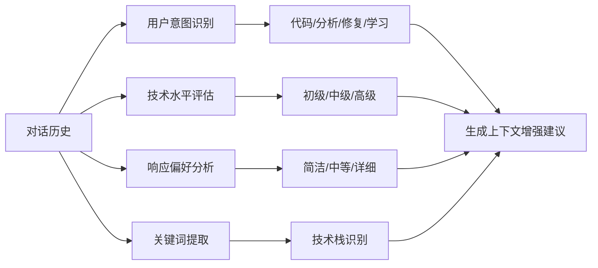

#### 上下文注入机制
```python
def _build_context_enhancement(self, request: ModelRequest) -> str:
    context_parts = []

    # 项目信息
    project_info = self._analyze_project_structure(os.getcwd())
    if project_info:
        context_parts.append("## 项目上下文")
        context_parts.append(f"- 项目类型: {project_info['type']}")
        context_parts.append(f"- 编程语言: {', '.join(project_info['languages'])}")
        context_parts.append(f"- 检测框架: {', '.join(project_info['frameworks'])}")

    # 对话模式
    patterns = self._analyze_conversation_patterns(request.state.get("messages", []))
    if patterns:
        context_parts.append("\n## 对话上下文")
        context_parts.append(f"- 用户意图: {patterns['user_intent']}")
        context_parts.append(f"- 技术水平: {patterns['technical_level']}")
        context_parts.append(f"- 响应偏好: {patterns['preferred_response_length']}")

    return "\n".join(context_parts)
```

### 2.2 分层记忆中间件 (LayeredMemoryMiddleware)

#### 三层记忆架构
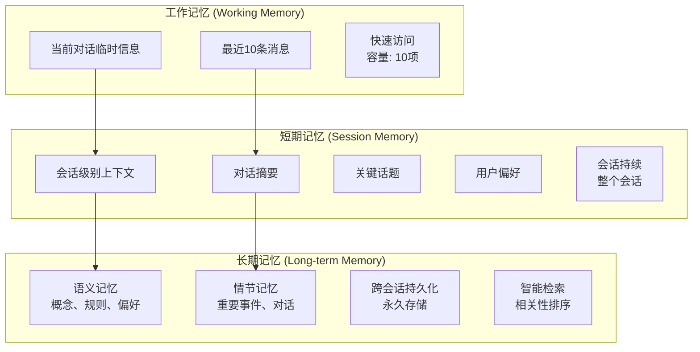

#### 记忆流转机制
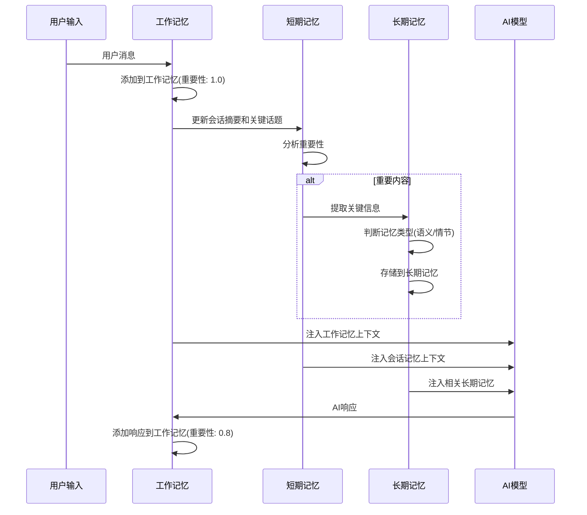

#### 记忆分类算法
```python
def _update_long_term_memory(self, content: str, importance: float = 0.8):
    # 重要性评估
    if "重要" in content or "关键" in content or "记住" in content:
        importance = min(1.0, importance + 0.3)

    # 记忆类型判断
    if any(keyword in content for keyword in ["我说", "用户说", "对话", "讨论"]):
        # 情节记忆 - 具体事件和对话
        self.long_term_memory.add_episodic_memory(content, importance)
    else:
        # 语义记忆 - 概念、规则、偏好
        self.long_term_memory.add_semantic_memory(content, importance)
```

#### 记忆检索策略
```python
def get_context(self, max_items: int = 10) -> str:
    context_parts = ["## 长期记忆（相关上下文）"]

    # 获取最重要的语义记忆
    semantic_items = sorted(
        self.semantic_memory,
        key=lambda x: (x["importance"], x["access_count"]),
        reverse=True
    )[:max_items//2]

    # 获取最近的情节记忆
    episodic_items = sorted(
        self.episodic_memory,
        key=lambda x: x["timestamp"],
        reverse=True
    )[:max_items//2]

    return "\n".join(context_parts)
```

## 第三层：框架默认层

### 3.1 任务管理中间件 (TodoListMiddleware)

#### 功能特性
- 管理AI创建的任务待办事项列表
- 支持任务状态跟踪（待办、进行中、已完成）
- 提供任务优先级和分类管理

#### 任务数据结构
```python
class TodoState(AgentState):
    todos: NotRequired[List[Dict[str, Any]]]  # 任务列表
    todo_count: NotRequired[int] = 0           # 任务计数
    completed_todos: NotRequired[int] = 0      # 已完成任务数
```

### 3.2 文件系统中间件 (FilesystemMiddleware)

#### 功能特性
- 提供安全的文件读写操作
- 支持目录浏览和文件搜索
- 实现文件备份和版本控制

### 3.3 子代理管理中间件 (SubAgentMiddleware)

#### 功能特性
- 管理子代理的生命周期
- 支持并行任务处理
- 提供子代理间的通信机制

#### 子代理调用流程
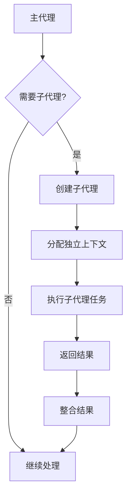

### 3.4 对话摘要中间件 (SummarizationMiddleware)

#### 功能特性
- 当上下文过长时自动生成摘要
- 保留关键信息和对话脉络
- 优化Token使用效率

### 3.5 提示缓存中间件 (AnthropicPromptCachingMiddleware)

#### 功能特性
- 缓存系统提示以减少API调用成本
- 支持智能缓存失效策略
- 提供缓存命中率统计

### 3.6 工具调用补丁中间件 (PatchToolCallsMiddleware)

#### 功能特性
- 修复工具调用中的常见问题
- 提供工具参数验证和修正
- 支持工具调用重试机制

## 第四层：工具层

### 4.1 安全检查中间件 (SecurityMiddleware)

#### 多层安全防护体系
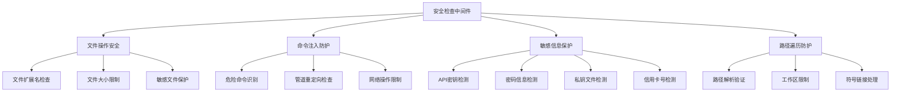

#### 安全违规记录
```python
@dataclass
class SecurityViolation:
    violation_type: str    # 违规类型
    severity: str          # 严重程度
    description: str        # 违规描述
    suggested_action: str  # 建议措施
    timestamp: float       # 发生时间
    context: str           # 违规上下文
```

#### 危险命令检测
```python
dangerous_commands = {
    'rm': re.compile(r'\brm\s+-rf?\s+/'),
    'dd': re.compile(r'\bdd\s+if=/dev/'),
    'format': re.compile(r'\b(format|mkfs)\s+/dev/'),
    'sudo': re.compile(r'\bsudo\s+'),
    'shutdown': re.compile(r'\bshutdown\s+'),
}
```

#### 敏感信息检测
```python
sensitive_patterns = {
    'api_key': re.compile(r'(api[_-]?key|apikey)\s*[:=]\s*["\']?[a-zA-Z0-9]{20,}["\']?', re.IGNORECASE),
    'password': re.compile(r'(password|pwd)\s*[:=]\s*["\']?[^\s"\']{6,}["\']?', re.IGNORECASE),
    'private_key': re.compile(r'-----BEGIN\s+(RSA\s+)?PRIVATE\s+KEY-----', re.IGNORECASE),
    'credit_card': re.compile(r'\b\d{4}[-\s]?\d{4}[-\s]?\d{4}[-\s]?\d{4}\b'),
}
```

### 4.2 Shell工具中间件 (ResumableShellToolMiddleware)

#### 功能特性
- 解决人类在环（HITL）暂停时的Shell会话资源丢失问题
- 支持Shell会话的暂停和恢复
- 提供Shell命令的安全执行环境

#### 会话管理机制
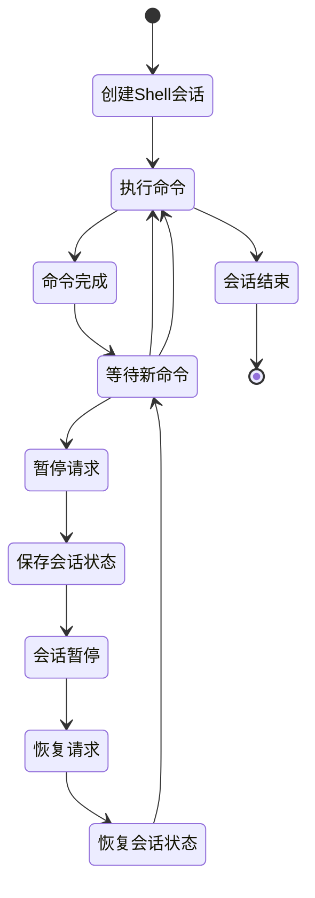

#### 会话状态保存
```python
class SessionState:
    session_id: str
    working_directory: str
    environment_variables: Dict[str, str]
    active_processes: List[ProcessInfo]
    command_history: List[str]
    created_at: float
    last_activity: float
```

## 中间件管道集成机制

### 创建流程
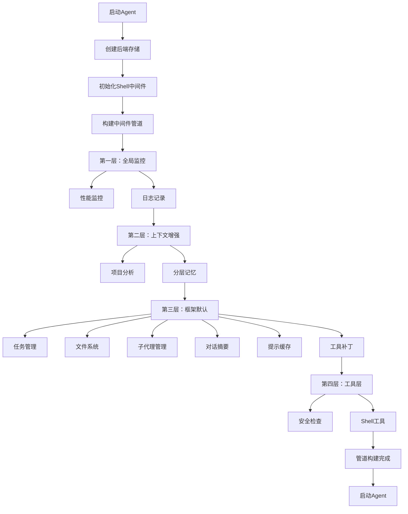

### 代理创建代码示例
```python
def create_agent_with_config(model, assistant_id: str, tools: list):
    # 构建中间件管道
    agent_middleware = []

    # 第一层：全局监控（最外层）
    agent_middleware.append(PerformanceMonitorMiddleware(...))
    agent_middleware.append(LoggingMiddleware(...))

    # 第二层：上下文增强
    agent_middleware.append(ContextEnhancementMiddleware(...))
    agent_middleware.append(MemoryMiddlewareFactory.auto_upgrade_memory(...))

    # 第三层：框架默认中间件（自动追加）
    # 框架会自动添加：TodoList, Filesystem, SubAgent, Summarization, Caching, PatchToolCalls

    # 第四层：工具层（最内层）
    agent_middleware.append(SecurityMiddleware(...))
    agent_middleware.append(ResumableShellToolMiddleware(...))

    # 创建Agent
    return create_deep_agent(
        model=model,
        tools=tools,
        middleware=agent_middleware,
        ...
    )
```

### 执行时序图
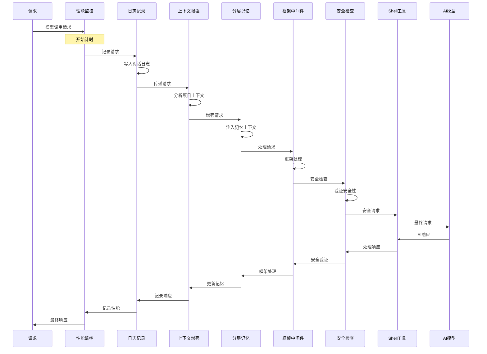

## 配置和扩展

### 中间件配置参数

#### 性能监控配置
```python
PerformanceMonitorMiddleware(
    backend=backend,
    metrics_path="/performance/",
    enable_system_monitoring=True,    # 启用系统资源监控
    max_records=1000,                  # 最大记录数
    auto_save_interval=300,             # 自动保存间隔(秒)
)
```

#### 安全检查配置
```python
SecurityMiddleware(
    backend=backend,
    security_level="medium",            # 安全级别: low/medium/high/strict
    workspace_root=workspace_path,     # 工作区根路径
    enable_file_security=True,         # 启用文件安全检查
    enable_command_security=True,      # 启用命令安全检查
    enable_content_security=True,      # 启用内容安全检查
    allow_path_traversal=False,        # 是否允许路径遍历
    max_file_size=10*1024*1024,       # 最大文件大小
)
```

#### 记忆系统配置
```python
LayeredMemoryMiddleware(
    backend=backend,
    memory_path="/memories/",
    working_memory_size=10,            # 工作记忆容量
    enable_semantic_memory=True,       # 启用语义记忆
    enable_episodic_memory=True,       # 启用情节记忆
    auto_save_interval=300,             # 自动保存间隔
)
```

### 自定义中间件开发

#### 中间件模板
```python
from langchain.agents.middleware.types import AgentMiddleware, AgentState, ModelRequest, ModelResponse

class CustomMiddleware(AgentMiddleware):
    state_schema = AgentState  # 定义状态模式

    def __init__(self, *, custom_param: str = "default"):
        self.custom_param = custom_param

    def before_agent(self, state: AgentState, runtime) -> AgentState:
        """代理执行前处理"""
        return {"custom_data": "initialized"}

    async def abefore_agent(self, state: AgentState, runtime) -> AgentState:
        """异步：代理执行前处理"""
        return self.before_agent(state, runtime)

    def wrap_model_call(self, request: ModelRequest, handler) -> ModelResponse:
        """包装模型调用"""
        # 前处理
        # 执行模型调用
        response = handler(request)
        # 后处理
        return response

    async def awrap_model_call(self, request: ModelRequest, handler) -> ModelResponse:
        """异步：包装模型调用"""
        # 前处理
        response = await handler(request)
        # 后处理
        return response
```

#### 中间件注册
```python
# 在agent.py中注册自定义中间件
def create_agent_with_config(model, assistant_id, tools: list):
    custom_middleware = CustomMiddleware(custom_param="special")

    agent_middleware = [
        # 其他中间件...
        custom_middleware,  # 添加自定义中间件
        # 更多中间件...
    ]

    return create_deep_agent(
        model=model,
        tools=tools,
        middleware=agent_middleware,
        ...
    )
```

## 性能优化和最佳实践

### 中间件性能优化策略

#### 1. 延迟初始化
```python
class LazyInitMiddleware:
    def __init__(self):
        self._heavy_resource = None

    @property
    def heavy_resource(self):
        if self._heavy_resource is None:
            self._heavy_resource = self._create_heavy_resource()
        return self._heavy_resource
```

#### 2. 缓存机制
```python
class CachedMiddleware:
    def __init__(self):
        self._cache = {}
        self._cache_ttl = 300  # 5分钟

    def _get_cached_or_compute(self, key: str, compute_func):
        cached = self._cache.get(key)
        if cached and time.time() - cached['timestamp'] < self._cache_ttl:
            return cached['value']

        value = compute_func()
        self._cache[key] = {
            'value': value,
            'timestamp': time.time()
        }
        return value
```

#### 3. 异步处理
```python
class AsyncMiddleware:
    async def wrap_model_call(self, request, handler):
        # 异步前处理
        async_result = await self._async_preprocess(request)

        # 并行执行
        response = await handler(request)
        async_process_result = await self._async_postprocess(response)

        return response
```

### 内存管理

#### 资源清理
```python
class ResourceManagedMiddleware:
    def __init__(self):
        self.resources = []
        self._cleanup_registered = False

    def __enter__(self):
        return self

    def __exit__(self, exc_type, exc_val, exc_tb):
        self.cleanup()

    def cleanup(self):
        for resource in self.resources:
            try:
                resource.close()
            except Exception:
                pass
        self.resources.clear()
```

#### 内存限制
```python
class MemoryBoundedMiddleware:
    def __init__(self, max_memory_mb: int = 100):
        self.max_memory = max_memory_mb * 1024 * 1024
        self.current_memory = 0

    def _check_memory_limit(self):
        if self.current_memory > self.max_memory:
            self._cleanup_old_data()
            raise MemoryError("Memory limit exceeded")
```

## 监控和调试

### 中间件监控指标

#### 性能指标
```python
# 响应时间分布
response_time_histogram = {
    "0-100ms": 0,
    "100-500ms": 0,
    "500ms-1s": 0,
    "1s+": 0
}

# 错误率统计
error_metrics = {
    "total_requests": 0,
    "error_count": 0,
    "error_rate": 0.0
}

# 资源使用率
resource_metrics = {
    "memory_usage_mb": 0,
    "cpu_usage_percent": 0,
    "disk_io_mb": 0
}
```

#### 调试工具
```python
# 中间件调试装饰器
def debug_middleware(middleware_class):
    class DebugWrappedMiddleware(middleware_class):
        def wrap_model_call(self, request, handler):
            print(f"[DEBUG] {middleware_class.__name__}: processing request")
            start_time = time.time()

            try:
                response = super().wrap_model_call(request, handler)
                print(f"[DEBUG] {middleware_class.__name__}: completed in {time.time()-start_time:.2f}s")
                return response
            except Exception as e:
                print(f"[DEBUG] {middleware_class.__name__}: error occurred: {e}")
                raise

    return DebugWrappedMiddleware
```

#### 日志级别配置
```python
import logging

class LoggingConfig:
    LOG_LEVELS = {
        'DEBUG': logging.DEBUG,
        'INFO': logging.INFO,
        'WARNING': logging.WARNING,
        'ERROR': logging.ERROR,
        'CRITICAL': logging.CRITICAL
    }

    @classmethod
    def setup_logging(cls, log_level: str = "INFO"):
        logging.basicConfig(
            level=cls.LOG_LEVELS.get(log_level, logging.INFO),
            format='%(asctime)s - %(name)s - %(levelname)s - %(message)s',
            handlers=[
                logging.StreamHandler(),
                logging.FileHandler('middleware.log')
            ]
        )
```

## 总结

Fix Agent的中间件管道架构提供了一个强大、灵活且可扩展的AI代理系统。通过精心设计的四层架构，系统实现了：

1. **全面的监控能力** - 性能监控和日志记录确保系统可观测性
2. **智能的上下文理解** - 上下文增强和分层记忆提供丰富的信息支持
3. **稳定的核心功能** - 框架默认中间件提供可靠的代理功能
4. **完善的安全防护** - 多层安全机制保护系统安全

这个架构设计具有高度的可扩展性，允许开发者轻松添加新的中间件功能，同时保持系统的稳定性和性能。通过合理的分层设计和执行顺序，确保了每个中间件都能在最合适的位置发挥作用，为用户提供强大、安全、智能的AI代码分析体验。