# Fix Agent Tools 系统开发指南

## 概述

Fix Agent 是一个专业的AI代码分析修复助手，采用多层次架构设计，提供完整的工具生态系统来支持代码质量管理和项目优化。本文档从开发者角度详细介绍Tools系统的设计理念、架构实现和使用方法。

## 1. 系统架构概览

### 1.1 整体架构图

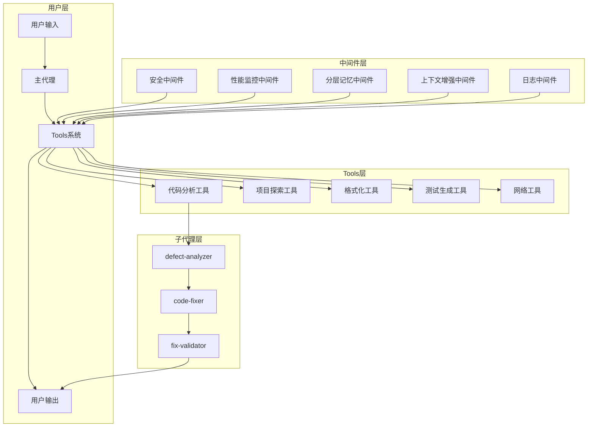
```mermaid
graph TB
    subgraph "用户层"
        A[用户输入] --> B[主代理]
        B --> C[Tools系统]
        C --> D[用户输出]
    end

    subgraph "Tools层"
        C --> E[代码分析工具]
        C --> F[项目探索工具]
        C --> G[格式化工具]
        C --> H[测试生成工具]
        C --> I[网络工具]
    end

    subgraph "中间件层"
        J[安全中间件]
        K[性能监控中间件]
        L[分层记忆中间件]
        M[上下文增强中间件]
        N[日志中间件]
    end

    subgraph "子代理层"
        O[defect-analyzer]
        P[code-fixer]
        Q[fix-validator]
    end

    E --> O
    O --> P
    P --> Q
    Q --> D

    J --> C
    K --> C
    L --> C
    M --> C
    N --> C
```

### 1.2 核心设计原则

- **分层架构**: 工具层 → 中间件层 → 代理层
- **模块化设计**: 每个工具都是独立的模块，易于维护和扩展
- **代理模式**: 主代理 + 专业子代理的协作模式
- **中间件管道**: 多层中间件提供安全、性能、记忆等增强功能
- **工具链整合**: 基于LangChain和LangGraph构建的工具生态

## 2. 核心工具详解

### 2.1 代码分析工具链

#### analyze_code_defects - 一站式代码缺陷分析

**功能描述**: 提供全面的代码缺陷分析，支持多语言静态分析和智能缺陷聚合。

**技术架构**:

```mermaid
graph LR
    A[代码输入] --> B[语言检测]
    B --> C[静态分析器]
    C --> D[缺陷检测器]
    D --> E[缺陷聚合器]
    E --> F[优先级排序]
    F --> G[修复建议]
    G --> H[结构化输出]
```

**核心组件**:
- `CodeDefectDetector`: 基础缺陷检测器
- `ErrorDetector`: 错误模式识别
- `DefectAggregator`: 缺陷智能聚合
- `StaticCodeAnalyzer`: 静态代码分析

**使用示例**:
```python
result = await analyze_code_defects(
    file_paths=["src/main.py", "src/utils.js"],
    language="auto",  # 自动检测
    output_format="json",
    include_fix_suggestions=True,
    severity_threshold="medium"
)
```

**输出格式**:
```json
{
    "summary": {
        "total_defects": 15,
        "critical": 2,
        "high": 5,
        "medium": 8,
        "languages": ["python", "javascript"]
    },
    "defects": [
        {
            "id": "DEF001",
            "file": "src/main.py",
            "line": 25,
            "severity": "high",
            "type": "security",
            "description": "潜在SQL注入漏洞",
            "fix_suggestion": "使用参数化查询"
        }
    ]
}
```

#### analyze_code_file - 单文件深度分析

**功能特性**:
- 自动检测编程语言
- 多维度代码质量检查
- 语法、逻辑、安全问题识别
- 量化质量评分

**实现原理**:
```python
def analyze_code_file(
    file_path: str,
    output_format: str = "json",
    max_lines: int = 2000,
    skip_comments: bool = True
) -> str:
    # 智能语言检测
    language = self.detect_language(file_path)

    # 多维度分析
    result = {
        "language": language,
        "analysis_type": "code_quality",
        "total_lines": total_lines,
        "syntax_errors": syntax_errors,
        "logic_issues": logic_issues,
        "security_violations": security_issues,
        "recommendations": recommendations,
        "quality_score": self._calculate_quality_score(analysis_results)
    }
```

**质量评分算法**:
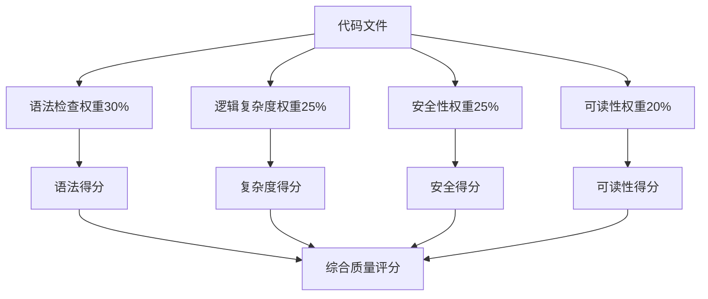
```mermaid
graph TD
    A[代码文件] --> B[语法检查权重30%]
    A --> C[逻辑复杂度权重25%]
    A --> D[安全性权重25%]
    A --> E[可读性权重20%]

    B --> F[语法得分]
    C --> G[复杂度得分]
    D --> H[安全得分]
    E --> I[可读性得分]

    F --> J[综合质量评分]
    G --> J
    H --> J
    I --> J
```

#### analyze_code_complexity - 代码复杂度分析

**评估指标**:
- **圈复杂度**: 衡量代码的线性独立路径数量
- **认知复杂度**: 评估代码的理解难度
- **函数复杂度**: 分析函数的参数、返回值、嵌套层级
- **类复杂度**: 评估类的职责和耦合度

**复杂度分级标准**:
```python
class ComplexityLevel(Enum):
    SIMPLE = "simple"      # 圈复杂度 < 10
    MODERATE = "moderate"  # 圈复杂度 10-20
    COMPLEX = "complex"    # 圈复杂度 20-50
    VERY_COMPLEX = "very_complex"  # 圈复杂度 > 50
```

### 2.2 项目探索工具

#### explore_project_structure - 项目结构智能分析

**核心能力**:
- 项目类型自动识别
- 技术栈智能检测
- 架构模式分析
- 依赖关系分析

**项目类型识别**:
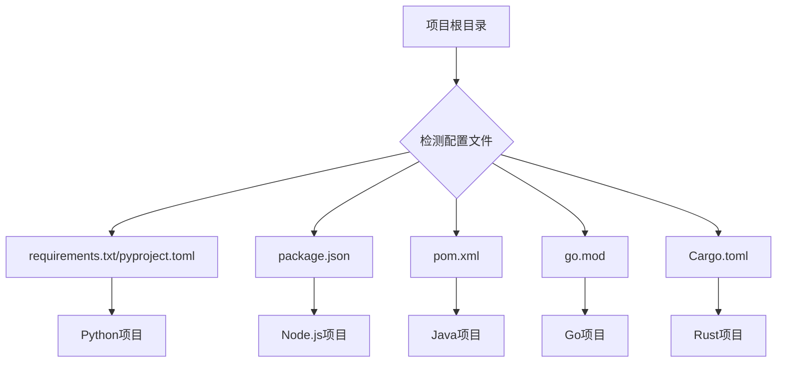
```mermaid
graph TD
    A[项目根目录] --> B{检测配置文件}

    B --> C[requirements.txt/pyproject.toml]
    B --> D[package.json]
    B --> E[pom.xml]
    B --> F[go.mod]
    B --> G[Cargo.toml]

    C --> H[Python项目]
    D --> I[Node.js项目]
    E --> J[Java项目]
    F --> K[Go项目]
    G --> L[Rust项目]
```

**架构模式识别**:
```python
class ArchitecturePattern(Enum):
    MONOLITH = "monolith"        # 单体应用
    MICROSERVICE = "microservice"  # 微服务
    LIBRARY = "library"          # 库/框架
    PLUGIN = "plugin"            # 插件系统
    CLI_TOOL = "cli_tool"        # 命令行工具
    WEB_APP = "web_app"          # Web应用
    API_SERVICE = "api_service"  # API服务
```

**分析报告结构**:
```json
{
    "project_info": {
        "name": "my-project",
        "type": "python_web",
        "architecture": "monolith",
        "primary_language": "python"
    },
    "tech_stack": {
        "frameworks": ["Django", "Django REST Framework"],
        "databases": ["PostgreSQL", "Redis"],
        "testing": ["pytest", "coverage"],
        "deployment": ["Docker", "Nginx"]
    },
    "structure_analysis": {
        "total_files": 245,
        "code_files": 189,
        "test_files": 56,
        "main_directories": ["src", "tests", "docs", "config"]
    }
}
```

### 2.3 专业代码格式化工具

#### format_code_professional - 智能代码格式化

**支持的语言和工具矩阵**:
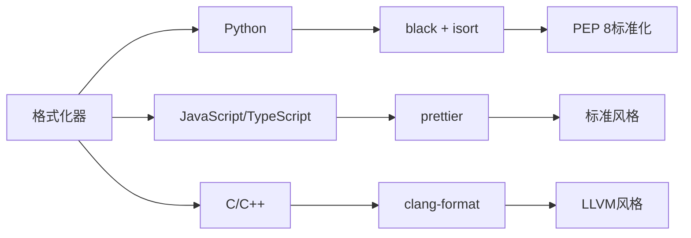
```mermaid
graph LR
    A[格式化器] --> B[Python]
    A --> C[JavaScript/TypeScript]
    A --> D[C/C++]

    B --> E[black + isort]
    C --> F[prettier]
    D --> G[clang-format]

    E --> H[PEP 8标准化]
    F --> I[标准风格]
    G --> J[LLVM风格]
```

**操作模式**:
```python
class FormatOperation(Enum):
    AUTO_FIX = "auto_fix"      # 自动格式化并保存
    PREVIEW = "preview"        # 预览变更，不修改文件
    CHECK = "check"           # 检查是否需要格式化
    DIFF = "diff"             # 显示详细差异对比
```

**智能格式化流程**:
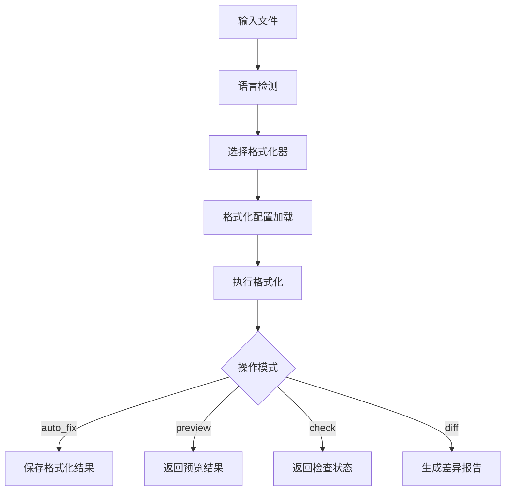
```mermaid
flowchart TD
    A[输入文件] --> B[语言检测]
    B --> C[选择格式化器]
    C --> D[格式化配置加载]
    D --> E[执行格式化]
    E --> F{操作模式}

    F -->|auto_fix| G[保存格式化结果]
    F -->|preview| H[返回预览结果]
    F -->|check| I[返回检查状态]
    F -->|diff| J[生成差异报告]
```

**设计模式实现**:
```python
class ProfessionalCodeFormatter:
    def __init__(self):
        self.formatters = {
            'python': PythonFormatter(),    # black + isort
            'javascript': JavaScriptFormatter(),  # prettier
            'typescript': TypeScriptFormatter(),  # prettier
            'cpp': CppFormatter(),          # clang-format
            'c': CFormatter(),              # clang-format
        }

    def format(self, file_path: str, operation: FormatOperation):
        language = self.detect_language(file_path)
        formatter = self.formatters.get(language)

        if formatter:
            return formatter.format(file_path, operation)
        else:
            raise UnsupportedLanguageError(f"不支持的语言: {language}")
```

#### batch_format_professional - 批量格式化工具

**功能特性**:
- 支持多种文件模式匹配（glob、正则表达式）
- 智能语言检测和分类
- 并行处理优化
- 详细统计报告

**批量处理流程**:
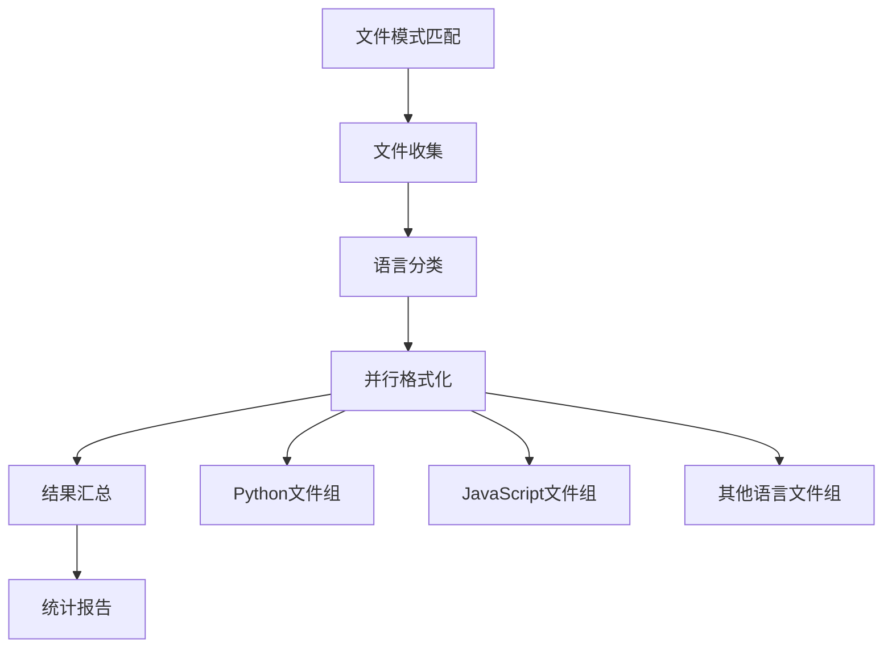
```mermaid
graph TD
    A[文件模式匹配] --> B[文件收集]
    B --> C[语言分类]
    C --> D[并行格式化]
    D --> E[结果汇总]
    E --> F[统计报告]

    D --> G[Python文件组]
    D --> H[JavaScript文件组]
    D --> I[其他语言文件组]
```

**统计报告示例**:
```json
{
    "summary": {
        "total_files": 156,
        "processed": 148,
        "failed": 8,
        "execution_time": "12.5s"
    },
    "by_language": {
        "python": {
            "count": 89,
            "formatted": 85,
            "already_compliant": 4,
            "errors": 0
        },
        "javascript": {
            "count": 45,
            "formatted": 42,
            "already_compliant": 2,
            "errors": 1
        }
    },
    "failed_files": [
        {
            "file": "src/broken.js",
            "error": "SyntaxError: Unexpected token"
        }
    ]
}
```

### 2.4 智能测试生成工具

#### generate_validation_tests_tool - AI驱动测试生成

**测试类型覆盖**:
```python
class TestType(Enum):
    UNIT = "unit"              # 单元测试
    INTEGRATION = "integration"  # 集成测试
    REGRESSION = "regression"   # 回归测试
    SMOKE = "smoke"            # 冒烟测试
    PERFORMANCE = "performance"  # 性能测试
```

**支持的测试框架**:
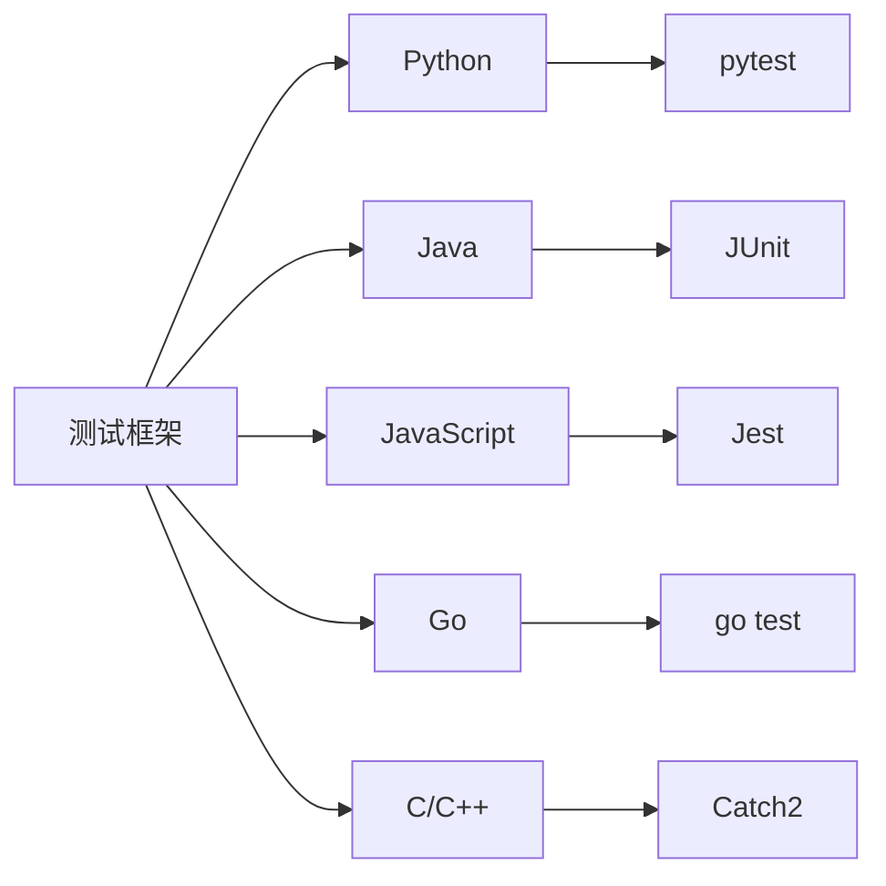
```mermaid
graph LR
    A[测试框架] --> B[Python]
    A --> C[Java]
    A --> D[JavaScript]
    A --> E[Go]
    A --> F[C/C++]

    B --> G[pytest]
    C --> H[JUnit]
    D --> I[Jest]
    E --> J[go test]
    F --> K[Catch2]
```

**智能测试生成算法**:
```python
class SmartTestGenerator:
    def generate_validation_tests(self, defects, fixes, project_context):
        # 1. 为每个缺陷生成回归测试
        regression_tests = self._generate_regression_tests(defects)

        # 2. 为修复生成验证测试
        validation_tests = self._generate_validation_tests(fixes, defects)

        # 3. 基于代码结构生成集成测试
        integration_tests = self._generate_integration_tests(project_context)

        # 4. 生成边界和异常测试
        edge_case_tests = self._generate_edge_case_tests(defects)

        return {
            "regression_tests": regression_tests,
            "validation_tests": validation_tests,
            "integration_tests": integration_tests,
            "edge_case_tests": edge_case_tests
        }
```

**测试质量保障**:
- **覆盖率分析**: 确保测试覆盖关键路径
- **断言质量**: 生成有意义的断言
- **测试数据管理**: 智能生成测试数据
- **Mock策略**: 自动生成必要的Mock对象

### 2.5 网络工具集

#### web_search - 智能网络搜索

**技术栈**: 基于Tavily API构建
**功能特性**:
- 中英文智能搜索
- 多主题类型支持（general、news、finance）
- 结构化结果返回
- 相关性评分和内容过滤

**搜索流程**:
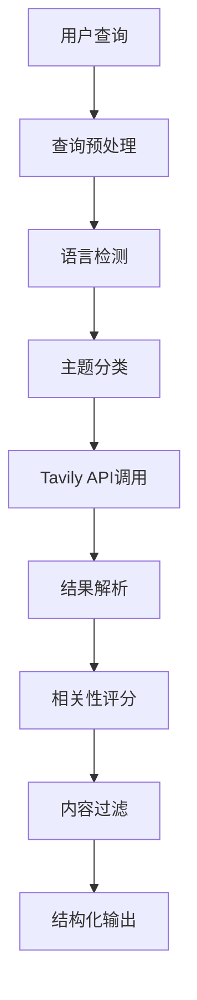
```mermaid
flowchart TD
    A[用户查询] --> B[查询预处理]
    B --> C[语言检测]
    C --> D[主题分类]
    D --> E[Tavily API调用]
    E --> F[结果解析]
    F --> G[相关性评分]
    G --> H[内容过滤]
    H --> I[结构化输出]
```

**使用示例**:
```python
result = await web_search(
    query="Python异步编程最佳实践",
    topic="general",
    max_results=10,
    include_content=True,
    language="zh"
)
```

#### http_request - 通用HTTP客户端

**功能特性**:
- 支持所有HTTP方法（GET、POST、PUT、DELETE等）
- 自定义请求头和参数
- JSON和表单数据处理
- 完善的错误处理和超时控制

## 3. 中间件系统架构

### 3.1 分层记忆中间件

**三层记忆架构**:
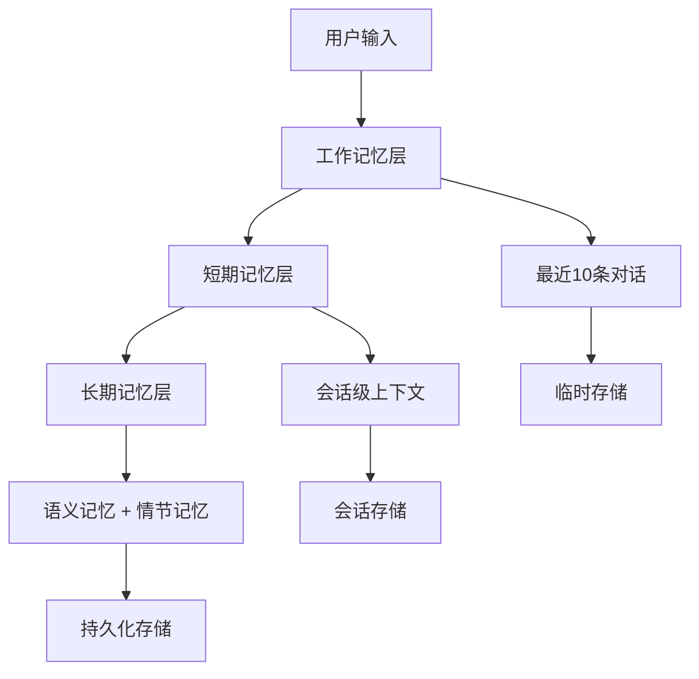
```mermaid
graph TD
    A[用户输入] --> B[工作记忆层]
    B --> C[短期记忆层]
    C --> D[长期记忆层]

    B --> E[最近10条对话]
    C --> F[会话级上下文]
    D --> G[语义记忆 + 情节记忆]

    E --> H[临时存储]
    F --> I[会话存储]
    G --> J[持久化存储]
```

**记忆管理策略**:
```python
class LayeredMemoryMiddleware:
    def __init__(self, backend, **kwargs):
        self.working_memory = WorkingMemory(capacity=10)
        self.short_term_memory = ShortTermMemory(capacity=100)
        self.long_term_memory = LongTermMemory(backend)

        # 智能管理策略
        self.importance_scorer = ImportanceScorer()
        self.access_tracker = AccessTracker()
        self.reclaim_policy = ReclaimPolicy()
```

**记忆功能特性**:
- **重要性评分**: 基于内容价值和用户行为
- **访问频率追踪**: 优化记忆检索效率
- **自动内存回收**: LRU和重要性结合的清理策略
- **语义搜索**: 基于向量的相似性搜索

### 3.2 安全检查中间件

**多层次安全防护体系**:
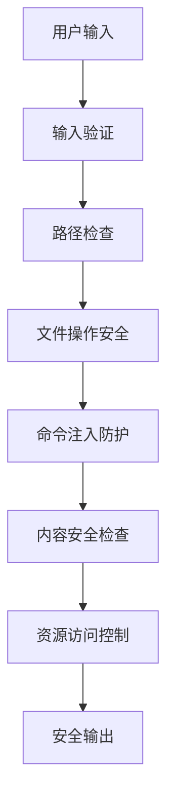
```mermaid
graph TD
    A[用户输入] --> B[输入验证]
    B --> C[路径检查]
    C --> D[文件操作安全]
    D --> E[命令注入防护]
    E --> F[内容安全检查]
    F --> G[资源访问控制]
    G --> H[安全输出]
```

**安全检查矩阵**:
```python
class SecurityMiddleware:
    def __init__(self, security_level="medium"):
        self.security_levels = {
            "low": SecurityConfig(
                check_dangerous_files=False,
                validate_commands=False,
                max_file_size=100*1024*1024  # 100MB
            ),
            "medium": SecurityConfig(
                check_dangerous_files=True,
                validate_commands=True,
                max_file_size=50*1024*1024   # 50MB
            ),
            "high": SecurityConfig(
                check_dangerous_files=True,
                validate_commands=True,
                max_file_size=10*1024*1024   # 10MB
            ),
            "strict": SecurityConfig(
                check_dangerous_files=True,
                validate_commands=True,
                max_file_size=1*1024*1024    # 1MB
            )
        }
```

**安全防护机制**:
- **文件操作安全**: 阻止危险文件扩展名（.exe、.bat、.sh等）
- **命令注入防护**: 输入验证和危险命令检测
- **路径遍历防护**: 路径规范化和白名单验证
- **资源访问控制**: 文件大小和数量限制
- **内容安全**: 敏感信息检测和脱敏处理

### 3.3 性能监控中间件

**性能指标体系**:
```python
@dataclass
class PerformanceRecord:
    timestamp: float        # 时间戳
    response_time: float    # 响应时间（毫秒）
    token_count: int       # Token使用量
    tool_calls: int        # 工具调用次数
    memory_usage: float    # 内存使用（MB）
    cpu_usage: float       # CPU使用率（%）
    error_count: int       # 错误次数
```

**性能监控架构**:
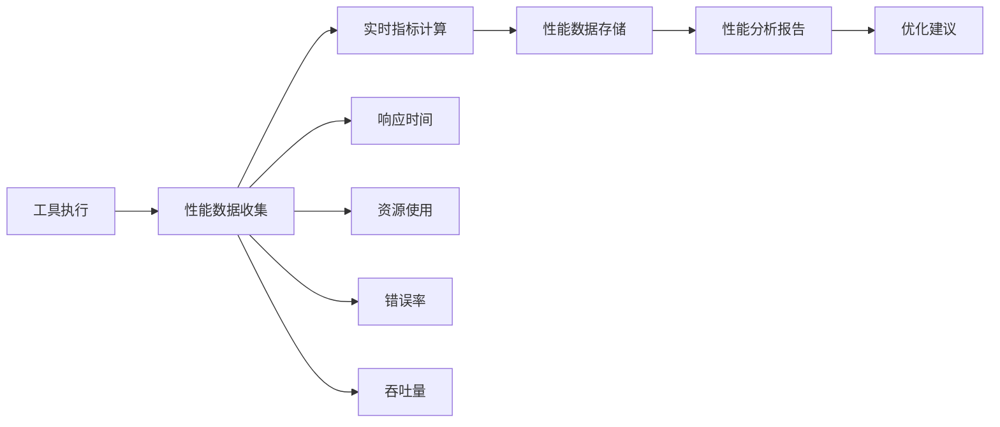
```mermaid
graph LR
    A[工具执行] --> B[性能数据收集]
    B --> C[实时指标计算]
    C --> D[性能数据存储]
    D --> E[性能分析报告]
    E --> F[优化建议]

    B --> G[响应时间]
    B --> H[资源使用]
    B --> I[错误率]
    B --> J[吞吐量]
```

**监控功能特性**:
- **实时性能数据收集**: 毫秒级精度的性能指标
- **会话级性能分析**: 聚合分析用户会话的性能表现
- **工具执行统计**: 各工具的性能表现对比
- **自动性能报告**: 定期生成性能分析报告
- **性能异常检测**: 自动识别性能异常和瓶颈

### 3.4 上下文增强中间件

**智能上下文管理**:
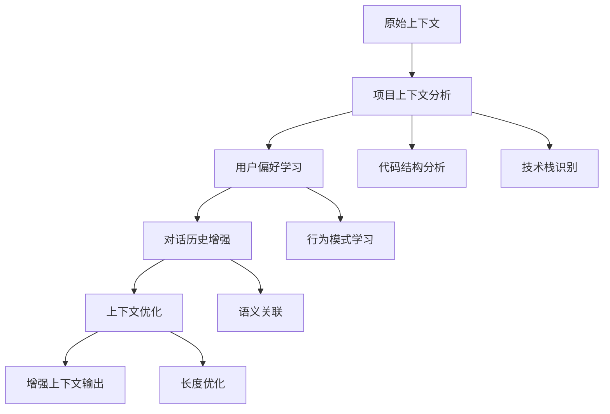
```mermaid
graph TD
    A[原始上下文] --> B[项目上下文分析]
    B --> C[用户偏好学习]
    C --> D[对话历史增强]
    D --> E[上下文优化]
    E --> F[增强上下文输出]

    B --> G[代码结构分析]
    B --> H[技术栈识别]
    C --> I[行为模式学习]
    D --> J[语义关联]
    E --> K[长度优化]
```

**上下文增强能力**:
- **项目上下文智能分析**: 自动识别项目结构、技术栈和编码风格
- **用户偏好学习**: 学习用户的使用习惯和偏好设置
- **对话历史增强**: 基于语义关联的上下文补全
- **上下文长度优化**: 智能压缩和筛选关键信息

## 4. 子代理协作系统

### 4.1 专业子代理团队

#### defect-analyzer - 缺陷分析专家

**职责定位**: 专门负责分析代码缺陷，包括语法错误、逻辑问题、性能问题和安全隐患

**核心能力**:
```python
defect_analyzer_subagent = {
    "name": "defect-analyzer",
    "description": "专门负责分析代码缺陷，包括语法错误、逻辑问题、性能问题和安全隐患",
    "system_prompt": defect_analyzer_subagent_system_prompt,
    "capabilities": [
        "static_code_analysis",
        "security_vulnerability_detection",
        "performance_issue_identification",
        "code_quality_assessment"
    ],
    "debug": False,
}
```

**分析流程**:
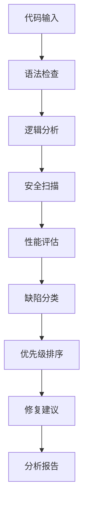
```mermaid
flowchart TD
    A[代码输入] --> B[语法检查]
    B --> C[逻辑分析]
    C --> D[安全扫描]
    D --> E[性能评估]
    E --> F[缺陷分类]
    F --> G[优先级排序]
    G --> H[修复建议]
    H --> I[分析报告]
```

#### code-fixer - 代码修复专家

**职责定位**: 专门负责修复代码缺陷，基于缺陷分析报告进行精准的代码修改

**修复策略**:
```python
code_fixer_subagent = {
    "name": "code-fixer",
    "description": "专门负责修复代码缺陷，基于缺陷分析报告进行代码修改",
    "system_prompt": code_fixer_subagent_system_prompt,
    "capabilities": [
        "automated_code_repair",
        "refactoring_suggestions",
        "best_practices_application",
        "compatibility_maintenance"
    ],
    "debug": False,
}
```

**修复流程**:
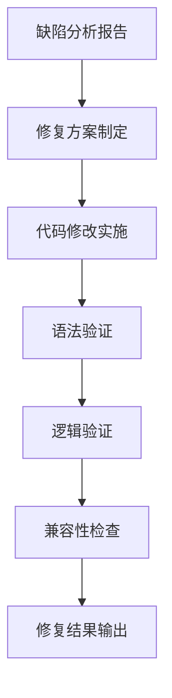
```mermaid
graph TD
    A[缺陷分析报告] --> B[修复方案制定]
    B --> C[代码修改实施]
    C --> D[语法验证]
    D --> E[逻辑验证]
    E --> F[兼容性检查]
    F --> G[修复结果输出]
```

#### fix-validator - 修复验证专家

**职责定位**: 专门负责验证代码修复的有效性，确保缺陷被正确修复且无新问题产生

**验证维度**:
```python
fix_validator_subagent = {
    "name": "fix-validator",
    "description": "专门负责验证代码修复的有效性，确保缺陷被正确修复且无新问题",
    "system_prompt": fix_validator_subagent_system_prompt,
    "capabilities": [
        "regression_testing",
        "functionality_verification",
        "performance_impact_assessment",
        "code_quality_validation"
    ],
    "debug": False,
}
```

### 4.2 协作工作流设计

**标准协作流程**:
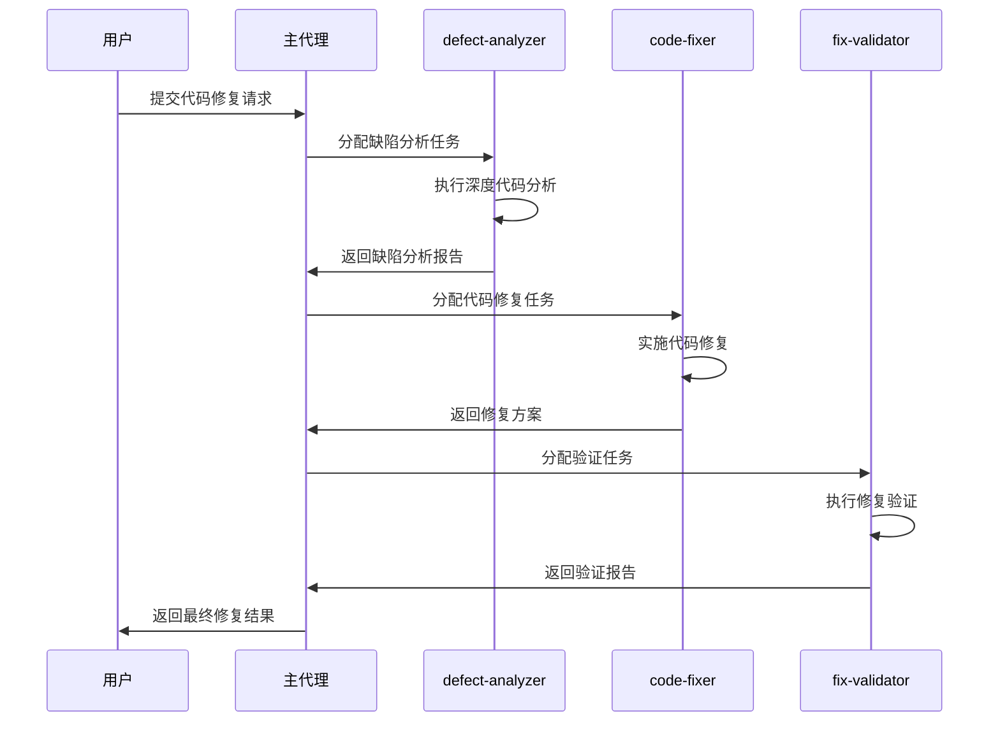
```mermaid
sequenceDiagram
    participant U as 用户
    participant M as 主代理
    participant A as defect-analyzer
    participant F as code-fixer
    participant V as fix-validator

    U->>M: 提交代码修复请求
    M->>A: 分配缺陷分析任务
    A->>A: 执行深度代码分析
    A->>M: 返回缺陷分析报告
    M->>F: 分配代码修复任务
    F->>F: 实施代码修复
    F->>M: 返回修复方案
    M->>V: 分配验证任务
    V->>V: 执行修复验证
    V->>M: 返回验证报告
    M->>U: 返回最终修复结果
```

**并行化策略**:
对于大型项目或复杂任务，系统支持子代理的并行化执行：

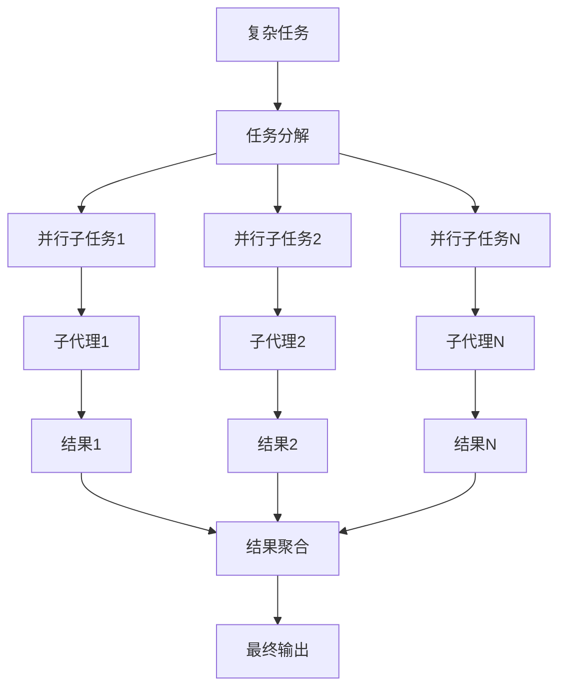
```mermaid
graph TD
    A[复杂任务] --> B[任务分解]
    B --> C[并行子任务1]
    B --> D[并行子任务2]
    B --> E[并行子任务N]

    C --> F[子代理1]
    D --> G[子代理2]
    E --> H[子代理N]

    F --> I[结果1]
    G --> J[结果2]
    H --> K[结果N]

    I --> L[结果聚合]
    J --> L
    K --> L

    L --> M[最终输出]
```

### 4.3 智能任务分配机制

**任务分配算法**:
```python
class TaskDispatcher:
    def dispatch_task(self, task_description, available_agents):
        # 1. 任务类型分析
        task_type = self.analyze_task_type(task_description)

        # 2. 代理能力匹配
        suitable_agents = self.match_agents(task_type, available_agents)

        # 3. 负载均衡考虑
        selected_agent = self.balance_load(suitable_agents)

        # 4. 任务优化分配
        return self.optimize_assignment(task_description, selected_agent)
```

**负载均衡策略**:
- **基于当前负载**: 选择当前任务最少的代理
- **基于响应时间**: 优先选择响应时间短的代理
- **基于成功率**: 考虑代理的历史成功率
- **基于专业度**: 优先选择专业匹配度最高的代理

## 5. 数据流和控制流设计

### 5.1 系统数据流架构

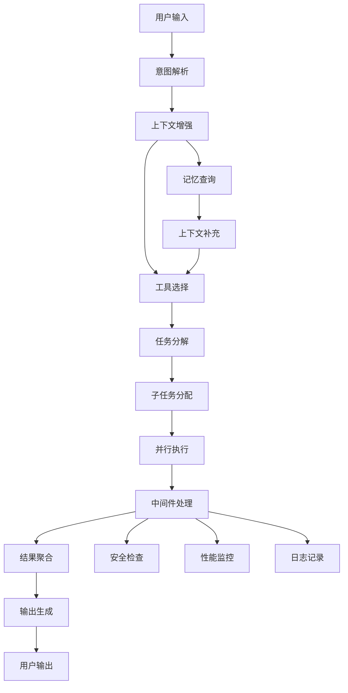
```mermaid
flowchart TD
    A[用户输入] --> B[意图解析]
    B --> C[上下文增强]
    C --> D[工具选择]
    D --> E[任务分解]
    E --> F[子任务分配]
    F --> G[并行执行]
    G --> H[中间件处理]
    H --> I[结果聚合]
    I --> J[输出生成]
    J --> K[用户输出]

    C --> L[记忆查询]
    L --> M[上下文补充]
    M --> D

    H --> N[安全检查]
    H --> O[性能监控]
    H --> P[日志记录]
```

### 5.2 控制流决策机制

**智能决策引擎**:
```python
class DecisionEngine:
    def make_decision(self, user_input, context):
        # 1. 输入解析和理解
        parsed_input = self.parse_input(user_input)

        # 2. 意图识别
        intent = self.identify_intent(parsed_input)

        # 3. 工具选择策略
        tools = self.select_tools(intent, context)

        # 4. 执行策略制定
        execution_plan = self.create_execution_plan(tools, context)

        # 5. 风险评估
        risk_assessment = self.assess_risks(execution_plan)

        return {
            "intent": intent,
            "tools": tools,
            "execution_plan": execution_plan,
            "risk_assessment": risk_assessment
        }
```

**决策树结构**:
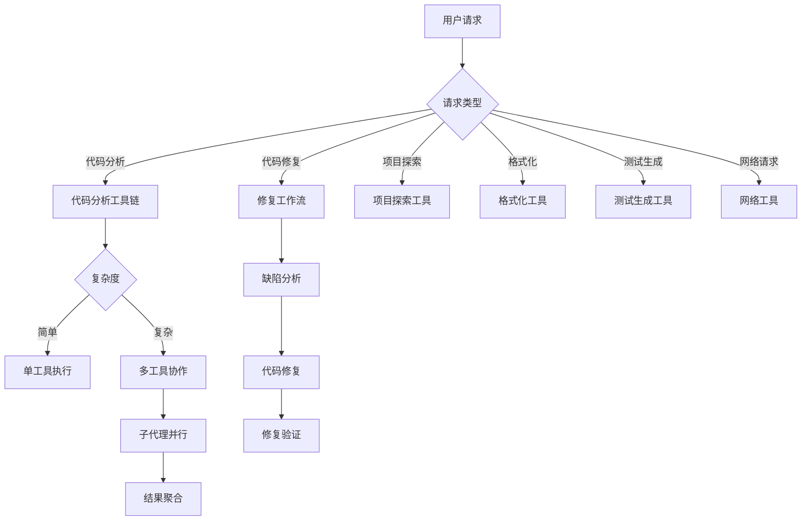
```mermaid
graph TD
    A[用户请求] --> B{请求类型}

    B -->|代码分析| C[代码分析工具链]
    B -->|代码修复| D[修复工作流]
    B -->|项目探索| E[项目探索工具]
    B -->|格式化| F[格式化工具]
    B -->|测试生成| G[测试生成工具]
    B -->|网络请求| H[网络工具]

    C --> I{复杂度}
    I -->|简单| J[单工具执行]
    I -->|复杂| K[多工具协作]

    D --> L[缺陷分析]
    L --> M[代码修复]
    M --> N[修复验证]

    K --> O[子代理并行]
    O --> P[结果聚合]
```

## 6. 关键设计模式和最佳实践

### 6.1 核心设计模式

#### 策略模式 - 语言检测和格式化
```python
class LanguageDetector:
    def __init__(self):
        self.detection_strategies = {
            'extension_based': ExtensionBasedDetection(),
            'content_based': ContentBasedDetection(),
            'heuristic_based': HeuristicBasedDetection()
        }

    def detect_language(self, file_path):
        for strategy_name, strategy in self.detection_strategies.items():
            language = strategy.detect(file_path)
            if language != "unknown":
                return language
        return "unknown"
```

#### 工厂模式 - 格式化器创建
```python
class FormatterFactory:
    @staticmethod
    def create_formatter(language, config=None):
        formatters = {
            'python': PythonFormatter,
            'javascript': JavaScriptFormatter,
            'typescript': TypeScriptFormatter,
            'cpp': CppFormatter,
            'c': CFormatter
        }

        formatter_class = formatters.get(language)
        if formatter_class:
            return formatter_class(config or DefaultConfig())
        else:
            raise UnsupportedLanguageError(f"不支持的语言: {language}")
```

#### 观察者模式 - 性能监控
```python
class PerformanceCollector:
    def __init__(self):
        self.observers = []
        self.records = []

    def add_observer(self, observer):
        self.observers.append(observer)

    def record_execution(self, tool_name, execution_time, success=True):
        record = PerformanceRecord(
            tool_name=tool_name,
            execution_time=execution_time,
            success=success,
            timestamp=time.time()
        )
        self.records.append(record)

        # 通知所有观察者
        for observer in self.observers:
            observer.on_performance_record(record)
```

#### 适配器模式 - 记忆系统集成
```python
class MemoryMiddlewareFactory:
    @staticmethod
    def auto_upgrade_memory(backend, **kwargs):
        # 检查后端能力
        capabilities = backend.get_capabilities()

        if capabilities.supports_layered_storage:
            return LayeredMemoryMiddleware(backend, **kwargs)
        elif capabilities.supports_vector_search:
            return VectorMemoryMiddleware(backend, **kwargs)
        else:
            return BasicMemoryMiddleware(backend, **kwargs)
```

#### 命令模式 - 工具执行
```python
class ToolCommand:
    def __init__(self, tool, args, kwargs):
        self.tool = tool
        self.args = args
        self.kwargs = kwargs

    def execute(self):
        return self.tool(*self.args, **self.kwargs)

    def undo(self):
        # 实现撤销逻辑（如果支持）
        pass

class ToolInvoker:
    def __init__(self):
        self.history = []

    def execute_command(self, command):
        try:
            result = command.execute()
            self.history.append(command)
            return result
        except Exception as e:
            # 记录失败命令但不影响后续执行
            self.logger.error(f"命令执行失败: {e}")
            raise
```

### 6.2 错误处理和容错机制

**分层错误处理**:
```python
class ErrorHandler:
    def __init__(self):
        self.error_handlers = {
            ToolExecutionError: self.handle_tool_error,
            SecurityViolationError: self.handle_security_error,
            PerformanceError: self.handle_performance_error,
            MemoryError: self.handle_memory_error
        }

    def handle_error(self, error, context):
        handler = self.error_handlers.get(type(error))
        if handler:
            return handler(error, context)
        else:
            return self.handle_unknown_error(error, context)

    def handle_tool_error(self, error, context):
        # 记录错误、尝试降级方案、返回用户友好信息
        self.logger.error(f"工具执行错误: {error}")
        return {
            "success": False,
            "error_type": "tool_execution_error",
            "user_message": "工具执行失败，请稍后重试",
            "technical_details": str(error)
        }
```

**重试和降级机制**:
```python
class ResilientExecutor:
    def __init__(self, max_retries=3, backoff_factor=2):
        self.max_retries = max_retries
        self.backoff_factor = backoff_factor

    def execute_with_retry(self, func, *args, **kwargs):
        for attempt in range(self.max_retries):
            try:
                return func(*args, **kwargs)
            except (TemporaryError, NetworkError) as e:
                if attempt == self.max_retries - 1:
                    # 最后一次尝试失败，尝试降级方案
                    return self.fallback_execution(func, args, kwargs)
                else:
                    # 指数退避重试
                    wait_time = self.backoff_factor ** attempt
                    time.sleep(wait_time)
            except PermanentError:
                # 永久性错误，直接抛出
                raise
```

### 6.3 性能优化策略

**缓存机制**:
```python
class SmartCache:
    def __init__(self, max_size=1000, ttl=3600):
        self.cache = {}
        self.access_times = {}
        self.max_size = max_size
        self.ttl = ttl

    def get(self, key):
        if key in self.cache:
            # 检查是否过期
            if time.time() - self.access_times[key] < self.ttl:
                self.access_times[key] = time.time()
                return self.cache[key]
            else:
                del self.cache[key]
                del self.access_times[key]
        return None

    def set(self, key, value):
        # LRU清理策略
        if len(self.cache) >= self.max_size:
            self._evict_lru()

        self.cache[key] = value
        self.access_times[key] = time.time()
```

**并行处理优化**:
```python
import asyncio
from concurrent.futures import ThreadPoolExecutor

class ParallelExecutor:
    def __init__(self, max_workers=4):
        self.executor = ThreadPoolExecutor(max_workers=max_workers)

    async def execute_parallel(self, tasks):
        # 将同步任务转换为异步任务
        loop = asyncio.get_event_loop()
        futures = [
            loop.run_in_executor(self.executor, task)
            for task in tasks
        ]

        # 并行执行并收集结果
        results = await asyncio.gather(*futures, return_exceptions=True)

        # 处理异常
        successful_results = []
        errors = []

        for result in results:
            if isinstance(result, Exception):
                errors.append(result)
            else:
                successful_results.append(result)

        return successful_results, errors
```

## 7. 扩展性和维护性设计

### 7.1 插件化架构

**工具接口标准**:
```python
from abc import ABC, abstractmethod

class BaseTool(ABC):
    def __init__(self, name, description):
        self.name = name
        self.description = description

    @abstractmethod
    async def execute(self, *args, **kwargs):
        """执行工具的核心逻辑"""
        pass

    @abstractmethod
    def validate_args(self, *args, **kwargs):
        """验证输入参数的有效性"""
        pass

    def get_metadata(self):
        """返回工具的元数据信息"""
        return {
            "name": self.name,
            "description": self.description,
            "version": self.version,
            "author": self.author,
            "capabilities": self.capabilities
        }
```

**工具注册机制**:
```python
class ToolRegistry:
    def __init__(self):
        self.tools = {}
        self.categories = {}

    def register_tool(self, tool, category="general"):
        if not isinstance(tool, BaseTool):
            raise InvalidToolError("工具必须继承自BaseTool")

        # 验证工具的唯一性
        if tool.name in self.tools:
            raise DuplicateToolError(f"工具 {tool.name} 已存在")

        self.tools[tool.name] = tool

        # 按类别组织
        if category not in self.categories:
            self.categories[category] = []
        self.categories[category].append(tool)

    def get_tool(self, name):
        return self.tools.get(name)

    def get_tools_by_category(self, category):
        return self.categories.get(category, [])
```

### 7.2 配置管理系统

**分层配置架构**:
```python
class ConfigManager:
    def __init__(self):
        self.default_config = DefaultConfig()
        self.user_config = UserConfig()
        self.runtime_config = RuntimeConfig()

    def get(self, key, default=None):
        # 配置优先级：运行时 > 用户配置 > 默认配置
        value = self.runtime_config.get(key)
        if value is None:
            value = self.user_config.get(key)
        if value is None:
            value = self.default_config.get(key, default)
        return value

    def set(self, key, value, scope="runtime"):
        if scope == "runtime":
            self.runtime_config.set(key, value)
        elif scope == "user":
            self.user_config.set(key, value)
        elif scope == "default":
            self.default_config.set(key, value)
```

## 8. 质量保证和测试策略

### 8.1 测试架构设计

**测试金字塔**:
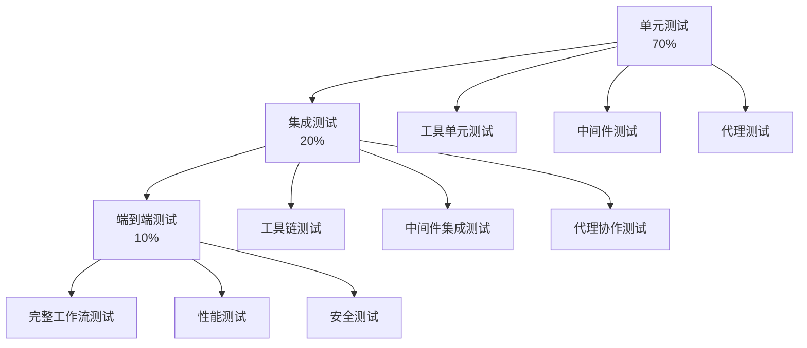
```mermaid
graph TD
    A[单元测试<br/>70%] --> B[集成测试<br/>20%]
    B --> C[端到端测试<br/>10%]

    A --> D[工具单元测试]
    A --> E[中间件测试]
    A --> F[代理测试]

    B --> G[工具链测试]
    B --> H[中间件集成测试]
    B --> I[代理协作测试]

    C --> J[完整工作流测试]
    C --> K[性能测试]
    C --> L[安全测试]
```

**测试数据管理**:
```python
class TestDataManager:
    def __init__(self):
        self.test_data_cache = {}
        self.mock_data_generators = {}

    def get_test_code(self, language, defect_type):
        cache_key = f"{language}_{defect_type}"
        if cache_key not in self.test_data_cache:
            self.test_data_cache[cache_key] = self._generate_test_code(
                language, defect_type
            )
        return self.test_data_cache[cache_key]

    def create_mock_project(self, structure_type):
        generator = self.mock_data_generators.get(structure_type)
        if generator:
            return generator.generate()
        else:
            raise UnsupportedProjectTypeError(f"不支持的项目类型: {structure_type}")
```

### 8.2 持续集成和质量监控

**CI/CD流程**:
```yaml
# .github/workflows/quality.yml
name: Quality Assurance
on: [push, pull_request]

jobs:
  quality-check:
    runs-on: ubuntu-latest
    steps:
      - uses: actions/checkout@v2

      - name: Setup Python
        uses: actions/setup-python@v2
        with:
          python-version: '3.9'

      - name: Install dependencies
        run: |
          pip install -r requirements.txt
          pip install -r requirements-dev.txt

      - name: Run unit tests
        run: pytest tests/unit/ --cov=src --cov-report=xml

      - name: Run integration tests
        run: pytest tests/integration/

      - name: Code quality check
        run: |
          flake8 src/
          black --check src/
          mypy src/

      - name: Security scan
        run: bandit -r src/

      - name: Performance test
        run: pytest tests/performance/ --benchmark-only
```

## 9. 部署和运维

### 9.1 容器化部署

**Dockerfile设计**:
```dockerfile
FROM python:3.9-slim

WORKDIR /app

# 安装系统依赖
RUN apt-get update && apt-get install -y \
    git \
    curl \
    && rm -rf /var/lib/apt/lists/*

# 复制依赖文件
COPY requirements.txt .
RUN pip install --no-cache-dir -r requirements.txt

# 复制源代码
COPY src/ ./src/
COPY config/ ./config/

# 设置环境变量
ENV PYTHONPATH=/app/src
ENV LOG_LEVEL=INFO

# 暴露端口
EXPOSE 8000

# 启动命令
CMD ["python", "-m", "src.main"]
```

### 9.2 监控和日志

**结构化日志设计**:
```python
import structlog

class StructuredLogger:
    def __init__(self, name):
        self.logger = structlog.get_logger(name)

    def log_tool_execution(self, tool_name, args, execution_time, success=True):
        self.logger.info(
            "tool_execution",
            tool=tool_name,
            args=str(args)[:100],  # 限制日志长度
            execution_time_ms=execution_time * 1000,
            success=success,
            timestamp=datetime.utcnow().isoformat()
        )

    def log_error(self, error, context=None):
        self.logger.error(
            "error_occurred",
            error_type=type(error).__name__,
            error_message=str(error),
            context=context or {},
            timestamp=datetime.utcnow().isoformat()
        )
```

## 10. 总结和最佳实践建议

### 10.1 系统优势总结

Fix Agent Tools系统的核心优势体现在以下几个方面：

1. **高可扩展性**: 插件化的工具架构和标准化的接口设计，使得添加新工具变得简单直接
2. **强可维护性**: 清晰的分层架构和模块职责分离，降低了系统复杂度
3. **高性能**: 多层中间件优化、智能缓存和并行处理机制
4. **安全性**: 全面的安全检查和多层次防护机制
5. **智能化**: 分层记忆系统和上下文增强提供智能化服务

### 10.2 开发最佳实践

**代码开发**:
- 遵循单一职责原则，每个工具只负责特定功能
- 使用类型注解提高代码可读性和安全性
- 编写全面的单元测试和集成测试
- 采用异步编程提高并发性能

**架构设计**:
- 优先使用组合而非继承
- 通过接口定义明确的模块边界
- 实现优雅的降级和容错机制
- 保持向后兼容性

**性能优化**:
- 合理使用缓存减少重复计算
- 采用批处理和并行处理提高效率
- 实现智能的资源管理和清理机制
- 监控性能指标并进行持续优化

这个系统代表了现代AI代码助手的一个重要演进方向，通过将AI技术与专业的软件工程实践深度结合，为开发人员提供了全方位的代码分析和修复支持，显著提升了开发效率和代码质量。