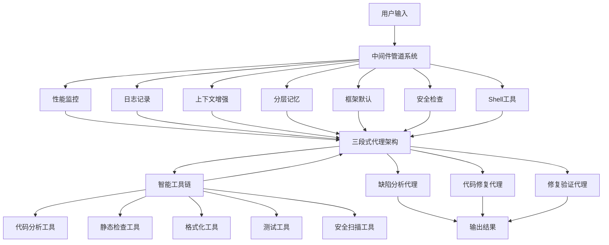

[](https://python.org)
[](LICENSE)
[](https://python.langchain.com)
[](https://github.com/3uyuan1ee/Fix_agent)


基于Langchian1.0和Deepagents，实现项目问题检测->自动修复->效果验证的闭环
- **人机交互** - 直观高效的命令行界面，同时支持web界面
- **精准修复** - 基于深度分析提供针对性修复方案并在human-in-loop下执行修复
- **持续学习** - 具备记忆能力，越用越智能

---

### 基于Deepagents的Three-subagents架构

#### 1. 缺陷分析代理 (defect-analyzer)
- **语法分析** - 检测语法错误、类型错误、导入错误
- **逻辑分析** - 识别逻辑漏洞、边界条件处理不当
- **性能分析** - 发现性能瓶颈、资源泄漏问题
- **安全分析** - 检查SQL注入、XSS、权限绕过等安全漏洞

#### 2. 代码修复代理 (code-fixer)
- **智能修复** - 基于分析报告自动生成修复代码
- **策略优化** - 从多个修复方案中选择最优解
- **兼容性保证** - 确保修复不会引入新的问题

#### 3. 修复验证代理 (fix-validator)
- **测试验证** - 运行单元测试和集成测试
- **静态分析** - 验证代码质量标准
- **安全扫描** - 确保修复无安全风险

### 全面的技术栈支持

支持主流编程语言的代码质量分析：
- **Web开发** - JavaScript, TypeScript, HTML, CSS
- **后端开发** - Python, Java, Go, Node.js
- **系统编程** - C, C++, Rust
- **移动开发** - Swift, Kotlin
- **数据科学** - Python, R

### 智能工具生态

- **统一工具链** - 集成pylint, flake8, mypy, bandit, black, eslint等
- **智能聚合** - 语义相似度缺陷聚类分析
- **项目探索** - 结构分析和复杂度评估
- **智能测试** - 自动生成和执行验证测试

---

## 现代化用户体验
### 双模式支持

**CLI模式** 
- 快速、高效的命令行交互
- 丰富的键盘快捷键和自动补全
- 支持多行输入和编辑器集成

**Web模式** - 直观的图形化界面
- 友好的浏览器界面
- 可视化的代码质量报告

### 人机交互

- **打字机效果** - 动态文本输出增强体验
- **实时进度指示** - 清晰显示处理进度，实时监控Agent的行为，调用工具manual和auto两种模式
- **智能提示系统** - /command建议和补全
- **中断支持** - 随时中断长时间运行的分析
  
---

## 安全防护


1. **文件安全中间件** - 防止恶意文件访问和路径遍历
2. **命令安全中间件** - 限制Shell命令执行范围，精细的文件和目录访问权限控制
3. **内容安全中间件** - 过滤敏感信息和恶意内容,防止API等信息泄露


---

## 快速开始

### 环境要求

- Python 3.11+
- 支持的操作系统：macOS, Linux

### 安装
#### Clone
```bash
# 克隆项目
git clone https://github.com/3uyuan1ee/Fix_agent.git
cd Fix_agent

# 安装依赖
pip install -r requirements.txt

# 安装Fix Agent
pip install -e .
```
#### PYPI
包已上传到PYPI,支持在python环境下pip一键安装

```bash
# 建议在虚拟python环境下安装
pip install Fix-agent
```

### 配置

```bash
# 支持自动配置，若检测到为配置，启动会引导进行配置，只需获取API即可

#手动配置
# 配置环境变量
export OPENAI_API_KEY="your-api-key"

# 或创建.env文件
echo "OPENAI_API_KEY=your-api-key" > .env

# 如需使用国内模型还需配置base_url
OPENAI_API_BASE=https://open.bigmodel.cn/api/paas/v4/

# 若要启动联网搜索，还需配置Tavily API Key

TAVILY_API_KEY=your_tavily_api_key_here
```
点这里获取[TAVILY_API](https://www.tavily.com/)


### 启动使用

```bash
# 启动Fix Agent
fixagent

# 查看帮助
fixagent help

# 列出可用的agents
fixagent list
```

---


## 高级功能

### 记忆系统

Fix Agent具备长期记忆能力，能够：

- **支持编辑记忆** - 可根据需求给予Agents记忆和知识
- **学习修复模式** - 根据历史修复优化建议
- **个性化偏好** - 记住用户的编码风格和偏好

```bash
# 编辑记忆内容
/memory edit

# 查看记忆内容
/memory view

# 搜索特定问题的记忆
/memory search SQL注入

# 清理记忆内容
/memory clear
```
---

## 技术架构

- **异步处理** - 基于asyncio的高性能异步架构
- **流式处理** - 实时显示分析进度和结果
- **模块化设计** - 插件化的工具和中间件系统，用户可自定义

### 系统架构


---

## 贡献指南

我们欢迎社区贡献！您可以通过以下方式参与：

### 报告问题
- 在[Issues](https://github.com/3uyuan1ee/Fix_agent/issues)中报告bug
- 提供详细的重现步骤
- 附上相关的日志信息
- 或联系[我](1481059602@qq.com)

### 功能建议
- 提出新功能想法
- 讨论实现方案
- 提供用户反馈

### 代码贡献
1. Fork项目
2. 创建功能分支
3. 提交Pull Request
4. 参与代码审查

### 文档改进
- 改进用户文档
- 添加使用示例
- 翻译多语言版本


## 许可证

本项目采用MPL-2.0许可证，详见[LICENSE](LICENSE)文件。

---

## 致谢

感谢所有为Fix Agent项目做出贡献的开发者和用户,感谢开源社区提供的优秀工具和库，让这个项目成为可能。

