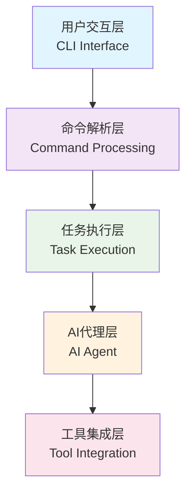
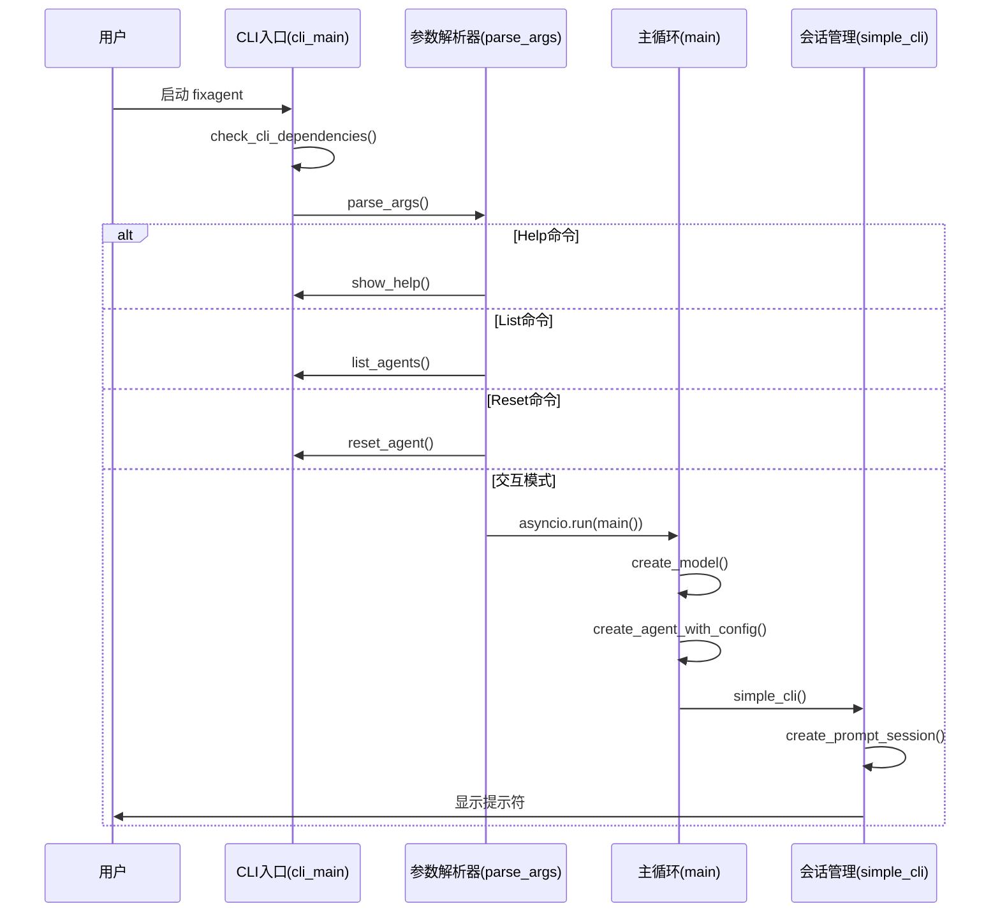
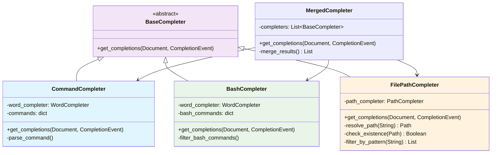
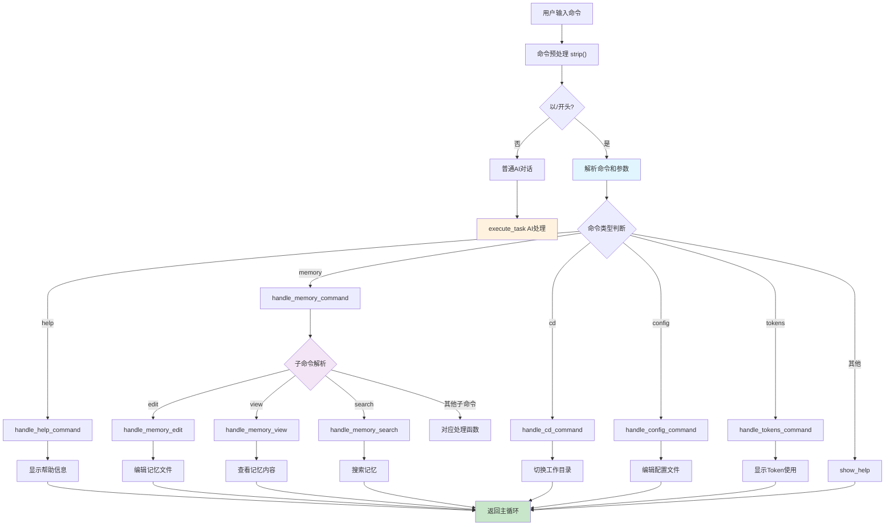
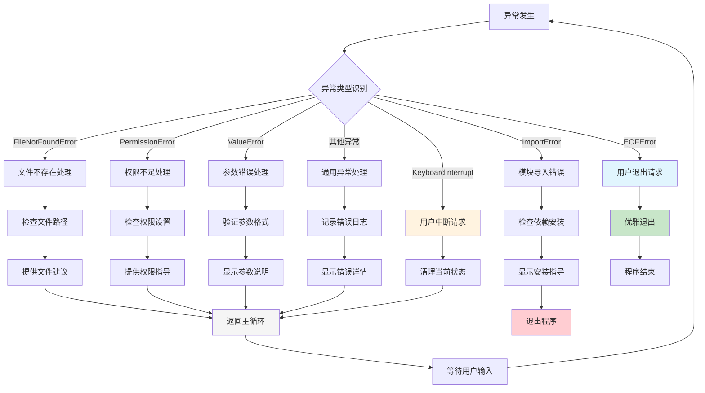

# Fix Agent CLI/UI 架构设计文档

## 概述

Fix Agent 是一个基于命令行的AI代码助手，采用了现代化的终端用户界面设计，提供流畅的交互体验。本文档深入分析其CLI、UI、命令处理和用户交互系统的架构设计与实现理念。

## 核心设计理念

### 1. 分层架构 (Layered Architecture)

Fix Agent 采用了清晰的分层架构设计：



每一层都有明确的职责边界，保证了系统的可维护性和扩展性。

### 2. 异步优先 (Async-First Design)

整个系统基于异步编程模型构建：
- 使用 `asyncio` 作为核心事件循环
- 支持非阻塞的用户输入处理
- 实现流式AI响应显示
- 优雅的中断处理机制

### 3. 用户体验优先 (UX-First Design)

- **即时响应**: 用户输入立即得到反馈
- **视觉丰富**: 使用Rich库提供美观的终端UI
- **智能补全**: 支持命令、文件路径的自动补全
- **状态感知**: 实时显示agent思考和执行状态

## 系统整体架构

### 应用程序启动流程



## CLI 核心架构

### 主入口点架构

**技术实现细节**：

```python
# src/main.py - cli_main()
def cli_main():
    """控制台脚本的入口点"""
    try:
        args = parse_args()

        if args.command == "help":
            show_help()
        elif args.command == "list":
            list_agents()
        elif args.command == "reset":
            reset_agent(args.agent, args.source_agent)
        else:
            session_state = SessionState(auto_approve=args.auto_approve)
            asyncio.run(main(args.agent, session_state))
    except KeyboardInterrupt:
        console.print("\n\n[yellow]Interrupted[/yellow]")
        sys.exit(0)
```

### 交互式会话循环

**具体实现机制**：

```python
# src/main.py - simple_cli()
async def simple_cli(agent, assistant_id, session_state, baseline_tokens=0):
    """Main CLI循环"""
    console.clear()
    typewriter.welcome()

    session = create_prompt_session(assistant_id, session_state)
    token_tracker = TokenTracker()

    while True:
        try:
            user_input = await session.prompt_async()
            user_input = user_input.strip()
        except EOFError:
            break
        except KeyboardInterrupt:
            console.print("\n[yellow]输入已取消 (Ctrl+C)[/yellow]")
            continue

        if not user_input:
            continue

        # 命令分发逻辑
        if user_input.startswith("/"):
            result = handle_command(user_input, agent, token_tracker)
            if result == "exit":
                break
            if result:
                continue

        if user_input.startswith("!"):
            execute_bash_command(user_input)
            continue

        if user_input.lower() in ["quit", "exit", "q"]:
            break

        execute_task(user_input, agent, assistant_id, session_state, token_tracker)
```

**会话状态机**：

```mermaid
stateDiagram-v2
    [*] --> 等待输入: session.prompt_async()
    等待输入 --> 输入处理: 用户输入
    等待输入 --> 优雅退出: EOFError
    等待输入 --> 取消输入: KeyboardInterrupt

    输入处理 --> 命令判断: strip()
    命令判断 --> 内置命令: /开头
    命令判断 --> Bash命令: !开头
    命令判断 --> 退出命令: quit/exit/q
    命令判断 --> AI任务: 普通文本

    内置命令 --> handle_command: 命令处理
    Bash命令 --> execute_bash_command: Shell执行
    AI任务 --> execute_task: Agent处理

    handle_command --> 等待输入: 返回结果
    execute_bash_command --> 等待输入: 输出结果
    execute_task --> 等待输入: 任务完成
    退出命令 --> 优雅退出
    取消输入 --> 等待输入
    优雅退出 --> [*]

    style 等待输入 fill:#e1f5fe
    style 优雅退出 fill:#c8e6c9
    style 取消输入 fill:#fff3e0
```

## 用户输入处理系统

### PromptSession 设计

**核心技术实现**：

```python
# src/interface/input.py - create_prompt_session()
def create_prompt_session(assistant_id: str, session_state: SessionState):
    """Create a configured PromptSession with all features."""
    kb = KeyBindings()

    # Ctrl+T 切换auto-approve模式
    @kb.add("c-t")
    def _(event):
        session_state.toggle_auto_approve()
        event.app.invalidate()

    # Enter提交逻辑 - 区分补全和提交
    @kb.add("enter")
    def _(event):
        buffer = event.current_buffer
        if buffer.complete_state:
            if buffer.complete_state.current_completion:
                buffer.apply_completion(buffer.complete_state.current_completion)
            elif buffer.complete_state.completions:
                buffer.complete_next()
                buffer.apply_completion(buffer.complete_state.current_completion)
        elif buffer.text.strip():
            buffer.validate_and_handle()

    # ESC+Enter 多行输入
    @kb.add("escape", "enter")
    def _(event):
        event.current_buffer.insert_text("\n")

    # 创建会话实例
    session = PromptSession(
        message=HTML(f'<style fg="{COLORS["user"]}">></style> '),
        multiline=True,
        key_bindings=kb,
        completer=merge_completers([
            CommandCompleter(),
            BashCompleter(),
            FilePathCompleter()
        ]),
        editing_mode=EditingMode.EMACS,
        complete_while_typing=True,
        mouse_support=False,
        bottom_toolbar=get_bottom_toolbar(session_state)
    )
    return session
```

### 自动补全系统架构

**文件路径补全实现**：

```python
# src/interface/input.py - FilePathCompleter
class FilePathCompleter(Completer):
    """File path completer that triggers on @ symbol with case-insensitive matching."""

    def __init__(self):
        self.path_completer = PathCompleter(expanduser=True)

    def get_completions(self, document, complete_event):
        """Get file path completions when @ is detected."""
        text = document.text_before_cursor

        if "@" in text:
            parts = text.split("@")
            if len(parts) >= 2:
                after_at = parts[-1]
                path_doc = Document(after_at, len(after_at))

                all_completions = list(
                    self.path_completer.get_completions(path_doc, complete_event)
                )

                # 智能过滤和大小写不敏感匹配
                if after_at.strip():
                    search_parts = after_at.split("/")
                    search_term = search_parts[-1].lower() if search_parts else ""

                    filtered_completions = [
                        c for c in all_completions
                        if search_term in c.text.lower()
                    ]
                else:
                    filtered_completions = all_completions

                for completion in filtered_completions:
                    yield Completion(
                        text=completion.text,
                        start_position=completion.start_position,
                        display=completion.display,
                        display_meta=completion.display_meta,
                        style=completion.style,
                    )
```

**命令补全实现**：

```python
# src/interface/input.py - CommandCompleter
class CommandCompleter(Completer):
    """Command completer for / commands."""

    def __init__(self):
        self.word_completer = WordCompleter(
            list(COMMANDS.keys()),
            meta_dict=COMMANDS,
            sentence=True,
            ignore_case=True,
        )

    def get_completions(self, document, complete_event):
        """Get command completions when / is at the start."""
        text = document.text

        if text.startswith("/"):
            cmd_text = text[1:]  # 移除/
            adjusted_doc = Document(
                cmd_text,
                document.cursor_position - 1 if document.cursor_position > 0 else 0,
            )

            for completion in self.word_completer.get_completions(
                adjusted_doc, complete_event
            ):
                yield completion
```

**补全系统架构图**：



## 命令处理系统

### 命令分发机制

**核心分发逻辑**：

```python
# src/interface/commands.py - handle_command()
def handle_command(user_input: str, agent, token_tracker=None) -> str:
    """处理用户输入的命令"""
    if not user_input.startswith("/"):
        return None

    parts = user_input[1:].strip().split()
    if not parts:
        return None

    command = parts[0].lower()
    args = parts[1:] if len(parts) > 1 else []

    # 命令分发映射
    command_handlers = {
        "help": handle_help_command,
        "clear": handle_clear_command,
        "memory": handle_memory_command,
        "cd": handle_cd_command,
        "config": handle_config_command,
        "tokens": handle_tokens_command,
        "sys": handle_system_command,
        "services": handle_services_command,
    }

    handler = command_handlers.get(command)
    if handler:
        try:
            return handler(args, agent, token_tracker)
        except Exception as e:
            console.print(f"[red]❌ Command '{command}' failed: {e}[/red]")
            return None
    else:
        console.print(f"[red]❌ Unknown command: /{command}[/red]")
        console.print("Type /help for available commands")
        return None
```

### 记忆管理命令实现

**分层命令处理**：

```python
# src/interface/memory_commands.py - handle_memory_command()
def handle_memory_command(args: List[str]) -> bool:
    """处理 /memory 命令的入口函数"""
    if not args:
        show_memory_menu()
        return True

    try:
        from agents.agent import get_current_assistant_id
        assistant_id = get_current_assistant_id()
    except ImportError:
        console.print("[red]❌ 无法获取当前assistant ID[/red]")
        return False

    memory_manager = MemoryManager(assistant_id)
    command = args[0]

    # 子命令分发
    subcommands = {
        "edit": lambda: handle_memory_edit(memory_manager, args[1:]),
        "view": lambda: handle_memory_view(memory_manager, args[1:]),
        "search": lambda: handle_memory_search(memory_manager, args[1:]),
        "stats": lambda: handle_memory_stats(memory_manager),
        "export": lambda: handle_memory_export(memory_manager, args[1:]),
        "import": lambda: handle_memory_import(memory_manager, args[1:]),
        "list": lambda: handle_memory_list(memory_manager),
        "backup": lambda: handle_memory_backup(memory_manager),
        "restore": lambda: handle_memory_restore(memory_manager, args[1:]),
        "clear": lambda: handle_memory_clear(memory_manager, args[1:]),
    }

    handler = subcommands.get(command)
    if handler:
        return handler()
    else:
        console.print(f"[red]❌ 未知的记忆命令: {command}[/red]")
        show_memory_menu()
        return True
```

**命令处理流程图**：



## 任务执行引擎

### AI任务执行核心实现

**流式处理引擎**：

```python
# src/interface/execution.py - execute_task()
def execute_task(user_input, agent, assistant_id, session_state, token_tracker=None):
    """Execute any task by passing it directly to the AI agent."""

    # 1. 输入预处理 - 文件引用解析
    prompt_text, mentioned_files = parse_file_mentions(user_input)

    if mentioned_files:
        context_parts = [prompt_text, "\n\n## Referenced Files\n"]
        for file_path in mentioned_files:
            try:
                content = file_path.read_text()
                # 文件大小限制，防止内存溢出
                if len(content) > 50000:
                    content = content[:50000] + "\n... (文件已截断)"
                context_parts.append(
                    f"\n### {file_path.name}\nPath: `{file_path}`\n```\n{content}\n```"
                )
            except Exception as e:
                context_parts.append(
                    f"\n### {file_path.name}\n[读取文件错误: {e}]"
                )
        final_input = "\n".join(context_parts)
    else:
        final_input = prompt_text

    # 2. 配置执行环境
    config = {
        "configurable": {"thread_id": "main"},
        "metadata": {"assistant_id": assistant_id} if assistant_id else {},
    }

    # 3. 状态和UI初始化
    has_responded = False
    captured_input_tokens = 0
    captured_output_tokens = 0
    current_todos = None

    status = console.status(
        f"[bold {COLORS['thinking']}]Agent is thinking...",
        spinner="dots"
    )
    status.start()
    spinner_active = True

    # 4. 流式处理核心循环
    stream_input = {"messages": [{"role": "user", "content": final_input}]}

    try:
        while True:
            interrupt_occurred = False
            hitl_response = None
            suppress_resumed_output = False

            try:
                for chunk in agent.stream(
                    stream_input,
                    stream_mode=["messages", "updates"],  # 双模式流
                    subgraphs=True,
                    config=config,
                    durability="exit",
                ):
                    # 解包chunk数据
                    if not isinstance(chunk, tuple) or len(chunk) != 3:
                        continue

                    namespace, current_stream_mode, data = chunk

                    # 处理更新流 - 中断和待办事项
                    if current_stream_mode == "updates":
                        if not isinstance(data, dict):
                            continue

                        # 中断检测和处理
                        if "__interrupt__" in data:
                            interrupt_data = data["__interrupt__"]
                            if interrupt_data:
                                interrupt_obj = (
                                    interrupt_data[0]
                                    if isinstance(interrupt_data, tuple)
                                    else interrupt_data
                                )
                                hitl_request = (
                                    interrupt_obj.value
                                    if hasattr(interrupt_obj, "value")
                                    else interrupt_obj
                                )

                                # 处理人机交互(HITL)
                                if session_state.auto_approve:
                                    decisions = []
                                    for action_request in hitl_request.get("action_requests", []):
                                        decisions.append({"type": "approve"})
                                    hitl_response = {"decisions": decisions}
                                    interrupt_occurred = True
                                    break
                                else:
                                    decisions = []
                                    for action_request in hitl_request.get("action_requests", []):
                                        decision = prompt_for_tool_approval(action_request, assistant_id)
                                        decisions.append(decision)
                                    suppress_resumed_output = any(
                                        decision.get("type") == "reject"
                                        for decision in decisions
                                    )
                                    hitl_response = {"decisions": decisions}
                                    interrupt_occurred = True
                                    break

                    # 处理消息流 - AI响应和工具调用
                    elif current_stream_mode == "messages":
                        if not isinstance(data, tuple) or len(data) != 2:
                            continue

                        message, metadata = data

                        # 处理工具消息
                        if isinstance(message, ToolMessage):
                            tool_name = getattr(message, "name", "")
                            tool_status = getattr(message, "status", "success")
                            tool_content = format_tool_message_content(message.content)
                            record = file_op_tracker.complete_with_message(message)

                            # 特殊处理shell错误
                            if tool_name == "shell" and tool_status != "success":
                                if spinner_active:
                                    status.stop()
                                    spinner_active = False
                                if tool_content:
                                    console.print(tool_content, style="red", markup=False)
                                    console.print()

                            # 文件操作记录显示
                            if record:
                                if spinner_active:
                                    status.stop()
                                    spinner_active = False
                                console.print()
                                render_file_operation(record)
                                console.print()
                                if not spinner_active:
                                    status.start()
                                    spinner_active = True
                            continue

                        # 处理AI消息块
                        if hasattr(message, "content_blocks"):
                            # Token使用统计
                            if token_tracker and hasattr(message, "usage_metadata"):
                                usage = message.usage_metadata
                                if usage:
                                    input_toks = usage.get("input_tokens", 0)
                                    output_toks = usage.get("output_tokens", 0)
                                    if input_toks or output_toks:
                                        captured_input_tokens = max(captured_input_tokens, input_toks)
                                        captured_output_tokens = max(captured_output_tokens, output_toks)

                            # 处理内容块
                            for block in message.content_blocks:
                                block_type = block.get("type")

                                if block_type == "text":
                                    text = block.get("text", "")
                                    if text:
                                        if is_summary_message(text) or is_summary_message(pending_text + text):
                                            if pending_text:
                                                summary_buffer += pending_text
                                                pending_text = ""
                                            summary_mode = True
                                            summary_buffer += text
                                            continue

                                        pending_text += text

                                elif block_type == "reasoning":
                                    flush_text_buffer(final=True)
                                    reasoning = block.get("reasoning", "")
                                    if reasoning:
                                        if spinner_active:
                                            status.stop()
                                            spinner_active = False

                                elif block_type == "tool_call_chunk":
                                    # 工具调用处理逻辑
                                    chunk_name = block.get("name")
                                    chunk_args = block.get("args")
                                    chunk_id = block.get("id")
                                    chunk_index = block.get("index")

                                    # 稳定的缓冲键
                                    buffer_key = chunk_index if chunk_index is not None else chunk_id
                                    if buffer_key is None:
                                        buffer_key = f"unknown-{len(tool_call_buffers)}"

                                    buffer = tool_call_buffers.setdefault(buffer_key, {
                                        "name": None, "id": None, "args": None, "args_parts": []
                                    })

                                    if chunk_name:
                                        buffer["name"] = chunk_name
                                    if chunk_id:
                                        buffer["id"] = chunk_id
                                    if chunk_args:
                                        if isinstance(chunk_args, str):
                                            parts = buffer.setdefault("args_parts", [])
                                            if chunk_args and (not parts or chunk_args != parts[-1]):
                                                parts.append(chunk_args)
                                            buffer["args"] = "".join(parts)
                                        else:
                                            buffer["args"] = chunk_args

                                    # 工具调用显示
                                    buffer_name = buffer.get("name")
                                    if buffer_name and buffer_name not in displayed_tool_ids:
                                        buffer_id = buffer.get("id")
                                        if buffer_id:
                                            displayed_tool_ids.add(buffer_id)
                                            file_op_tracker.start_operation(buffer_name, buffer.get("args"), buffer_id)

                                        icon = tool_icons.get(buffer_name, "🔧")
                                        if spinner_active:
                                            status.stop()
                                        if has_responded:
                                            console.print()

                                        parsed_args = buffer.get("args")
                                        if isinstance(parsed_args, str):
                                            try:
                                                parsed_args = json.loads(parsed_args)
                                            except json.JSONDecodeError:
                                                continue
                                        elif parsed_args is None:
                                            continue

                                        if not isinstance(parsed_args, dict):
                                            parsed_args = {"value": parsed_args}

                                        display_str = format_tool_display(buffer_name, parsed_args)
                                        console.print(
                                            f"  {icon} {display_str}",
                                            style=f"dim {COLORS['tool']}",
                                            markup=False,
                                        )

                                        if not spinner_active:
                                            status.start()
                                            spinner_active = True

                    # 消息块结束处理
                    if getattr(message, "chunk_position", None) == "last":
                        flush_summary_buffer()
                        flush_text_buffer(final=True)

                # 流循环后处理中断
                flush_summary_buffer()
                flush_text_buffer(final=True)

                if interrupt_occurred and hitl_response:
                    if suppress_resumed_output:
                        if spinner_active:
                            status.stop()
                            spinner_active = False
                        console.print("\nCommand rejected. Returning to prompt.\n", style=COLORS["dim"])

                        # 后台恢复agent状态
                        def resume_after_rejection():
                            try:
                                agent.invoke(Command(resume=hitl_response), config=config)
                            except Exception:
                                pass
                        threading.Thread(target=resume_after_rejection, daemon=True).start()
                        return

                    # 恢复agent执行
                    stream_input = Command(resume=hitl_response)
                    continue
                else:
                    break

            except KeyboardInterrupt:
                # Ctrl+C中断处理
                if spinner_active:
                    status.stop()
                    spinner_active = False
                console.print("\n[yellow]Agent执行被打断 (Ctrl+C)[/yellow]")

                # 通知agent中断状态
                def notify_agent():
                    try:
                        agent.update_state(
                            config=config,
                            values={
                                "messages": [
                                    HumanMessage(content="[User interrupted the execution with Ctrl+C]")
                                ]
                            },
                        )
                    except Exception:
                        pass

                threading.Thread(target=notify_agent, daemon=True).start()
                return

    except KeyboardInterrupt:
        # 外层中断处理
        if spinner_active:
            status.stop()
            spinner_active = False
        console.print("\n[yellow]Interrupted by user[/yellow]\n")

        def notify_agent():
            try:
                agent.update_state(
                    config=config,
                    values={
                        "messages": [
                            HumanMessage(content="[User interrupted the previous request with Ctrl+C]")
                        ]
                    },
                )
            except Exception:
                pass

        threading.Thread(target=notify_agent, daemon=True).start()
        return

    # 清理和统计
    if spinner_active:
        status.stop()
        spinner_active = False

    if has_responded:
        console.print()

    if token_tracker and (captured_input_tokens or captured_output_tokens):
        token_tracker.add(captured_input_tokens, captured_output_tokens)

    console.print()
```

### 中断处理机制

**多层中断处理架构**：

```mermaid
stateDiagram-v2
    [*] --> 正常执行
    正常执行 --> 流式处理: agent.stream()
    流式处理 --> 工具调用: 处理工具请求
    流式处理 --> AI响应: 处理AI消息
    流式处理 --> 用户中断: KeyboardInterrupt

    用户中断 --> 清理状态: status.stop()
    清理状态 --> 显示提示: "Agent执行被打断"
    显示提示 --> 通知Agent: agent.update_state()
    通知Agent --> 后台线程: threading.Thread()
    后台线程 --> 返回主循环

    工具调用 --> 执行工具: prompt_for_tool_approval()
    执行工具 --> 继续流式: 处理结果
    AI响应 --> 继续流式: 显示响应
    继续流式 --> 流式处理
    流式处理 --> 任务完成: break

    任务完成 --> 清理资源: stop spinner
    清理资源 --> 统计Token: token_tracker.add()
    统计Token --> 返回主循环
    返回主循环 --> [*]

    style 用户中断 fill:#ffcdd2
    style 清理状态 fill:#fff3e0
    style 通知Agent fill:#e1f5fe
    style 返回主循环 fill:#c8e6c9
```

## UI 渲染系统

### Rich UI 组件实现

**状态指示器**：

```python
# 状态显示管理
class StatusManager:
    def __init__(self):
        self.status = None
        self.spinner_active = False

    def start_thinking(self):
        """启动思考状态指示器"""
        self.status = console.status(
            f"[bold {COLORS['thinking']}]Agent is thinking...",
            spinner="dots"
        )
        self.status.start()
        self.spinner_active = True

    def stop_thinking(self):
        """停止思考状态指示器"""
        if self.status and self.spinner_active:
            self.status.stop()
            self.spinner_active = False
            self.status = None
```

**Markdown渲染器**：

```python
# 文本缓冲和渲染系统
class TextBuffer:
    def __init__(self):
        self.pending_text = ""
        self.summary_mode = False
        self.summary_buffer = ""

    def add_text(self, text: str):
        """添加文本到缓冲区"""
        if self.summary_mode:
            self.summary_buffer += text
        else:
            self.pending_text += text

    def flush_as_markdown(self, final: bool = False):
        """将缓冲区内容作为Markdown渲染"""
        if not final or not self.pending_text.strip():
            return

        markdown = Markdown(self.pending_text.rstrip())
        console.print(markdown, style=COLORS["agent"])
        self.pending_text = ""

    def flush_as_summary_panel(self):
        """渲染摘要面板"""
        if not self.summary_mode or not self.summary_buffer.strip():
            return

        console.print()
        render_summary_panel(self.summary_buffer.strip())
        console.print()
        self.summary_mode = False
        self.summary_buffer = ""
```

**面板渲染系统**：

```python
# 工具操作面板
def render_tool_approval_panel(action_request: dict, assistant_id: str):
    """渲染工具操作批准面板"""
    tool_name = action_request.get("name")
    tool_args = _extract_tool_args(action_request)
    preview = build_approval_preview(tool_name, tool_args, assistant_id)

    body_lines = []
    if preview:
        body_lines.append(f"[bold]{preview.title}[/bold]")
        body_lines.extend(preview.details)
        if preview.error:
            body_lines.append(f"[red]{preview.error}[/red]")

    description = action_request.get("description", "No description available")
    if description != "No description available":
        body_lines.append("")
        body_lines.append(description)
    else:
        body_lines.append(description)

    # 显示面板
    console.print()
    console.print(
        Panel(
            "[bold yellow]⚠️ Tool Action Requires Approval[/bold yellow]\n\n"
            + "\n".join(body_lines),
            border_style="yellow",
            box=box.ROUNDED,
            padding=(0, 1),
        )
    )

    # 显示差异对比
    if preview and preview.diff and not preview.error:
        console.print()
        render_diff_block(preview.diff, preview.diff_title or preview.title)
    console.print()
```

## 错误处理和恢复系统

### 分层异常处理

**具体实现机制**：

```python
# 1. 输入层异常处理
async def safe_prompt_input(session):
    """安全的用户输入处理"""
    while True:
        try:
            user_input = await session.prompt_async()
            return user_input.strip()
        except EOFError:
            console.print("\n[yellow]会话结束[/yellow]")
            return None  # 信号退出
        except KeyboardInterrupt:
            console.print("\n[yellow]输入已取消，请重新输入[/yellow]")
            continue  # 继续等待输入
        except Exception as e:
            console.print(f"\n[red]输入错误: {e}[/red]")
            continue

# 2. 命令执行异常处理
def safe_command_execute(command_func, *args, **kwargs):
    """安全的命令执行包装"""
    try:
        return command_func(*args, **kwargs)
    except FileNotFoundError as e:
        console.print(f"[red]❌ 文件未找到: {e}[/red]")
        return False
    except PermissionError as e:
        console.print(f"[red]❌ 权限不足: {e}[/red]")
        return False
    except ValueError as e:
        console.print(f"[red]❌ 参数错误: {e}[/red]")
        return False
    except Exception as e:
        console.print(f"[red]❌ 命令执行失败: {e}[/red]")
        import traceback
        console.print(f"[dim]错误详情: {traceback.format_exc()}[/dim]")
        return False

# 3. 系统级异常处理
def cli_main():
    """主程序入口的安全包装"""
    try:
        check_cli_dependencies()
        args = parse_args()

        if args.command == "help":
            show_help()
        elif args.command == "list":
            list_agents()
        elif args.command == "reset":
            reset_agent(args.agent, args.source_agent)
        else:
            session_state = SessionState(auto_approve=args.auto_approve)
            asyncio.run(main(args.agent, session_state))

    except KeyboardInterrupt:
        console.print("\n\n[yellow]程序被用户中断[/yellow]")
        sys.exit(0)
    except ImportError as e:
        console.print(f"[red]❌ 模块导入失败: {e}[/red]")
        console.print("[dim]请检查是否正确安装了所有依赖[/dim]")
        sys.exit(1)
    except Exception as e:
        console.print(f"[red]❌ 程序发生严重错误: {e}[/red]")
        console.print("[dim]详细错误信息:[/dim]")
        import traceback
        console.print(f"[dim]{traceback.format_exc()}[/dim]")
        sys.exit(1)
```

**错误恢复流程图**：



## 性能优化实现

### 异步I/O优化

**非阻塞输入处理**：

```python
# 异步输入处理实现
class AsyncInputManager:
    def __init__(self):
        self.input_queue = asyncio.Queue()
        self.session = None

    async def setup_session(self, assistant_id, session_state):
        """设置异步会话"""
        self.session = create_prompt_session(assistant_id, session_state)

    async def get_user_input(self):
        """获取用户输入 - 非阻塞"""
        while True:
            try:
                # 异步等待用户输入
                user_input = await self.session.prompt_async()
                if user_input and user_input.strip():
                    return user_input.strip()
            except EOFError:
                return None
            except KeyboardInterrupt:
                console.print("\n[yellow]输入已取消[/yellow]")
                continue

    async def process_input_stream(self):
        """处理输入流"""
        while True:
            user_input = await self.get_user_input()
            if user_input is None:
                break

            # 将输入放入处理队列
            await self.input_queue.put(user_input)

    async def get_next_command(self):
        """获取下一个命令 - 非阻塞"""
        try:
            # 带超时的队列获取，避免永久阻塞
            return await asyncio.wait_for(self.input_queue.get(), timeout=0.1)
        except asyncio.TimeoutError:
            return None
```

**内存管理优化**：

```python
# 内存优化管理器
class MemoryOptimizer:
    def __init__(self, max_file_size=50000, max_memory_mb=100):
        self.max_file_size = max_file_size
        self.max_memory_bytes = max_memory_mb * 1024 * 1024
        self.memory_usage = 0

    def check_file_size(self, content: str, file_path: str) -> str:
        """检查并处理文件大小"""
        if len(content) > self.max_file_size:
            console.print(f"[yellow]⚠ 文件 {file_path} 过大，已截断到 {self.max_file_size//1024}KB[/yellow]")
            return content[:self.max_file_size] + "\n... (文件已截断)"
        return content

    def monitor_memory_usage(self):
        """监控内存使用"""
        import psutil
        process = psutil.Process()
        memory_info = process.memory_info()
        self.memory_usage = memory_info.rss

        if self.memory_usage > self.max_memory_bytes:
            console.print(f"[yellow]⚠ 内存使用过高: {self.memory_usage//1024//1024}MB[/yellow]")
            self.garbage_collect()

    def garbage_collect(self):
        """强制垃圾回收"""
        import gc
        gc.collect()
        console.print("[dim]执行内存清理...[/dim]")
```

**Token使用优化**：

```python
# Token使用统计和优化
class TokenOptimizer:
    def __init__(self):
        self.input_tokens = 0
        self.output_tokens = 0
        self.cache = {}

    def track_token_usage(self, usage_metadata: dict):
        """跟踪Token使用"""
        if not usage_metadata:
            return

        input_toks = usage_metadata.get("input_tokens", 0)
        output_toks = usage_metadata.get("output_tokens", 0)

        self.input_tokens = max(self.input_tokens, input_toks)
        self.output_tokens = max(self.output_tokens, output_toks)

    def optimize_input_for_context(self, context: str, max_tokens: int = 8000) -> str:
        """优化输入以减少Token使用"""
        # 简单的Token估算 (大约4字符 = 1token)
        estimated_tokens = len(context) // 4

        if estimated_tokens <= max_tokens:
            return context

        # 按重要性截取内容
        lines = context.split('\n')
        target_lines = int(len(lines) * max_tokens / estimated_tokens)

        # 保留开头和结尾，截取中间
        keep_start = target_lines // 2
        keep_end = target_lines - keep_start

        result = '\n'.join(lines[:keep_start] + ['...'] + lines[-keep_end:])

        console.print(f"[yellow]⚠ 上下文已优化: {estimated_tokens} -> ~{max_tokens} tokens[/yellow]")
        return result
```

## 安全性实现

### 输入验证和安全过滤

**安全输入处理器**：

```python
# 安全输入验证
class SecurityValidator:
    def __init__(self):
        self.dangerous_patterns = [
            r'\.\./.*',           # 路径遍历
            r'[;&|`$]',           # Shell注入字符
            r'rm\s+-rf',         # 危险命令
            r'sudo',              # 权限提升
            r'passwd',            # 密码相关
            r'ssh\s+.*@',         # SSH连接
        ]

    def validate_file_path(self, file_path: str) -> tuple[bool, str]:
        """验证文件路径安全性"""
        try:
            path = Path(file_path).resolve()
            cwd = Path.cwd().resolve()

            # 检查路径遍历攻击
            if not str(path).startswith(str(cwd)):
                return False, f"拒绝访问路径 {file_path} (路径遍历攻击防护)"

            # 检查敏感文件
            sensitive_files = ['/etc/passwd', '/etc/shadow', '~/.ssh/', '~/.aws/']
            for sensitive in sensitive_files:
                if str(path).startswith(sensitive):
                    return False, f"拒绝访问敏感文件 {file_path}"

            return True, str(path)

        except Exception as e:
            return False, f"路径验证失败: {e}"

    def validate_bash_command(self, command: str) -> tuple[bool, str]:
        """验证Bash命令安全性"""
        import re

        for pattern in self.dangerous_patterns:
            if re.search(pattern, command, re.IGNORECASE):
                return False, f"命令包含危险模式: {pattern}"

        # 检查命令白名单
        safe_commands = {
            'ls', 'pwd', 'cd', 'cat', 'grep', 'find', 'head', 'tail', 'wc',
            'git', 'python', 'node', 'npm', 'pip', 'docker', 'pytest',
            'make', 'cmake', 'gcc', 'g++', 'javac', 'java'
        }

        first_word = command.split()[0] if command.split() else ''
        if first_word not in safe_commands:
            return False, f"命令 '{first_word}' 不在安全命令列表中"

        return True, command

    def sanitize_input(self, user_input: str) -> str:
        """清理用户输入"""
        import html
        # 转义HTML字符
        sanitized = html.escape(user_input)

        # 移除控制字符
        sanitized = ''.join(char for char in sanitized if ord(char) >= 32 or char in '\n\r\t')

        return sanitized
```

**沙箱执行环境**：

```python
# 沙箱工具执行
class SandboxedExecutor:
    def __init__(self, working_dir: str = None):
        self.working_dir = Path(working_dir) if working_dir else Path.cwd()
        self.allowed_dirs = [self.working_dir]

    def execute_command_safely(self, command: str) -> tuple[int, str, str]:
        """在沙箱环境中安全执行命令"""
        import subprocess
        import tempfile
        import shutil

        # 创建临时工作目录
        with tempfile.TemporaryDirectory() as temp_dir:
            temp_path = Path(temp_dir)

            # 复制必要文件到临时目录
            work_copy = temp_path / "workspace"
            if self.working_dir.exists():
                shutil.copytree(self.working_dir, work_copy, dirs_exist_ok=True)

            # 限制资源使用
            resource_limits = {
                'RLIMIT_CPU': (30, 30),      # 30秒CPU时间
                'RLIMIT_FSIZE': (100*1024*1024, 100*1024*1024),  # 100MB文件大小
                'RLIMIT_AS': (512*1024*1024, 512*1024*1024),      # 512MB内存
            }

            try:
                # 在受限环境中执行命令
                result = subprocess.run(
                    command,
                    cwd=work_copy,
                    shell=True,
                    capture_output=True,
                    text=True,
                    timeout=60,  # 60秒超时
                    preexec_fn=self._apply_resource_limits(resource_limits)
                )

                return result.returncode, result.stdout, result.stderr

            except subprocess.TimeoutExpired:
                return -1, "", "命令执行超时"
            except Exception as e:
                return -1, "", f"执行错误: {e}"

    def _apply_resource_limits(self, limits):
        """应用资源限制"""
        import resource
        def set_limits():
            for limit, (soft, hard) in limits.items():
                resource.setrlimit(getattr(resource, limit), (soft, hard))
        return set_limits
```

## 总结

Fix Agent的CLI/UI系统实现了以下核心价值：

### 架构优势


### 核心技术特点

1. **异步优先设计**: 基于`asyncio`的完整异步架构
2. **流式处理引擎**: 实时AI响应和工具执行
3. **智能补全系统**: 多层次自动补全机制
4. **安全执行沙箱**: 隔离的命令执行环境
5. **内存优化管理**: 智能的内存和Token使用优化
6. **中断处理机制**: 优雅的Ctrl+C中断支持
7. **错误恢复策略**: 多层异常处理和恢复机制

这种设计使得Fix Agent不仅是一个功能强大的AI工具，更是一个展示现代终端应用开发最佳实践的典范。