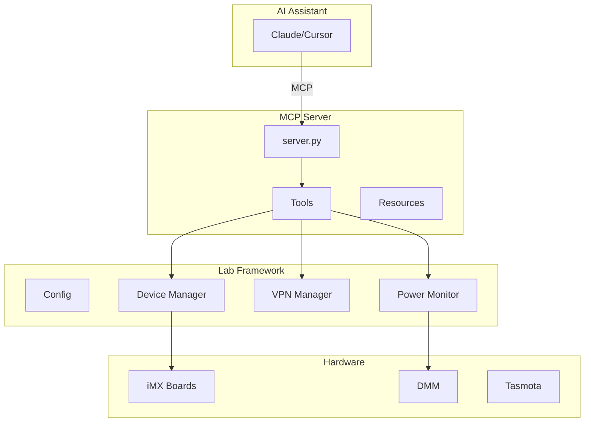

# Lab Testing MCP Server

[](https://github.com/DynamicDevices/ai-lab-testing/actions/workflows/tests.yml)
[](https://www.python.org/downloads/)
[](https://www.gnu.org/licenses/gpl-3.0)
[](https://github.com/psf/black)

MCP server exposing remote embedded hardware testing capabilities to AI assistants.

**Version**: 0.2.0

> **⚠️ ALPHA QUALITY WARNING**: This package is currently in **alpha** development status. It is **not ready for professional or production use**. The API may change, features may be incomplete, and there may be bugs. Use at your own risk. See [PUBLISHING.md](PUBLISHING.md) for more details.

## Installation

**Requirements: Python 3.10+** (MCP SDK requires Python 3.10+)

### From PyPI (Recommended)

```bash
# Install from PyPI
python3.10 -m pip install ai-lab-testing

# Or with development dependencies
python3.10 -m pip install "ai-lab-testing[dev]"
```

### From Source

```bash
# Clone the repository
git clone https://github.com/DynamicDevices/ai-lab-testing.git
cd ai-lab-testing

# Install in development mode
python3.10 -m pip install -e ".[dev]"

# Verify installation
python3.10 lab_testing/test_server.py
```

## Configuration

Add to Cursor MCP config (`~/.cursor/mcp.json`):

```json
{
  "mcpServers": {
    "ai-lab-testing": {
      "command": "python3.10",
      "args": ["/path/to/ai-lab-testing/lab_testing/server.py"],
      "env": {
        "LAB_TESTING_ROOT": "/path/to/ai-lab-testing",
        "VPN_CONFIG_PATH": "/path/to/wg0.conf"
      }
    }
  }
}
```

**Important:** Use `python3.10` (or `python3.11+`) since MCP SDK requires Python 3.10+.

### VPN Setup

The server auto-detects WireGuard VPN configs. If you don't have one:
- See [docs/VPN_SETUP.md](docs/VPN_SETUP.md) for setup guide
- Use MCP tools: `vpn_setup_instructions`, `create_vpn_config_template`

See [docs/SETUP.md](docs/SETUP.md) for detailed setup instructions or `mcp.json.example` for a template.

## Architecture



Data flow: AI → MCP Server → Tools → Lab Framework → Hardware

## Tools

- **Device**: `list_devices`, `test_device`, `ssh_to_device`
- **VPN**: `vpn_status`, `connect_vpn`, `disconnect_vpn`
- **Power**: `start_power_monitoring` (DMM or Tasmota), `get_power_logs`, `analyze_power_logs`, `monitor_low_power`, `compare_power_profiles` - Power monitoring via DMM (SCPI) or Tasmota energy monitoring
- **Tasmota**: `tasmota_control`, `list_tasmota_devices`, `power_cycle_device` - Power cycle devices via Tasmota switches
- **OTA/Containers**: `check_ota_status`, `trigger_ota_update`, `list_containers`, `deploy_container`, `get_system_status`, `get_firmware_version`, `get_foundries_registration_status`, `get_secure_boot_status`, `get_device_identity`
- **Process Management**: `kill_stale_processes` - Kill duplicate processes that might interfere
- **Remote Access**: `create_ssh_tunnel`, `list_ssh_tunnels`, `close_ssh_tunnel`, `access_serial_port`, `list_serial_devices` - SSH tunnels and serial port access
- **Change Tracking**: `get_change_history`, `revert_changes` - Track and revert changes for security/debugging
- **Batch/Regression**: `batch_operation`, `regression_test`, `get_device_groups`
- **Network Mapping**: `create_network_map` - Visual map of network with device type, uptime, friendly names, power switches
- **Device Verification**: `verify_device_identity`, `verify_device_by_ip`, `update_device_ip` - Verify device identity in DHCP environments
- **Help**: `help` - Get usage documentation and examples

## Resources

- `device://inventory` - Device inventory
- `network://status` - Network/VPN status
- `config://lab_devices` - Raw config
- `help://usage` - Help documentation and usage examples
- `health://status` - Server health, metrics, and SSH pool status

## Development

```bash
# Use Python 3.10+ for development
python3.10 -m pip install -e ".[dev]"
pre-commit install
black . && ruff check . --fix
```

**Adding tools**: Create function in `lab_testing/tools/`, register in `lab_testing/server/tool_definitions.py` and `lab_testing/server/tool_handlers.py`.

**Versioning**: Semantic versioning (MAJOR.MINOR.PATCH). Update `version.py`, see [CHANGELOG.md](CHANGELOG.md).

## Documentation

- [API Reference](docs/API.md) - Tool and resource API
- [Setup Guide](docs/SETUP.md) - Installation and configuration
- [Architecture Diagram](docs/architecture.mmd) - Full system diagram

## License

GPL-3.0-or-later - Copyright (C) 2025 Dynamic Devices Ltd

See [LICENSE](LICENSE) for full license text.

## Maintainer

Alex J Lennon <ajlennon@dynamicdevices.co.uk>
