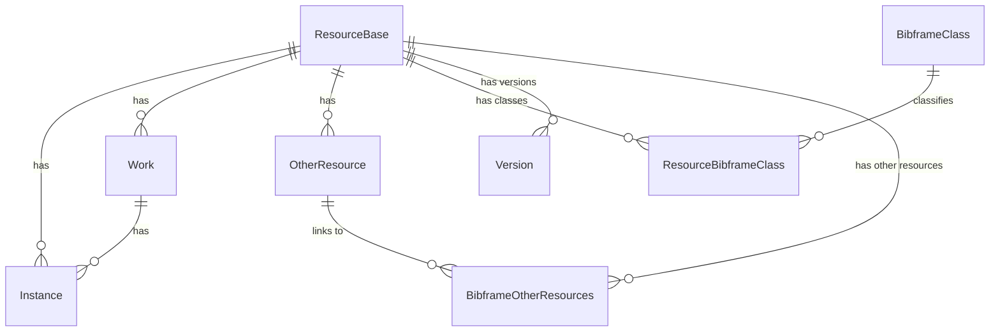

# Blue Core Data Models
The Blue Core Data Models are used in [Blue Core API](https://github.com/blue-core-lod/bluecore_api) 
and in the [Blue Core Workflows](https://github.com/blue-core-lod/bluecore-workflows) services.  

## 🐳 Run Postgres with Docker
To run the Postgres with the Blue Core Database, run the following command from this directory:

`docker run --name bluecore_db -e POSTGRES_USER=airflow -e POSTGRES_PASSWORD=airflow -v ./create-db.sql:/docker-entrypoint-initdb.d/create_database.sql -p 5432:5432 postgres:17`

---

## 🛠️ Installing
- Install via pip: `pip install bluecore-models`
- Install via uv: `uv add bluecore-models`

---

## 🗄️ Database Management
The [SQLAlchemy](https://www.sqlalchemy.org/) Object Relational Mapper (ORM) is used to create
the Bluecore database models. 

### Database Migrations with Alembic
The [Alembic](https://alembic.sqlalchemy.org/en/latest/) database migration package is used
to manage database changes with the Bluecore Data models.

To create a new migration, ensure that the Postgres database is available and then run:
- `uv run alembic revision --autogenerate -m "{short message describing change}`

A new migration script will be created in the `bluecore_store_migration` directory. Be sure
to add the new script to the repository with `git`.

#### Applying Migrations
To apply all of the migrations, run the following command:
- `uv run alembic upgrade head`

---

## 🧹 Linter for Python 
bluecore-models uses [ruff](https://docs.astral.sh/ruff/)
- `uv run ruff check`

To auto-fix errors in both (where possible):
- `uv run ruff check --fix`

Check formatting differences without changing files:
- `uv run ruff format --diff`

Apply Ruff's code formatting:
- `uv run ruff format`

---

## 🧪 Running Tests
The test suite is written using pytest and is executed via uv.
All tests are located in the tests/ directory.

#### Run All Tests
`uv run pytest`

#### Run a specific test file
`uv run pytest tests/test_models.py`

#### Run a specific test function
`uv run pytest tests/test_models.py -k test_updated_instance`

#### Show output (prints/logs) during test execution
`uv run pytest -s`

💡 Make sure your virtual environment is activated and dependencies are installed with uv before running tests.

---

## ⬆️ Publishing to Pypi
To publish the `bluecore-models` to [pypi](https://pypi.org/project/bluecore-models/), the
following steps need to be taken. 

1. Update the version in `pyproject.toml` either in a feature branch PR or in a
   dedicated PR.
2. After the PR is merged, create a [tagged release](https://github.com/blue-core-lod/bluecore-models/releases) 
   using the same version (prepended with a `v` i.e. `v0.4.2`.
3. Once the tagged release is saved, the [Publish to PyPi](https://github.com/blue-core-lod/bluecore-models/actions/workflows/publish.yml)
   Github Action should then publish the release to PyPi. 
