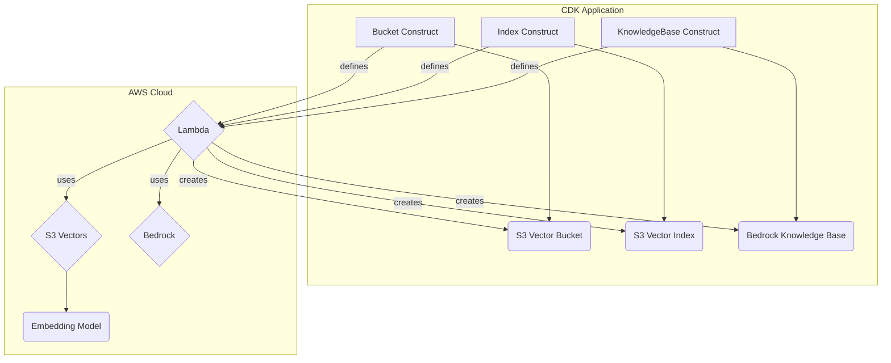

# cdk-s3-vectors


> **⚠️ Maintenance Notice**: This library is intended as a temporary solution and will only be maintained until AWS CloudFormation and CDK introduce native support for Amazon S3 Vectors. Once native support is available, users are encouraged to migrate to the official AWS constructs.

## Reference Documentation

[Amazon S3 Vectors User Guide](https://docs.aws.amazon.com/AmazonS3/latest/userguide/s3-vectors.html)

## Overview

Amazon S3 Vectors is in preview release and provides native vector storage and similarity search capabilities within Amazon S3.

This AWS CDK construct library provides high-level constructs for Amazon S3 Vectors, enabling you to create vector buckets, indexes, and knowledge bases for AI/ML applications.

The library includes three main constructs:

* **Bucket**: Creates S3 vector buckets with optional encryption
* **Index**: Creates vector indexes within buckets for similarity search
* **KnowledgeBase**: Creates Amazon Bedrock knowledge bases using S3 Vectors as the vector store

## Getting Started

| Language | Package |
|----------|---------|
|  Python | `pip install cdk-s3-vectors` |
|  TypeScript/JavaScript | `npm install cdk-s3-vectors` |
|  .NET | `dotnet add package bimnett.CdkS3Vectors` |

For Java, add the following to your `pom.xml` file:

```xml
<dependency>
  <groupId>io.github.bimnett</groupId>
  <artifactId>cdk-s3-vectors</artifactId>
  <version>LATEST</version>
</dependency>
```

## Examples

For complete, deployable examples in all supported languages, see the [examples directory](examples/).

## API Reference

The API reference can be found [here](./API.md).

## Architecture



## License

This project is licensed under the Apache License 2.0. See [LICENSE](LICENSE) file for details.
