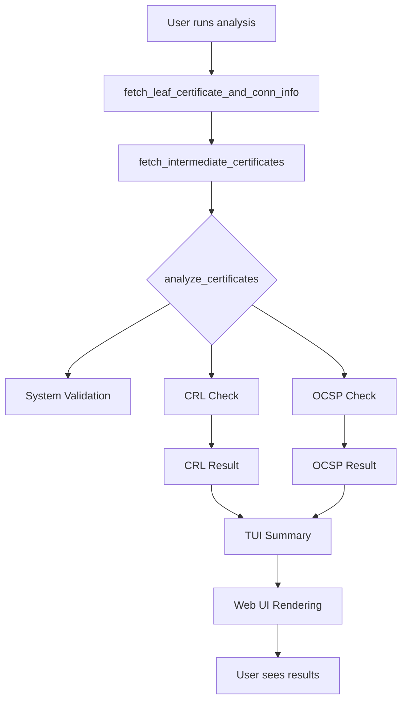

# OCSP Support Plan for check-tls

This document outlines the detailed plan to add OCSP (Online Certificate Status Protocol) support to the check-tls project.

## Overview

The goal is to implement OCSP checks for leaf certificates across the TUI, Web UI, and update documentation accordingly.



## Task Breakdown

1. **ocsp_utils module** (`src/check_tls/utils/ocsp_utils.py`)
   - `get_ocsp_urls(cert: x509.Certificate) -> List[str]`
   - `build_ocsp_request(cert, issuer_cert) -> bytes`
   - `fetch_ocsp_response(url: str, request_data: bytes) -> Optional[bytes]`
   - `parse_ocsp_response(data: bytes) -> OCSPResponseDetails`
   - `check_ocsp(cert: x509.Certificate, issuer_cert: x509.Certificate) -> Dict[str, Any]`
   - Use `cryptography.x509.ocsp` classes and methods.

2. **Update `analyze_certificates`** (`src/check_tls/tls_checker.py`)
   - Add parameter `perform_ocsp_check: bool = True`
   - Initialize `result["ocsp_check"] = {"checked": False, "status": None, "details": None}`
   - After CRL check, if enabled:
     ```python
     result["ocsp_check"]["checked"] = True
     ocsp_details = check_ocsp(leaf_cert, issuer_cert)
     result["ocsp_check"].update(ocsp_details)
     ```

3. **TUI (CLI)** (`src/check_tls/main.py`)
   - In `print_human_summary`, insert an “OCSP Check (Leaf)” section
   - Colorize status (good, revoked, unknown, error)
   - Display checked URL and reason/details

4. **Web UI**
   - **Web Server** (`src/check_tls/web_server.py`): include `ocsp_check` in JSON response
   - **Template** (`templates/index.html`): add OCSP section/table
   - **JavaScript** (`static/js/app.js`): parse and render `ocsp_check`

5. **Documentation** (`README.md`)
   - Add `--no-ocsp-check` CLI flag description
   - Document default behavior and status meanings
   - Update screenshots (TUI/Web UI)

6. **Testing & Validation**
   - Verify dependencies (`cryptography` >= version supports OCSP)
   - Add unit tests for `ocsp_utils.check_ocsp`
   - Validate manual runs on known revocation status endpoints

-- End of Plan
