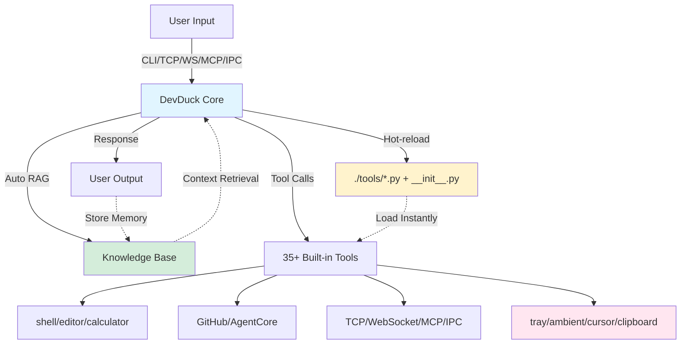

# 🦆 DevDuck

[](https://pypi.org/project/devduck/)

**Self-modifying AI agent that hot-reloads its own code—builds itself as it runs.**

One Python file that adapts to your environment, fixes itself, and expands capabilities at runtime.

Learn more: https://duck.nyc

## 🎬 See It In Action

| Feature | What You'll See | Video |
|---------|----------------|-------|
| 🔥 **Hot-Reload** | Agent detects code changes and restarts instantly—no manual intervention needed. Edit your agent code or tools while running, save the file, and watch it reload automatically. | [Watch Demo](https://redduck.dev/videos/hot-reload.mp4) |
| 🌐 **Web UI** | Clean, modern web interface for chatting with DevDuck. Real-time streaming responses, tool execution visibility, and beautiful markdown rendering. | [Watch Demo](https://redduck.dev/videos/web-ui.mp4) |
| 🛠️ **Dynamic Tool Creation** | Create a new tool by simply saving a `.py` file in the `./tools/` directory. No restart, no configuration—the agent loads it instantly and starts using it. Pure hot-reload magic. | [Watch Demo](https://redduck.dev/videos/dynamic-tool-creation.mp4) |
| 🌊 **TCP Streaming Server** | Connect from any client (netcat, custom apps, other agents) via TCP. Real-time streaming responses with parallel tool execution. Multi-protocol access to the same agent. | [Watch Demo](https://redduck.dev/videos/tcp.mp4) |
| 🔌 **IPC & macOS Tray** | Unix socket-based inter-process communication with native macOS menu bar integration. DevDuck runs in your menu bar with quick actions, status indicators, and seamless IPC streaming via `/tmp/devduck_main.sock`. |  |
| 💬 **Ambient Overlay** | Floating AI input overlay with glassmorphism UI. Real-time IPC streaming from devduck, auto-focus with blinking cursor, and ESC to hide / Enter to send. Perfect for desktop AI interactions. | [Watch Demo](https://redduck.dev/videos/floating-input.mp4) |

---

## Install & Run

| Method | Command |
|--------|---------|
| **pipx** | `pipx install devduck && devduck` |
| **uvx** | `uvx devduck "create a Flask API"` |
| **Python** | `pip install devduck` → `import devduck; devduck("query")` |

**Requirements:** Python 3.10-3.13, Bedrock (or Ollama/Anthropic/GitHub/MLX)

---

## Developer Setup

**Clone and develop:**
```bash
git clone git@github.com:cagataycali/devduck.git
cd devduck
python3.13 -m venv .venv
source .venv/bin/activate
.venv/bin/pip3.13 install -e .

# Now which devduck points to .venv
which devduck
# /path/to/devduck/.venv/bin/devduck
```

**Make changes → test instantly:**
```bash
# Edit devduck/__init__.py or tools/
code .

# Run immediately (hot-reloads on save)
devduck
```

---

## What It Does

| Feature | Description | Example |
|---------|-------------|---------|
| 🔥 **Hot-Reload** | Agent reloads its own code + custom tools instantly | Modify agent code → auto-restart, or add `weather.py` → use immediately |
| 🧠 **Auto-RAG** | Remembers past conversations | "I prefer FastAPI" → later uses FastAPI automatically |
| 🌊 **Multi-Protocol** | CLI, Python, TCP, WebSocket, MCP, IPC | `devduck "query"` or `nc localhost 9999` |
| ☁️ **AWS Deploy** | One-command serverless deployment | `agentcore_config(auto_launch=True)` |
| 🛠️ **35+ Tools** | Shell, GitHub, file editing, math, UI control | `devduck("create GitHub issue")` |
| 🎛️ **Flexible Config** | Load only tools you need | `DEVDUCK_TOOLS="strands_tools:shell,editor"` |

---

## Architecture



**Self-adapting loop:** User queries → RAG retrieval → Tool execution → Response → Memory storage → Hot-reload new capabilities → Repeat.

---

## Quick Start

```bash
# 1. Install
pipx install devduck

# 2. Start (auto-launches TCP/WS/MCP/IPC servers)
devduck

# 3. Use
🦆 create a REST API with FastAPI
🦆 !ls -la
🦆 exit
```

**One-shot:**
```bash
devduck "analyze this error: ImportError: No module named 'flask'"
```

**Python API:**
```python
import devduck
devduck("refactor my code to use async/await")
```

---

## Model Setup

| Provider | Setup | When to Use |
|----------|-------|-------------|
| **Bedrock** (auto-detected) | [Get API key](https://console.aws.amazon.com/bedrock) → `export AWS_BEARER_TOKEN_BEDROCK=...` | Auto-selected if credentials found |
| **MLX** (macOS auto-detected) | Auto-detected on Apple Silicon | Local, optimized for M-series Macs |
| **Ollama** (fallback) | `ollama pull qwen3:1.7b` | Local, free, private (used if Bedrock/MLX unavailable) |
| **Anthropic** | `export ANTHROPIC_API_KEY=...` | Claude API direct access |
| **GitHub** | `export GITHUB_TOKEN=...` | Free GPT-4o for GitHub users |

**Quick Bedrock setup:**
```bash
export MODEL_PROVIDER=bedrock
export AWS_BEARER_TOKEN_BEDROCK=your_token  # From AWS console
devduck
```

---

## Core Tools

| Category | Tools | Use Case |
|----------|-------|----------|
| **Dev** | `shell`, `editor`, `file_read`, `calculator` | Code, test, debug |
| **GitHub** | `use_github`, `create_subagent` | Issues, PRs, CI/CD automation |
| **Network** | `tcp`, `websocket`, `mcp_server`, `ipc` | Serve agents over protocols |
| **AWS** | `agentcore_config`, `agentcore_invoke`, `agentcore_logs`, `agentcore_agents` | Deploy to serverless |
| **AI** | `use_agent`, `retrieve`, `store_in_kb`, `state_manager` | Multi-agent, memory, state |
| **UI** (macOS) | `tray`, `ambient`, `cursor`, `clipboard` | Desktop automation |

<details>
<summary><strong>📋 Full tool list (click to expand)</strong></summary>

### DevDuck Core Tools
- `tcp` - TCP server with streaming
- `websocket` - WebSocket server with concurrent messaging
- `ipc` - Unix socket IPC server
- `mcp_server` - MCP server (HTTP/stdio)
- `install_tools` - Dynamic tool loading from packages
- `use_github` - GitHub GraphQL API operations
- `create_subagent` - Spawn sub-agents via GitHub Actions
- `store_in_kb` - Store content in Bedrock Knowledge Base
- `system_prompt` - Manage agent system prompt
- `state_manager` - Agent state management with time-travel capabilities
- `tray` - System tray app control (macOS)
- `ambient` - Ambient AI input overlay (macOS)

### AgentCore Tools (AWS)
- `agentcore_config` - Configure & launch on Bedrock AgentCore
- `agentcore_invoke` - Invoke deployed agents
- `agentcore_logs` - View CloudWatch logs
- `agentcore_agents` - List/manage agent runtimes

### strands-agents-tools
- `shell` - Interactive shell with PTY support
- `editor` - File editing (view/create/replace/insert)
- `file_read` - Multi-file reading with search
- `file_write` - Write content to files
- `calculator` - SymPy-powered math operations
- `image_reader` - Read images for Converse API
- `use_agent` - Nested agent with different model
- `load_tool` - Load custom tools at runtime
- `environment` - Environment variable management
- `mcp_client` - Connect to external MCP servers
- `retrieve` - Bedrock Knowledge Base retrieval
- `scraper` - HTML/XML parsing with BeautifulSoup4
- `fetch_github_tool` - Fetch and load tools from GitHub
- `gist` - Comprehensive GitHub Gist management
- `add_comment` - Add comments to GitHub issues/PRs
- `list_issues` - List GitHub issues
- `list_pull_requests` - List GitHub pull requests

### strands-fun-tools (macOS)
- `listen` - Background speech transcription with Whisper
- `cursor` - Mouse & keyboard control
- `clipboard` - Clipboard monitoring & control
- `screen_reader` - OCR & UI element detection
- `yolo_vision` - Object detection with YOLO

### Hot-Reload Tools
- Custom tools in `./tools/*.py` load instantly
- Agent code changes trigger auto-restart

</details>

---

## Hot-Reload Example

```python
# ./tools/weather.py
from strands import tool
import requests

@tool
def weather(city: str) -> str:
    """Get weather for a city."""
    r = requests.get(f"https://wttr.in/{city}?format=%C+%t")
    return r.text
```

**Save → use instantly:**
```bash
🦆 weather(city="Tokyo")
# Clear sky +15°C
```

No restart. No configuration. Just works.

---

## Access Methods

| Protocol | Endpoint | Test Command |
|----------|----------|--------------|
| CLI | Terminal | `devduck "query"` |
| Python | Import | `from devduck import devduck` |
| TCP | `localhost:9999` | `nc localhost 9999` |
| WebSocket | `ws://localhost:8080` | `wscat -c ws://localhost:8080` |
| MCP | `http://localhost:8000/mcp` | Add to Claude Desktop config |
| IPC | `/tmp/devduck_main.sock` | `nc -U /tmp/devduck_main.sock` |

**Custom ports:** `export DEVDUCK_TCP_PORT=9000`

---

## Configuration

| Variable | Default | Options |
|----------|---------|---------|
| `MODEL_PROVIDER` | Auto-detect | `bedrock`, `anthropic`, `github`, `mlx`, `ollama` |
| `STRANDS_MODEL_ID` | Auto | Model name (e.g., `qwen3:1.7b`, `claude-sonnet-4`) |
| `DEVDUCK_TOOLS` | 37 default tools | `package:tool1,tool2:package2:tool3` format |
| `DEVDUCK_LOAD_TOOLS_FROM_DIR` | `false` | `true`/`false` - Auto-load tools from `./tools/` directory |
| `DEVDUCK_KNOWLEDGE_BASE_ID` | - | Bedrock KB ID for auto-RAG |
| `DEVDUCK_TCP_PORT` | `9999` | TCP server port |
| `DEVDUCK_ENABLE_TCP` | `true` | Enable/disable TCP |

### Tool Configuration Format

**Format:** `package:tool1,tool2:package2:tool3`

**Directory Auto-Loading:**

By default, DevDuck **does not** automatically load tools from the `./tools/` directory. This gives you explicit control over which tools are loaded. To enable automatic loading of tools from `./tools/`, set:

```bash
export DEVDUCK_LOAD_TOOLS_FROM_DIR=true
devduck
```

When enabled, any `.py` file in `./tools/` with a `@tool` decorator will be loaded automatically. When disabled (default), you control tool loading via `DEVDUCK_TOOLS` or runtime `manage_tools()` calls.

**Examples:**
```bash
# Minimal (shell + editor only)
export DEVDUCK_TOOLS="strands_tools:shell,editor"

# Dev tools only
export DEVDUCK_TOOLS="strands_tools:shell,editor,file_read,file_write,calculator"

# Full DevDuck + Strands (no fun tools)
export DEVDUCK_TOOLS="devduck.tools:tcp,websocket,mcp_server,use_github:strands_tools:shell,editor,file_read"

# Custom package
export DEVDUCK_TOOLS="my_tools:custom_tool,another_tool:strands_tools:shell"

devduck
```

**Runtime tool management:**
```python
# List loaded tools
manage_tools(action="list")

# Add tools at runtime
manage_tools(action="add", package="strands_fun_tools", tool_names="cursor,clipboard")

# Remove tools
manage_tools(action="remove", tool_names="cursor,clipboard")

# Reload specific tools
manage_tools(action="reload", tool_names="shell,editor")

# Reload all (restart agent)
manage_tools(action="reload")
```

**Discover tools before loading:**
```python
# List available tools in a package
install_tools(action="list_available", package="strands-fun-tools", module="strands_fun_tools")
```

---


## MCP Integration

### Expose DevDuck as MCP Server

**Claude Desktop** (`~/Library/Application Support/Claude/claude_desktop_config.json`):
```json
{
  "mcpServers": {
    "devduck": {
      "command": "uvx",
      "args": ["devduck", "--mcp"]
    }
  }
}
```

Restart Claude → DevDuck tools appear automatically.

### Load External MCP Servers

DevDuck can act as an MCP client and load tools from external MCP servers automatically.

**Setup:**
```bash
export MCP_SERVERS='{
  "mcpServers": {
    "strands": {
      "command": "uvx",
      "args": ["strands-agents-mcp-server"]
    }
  }
}'
devduck
```

**Supported Transport Types:**

| Transport | Configuration | Example |
|-----------|--------------|---------|
| **stdio** | `command`, `args`, `env` | Executables via stdin/stdout |
| **HTTP** | `url`, `headers` | Remote servers via HTTP |
| **SSE** | `url` (with `/sse` path) | Server-Sent Events streaming |

**Examples:**

```bash
# Stdio server
export MCP_SERVERS='{
  "mcpServers": {
    "myserver": {
      "command": "python",
      "args": ["server.py"],
      "env": {"API_KEY": "secret"}
    }
  }
}'

# HTTP server
export MCP_SERVERS='{
  "mcpServers": {
    "remote": {
      "url": "https://api.example.com/mcp",
      "headers": {"Authorization": "Bearer token"}
    }
  }
}'

# SSE server
export MCP_SERVERS='{
  "mcpServers": {
    "events": {
      "url": "https://api.example.com/sse"
    }
  }
}'

# Multiple servers
export MCP_SERVERS='{
  "mcpServers": {
    "strands": {
      "command": "uvx",
      "args": ["strands-agents-mcp-server"]
    },
    "remote": {
      "url": "https://api.example.com/mcp"
    }
  }
}'

devduck
# Tools from all MCP servers automatically available
```

**Tool Prefixing:** Each MCP server's tools are prefixed with the server name (e.g., `strands_tool_name`)

---

## Troubleshooting

**Ollama model not found:**
```bash
# DevDuck auto-pulls models, but if it fails:
ollama pull qwen3:1.7b
```

**Port already in use:**
```bash
# Change ports
export DEVDUCK_TCP_PORT=9000
export DEVDUCK_WS_PORT=8001
devduck
```

**Hot-reload not working:**
```bash
# Ensure tools directory exists
mkdir -p ./tools

# Check file watcher logs
devduck
🦆 view_logs(action="search", pattern="watcher")
```

**Memory/performance issues:**
```bash
# Use lighter model
export STRANDS_MODEL_ID="qwen3:0.5b"

# Reduce context
export DEVDUCK_LOG_LINE_COUNT=20
export DEVDUCK_LAST_MESSAGE_COUNT=50
```

**Ambient overlay not starting:**
```bash
# Make sure tkinter is installed
python3 -c "import tkinter"

# Install tkinter if missing
brew install python-tk@3.13  # macOS
sudo apt-get install python3-tk  # Ubuntu/Debian
sudo dnf install python3-tkinter  # Fedora
```

**Tray app not starting (macOS):**
```bash
# Install rumps
pip install rumps

# Or reinstall devduck
pip install -e .
```

**View logs:** `devduck` → `🦆 view_logs()`

---

## GitHub Actions

**Run DevDuck in CI/CD pipelines:**

```yaml
name: AI Code Assistant
on: 
  issues:
    types: [opened, edited]
  pull_request:
    types: [opened, edited, synchronize]

jobs:
  devduck:
    runs-on: ubuntu-latest
    permissions:
      contents: read
      issues: write
      pull-requests: write
    steps:
      - uses: cagataycali/devduck@main
        with:
          task: "Analyze and help with this issue or PR"
          provider: "github"
          model: "gpt-4o"
          tools: "shell,file_read,file_write,use_github,calculator"
        env:
          GITHUB_TOKEN: ${{ secrets.GITHUB_TOKEN }}
```

**Sub-agent workflows:**
```python
devduck("Create a sub-agent to analyze test coverage")
```

---

## Resources

- **Strands SDK:** [github.com/strands-agents/sdk-python](https://github.com/strands-agents/sdk-python)
- **Documentation:** [strandsagents.com](https://strandsagents.com)
- **Web UI:** [cagataycali.github.io/devduck](http://cagataycali.github.io/devduck)

---

## Citation

```bibtex
@software{devduck2025,
  author = {Cagatay Cali},
  title = {DevDuck: Self-Modifying AI Agent with Hot-Reload and Multi-Protocol Servers},
  year = {2025},
  url = {https://github.com/cagataycali/devduck}
}
```

---

**Apache 2.0** | Built with [Strands Agents](https://strandsagents.com) | [@cagataycali](https://github.com/cagataycali)
