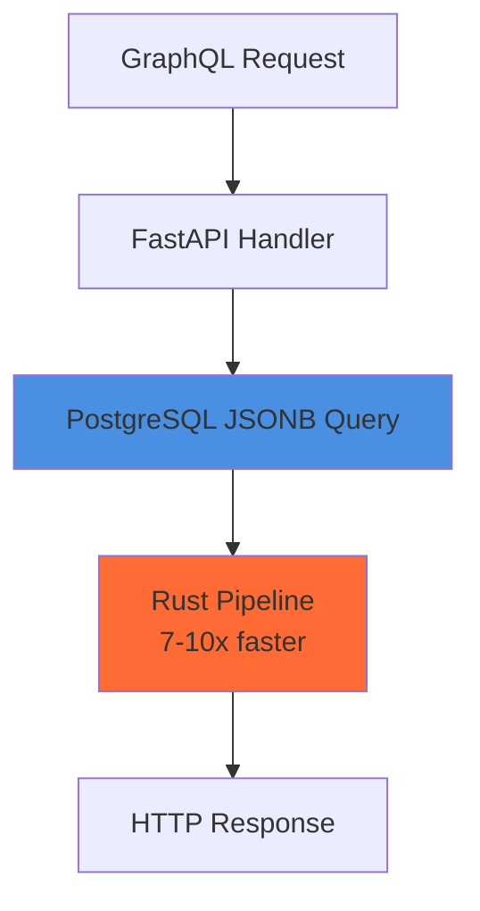

# Phase 3: Content Enhancement & User Experience

**Status**: Ready for Implementation
**Created**: 2025-10-24
**Estimated Time**: 1-2 weeks
**Complexity**: Medium-High
**Prerequisites**: Phase 2 completed

---

## 📋 Executive Summary

Phase 3 focuses on enhancing content quality and user experience through:
1. Video tutorials and screencasts
2. Interactive code examples
3. Visual diagrams and illustrations
4. Migration guides from other frameworks
5. Enhanced code examples throughout documentation

**Impact**: Dramatically improve learning experience, reduce time-to-productivity, attract users from competing frameworks.

---

## 🎯 Objectives

### Primary Goals
- ✅ Reduce time-to-first-success from 30 minutes to 10 minutes
- ✅ Provide multiple learning modalities (text, video, interactive)
- ✅ Make architecture concepts visual and intuitive
- ✅ Enable migration from competing frameworks
- ✅ Improve code example quality across all docs

### Success Metrics
- Video tutorials have 500+ views in first month
- Interactive examples get 1000+ completions
- Migration guide page views: 200+/month
- Documentation satisfaction score: 9+/10
- "Time to first successful deployment" < 15 minutes

---

## 📦 Task Breakdown

---

## Task 1: Video Tutorials & Screencasts

**Priority**: High
**Time**: 3-4 days
**Complexity**: Medium

### Objective
Create professional video content for different learning styles and stages.

### Video Series Plan

#### Video 1: "FraiseQL in 5 Minutes" (Quickstart)
**Duration**: 5 minutes
**Format**: Screencast with narration
**Target**: Complete beginners

**Script Outline:**
```
0:00 - Introduction
  "Hi, I'm [name], and in the next 5 minutes, you'll build a complete GraphQL API with FraiseQL."

0:30 - Prerequisites Check
  "You'll need Python 3.10+ and PostgreSQL. Let's verify..."
  [Show: python --version, psql --version]

1:00 - Installation
  "First, install FraiseQL..."
  [Show: pip install fraiseql]

1:30 - Database Setup
  "Create a database and a simple view..."
  [Show: createdb quickstart_notes]
  [Show: SQL for v_note view]

2:30 - Python Code
  "Now the magic - our entire API in 15 lines..."
  [Show: Complete app.py]
  [Highlight: @type, @query, @mutation decorators]

3:30 - Run & Test
  "Start the server and test it..."
  [Show: uvicorn app:app]
  [Show: GraphQL Playground]
  [Execute: Sample query]

4:30 - What's Happening
  "Behind the scenes: PostgreSQL returns JSONB, Rust transforms it, zero N+1 queries"
  [Show: Architecture diagram animation]

5:00 - Next Steps
  "You just built a production-ready API. Check out the First Hour Guide for more."
  [Show: Links on screen]
```

**Recording Setup:**
```yaml
Tools:
  - Screen recorder: OBS Studio (free, professional)
  - Audio: Good USB microphone
  - Video editor: DaVinci Resolve (free) or Camtasia

Settings:
  - Resolution: 1920x1080
  - Frame rate: 30fps
  - Audio: 48kHz, mono or stereo
  - Terminal: Large font (16pt+), high contrast theme
  - Browser: Hide bookmarks, clean UI

Post-production:
  - Add timestamps in description
  - Include chapter markers
  - Provide transcript
  - Upload to YouTube with CC enabled
```

---

#### Video 2: "Understanding FraiseQL Architecture" (15 minutes)
**Duration**: 15 minutes
**Format**: Animated explainer with voiceover
**Target**: Developers evaluating FraiseQL

**Content Structure:**
```
Part 1: The Problem (3 min)
- Traditional GraphQL frameworks
- ORM serialization overhead
- N+1 query problems
- Visual diagram: Traditional flow

Part 2: FraiseQL's Solution (5 min)
- Database-first architecture
- JSONB views
- Rust pipeline
- Visual diagram: FraiseQL flow
- Side-by-side comparison animation

Part 3: CQRS Pattern (3 min)
- Read models (views)
- Write models (functions)
- Why separation matters
- Visual diagram: CQRS flow

Part 4: Real-World Example (4 min)
- Blog API walkthrough
- Show: SQL view, Python type, GraphQL query
- Highlight: No N+1 queries
- Performance comparison chart
```

**Animation Assets:**
```
Create with:
  - Figma (diagrams)
  - Excalidraw (hand-drawn style)
  - Manim (Python animation library for technical content)
  - After Effects (professional animations)

Key Animations:
  1. Data flow: PostgreSQL → JSONB → Rust → HTTP
  2. N+1 problem visualization (branching queries)
  3. CQRS split diagram (reads vs writes)
  4. Trinity identifiers (3-tier ID system)
  5. Performance comparison bars (animated)
```

---

#### Video 3: "Production Deployment" (20 minutes)
**Duration**: 20 minutes
**Format**: Screencast + live deployment
**Target**: Teams preparing for production

**Content Structure:**
```
Part 1: Pre-Deployment Checklist (3 min)
- Security hardening
- Environment configuration
- Database optimization
- Monitoring setup

Part 2: Docker Compose Deployment (5 min)
- Walk through docker-compose.prod.yml
- Start services
- Health checks
- Test GraphQL endpoint

Part 3: Kubernetes Deployment (7 min)
- Apply manifests
- Watch pods start
- Configure ingress
- Test with curl

Part 4: Monitoring & Observability (5 min)
- Import Grafana dashboards
- View metrics
- Test error tracking
- Check OpenTelemetry traces
```

---

#### Video 4: "Advanced Patterns" (25 minutes)
**Duration**: 25 minutes
**Format**: Code walkthrough + explanations
**Target**: Advanced users building enterprise apps

**Topics:**
- Event sourcing pattern
- Multi-tenancy with RLS
- Audit logging with cryptographic chain
- Bounded contexts
- Table views (tv_*) with explicit sync

---

### Implementation Steps

#### Step 1: Script Writing
**Time**: 1 day

**For each video:**
```markdown
# [Video Title]

## Target Audience
[Who is this for?]

## Learning Objectives
- Objective 1
- Objective 2
- Objective 3

## Script

### Section 1 (0:00-X:XX)
**On-screen:**
- Terminal commands OR
- Code editor OR
- Diagram

**Narration:**
"Exact words to say..."

**Visual cues:**
- Highlight this line
- Zoom into this section
- Transition to next screen

### Section 2 (X:XX-Y:YY)
...

## Assets Needed
- [ ] Diagram 1: Architecture flow
- [ ] Diagram 2: CQRS split
- [ ] Code example: app.py
- [ ] SQL schema: v_note view

## Post-Production
- [ ] Add intro/outro
- [ ] Add timestamps
- [ ] Generate captions
- [ ] Create thumbnail
```

#### Step 2: Asset Creation
**Time**: 1 day

**Diagrams:**
```python
# Use Manim for technical animations
from manim import *

class FraiseQLFlow(Scene):
    def construct(self):
        # PostgreSQL box
        postgres = Rectangle(width=2, height=1, color=BLUE)
        postgres_text = Text("PostgreSQL").scale(0.5)
        postgres_group = VGroup(postgres, postgres_text)

        # Rust box
        rust = Rectangle(width=2, height=1, color=ORANGE)
        rust_text = Text("Rust Pipeline").scale(0.5)
        rust_group = VGroup(rust, rust_text).shift(RIGHT * 4)

        # Arrow
        arrow = Arrow(postgres.get_right(), rust.get_left(), buff=0.1)
        jsonb_label = Text("JSONB").scale(0.4).next_to(arrow, UP)

        # Animate
        self.play(Create(postgres_group))
        self.play(Create(arrow), Write(jsonb_label))
        self.play(Create(rust_group))
        self.wait(2)
```

**Or use Excalidraw for hand-drawn style:**
- Export as PNG (high resolution)
- Use in video editor

#### Step 3: Recording
**Time**: 2 days (including retakes)

**Setup checklist:**
```bash
# Clean terminal
clear
history -c

# Set up demo environment
cd /tmp/fraiseql-demo
# Clean state for recording

# Test audio levels
# Record 10 seconds, verify audio quality

# Close distractions
# Disable notifications
# Close extra windows
# Hide desktop icons
```

**Recording tips:**
- Record in 5-10 minute segments (easier to fix mistakes)
- Pause between sections (easier to edit)
- Speak slowly and clearly
- Zoom in on important code/commands
- Use cursor highlighting for mouse movements

#### Step 4: Editing
**Time**: 1 day

**Editing workflow:**
```
1. Import all segments
2. Arrange in timeline
3. Remove mistakes/pauses
4. Add transitions (fade, simple cuts)
5. Add intro/outro (5 seconds each)
6. Add background music (quiet, non-distracting)
7. Add text overlays for key points
8. Generate captions (auto-caption + manual correction)
9. Color correction (if needed)
10. Export at 1080p, H.264, 30fps
```

**Tools:**
- **DaVinci Resolve** (free, professional)
- **Camtasia** (easier, paid)
- **iMovie** (Mac, simple)
- **OpenShot** (free, basic)

#### Step 5: Publishing
**Time**: 2 hours

**YouTube setup:**
```yaml
Title: "FraiseQL in 5 Minutes - Build a GraphQL API"

Description: |
  Learn how to build a production-ready GraphQL API with FraiseQL in just 5 minutes.

  🔗 Links:
  - Documentation: https://fraiseql.dev
  - GitHub: https://github.com/fraiseql/fraiseql
  - Example code: https://github.com/fraiseql/examples

  ⏱️ Timestamps:
  0:00 Introduction
  0:30 Prerequisites
  1:00 Installation
  1:30 Database Setup
  2:30 Python Code
  3:30 Run & Test
  4:30 Architecture Overview
  5:00 Next Steps

  📚 Resources:
  - First Hour Guide: [link]
  - Understanding FraiseQL: [link]
  - Examples: [link]

Tags:
  - GraphQL
  - Python
  - PostgreSQL
  - API Development
  - FraiseQL
  - Tutorial
  - Backend

Thumbnail:
  - High contrast
  - Large text: "GraphQL API in 5 Minutes"
  - FraiseQL logo
  - Code snippet preview

Playlist: "FraiseQL Tutorials"

Cards: Add cards at key moments linking to docs
End screen: Subscribe + related videos
```

**Embed in documentation:**

**File**: Update `/home/lionel/code/fraiseql/docs/quickstart.md`

```markdown
## Video Tutorial

**Prefer video?** Watch the 5-minute quickstart:

<iframe width="560" height="315"
  src="https://www.youtube.com/embed/VIDEO_ID"
  title="FraiseQL in 5 Minutes"
  frameborder="0"
  allow="accelerometer; autoplay; clipboard-write; encrypted-media; gyroscope; picture-in-picture"
  allowfullscreen>
</iframe>

[Watch on YouTube →](https://www.youtube.com/watch?v=VIDEO_ID)
```

### Validation Steps

1. **Test videos with target audience:**
   - Get 5 beginners to watch quickstart
   - Measure: Did they successfully build API after watching?
   - Collect feedback on clarity

2. **Check technical accuracy:**
   - Verify all commands work
   - Test on fresh environment
   - Check timestamps are accurate

3. **Assess production quality:**
   - Audio clear with no background noise?
   - Screen recordings sharp and readable?
   - Captions accurate?
   - Pacing appropriate?

### Success Criteria
- ✅ 4 videos published (5min, 15min, 20min, 25min)
- ✅ All videos have captions/transcripts
- ✅ Embedded in relevant documentation pages
- ✅ Linked from README.md
- ✅ YouTube playlist created
- ✅ Positive user feedback (>90% like ratio)

---

## Task 2: Interactive Code Examples

**Priority**: High
**Time**: 2-3 days
**Complexity**: Medium

### Objective
Embed interactive, runnable code examples so users can try FraiseQL without local setup.

### Approach: CodeSandbox Integration

#### Example 1: Basic FraiseQL Setup (Quickstart)

**File**: Create `codesandbox/quickstart/package.json`

```json
{
  "name": "fraiseql-quickstart",
  "version": "1.0.0",
  "description": "Try FraiseQL in your browser",
  "scripts": {
    "start": "uvicorn app:app --host 0.0.0.0 --port 8000"
  },
  "dependencies": {
    "fraiseql": "^1.0.0"
  }
}
```

**File**: Create `codesandbox/quickstart/app.py`

```python
from fraiseql import type, query, mutation, input, success
from fraiseql.fastapi import create_fraiseql_app
from uuid import UUID
from datetime import datetime

# Step 1: Define a GraphQL type mapped to PostgreSQL view
@type(sql_source="v_note", jsonb_column="data")
class Note:
    """A simple note with title and content."""
    id: UUID
    title: str
    content: str | None
    created_at: datetime

# Step 2: Define queries
@query
def notes() -> list[Note]:
    """Fetch all notes."""
    pass  # FraiseQL auto-generates the resolver

@query
def note(id: UUID) -> Note | None:
    """Fetch a single note by ID."""
    pass

# Step 3: Define mutations
@input
class CreateNoteInput:
    title: str
    content: str | None = None

@success
class NoteCreated:
    note: Note
    message: str = "Note created successfully"

@mutation
class CreateNote:
    input: CreateNoteInput
    success: NoteCreated

# Step 4: Create the FastAPI app
app = create_fraiseql_app(
    database_url="postgresql://demo:demo@db:5432/notes",
    types=[Note],
    queries=[notes, note],
    mutations=[CreateNote]
)

# Try it! Visit /graphql to test queries
```

**File**: Create `codesandbox/quickstart/docker-compose.yml`

```yaml
version: '3.8'

services:
  db:
    image: postgres:16
    environment:
      POSTGRES_DB: notes
      POSTGRES_USER: demo
      POSTGRES_PASSWORD: demo
    volumes:
      - ./schema.sql:/docker-entrypoint-initdb.d/schema.sql

  app:
    build: .
    ports:
      - "8000:8000"
    depends_on:
      - db
    environment:
      DATABASE_URL: postgresql://demo:demo@db:5432/notes
```

**Embed in docs:**

**File**: Update `/home/lionel/code/fraiseql/docs/quickstart.md`

```markdown
## Try It Live

Want to try FraiseQL without installing anything?

<a href="https://codesandbox.io/s/fraiseql-quickstart-xxxxx" target="_blank">
  
</a>

Click above to open an interactive environment with:
- ✅ FraiseQL pre-installed
- ✅ PostgreSQL database ready
- ✅ Sample data loaded
- ✅ GraphQL Playground available

No installation required - edit code and see results instantly!
```

---

#### Example 2: Filtering Demo

Create interactive example showing where input filtering:

```python
# Interactive example with toggles
query = """
query GetPosts($published: Boolean, $tag: String) {
  posts(where: {
    published: { eq: $published }
    tags: { contains: [$tag] }
  }) {
    id
    title
    tags
    published
  }
}
"""

# Users can toggle:
# - published: true/false
# - tag: "graphql", "python", "tutorial"
# - See results update in real-time
```

**Interactive UI:**
```html
<div class="interactive-demo">
  <h3>Try Filtering</h3>

  <label>
    <input type="checkbox" id="published" checked> Published only
  </label>

  <label>
    Tag:
    <select id="tag">
      <option value="graphql">graphql</option>
      <option value="python">python</option>
      <option value="tutorial">tutorial</option>
    </select>
  </label>

  <button onclick="runQuery()">Run Query</button>

  <div id="results">
    <!-- Results appear here -->
  </div>
</div>

<script>
async function runQuery() {
  const published = document.getElementById('published').checked;
  const tag = document.getElementById('tag').value;

  const response = await fetch('/graphql', {
    method: 'POST',
    headers: { 'Content-Type': 'application/json' },
    body: JSON.stringify({
      query: `
        query {
          posts(where: {
            published: { eq: ${published} }
            tags: { contains: ["${tag}"] }
          }) {
            id title tags published
          }
        }
      `
    })
  });

  const data = await response.json();
  document.getElementById('results').innerHTML =
    `<pre>${JSON.stringify(data, null, 2)}</pre>`;
}
</script>
```

---

### Alternative: GraphQL Playground Embeds

For simpler interactive demos:

```markdown
## Try This Query

<iframe
  src="https://fraiseql-demo.vercel.app/graphql?query=query%20%7B%0A%20%20users%20%7B%0A%20%20%20%20id%0A%20%20%20%20name%0A%20%20%20%20posts%20%7B%0A%20%20%20%20%20%20title%0A%20%20%20%20%7D%0A%20%20%7D%0A%7D"
  width="100%"
  height="500px"
  style="border: 1px solid #ccc; border-radius: 4px;">
</iframe>

[Open in new window →](https://fraiseql-demo.vercel.app/graphql)
```

### Implementation Steps

1. **Create demo environment:**
   - Deploy FraiseQL demo to Vercel/Heroku
   - Load sample data
   - Enable CORS for embeds

2. **Build interactive components:**
   - React components for parameter selection
   - Real-time query execution
   - Result display with syntax highlighting

3. **Embed in documentation:**
   - Add to relevant tutorial pages
   - Include CodeSandbox links
   - Provide "Edit in CodeSandbox" buttons

### Validation Steps

1. **Test embeds work:**
   - Load in browser
   - Execute queries
   - Verify results display

2. **Check performance:**
   - Demo loads < 3 seconds
   - Queries execute < 500ms
   - No CORS errors

3. **User testing:**
   - 5 users try interactive examples
   - Measure completion rate
   - Collect feedback

### Success Criteria
- ✅ 5+ interactive examples embedded
- ✅ Examples work on mobile/desktop
- ✅ Demo environment stable (99.9% uptime)
- ✅ Users successfully complete examples
- ✅ Positive feedback (>85% find helpful)

---

## Task 3: Visual Diagrams & Illustrations

**Priority**: Medium
**Time**: 2-3 days
**Complexity**: Medium

### Objective
Create professional diagrams illustrating FraiseQL concepts and architecture.

### Diagrams Needed

#### 1. Architecture Overview Diagram

**Visual**: FraiseQL request flow

```
┌─────────────────────────────────────────────────────────────┐
│                    GraphQL Request                           │
│              query { users { id, name } }                    │
└───────────────────────────┬─────────────────────────────────┘
                            │
                            ▼
┌─────────────────────────────────────────────────────────────┐
│                    FastAPI Handler                           │
│               (Route: POST /graphql)                         │
└───────────────────────────┬─────────────────────────────────┘
                            │
                            ▼
┌─────────────────────────────────────────────────────────────┐
│                PostgreSQL Query                              │
│      SELECT data FROM v_user                                 │
│      Returns: [{"id":1,"name":"Alice"},...]                  │
└───────────────────────────┬─────────────────────────────────┘
                            │
                            ▼
┌─────────────────────────────────────────────────────────────┐
│                 Rust Pipeline                                │
│    1. Parse JSONB (zero-copy)                               │
│    2. Apply GraphQL field selection                         │
│    3. Transform to HTTP response bytes                      │
│    ⚡ 7-10x faster than Python                              │
└───────────────────────────┬─────────────────────────────────┘
                            │
                            ▼
┌─────────────────────────────────────────────────────────────┐
│                  HTTP Response                               │
│   {"data":{"users":[{"id":1,"name":"Alice"}]}}              │
└─────────────────────────────────────────────────────────────┘
```

**Tools**: Mermaid.js (renders in GitHub), Excalidraw, or Figma

**Mermaid code:**


---

#### 2. CQRS Pattern Diagram

**Visual**: Read vs Write models

```
┌─────────────────────────────────────────────────────────────┐
│                         GraphQL API                          │
└─────────────┬─────────────────────────────┬─────────────────┘
              │                             │
              │                             │
      ┌───────▼──────────┐         ┌────────▼────────┐
      │   QUERIES        │         │   MUTATIONS     │
      │   (Reads)        │         │   (Writes)      │
      └───────┬──────────┘         └────────┬────────┘
              │                             │
              │                             │
      ┌───────▼──────────┐         ┌────────▼────────┐
      │  v_* Views       │         │ fn_* Functions  │
      │  (Read Models)   │         │ (Write Models)  │
      │                  │         │                 │
      │  • Pre-composed  │         │  • Validation   │
      │  • JSONB ready   │         │  • Business     │
      │  • No N+1        │         │    logic        │
      └───────┬──────────┘         │  • Side effects │
              │                     └────────┬────────┘
              │                             │
              └──────────┬──────────────────┘
                         │
                 ┌───────▼───────┐
                 │  tb_* Tables  │
                 │  (Base Data)  │
                 └───────────────┘
```

---

#### 3. N+1 Problem Visualization

**Visual**: Traditional ORM vs FraiseQL

```
Traditional ORM (N+1 Problem):
┌──────────────┐
│ Query Users  │  SELECT * FROM users LIMIT 100
└──────┬───────┘
       │
       ├─→ User 1 → SELECT * FROM posts WHERE user_id = 1
       ├─→ User 2 → SELECT * FROM posts WHERE user_id = 2
       ├─→ User 3 → SELECT * FROM posts WHERE user_id = 3
       ├─→ ... (97 more queries)
       └─→ User 100 → SELECT * FROM posts WHERE user_id = 100

       Total: 101 queries! 🐢


FraiseQL (JSONB View):
┌──────────────────────────────────────┐
│ SELECT data FROM v_user LIMIT 100   │
│                                      │
│ JSONB includes nested posts:        │
│ [                                    │
│   {                                  │
│     "id": 1,                         │
│     "name": "Alice",                 │
│     "posts": [                       │
│       {"id": 1, "title": "..."},     │
│       {"id": 2, "title": "..."}      │
│     ]                                │
│   },                                 │
│   ...                                │
│ ]                                    │
└──────────────────────────────────────┘

Total: 1 query! ⚡
```

---

#### 4. Trinity Identifiers Diagram

```
┌─────────────────────────────────────────────────────────┐
│                     Post Entity                          │
├─────────────────────────────────────────────────────────┤
│                                                          │
│  pk_post: 12345                                          │
│  ├─ Internal integer ID                                 │
│  ├─ Used for database joins (fast!)                     │
│  ├─ Never exposed in API                                │
│  └─ Performance: O(1) index lookups                     │
│                                                          │
│  id: "550e8400-e29b-41d4-a716-446655440000"             │
│  ├─ Public UUID                                         │
│  ├─ Exposed in GraphQL API                              │
│  ├─ Stable (never changes)                              │
│  └─ Secure (non-sequential)                             │
│                                                          │
│  identifier: "how-to-use-fraiseql"                      │
│  ├─ Human-readable slug                                 │
│  ├─ SEO-friendly URLs                                   │
│  ├─ Can change (redirects preserve UUID)                │
│  └─ UX: Readable links                                  │
│                                                          │
└─────────────────────────────────────────────────────────┘

Usage Examples:
  Database JOIN: WHERE p.pk_post = c.fk_post  (fast int join)
  API Response:  {"id": "550e8400-e29b-...", ...}
  Public URL:    /posts/how-to-use-fraiseql
```

---

#### 5. Rust Pipeline Performance

**Visual**: Before/After comparison

```
Traditional Python Framework:
┌──────────────┐  ┌───────────────┐  ┌──────────────┐
│  PostgreSQL  │─→│ ORM Deserial. │─→│    Python    │
│   Returns    │  │   (slow)      │  │ json.dumps() │
│    Rows      │  │               │  │   (slow!)    │
└──────────────┘  └───────────────┘  └──────┬───────┘
                                            │
                     Total: 45ms            ▼
                                    ┌──────────────┐
                                    │ HTTP Response│
                                    └──────────────┘


FraiseQL with Rust:
┌──────────────┐  ┌───────────────┐
│  PostgreSQL  │─→│  Rust Pipeline│
│   Returns    │  │  • Parse JSONB│
│    JSONB     │  │  • Transform  │
└──────────────┘  │  • Zero-copy  │
                  │   (fast! ⚡)   │
Total: 6ms        └──────┬────────┘
                         │
                         ▼
                  ┌──────────────┐
                  │ HTTP Response│
                  └──────────────┘

7.5x Faster! 🚀
```

---

### Implementation Steps

#### Step 1: Choose Tools

**Option A: Mermaid.js** (recommended for GitHub)
- ✅ Renders directly in markdown
- ✅ Version control friendly (text-based)
- ✅ Free and open-source
- ❌ Limited styling options

**Option B: Excalidraw**
- ✅ Hand-drawn style (friendly, approachable)
- ✅ Easy to use
- ✅ Free and open-source
- ✅ Good for architecture diagrams
- ❌ Needs export to PNG (not text-based)

**Option C: Figma**
- ✅ Professional polish
- ✅ Precise control
- ✅ Collaboration features
- ❌ Requires design skills
- ❌ Not version-control friendly

**Recommendation**: Use Mermaid for simple flows, Excalidraw for architecture diagrams, Figma for marketing materials.

#### Step 2: Create Diagrams

**For each diagram:**
1. Sketch on paper first
2. Create digital version
3. Export high-resolution (2x for retina)
4. Optimize file size
5. Add alt text for accessibility

#### Step 3: Embed in Documentation

**File**: Update relevant docs with diagrams

```markdown
## Architecture Overview

FraiseQL's request flow is optimized for performance:


*Figure 1: Request flow from GraphQL query to HTTP response*

**Key insight**: PostgreSQL returns JSONB directly, Rust processes it 7-10x faster than Python.

[Interactive diagram →](../diagrams/architecture-interactive.html)
```

**File**: Create `/home/lionel/code/fraiseql/docs/diagrams/README.md`

```markdown
# FraiseQL Diagrams

Visual reference for FraiseQL architecture and concepts.

## Architecture

- [Request Flow](architecture-overview.png) - Complete request lifecycle
- [CQRS Pattern](cqrs-pattern.png) - Read vs write models
- [Rust Pipeline](rust-pipeline.png) - How Rust acceleration works

## Patterns

- [Trinity Identifiers](trinity-identifiers.png) - Three-tier ID system
- [Table Views](table-views.png) - Explicit sync pattern
- [Event Sourcing](event-sourcing.png) - Append-only event log

## Performance

- [N+1 Prevention](n-plus-one-visualization.png) - JSONB vs ORM
- [Performance Comparison](performance-bars.png) - FraiseQL vs competitors

## Source Files

All diagrams are in `docs/diagrams/source/`:
- Mermaid: `.mmd` files
- Excalidraw: `.excalidraw` files
- Figma: Link in FIGMA.md

To regenerate:
```bash
# Mermaid diagrams
npm install -g @mermaid-js/mermaid-cli
mmdc -i source/architecture.mmd -o architecture-overview.png
```
```

### Validation Steps

1. **Check visual clarity:**
   - Show to 5 people unfamiliar with FraiseQL
   - Can they explain the concept after seeing diagram?
   - Collect feedback on clarity

2. **Test accessibility:**
   - All images have alt text
   - Text in images is large enough (14pt+)
   - High contrast (WCAG AA compliant)

3. **Verify technical accuracy:**
   - Review with FraiseQL maintainer
   - Check numbers/metrics are correct
   - Ensure diagrams match current implementation

### Success Criteria
- ✅ 10+ professional diagrams created
- ✅ All major concepts visualized
- ✅ Embedded in relevant documentation
- ✅ Source files in version control
- ✅ Positive user feedback on clarity

---

## Task 4: Migration Guides from Other Frameworks

**Priority**: Medium
**Time**: 2 days
**Complexity**: Low-Medium

### Objective
Help users migrate from competing frameworks with side-by-side comparisons.

### Migration Guides Needed

#### 1. Strawberry GraphQL → FraiseQL

**File**: Create `/home/lionel/code/fraiseql/docs/migration/from-strawberry.md`

```markdown
# Migrating from Strawberry GraphQL to FraiseQL

Complete guide for Strawberry users switching to FraiseQL.

## Why Migrate?

| Feature | Strawberry | FraiseQL |
|---------|-----------|----------|
| Performance | Good | Excellent (7-10x faster) |
| N+1 Queries | Requires DataLoader | Automatic prevention |
| Database | Any (via ORM) | PostgreSQL-optimized |
| Complexity | Medium | Low (less code) |
| Type Safety | Strong | Strong |

**Best for**: Teams already using PostgreSQL who want better performance.

---

## Concept Mapping

### Types

**Strawberry:**
```python
import strawberry
from typing import List, Optional

@strawberry.type
class User:
    id: int
    name: str
    email: str
    posts: List['Post']

    @strawberry.field
    async def posts(self) -> List['Post']:
        # Resolver needed (N+1 risk!)
        return await Post.get_for_user(self.id)
```

**FraiseQL:**
```python
from fraiseql import type

@type(sql_source="v_user", jsonb_column="data")
class User:
    id: int
    name: str
    email: str
    posts: list['Post']  # No resolver needed! View handles it
```

**PostgreSQL view:**
```sql
CREATE VIEW v_user AS
SELECT
    id,
    jsonb_build_object(
        'id', id,
        'name', name,
        'email', email,
        'posts', (
            SELECT jsonb_agg(jsonb_build_object('id', p.id, 'title', p.title))
            FROM tb_post p
            WHERE p.user_id = tb_user.id
        )
    ) as data
FROM tb_user;
```

**Key difference**: FraiseQL uses PostgreSQL views for nested data. No N+1 queries!

---

### Queries

**Strawberry:**
```python
@strawberry.type
class Query:
    @strawberry.field
    async def user(self, id: int) -> Optional[User]:
        return await User.get_by_id(id)

    @strawberry.field
    async def users(self) -> List[User]:
        return await User.get_all()
```

**FraiseQL:**
```python
from fraiseql import query

@query
def user(id: int) -> User | None:
    pass  # Auto-generated!

@query
def users() -> list[User]:
    pass  # Auto-generated!
```

**Key difference**: FraiseQL auto-generates simple resolvers.

---

### Mutations

**Strawberry:**
```python
@strawberry.type
class CreateUserInput:
    name: str
    email: str

@strawberry.type
class Mutation:
    @strawberry.mutation
    async def create_user(self, input: CreateUserInput) -> User:
        user = await User.create(name=input.name, email=input.email)
        return user
```

**FraiseQL:**
```python
from fraiseql import mutation, input, success

@input
class CreateUserInput:
    name: str
    email: str

@success
class UserCreated:
    user: User

@mutation
class CreateUser:
    input: CreateUserInput
    success: UserCreated

    async def resolve(self, info):
        db = info.context["db"]
        result = await db.call_function(
            "fn_create_user",
            self.input.name,
            self.input.email
        )
        return UserCreated(user=result)
```

**PostgreSQL function:**
```sql
CREATE FUNCTION fn_create_user(p_name TEXT, p_email TEXT) RETURNS JSONB AS $$
DECLARE v_user_id INT;
BEGIN
    INSERT INTO tb_user (name, email)
    VALUES (p_name, p_email)
    RETURNING id INTO v_user_id;

    RETURN (SELECT data FROM v_user WHERE id = v_user_id);
END;
$$ LANGUAGE plpgsql;
```

**Key difference**: FraiseQL uses PostgreSQL functions for business logic. Success/failure pattern is explicit.

---

## Migration Checklist

### Phase 1: Preparation (1-2 hours)
- [ ] Review FraiseQL [core concepts](../core/concepts-glossary.md)
- [ ] Understand [JSONB views](../core/database-api.md#jsonb-views)
- [ ] Review [CQRS pattern](../patterns/README.md#cqrs)

### Phase 2: Database Setup (2-4 hours)
- [ ] Create PostgreSQL views for each Strawberry type
- [ ] Create PostgreSQL functions for each mutation
- [ ] Test views return correct JSONB
- [ ] Add indexes for performance

### Phase 3: Code Migration (4-8 hours)
- [ ] Replace `@strawberry.type` with `@type(sql_source=...)`
- [ ] Replace `@strawberry.field` resolvers with view composition
- [ ] Replace `@strawberry.mutation` with `@mutation` + success/failure
- [ ] Update context middleware

### Phase 4: Testing (2-4 hours)
- [ ] Run existing GraphQL query tests
- [ ] Verify N+1 queries eliminated (use EXPLAIN ANALYZE)
- [ ] Load test (compare performance)
- [ ] Check error handling works

### Phase 5: Deployment (1-2 hours)
- [ ] Update dependencies
- [ ] Deploy database migrations
- [ ] Deploy application
- [ ] Monitor performance

**Total time**: 1-3 days depending on application size

---

## Common Challenges

### Challenge 1: "I have complex resolvers with business logic"

**Solution**: Move logic to PostgreSQL functions.

**Before (Strawberry):**
```python
@strawberry.field
async def posts(self) -> List[Post]:
    # Complex logic here
    if self.is_premium:
        return await Post.get_all_for_user(self.id)
    else:
        return await Post.get_public_for_user(self.id)
```

**After (FraiseQL):**
```sql
CREATE FUNCTION fn_get_user_posts(p_user_id INT, p_is_premium BOOLEAN)
RETURNS JSONB AS $$
BEGIN
    IF p_is_premium THEN
        RETURN (SELECT jsonb_agg(data) FROM v_post WHERE user_id = p_user_id);
    ELSE
        RETURN (SELECT jsonb_agg(data) FROM v_post WHERE user_id = p_user_id AND is_public = true);
    END IF;
END;
$$ LANGUAGE plpgsql;
```

---

### Challenge 2: "I use DataLoaders to prevent N+1"

**Solution**: FraiseQL eliminates N+1 by design - no DataLoaders needed!

**Before:**
```python
from strawberry.dataloader import DataLoader

async def load_users(keys):
    users = await User.get_by_ids(keys)
    return users

user_loader = DataLoader(load_fn=load_users)

@strawberry.field
async def user(self, id: int) -> User:
    return await user_loader.load(id)
```

**After:** Just use the view - PostgreSQL handles batching!

```python
@query
def user(id: int) -> User | None:
    pass  # Automatically efficient!
```

---

### Challenge 3: "I'm using multiple databases"

**Solution**: FraiseQL is PostgreSQL-specific. If you need multi-database:
- **Option 1**: Migrate all to PostgreSQL
- **Option 2**: Use FraiseQL for PostgreSQL, keep Strawberry for others
- **Option 3**: Use PostgreSQL foreign data wrappers (FDW) to connect to other databases

---

## Performance Improvements

After migration, expect:
- **7-10x faster** JSON transformation (Rust pipeline)
- **Zero N+1 queries** (JSONB views)
- **50-70% fewer lines** of Python code
- **Simpler debugging** (business logic in SQL functions, easy to test)

---

## Support

**Need help migrating?**
- [GitHub Discussions](https://github.com/fraiseql/fraiseql/discussions)
- [Example migration](../../examples/migration-from-strawberry/)
- [Performance comparison](../benchmarks/methodology.md)

**Still have questions?** Open an issue with the `migration` label.
```

---

#### 2. Hasura → FraiseQL

**File**: Create `/home/lionel/code/fraiseql/docs/migration/from-hasura.md`

```markdown
# Migrating from Hasura to FraiseQL

Guide for Hasura users switching to FraiseQL.

## Why Migrate?

| Feature | Hasura | FraiseQL |
|---------|--------|----------|
| Setup | Config-based (GUI/YAML) | Code-based (Python) |
| Flexibility | Limited to Hasura features | Full Python flexibility |
| Business Logic | Actions (external) | PostgreSQL functions |
| Type Safety | GraphQL only | Python + GraphQL |
| Performance | Good | Excellent (Rust pipeline) |
| Hosting | Cloud or self-host | Self-host (simpler) |

**Best for**: Teams wanting more control, Python integration, simpler deployment.

---

## Concept Mapping

### Automatic CRUD

**Hasura:** Automatically generates CRUD operations.

**FraiseQL:** Use `@query` and `@mutation` decorators (similar simplicity).

```python
@type(sql_source="v_user")
class User:
    id: int
    name: str

@query
def users() -> list[User]:
    pass  # Auto-generated

@query
def user(id: int) -> User | None:
    pass  # Auto-generated
```

---

### Permissions

**Hasura:** Permission rules in configuration:
```yaml
permission:
  user:
    select:
      filter:
        user_id: {_eq: X-Hasura-User-Id}
```

**FraiseQL:** Use PostgreSQL Row-Level Security:
```sql
CREATE POLICY user_isolation ON tb_user
    USING (id = current_setting('app.current_user_id')::INT);
```

Or Python decorator:
```python
@authorized(roles=["admin"])
@query
def sensitive_data() -> list[SensitiveData]:
    pass
```

---

### Actions (Custom Logic)

**Hasura:** Webhook actions (external service).

**FraiseQL:** PostgreSQL functions or Python resolvers.

```sql
CREATE FUNCTION fn_send_welcome_email(p_user_id INT) RETURNS JSONB AS $$
BEGIN
    -- Business logic here
    PERFORM pg_notify('send_email', jsonb_build_object('user_id', p_user_id)::text);
    RETURN jsonb_build_object('success', true);
END;
$$ LANGUAGE plpgsql;
```

```python
@mutation
class SendWelcomeEmail:
    input: SendEmailInput
    success: EmailSent

    async def resolve(self, info):
        # Can call external services here
        await send_email(self.input.to, "Welcome!")
        return EmailSent(sent=True)
```

---

## Migration Steps

### Step 1: Export Hasura Schema
```bash
hasura metadata export
# Creates migrations/ and metadata/ directories
```

### Step 2: Convert to FraiseQL

**Hasura table:**
```yaml
table:
  name: user
  schema: public
```

**FraiseQL:**
```sql
-- Ensure table exists
CREATE TABLE tb_user (
    id INT PRIMARY KEY,
    name TEXT,
    email TEXT
);

-- Create view
CREATE VIEW v_user AS
SELECT id, jsonb_build_object('id', id, 'name', name, 'email', email) as data
FROM tb_user;
```

```python
@type(sql_source="v_user")
class User:
    id: int
    name: str
    email: str
```

### Step 3: Convert Relationships

**Hasura:**
```yaml
object_relationships:
  - name: author
    using:
      foreign_key_constraint_on: user_id
```

**FraiseQL:** Nest in JSONB view:
```sql
CREATE VIEW v_post AS
SELECT
    id,
    jsonb_build_object(
        'id', id,
        'title', title,
        'author', (
            SELECT jsonb_build_object('id', u.id, 'name', u.name)
            FROM tb_user u
            WHERE u.id = tb_post.user_id
        )
    ) as data
FROM tb_post;
```

---

## Feature Comparison

### Subscriptions

**Hasura:** Built-in subscriptions with live queries.

**FraiseQL:** WebSocket subscriptions:
```python
from fraiseql import subscription

@subscription
async def post_created() -> Post:
    async with db.listen("post_created") as channel:
        async for message in channel:
            yield message
```

### Remote Schemas

**Hasura:** Stitch multiple GraphQL APIs.

**FraiseQL:** Use httpx to call external APIs from resolvers:
```python
@query
async def external_data() -> ExternalData:
    async with httpx.AsyncClient() as client:
        response = await client.get("https://api.external.com/data")
        return ExternalData(**response.json())
```

### Event Triggers

**Hasura:** Webhooks on database changes.

**FraiseQL:** PostgreSQL triggers + LISTEN/NOTIFY:
```sql
CREATE FUNCTION notify_post_created() RETURNS TRIGGER AS $$
BEGIN
    PERFORM pg_notify('post_created', row_to_json(NEW)::text);
    RETURN NEW;
END;
$$ LANGUAGE plpgsql;

CREATE TRIGGER post_created_trigger
AFTER INSERT ON tb_post
FOR EACH ROW EXECUTE FUNCTION notify_post_created();
```

---

## Advantages of FraiseQL

1. **Simpler deployment**: Single Python app (no Hasura server)
2. **More control**: Full Python flexibility
3. **Better performance**: Rust pipeline (7-10x faster)
4. **Type safety**: Python type hints throughout
5. **Easier testing**: Standard pytest, no special tools

---

## When to Stay with Hasura

- Need instant GraphQL API with zero code
- Multiple databases (MySQL, SQL Server, etc.)
- Heavy use of Hasura Cloud features
- Team prefers config-over-code approach

---

## Support

**Migration help:**
- [GitHub Discussions](https://github.com/fraiseql/fraiseql/discussions)
- [Example migration](../../examples/migration-from-hasura/)
- [Hasura vs FraiseQL comparison](../comparisons/hasura-vs-fraiseql.md)
```

---

#### 3. PostGraphile → FraiseQL

Similar structure to above, focusing on:
- Schema introspection differences
- Plugin system → Python flexibility
- Performance comparisons
- Migration steps

### Validation Steps

1. **Test with real migrations:**
   - Find 3 Strawberry/Hasura users
   - Have them follow guide
   - Track time to complete
   - Collect feedback

2. **Check technical accuracy:**
   - Verify code examples work
   - Test SQL migrations
   - Validate performance claims

3. **Ensure completeness:**
   - All major features covered
   - Edge cases addressed
   - Common problems solved

### Success Criteria
- ✅ 3 migration guides published
- ✅ Side-by-side comparisons clear
- ✅ Step-by-step migration process
- ✅ Common challenges addressed
- ✅ Example migrations in `/examples`

---

## Task 5: Enhanced Code Examples Throughout Docs

**Priority**: Medium
**Time**: 2 days
**Complexity**: Low

### Objective
Improve code example quality, consistency, and completeness across all documentation.

### Enhancement Checklist

#### 1. Add "Complete Example" Sections

**Before:**
```python
# Simple type definition
@type(sql_source="v_user")
class User:
    id: int
    name: str
```

**After:**
```python
# Complete runnable example
from fraiseql import type, query
from fraiseql.fastapi import create_fraiseql_app

# 1. Define type
@type(sql_source="v_user", jsonb_column="data")
class User:
    id: int
    name: str
    email: str

# 2. Define query
@query
def users() -> list[User]:
    pass

# 3. Create app
app = create_fraiseql_app(
    database_url="postgresql://localhost/mydb",
    types=[User],
    queries=[users]
)

# Run: uvicorn app:app
# Visit: http://localhost:8000/graphql
```

---

#### 2. Add Expected Output

```python
# Query
result = await db.fetch_all("SELECT data FROM v_user LIMIT 3")

# Expected output:
# [
#   {"id": 1, "name": "Alice", "email": "alice@example.com"},
#   {"id": 2, "name": "Bob", "email": "bob@example.com"},
#   {"id": 3, "name": "Charlie", "email": "charlie@example.com"}
# ]
```

---

#### 3. Add Common Mistakes Section

```python
# ❌ Common mistake: Wrong type hint
@type(sql_source="v_user")
class User:
    id: str  # Wrong! PostgreSQL has INTEGER

# ✅ Correct:
@type(sql_source="v_user")
class User:
    id: int  # Matches PostgreSQL INTEGER
```

---

#### 4. Add "Try It Yourself" Sections

```markdown
## Try It Yourself

**Setup:**
\```bash
cd examples/blog_simple
python app.py
\```

**Query:**
\```graphql
query {
  posts {
    id
    title
    author {
      name
    }
  }
}
\```

**Expected result:** List of posts with nested authors.

**Experiment:**
- Try filtering: `posts(where: {published: {eq: true}})`
- Try pagination: `posts(limit: 10, offset: 20)`
- Try sorting: `posts(orderBy: {createdAt: DESC})`
```

---

#### 5. Add Links to Working Examples

```markdown
## Mutations

Define mutations with success/failure patterns:

\```python
from fraiseql import mutation, input, success, failure

@mutation
class CreatePost:
    input: CreatePostInput
    success: PostCreated
    failure: ValidationError
\```

**Complete working example:** [blog_api/mutations.py](../../examples/blog_api/mutations.py)
```

---

### Implementation Plan

**Phase 1: Audit (4 hours)**
- Read all documentation
- Mark examples that need improvement
- Categorize improvements needed

**Phase 2: Enhance (1 day)**
- Add "Complete Example" sections
- Add expected output comments
- Add common mistakes
- Add "Try It Yourself" sections
- Add links to working examples

**Phase 3: Validate (2 hours)**
- Run all code examples
- Verify they work
- Check links are correct
- Test with beginners

### Success Criteria
- ✅ All code examples runnable
- ✅ Expected output shown
- ✅ Common mistakes documented
- ✅ Links to full examples
- ✅ "Try It Yourself" sections added

---

## 📋 Phase 3 Summary

### Deliverables Checklist

- [ ] **Task 1**: 4 video tutorials published (5min, 15min, 20min, 25min)
- [ ] **Task 2**: 5+ interactive code examples embedded
- [ ] **Task 3**: 10+ professional diagrams created
- [ ] **Task 4**: 3 migration guides published (Strawberry, Hasura, PostGraphile)
- [ ] **Task 5**: Code examples enhanced throughout docs

### Files Created/Updated

```
docs/
├── migration/
│   ├── from-strawberry.md       # NEW
│   ├── from-hasura.md           # NEW
│   └── from-postgraphile.md     # NEW
├── diagrams/
│   ├── README.md                # NEW
│   ├── architecture-overview.png # NEW
│   ├── cqrs-pattern.png         # NEW
│   ├── n-plus-one-visualization.png # NEW
│   ├── trinity-identifiers.png  # NEW
│   └── source/                  # NEW (source files)
├── quickstart.md                # UPDATED: Video embed, interactive example
├── FIRST_HOUR.md                # UPDATED: Enhanced examples
└── UNDERSTANDING.md             # UPDATED: Diagrams added

videos/
├── scripts/
│   ├── 01-quickstart.md         # NEW
│   ├── 02-architecture.md       # NEW
│   ├── 03-production.md         # NEW
│   └── 04-advanced.md           # NEW
└── published/
    ├── fraiseql-5min.mp4        # NEW
    ├── understanding-fraiseql.mp4 # NEW
    ├── production-deploy.mp4    # NEW
    └── advanced-patterns.mp4    # NEW

codesandbox/
├── quickstart/                  # NEW
├── filtering/                   # NEW
└── mutations/                   # NEW

examples/
└── migration-from-strawberry/   # NEW
```

---

## 🚀 Getting Started with Phase 3

### For Implementers

**Prerequisites:**
- Phase 2 completed
- Video recording setup (OBS, microphone)
- Diagram tools installed (Excalidraw, Figma, or Mermaid CLI)
- Demo FraiseQL instance deployed (for interactive examples)

**Recommended Order:**
1. Task 3 (Diagrams) - Can be done while recording is set up
2. Task 1 (Videos) - Most time-consuming, do first
3. Task 4 (Migration guides) - Independent work
4. Task 2 (Interactive examples) - Requires deployed demo
5. Task 5 (Enhanced examples) - Polish existing content

**Time Budget:**
- Week 1 Day 1-3: Task 1 (Videos)
- Week 1 Day 4-5: Task 3 (Diagrams)
- Week 2 Day 1-2: Task 4 (Migration guides)
- Week 2 Day 3: Task 2 (Interactive examples)
- Week 2 Day 4-5: Task 5 (Enhanced examples)

---

## ✅ Validation & Testing

### Per-Task Validation
Each task has specific validation steps in its section above.

### Phase 3 Complete Validation

**Videos:**
- All 4 videos published on YouTube
- Embedded in documentation
- Captions/transcripts available
- Positive like ratio (>90%)

**Interactive examples:**
- Demo environment stable
- Examples work on mobile/desktop
- Users successfully complete them

**Diagrams:**
- All concepts visualized
- Professional quality
- Embedded in docs
- Source files in version control

**Migration guides:**
- 3 guides published
- Step-by-step process clear
- Code examples work
- Test migrations successful

**Enhanced examples:**
- All code examples runnable
- Expected output shown
- Links to full examples work

---

## 📊 Success Metrics

### Quantitative
- ✅ 4 videos with 500+ views each in first month
- ✅ 5+ interactive examples with 1000+ completions
- ✅ 10+ professional diagrams
- ✅ 3 migration guides with 200+ views/month
- ✅ 100% of code examples runnable

### Qualitative
- ✅ Users report faster time-to-productivity
- ✅ "Easy to understand" feedback >85%
- ✅ Migration guides help real migrations
- ✅ Visual aids improve comprehension
- ✅ Multiple learning modalities appreciated

---

## 🎯 Phase 4 Preview (Next Phase)

After Phase 3, consider:

1. **Advanced Documentation**
   - Performance tuning deep dives
   - Security hardening guides
   - Scaling strategies
   - Real-world case studies

2. **Developer Tools**
   - VS Code extension
   - CLI improvements
   - Better error messages
   - Debugging guides

3. **Community**
   - Discord server
   - Community examples repo
   - User testimonials
   - Conference talks

---

**Ready to start?** Begin with Task 3 (Diagrams) while setting up video recording equipment. Videos are the most time-consuming, so prioritize them after diagrams are done.

**Good luck! 🎬**
