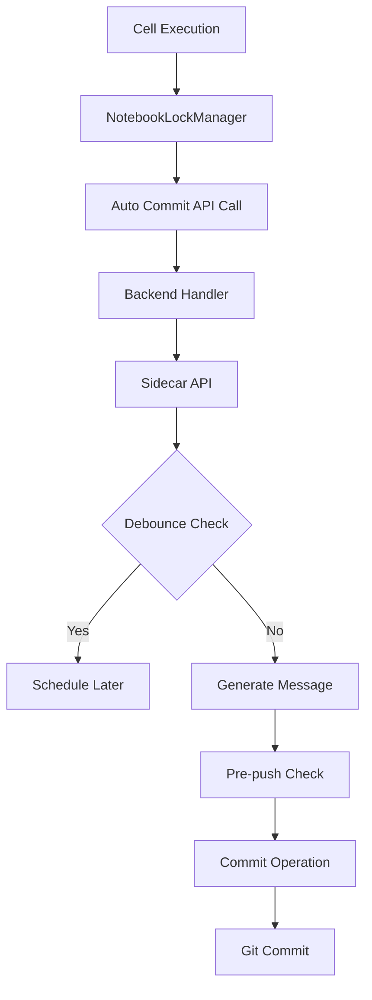
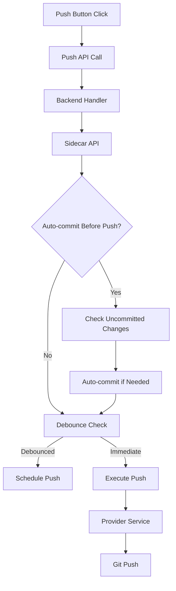
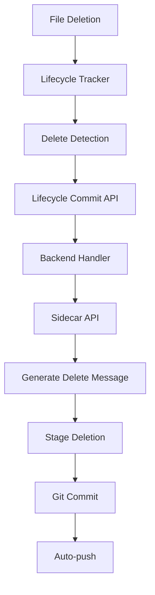
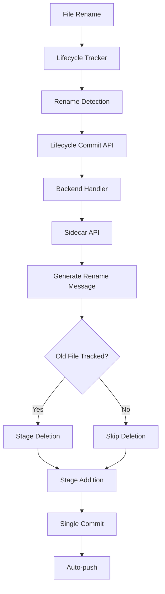

# Program Workflow Documentation

This document outlines the sequence of function calls for the main operations in the Git Lock Sign JupyterLab extension.

## Overview

The extension operates through a three-tier architecture:
- **Frontend**: JupyterLab extension (TypeScript/React)
- **Backend**: JupyterLab server handlers (Python)
- **Sidecar**: FastAPI service handling git operations (Python)

## Auto Commit Workflow

### Trigger: Cell Execution Completion
```
NotebookLockManager._handleNotebookSaveCompleted()
├── gitLockSignAPI.autoCommitWithContent()
├── CommitNotebookHandler.post()
├── SidecarClient._make_request("POST", "/commit")
└── Sidecar: /commit endpoint
    ├── commit_helpers.should_debounce_commit()
    ├── commit_helpers.generate_auto_commit_message()
    ├── commit_helpers.handle_pre_push_logic()
    ├── commit_helpers.perform_commit_operation()
    └── GitService.commit_notebook()
```

### Flow Diagram


## Push Workflow

### Trigger: Manual Push Button or Auto-push
```
PushButtonComponent.handlePushClick()
├── gitLockSignAPI.pushToRepository()
├── PushRepositoryHandler.post()
├── SidecarClient.push_notebook()
└── Sidecar: /push endpoint
    ├── push_helpers.handle_auto_commit_before_push()
    ├── push_helpers.should_debounce_push()
    ├── push_helpers.execute_push_operation()
    └── ProviderService.push_notebook()
```

### Flow Diagram


## Delete Workflow

### Trigger: File Deletion in JupyterLab
```
FileLifecycleTracker._setupContentsManagerTracking()
├── FileLifecycleCommitHandler.post()
├── SidecarClient.commit_file_lifecycle()
└── Sidecar: /file-lifecycle-commit endpoint
    ├── lifecycle_helpers.generate_lifecycle_commit_message()
    ├── lifecycle_helpers.handle_file_deletion()
    ├── GitService.commit_notebook()
    └── lifecycle_helpers.handle_lifecycle_auto_push()
```

### Flow Diagram


## Rename Workflow

### Trigger: File Rename in JupyterLab
```
FileLifecycleTracker._handleRenameEvent()
├── FileLifecycleCommitHandler.post()
├── SidecarClient.commit_file_lifecycle()
└── Sidecar: /file-lifecycle-commit endpoint
    ├── lifecycle_helpers.generate_lifecycle_commit_message()
    ├── lifecycle_helpers.handle_file_rename_commits()
    │   ├── Check if old file tracked
    │   ├── Stage old file deletion (if tracked)
    │   ├── Stage new file addition
    │   └── Single commit with rename message
    └── lifecycle_helpers.handle_lifecycle_auto_push()
```

### Flow Diagram


## Key Components

### Frontend Components
- **NotebookLockManager**: Handles auto-commit on cell execution
- **PushButtonComponent**: Manual push operations
- **FileLifecycleTracker**: Monitors file operations (create/delete/rename)

### Backend Handlers
- **CommitNotebookHandler**: Processes commit requests
- **PushRepositoryHandler**: Processes push requests
- **FileLifecycleCommitHandler**: Processes lifecycle events

### Sidecar Services
- **GitService**: Core git operations
- **ProviderService**: Git server integration (GitLab/Gitea/GitHub Enterprise)
- **DebounceService**: Prevents operation spam
- **ConfigService**: Configuration management

## Configuration

Key settings affecting workflow:
- `COMMIT_DEBOUNCE_SECONDS`: Auto-commit delay
- `PUSH_DEBOUNCE_SECONDS`: Auto-push delay
- `AUTO_COMMIT_BEFORE_PUSH`: Commit before push
- `INCLUDE_METADATA`: Include notebook metadata in commits
- `GIT_SERVER`: Target git server (gitlab/gitea/github_enterprise)

## Error Handling

All workflows include comprehensive error handling:
- Graceful degradation on failures
- Detailed logging for debugging
- User notifications for critical errors
- Automatic retry mechanisms where appropriate
