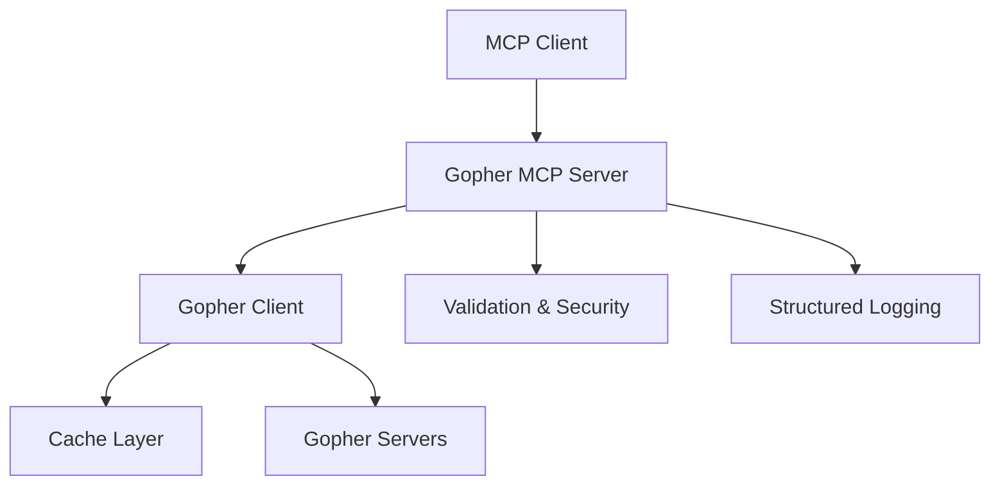

# Gopher MCP

A cross-platform **Model Context Protocol (MCP)** server that lets LLMs browse Gopher resources safely and efficiently.

## Overview

Gopher MCP provides a bridge between modern Large Language Models and the classic Gopher protocol, enabling LLMs to explore the rich content available on Gopher servers across the internet. The server implements the Model Context Protocol specification, making it compatible with various MCP clients including Claude Desktop.

## Key Features

- **Safe & Secure**: Built-in safeguards including timeouts, size limits, and input validation
- **High Performance**: Async implementation with intelligent caching
- **Developer Friendly**: Comprehensive type hints, extensive testing, and excellent documentation
- **Cross Platform**: Works on Linux, macOS, and Windows
- **Structured Output**: Returns LLM-optimized JSON responses for all Gopher content types
- **Full Protocol Support**: Handles menus, text, binary files, and search functionality

## Quick Start

### Installation

```bash
# Install from source (recommended for now)
git clone https://github.com/cameronrye/gopher-mcp.git
cd gopher-mcp
uv sync --all-extras

# Or install directly from GitHub
uv add git+https://github.com/cameronrye/gopher-mcp.git
```

> **Note:** PyPI installation will be available once the package is published.

### Basic Usage

```bash
# Run with stdio transport (for Claude Desktop)
gopher-mcp

# Run with streamable HTTP transport
gopher-mcp --transport streamable-http

# Run with SSE transport
gopher-mcp --transport sse
```

### Example Tool Usage

The server provides a single tool called `gopher.fetch` that can retrieve any Gopher resource:

```json
{
  "tool": "gopher.fetch",
  "arguments": {
    "url": "gopher://gopher.floodgap.com/1/"
  }
}
```

## Supported Gopher Types

| Type | Description | Response Format |
|------|-------------|-----------------|
| `0` | Text file | Structured text with metadata |
| `1` | Directory/Menu | JSON array of menu items |
| `7` | Search server | Menu results from search query |
| `4,5,6,9,g,I` | Binary files | Metadata only (size, MIME type) |

## Architecture



## Documentation

- [Installation Guide](installation.md)
- [API Reference](api-reference.md)
- [Advanced Features](advanced-features.md)
- [AI Assistant Guide](ai-assistant-guide.md)
- [Gemini Protocol Support](gemini-support.md)
- [Gemini Configuration](gemini-configuration.md)
- [Gemini Troubleshooting](gemini-troubleshooting.md)
- [Migration Guide](migration-guide.md)
- [Task Runner](task-runner.md)

## Contributing

We welcome contributions! Please see our [Contributing Guide](contributing.md) for details.

## License

This project is licensed under the MIT License - see the [LICENSE](../LICENSE) file for details.

## Acknowledgments

- Built on the excellent [MCP Python SDK](https://github.com/modelcontextprotocol/python-sdk)
- Uses [Pituophis](https://pypi.org/project/Pituophis/) for Gopher protocol implementation
- Inspired by the [MCP reference servers](https://github.com/modelcontextprotocol/servers)
