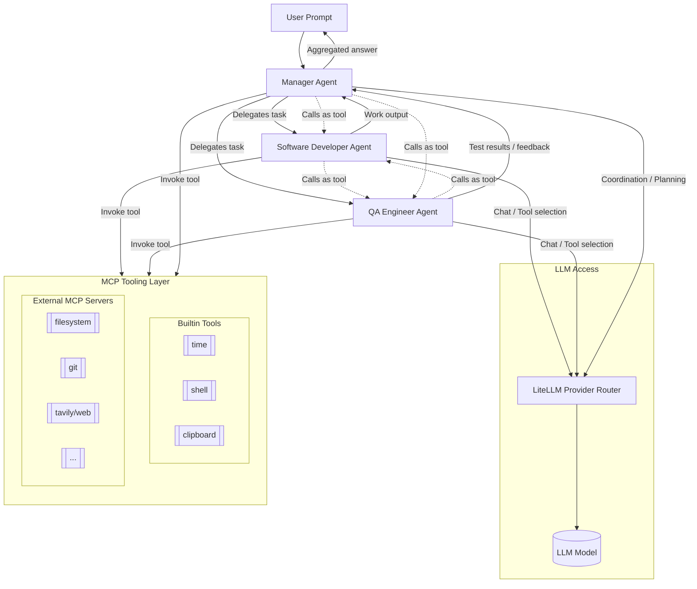
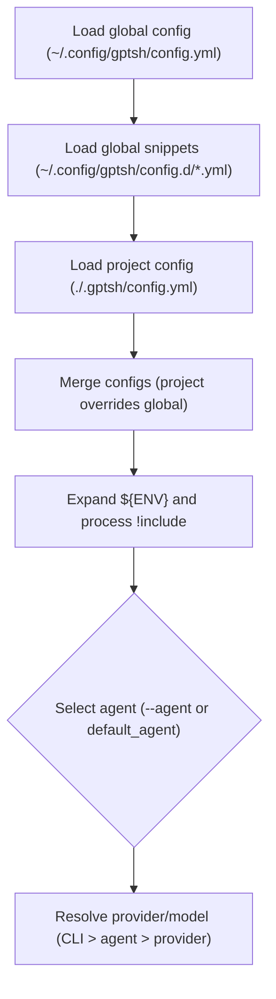
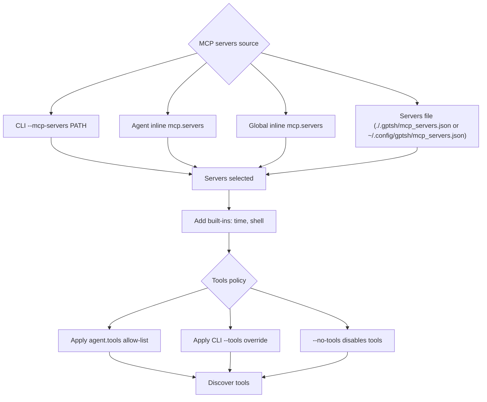
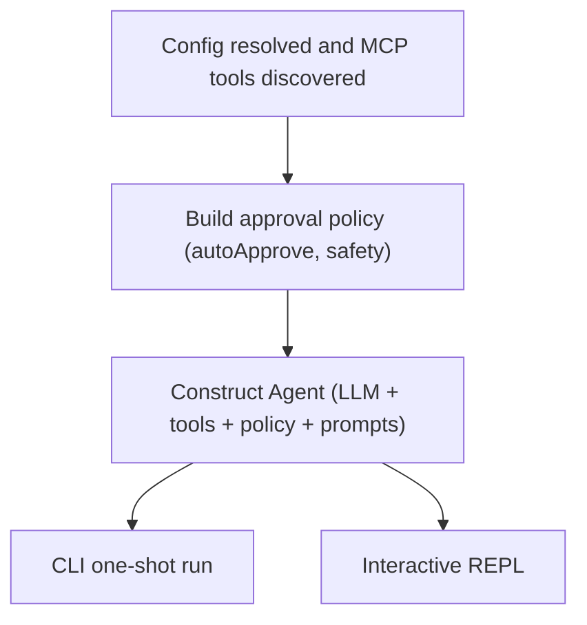

# gptsh

A modern, modular shell assistant powered by LLMs with first-class Model Context Protocol (MCP) support.

**Meet your shell copilot — the AI bestie for anyone who lives in the terminal.**

**Features:**
- Async-first core
- Configurable providers via LiteLLM (OpenAI, Claude, Perplexity, Azure, etc.)
- MCP tools discovery and invocation with resilient lifecycle
- Interactive REPL with persistent session, history, and multi-line input support
- Clean CLI UX with progress spinners and Markdown rendering
- Multimodal inputs (images, audio, PDFs) when supported by the model
- Dual multi-line modes: auto-continuation (default) or explicit Ctrl+S submission
- Predictable I/O for maximum flexibility


## Goal

There's already many CLI tools for interaction with LLMs. Some of them are
designed for coding (eg. Aider, Opencode, Codex), some others are meant for
sysadmin or generic use (eg. shell-gpt).
Having a tool is no longer an issue, with LLMs almost anyone can vibe-code
anything they like, even people without prior experience. We can argue about
quality and security of resulting products but the fact is that over time, as
LLMs are getting rapidly better as well as people are finding new approaches,
it will become irrelevant.

As this world evolves quickly, it is clear that it is not about tools; it is
about **human creativity**, ideas, and building a modular architecture using
blocks that can be replaced at any time.

gptsh aims to be a versatile, simple, and extensible tool built around the idea of
agents, where an agent is an LLM with a role-specific prompt that defines its behavior
and an assigned set of tools (using MCP).

It is meant to be simple—mostly plug-and-play—with examples and proven setups
and usage patterns shared by others.

You can easily use it with a single/default agent and a Claude-like
`mcp_servers.json` as-is.

Or you can define multiple agents with different roles and tools and use them as
needed.

Or you can set up a more complex environment with multiple agents (e.g.,
Software Developer, QA Engineer) and one agent (Manager) that receives the user
prompt, orchestrates work, and delegates tasks to these agents. Even an agent can be
invoked as a tool from another agent.



## Installation

We use uv/uvx for environment management and running:

### Python package

#### UV

Best way to install `gptsh` is using `uv tool`

For the latest **stable release**:
```bash
uv tool install gptsh-cli
```

To install the **latest unreleased (main branch) version**:
```bash
uv tool install git+https://github.com/fpytloun/gptsh.git@main
```

This will put executables into `~/.local/bin` so make sure it is in your `$PATH`

```bash
export PATH="${PATH}:~/.local/bin"

**⚠️ Warning: macOS + Python 3.13 build issue with pasteboard==0.4.0**

Installing gptsh-cli can fail on macOS with Python 3.13 due to an upstream C extension compatibility issue in pasteboard==0.4.0:

- Symptom: build fails with clang errors like:
  - cast-function-type-mismatch
  - errors in pasteboard.m when building pasteboard._native
- Cause: older pasteboard uses a function signature incompatible with Python 3.13; warnings are treated as errors.

Workaround (temporary): bypass the error by relaxing the specific warning during build:

```bash
# Install gptsh-cli with warning demoted from error
CFLAGS="-Wno-error=cast-function-type-mismatch" uv tool install gptsh-cli@git+https://github.com/fpytloun/gptsh.git@c86f275507b8ae63edf974985b3336facd88a815
```

#### UVX

If you prefer uvx, then use this command:

```bash
uvx --from gptsh-cli gptsh --help
```

You can also set alias:

```sh
alias gptsh="uvx --from gptsh-cli gptsh"
```

Not pinning version will cause that `uvx` will try to update on each run so it
will increase startup time. You can set version like this (check for latest
release first):

```sh
uvx --from gptsh-cli==<version> gptsh
```

## Quick Start

Single-shot prompt:

```bash
gptsh "Summarize the latest project changes"
```

Pipe input from stdin:

```bash
git diff | gptsh "Explain the changes and suggest a commit message"
```

Binary stdin (images, PDFs, audio) is automatically detected and sent to capable models:

```bash
# Images with vision models (gpt-4o, claude-3.5-sonnet, etc.)
cat image.png | gptsh "What is in this image?"
# → Sends as multimodal content with image data

# PDFs with PDF-capable models
cat document.pdf | gptsh "Summarize this document"
# → Sends as multimodal content with PDF data

# Audio files with audio-capable models (gpt-4o, gpt-4o-mini)
cat recording.mp3 | gptsh "What did they say?"
# → Optionally transcribes with Whisper API, or sends as multimodal audio

# Other binaries fall back to text markers
cat archive.zip | gptsh "What is this?"
# → Sends: "[Attached: application/zip, 1234 bytes]"
```

Plain text output (default is markdown):

```bash
gptsh -o text --no-progress "Generate shell command to rename all files in directory and prefix them with xxx_"
```

## CLI Usage

```text
Usage: gptsh [OPTIONS] [PROMPT]

  gptsh: Modular shell/LLM agent client.

Options:
  --provider TEXT               Override LiteLLM provider from config
  --model TEXT                  Override LLM model
  --agent TEXT                  Named agent preset from config
  --config TEXT                 Specify alternate config path
  --stream / --no-stream
  --progress / --no-progress
  --debug
  -v, --verbose                 Enable verbose logging (INFO)
  --mcp-servers TEXT            Override path to MCP servers file
  --list-tools
  --list-providers              List configured providers
  --list-agents                 List configured agents and their tools
  --list-sessions               List saved sessions (supports filters)
  -o, --output [text|markdown]  Output format
  --no-tools                    Disable MCP tools (discovery and execution)
  --tools TEXT                  Comma/space-separated MCP server labels to
                                allow (others skipped)
   -i, --interactive             Run in interactive REPL mode
   --multiline                   Enable full multi-line mode (Ctrl+S to submit)
   -s, --session TEXT            Session reference (index or id)
  --show-session TEXT           Show a saved session by id or index and exit
  --print-session               Print saved session (requires --session) and continue
  --summarize-session TEXT      Summarize a saved session and print only the summary
   --cleanup-sessions            Remove older saved sessions, keeping only the most recent ones
   --keep-sessions INTEGER       How many most recent sessions to keep with --cleanup-sessions
   --delete-session TEXT         Delete a saved session by id or index
   --copy                        Auto-copy last assistant message to clipboard on exit
   -h, --help                    Show this message and exit.
```

### Sessions: viewing and maintenance

- List sessions (filtered; indices preserved):
  - `gptsh --list-sessions`
  - `gptsh --list-sessions --agent dev`
  - `gptsh --list-sessions --provider openai --model gpt-5`
- Show full session (header + transcript; pager-friendly):
  - `gptsh --show-session 0 | less`
- Print then continue:
  - `gptsh --print-session -s 0 -i` (REPL)
  - `gptsh --print-session -s 0 "Continue here"` (one more non-interactive turn)
- Summarize only:
  - `gptsh --summarize-session 0`
- Cleanup/delete:
  - `gptsh --cleanup-sessions` (keep 10 by default)
  - `gptsh --cleanup-sessions --keep-sessions 3`
  - `gptsh --delete-session 0`

### Sessions configuration

- Precedence: CLI `--no-sessions` > per-agent `agents.<name>.sessions.enabled` > global `sessions.enabled` > default True
- Example:

```yaml
sessions:
  enabled: true
agents:
  committer:
    model: gpt-5-mini
    sessions:
      enabled: false
```

## MCP Tools

List available tools discovered from configured MCP servers:

```bash
gptsh --list-tools
```

Disable tools entirely:

```bash
gptsh --no-tools "Explain which tools are available to you"
```

Allow only specific MCP servers (whitelist):

```bash
gptsh --tools serena --list-tools
gptsh --tools serena "Only Serena tools will be available"
```

This flag supports multiple labels with comma/space separation:

```bash
uvx gptsh --tools serena,tavily
```

### Builtin Tools

gptsh includes several builtin tools available by default:

- **`time`** — Access system time and timezone operations
- **`shell`** — Execute shell commands with history search
- **`clipboard`** — Read from and write to system clipboard with OSC52 support over SSH

#### Clipboard Tool

The clipboard tool provides native clipboard access on macOS and Linux with optional OSC52 support for SSH sessions.

**Features:**
- Native clipboard access (no subprocess overhead)
- macOS: Uses `pasteboard` library (Cocoa bindings)
- Linux: Uses `tkinter` (built-in, no external dependencies)
- OSC52 support: Works over SSH to update local clipboard
- Smart auto-detection: Automatically uses optimal method for local vs remote sessions

**Usage examples:**

```bash
# Read clipboard content
gptsh "Analyze the code I copied to my clipboard"

# Write to clipboard
gptsh "Generate a docker command and put it in my clipboard"

# Over SSH - will work via OSC52 and update your local clipboard
ssh user@server
gptsh "Generate a backup command and write to clipboard"
# → Clipboard updated on your LOCAL machine!
```

**Configuration:**

```yaml
clipboard:
  enabled: true                # Enable/disable clipboard tool
  mode: "auto"                 # Options: "auto", "native", "both", "osc52"
  # auto (default):   Smart detection - uses both in SSH, native locally
  # native:      Never use OSC52, native clipboard only
  # both:             Always attempt both methods (redundant but guaranteed)
  # osc52:       Only OSC52, useful for remote-only environments
```

**Platform Support:**

| Platform | Read | Write | Method |
|----------|------|-------|--------|
| macOS | ✅ | ✅ | pasteboard (Cocoa) |
| Linux | ✅ | ✅ | tkinter (stdlib) |
| SSH (any) | ✅ OSC52 | ✅ OSC52+native | Over terminal |

**Installation for macOS (optional):**

On macOS, the clipboard tool tries to use the `pasteboard` library for better Cocoa integration. It's optional but recommended:

```bash
uv tool install --with clipboard-macos gptsh-cli
```

If not installed, the tool will provide a clear error message on use.

## Configuration

Config is merged from:
1) Global: ~/.config/gptsh/config.yml
2) Global snippets: ~/.config/gptsh/config.d/*.yml (merged in lexicographic order)
3) Project: ./.gptsh/config.yml

Merge semantics:
- The per-project config is merged into the global config (project overrides global where keys overlap).
- MCP servers definitions follow precedence (see below) and are not merged across files; the first matching source wins. Practically, a project-local `./.gptsh/mcp_servers.json` takes precedence over the user-level `~/.config/gptsh/mcp_servers.json`.



Environment variables may be referenced using ${VAR_NAME} (and ${env:VAR_NAME} in mcp_servers.json is normalized to ${VAR_NAME}). YAML also supports a custom !include tag resolved relative to the including file, with wildcard support. For example:
- agents: !include agents.yml
- agents: !include agents/*

### MCP

You can configure MCP servers inline in YAML or via a Claude-compatible JSON file. Only one servers definition is used at a time with this precedence:
1) CLI parameter (e.g., `--mcp-servers mcp_servers.json`)
2) Per-agent inline YAML `agents.<name>.mcp.servers`
3) Global inline YAML `mcp.servers`
4) Servers file (first existing): `./.gptsh/mcp_servers.json` then `~/.config/gptsh/mcp_servers.json`

Inline YAML is equivalent in structure to the JSON file and enables self-contained agents: you can define the required MCP servers directly on an agent and avoid relying on global server files. This lets a project ship agents that "just work" without external setup.



Inline YAML mapping (preferred):
```yaml
mcp:
  servers:
    tavily:
      transport: { type: sse, url: "https://api.tavily.com/mcp" }
      credentials:
        headers:
          Authorization: "Bearer ${TAVILY_API_KEY}"
    filesystem:
      transport: { type: stdio }
      command: uvx
      args: ["mcp-filesystem", "--root", "."]
      env: {}
```

You can also embed JSON as a string. If the JSON includes a top-level `mcpServers`, it will be unwrapped automatically:
```yaml
mcp:
  servers: |
    {"mcpServers": {"tavily": {"transport": {"type": "sse", "url": "https://api.tavily.com/mcp"}}}}
```

Built-in in-process servers `time`, `shell`, and `clipboard` are always available and are merged into your configuration (inline or file-based). To limit which servers/tools are used at runtime, use the `tools` allow-list on the agent (e.g., `tools: ["git"]`). This filters the merged set to only those servers. To completely override or effectively disable built-ins for an agent, set `tools` to a list without them.

Per-agent tools allow-list:
- Define `agents.<name>.tools` as a list of MCP server labels to expose to that agent (e.g., `tools: ["tavily", "serena"]`).
- This is a filter over all configured MCP servers (from inline/global or servers file). You can override it at runtime with `--tools`.



### Project Structure (overview)

```
gptsh/
  cli/
    entrypoint.py        # thin CLI, defers to core
    utils.py             # CLI helpers: agent resolution, listings
  core/
    approval.py          # DefaultApprovalPolicy
    config_api.py        # config helpers (now use core.models)
    config_resolver.py   # build_agent
    exceptions.py        # ToolApprovalDenied
    logging.py           # logger setup
    models.py            # typed config models (moved from domain/)
    progress.py          # RichProgressReporter
    repl.py              # interactive REPL (uses runner)
    runner.py            # unified run_turn (stream + tools + fallback)
    session.py           # ChatSession (tool loop, params)
    stdin_handler.py     # safe stdin handling
  llm/
    litellm_client.py    # LiteLLMClient + stream chunk logging
    chunk_utils.py       # extract_text
    tool_adapter.py      # tool specs + tool_calls parsing
  mcp/
    client.py            # persistent sessions
    manager.py           # MCPManager
    api.py               # facade
    tools_resolver.py    # ToolHandle resolver
    builtin/
      time.py, shell.py, clipboard.py  # builtin tools
  tests/                 # pytest suite (unit tests)
```

### Example config.yml

```yaml
default_agent: default
default_provider: openai

providers:
  openai:
    model: openai/gpt-4.1

agents:
  default:
    model: gpt-4.1
    output: markdown
    autoApprove: ["time"]
    prompt:
      system: "You are a helpful assistant called gptsh."
  cli:
    output: text
    model: "gpt-4.1-mini"
    tools: ["shell"]
    prompt:
      system: |
        You are expert system administrator with deep knowledge of Linux and Unix-based systems.
        You have in two modes: either you execute command using tool (default if tool is available) or you provide command that user can execute.

        **Instructions (tool):**
        - If you have shell execution tool available, call that tool to execute command by yourself
        - After command is completed, check exit code and return tool output
        - Return only tool output as it would return if executed directly
        - Do not make up output of tool and pretend you executed something!

        **Instructions (without tool):**
        - Return command that can be executed as is on given system and does what user wants
        - Make sure your output is compatible with POSIX-compliant shell
        - Return only ready to be executed command and nothing else!
        - It is likely to be passed to sh/bash via stdin
        - If command is destructive, make sure to use echo/read for user confirmation unless user commands to skip confirmation
  hello:
     tools: []
     prompt:
       user: "Hello, are you here?"
```

**Global Prompt Configuration:**

You can configure REPL prompt behavior globally:

```yaml
prompt:
  format: "{agent}|{model}> "        # Templized prompt (see below for placeholders)
  multiline: false                    # Enable Ctrl+S multi-line mode
  hint: true                          # Show "Press Ctrl+S to submit" on startup (multiline mode)
```

**Prompt Template Placeholders:**
- `{agent}` - Agent name with cyan bold color
- `{model}` - Model name with magenta color
- `{agent_plain}` - Agent name without color
- `{model_plain}` - Model name without color

**Examples:**

```yaml
# Custom separator
prompt:
  format: "[{agent_plain}:{model_plain}] "

# Different layout
prompt:
  format: "({agent}) {model}→ "

# With multi-line mode
prompt:
  format: "{agent}|{model}> "
  multiline: true
  hint: true
```

Agents at a glance:
- An agent bundles LLM + tools + prompt. The prompt includes a system prompt and may also include a pre-defined user prompt so you do not have to pass a prompt for routine tasks (e.g., a `changelog` or `committer` agent).

For full example, see `examples` directory.

### Example MCP servers file (mcp_servers.json)

```json
{
  "mcpServers": {
    "sequentialthinking": {
      "args": [
        "run",
        "--rm",
        "-i",
        "mcp/sequentialthinking"
      ],
      "autoApprove": [
        "sequentialthinking"
      ],
      "command": "docker"
    },
    "filesystem": {
      "args": [
        "run",
        "-i",
        "--rm",
        "--mount",
        "type=bind,src=${HOME},dst=${HOME}",
        "mcp/filesystem",
        "${HOME}"
      ],
      "autoApprove": [
        "directory_tree",
        "get_file_info",
        "list_allowed_directories",
        "list_directory",
        "read_file",
        "read_multiple_files",
        "search_files"
      ],
      "command": "docker"
    },
    "git": {
      "args": [
        "mcp-server-git"
      ],
      "autoApprove": [
        "git_diff",
        "git_diff_staged",
        "git_diff_unstaged",
        "git_log",
        "git_show",
        "git_status",
        "git_branch"
      ],
      "command": "uvx"
    },
    "tavily": {
      "args": [
        "run",
        "-i",
        "--rm",
        "-e",
        "TAVILY_API_KEY",
        "mcp/tavily"
      ],
      "autoApprove": [
        "tavily-search",
        "tavily-extract",
        "tavily-crawl",
        "tavily-map"
      ],
      "command": "docker",
      "env": {
        "TAVILY_API_KEY": "${TAVILY_API_KEY}"
      }
    }
  }
}
```

- Use ${VAR} for env expansion.
- autoApprove lists tools that should be pre-approved by the UI.

You can override servers files with the CLI:

```bash
gptsh --mcp-servers ./.gptsh/mcp_servers.json --list-tools
```

You can restrict which servers load by using:

```bash
gptsh --tools serena "Only serena’s tools are available"
```

## Examples

Ask with project context piped in:

```bash
rg -n "async def" -S | gptsh "What async entry points exist and what do they do?"
```

Use Text output for plain logs:

```bash
gptsh -o text "Return a one-line status summary"
```

Use a different provider/model:

```bash
gptsh --provider openai --model gpt-5-mini "Explain MCP in a paragraph"
```

## Interactive REPL:

- Compact current conversation history (preserving system prompt):
  - In REPL, run `/compact` to summarize with the small model and replace history with a single labeled USER summary message. This reduces context size for subsequent turns.

- Start a REPL:
```bash
gptsh -i
```

- Provide an initial prompt and continue in REPL:
```bash
gptsh -i "Say hello"
```

- Pipe stdin as the initial prompt and continue in REPL:
```bash
echo "Summarize this input" | gptsh -i
```

REPL slash-commands:

- /exit — Exit the REPL
- /quit — Exit the REPL (alias)
- /model <name> — Override the current model
- /agent <name> — Switch to a configured agent
- /reasoning_effort [minimal|low|medium|high] — Set reasoning effort for current agent
- /tools — List discovered MCP tools for current agent
- /no-tools [on|off] — Toggle or set MCP tool usage for this session
- /info — Show session/model info and usage
- /file <path> — Attach a file to the conversation (text inlined; images/PDFs/audio sent as multimodal if model supports)
- /compact — Summarize and compact history (keeps system prompt, inserts labeled USER summary)
- /copy — Copy the last assistant message to clipboard (uses native clipboard or OSC52 over SSH)
- /help — Show available commands
(Tab completion works for slash-commands and agent names.)

### Multi-line Input Modes

gptsh supports two multi-line input modes, controlled by the `prompt.multiline` config option:

#### Mode A: Auto-Continuation (Default, `prompt.multiline: false`)

Automatically detects continuation lines and prompts for more input. Perfect for natural, intuitive interactions.

**Continuation triggers:**
1. **Trailing backslash** — Explicitly continue on next line:
```
> Explain this concept \
...> in simple terms
```

2. **Unclosed brackets/parentheses** — Automatically detect incomplete grouping:
```
> Process these items: [
...> "item1",
...> "item2"
...> ]
```

3. **Markdown code blocks** — Detect triple backticks for code:
```
> Here's the code:
...> ```python
...> def hello():
...>     print("world")
...> ```
```

#### Mode B: Full Multi-line Mode (`prompt.multiline: true`)

Enable true multi-line editing with explicit submission. Press **Ctrl+S** to submit.

**Configuration:**
```yaml
# ~/.config/gptsh/config.yml or ./.gptsh/config.yml
prompt:
  multiline: true
```

**Usage:**
```
> Line 1
> Line 2
> Line 3
> [Press Ctrl+S to submit]
```

**Features:**
- Enter key inserts newlines (doesn't submit)
- Ctrl+S submits the accumulated input
- Full line editing until submission
- Useful for complex multi-paragraph prompts

**CLI Override:**

You can enable multi-line mode from the command line without config:

```bash
gptsh -i --multiline              # Interactive REPL with Ctrl+S mode
gptsh --multiline "Your prompt"   # Single-shot with Ctrl+S mode
```

The `--multiline` CLI flag overrides the config file setting (which defaults to false).

**Default:** `prompt.multiline: false` (auto-continuation mode)

Disable progress:

```bash
gptsh --no-progress "Describe current repo structure"
```

### Copying Assistant Messages to Clipboard

Use the `/copy` command in REPL or the `--copy` flag in one-shot mode to copy the last assistant message to your clipboard.

**REPL example:**
```bash
gptsh -i
> Generate a docker command for me
[LLM generates docker run command]
> /copy
# Message copied to clipboard!
```

**One-shot mode with auto-copy:**
```bash
gptsh --copy "Generate a docker command"
# Output is printed, then automatically copied to clipboard on exit
```

**Features:**
- **Automatic method selection:** Uses native clipboard on local sessions, falls back to OSC52 over SSH
- **OSC52 support:** Works seamlessly over SSH to update your local clipboard
- **Error handling:** Silently continues if copy fails (doesn't interrupt workflow)
- **Works with multimodal:** Copies text content from the assistant message

### Copy Previous Session Messages

You can also copy the last message from a previous session without continuing:

```bash
# List sessions to find the one you want
gptsh --list-sessions
# [0] abc123 2024-01-15 10:30 "Summarize docs" (default|gpt-4.1)

# Copy from most recent session
gptsh -s 0 --copy
Copied to clipboard (342 chars) via native

# Copy from specific session by ID
gptsh -s abc123 --copy
Copied to clipboard (1024 chars) via native

# Over SSH - clipboard will be updated on local machine via OSC52
ssh user@remote
gptsh -s 0 --copy
Copied to clipboard (500 chars) via osc52
```

This is useful for quickly retrieving outputs from recent conversations without needing to re-run them or start a new REPL.

## Tool I/O

- **stdin** — If available (e.g., from a pipe), non-interactive stdin is read and appended to the active prompt. Binary content (images, audio, PDFs) is auto-detected via magic bytes and injected as a concise marker. In REPL mode, stdin is then switched to /dev/tty to accept further interactive input.
- **stderr** — Progress bar, tool-approval prompts, and logs.
- **stdout** — Only LLM output is written to stdout.

This provides great flexibility and many possible uses in your shell session.

## Exit Codes

- 0   success
- 1   generic failure
- 2   configuration error (invalid/missing)
- 3   MCP connection/spawn failure (after retries)
- 4   tool approval denied
- 124 operation timeout
- 130 interrupted (Ctrl-C)

## Development

### Install

```bash
uv venv
UV_CACHE_DIR=.uv-cache uv pip install -e .[dev]
```

Run:

```bash
UV_CACHE_DIR=.uv-cache uv run gptsh --help
``````

### Linting and Tests

Ruff is configured as the primary linter in `pyproject.toml` (line length 100, isort enabled). Run lint + tests before committing:

```bash
UV_CACHE_DIR=.uv-cache uv run ruff check
UV_CACHE_DIR=.uv-cache uv run pytest
```

Project scripts:

- Entry point: gptsh = "gptsh.cli.entrypoint:main"
- Keep code async; don’t log secrets; prefer uv/uvx for all dev commands.

For full development instructions, read `AGENTS.md`.

## Audio Support

gptsh supports audio file processing through two complementary features:

### Audio Transcription

Audio files can be automatically transcribed using OpenAI's Whisper API:

```bash
# Transcribe audio file
cat recording.mp3 | gptsh "Summarize the transcript"
```

**Configuration:**

Transcription uses the provider system for credentials and API endpoints. Configure any LiteLLM provider to handle transcription:

```yaml
providers:
  openai:
    model: gpt-4o
    api_key: ${OPENAI_API_KEY}    # Or set OPENAI_API_KEY env var
    base_url: https://api.openai.com/v1

transcribe:
  enabled: true              # Explicitly enable or auto-enable if provider has API key
  provider: openai           # Reference the provider name
  model: whisper-1           # Whisper model to use
  language: null             # Optional language hint (ISO-639-1, e.g., "en", "es")
  max_file_size: 25000000   # 25 MB (OpenAI limit)
  detect_non_speech: true    # Filter music/noise
```

**Custom Endpoint Example:**

```yaml
providers:
  custom_whisper:
    api_key: ${CUSTOM_API_KEY}
    base_url: https://api.example.com    # Custom Whisper-compatible endpoint

transcribe:
  enabled: true
  provider: custom_whisper
  model: whisper-1
```

**Supported Formats:**
- MP3, WAV, OGG, FLAC, M4A, AAC, WebM

**Speech Detection:**
- Automatically filters out music and noise
- Prevents sending irrelevant audio to the LLM
- Detects markers like `[MUSIC]`, `[NOISE]`, `[SILENCE]`

### Audio as Multimodal Content

If transcription is disabled or unavailable, audio files are sent directly to the LLM as multimodal content (when supported):

```bash
# Send audio directly to GPT-4o (no transcription)
cat recording.wav | gptsh --model gpt-4o "What did they say?"
```

**Models with Audio Support:**
- ✅ `gpt-4o` — Native audio input support
- ✅ `gpt-4o-mini` — Native audio input support (more affordable)
- ✅ `gpt-4-turbo` — Native audio input support
- ❌ `gpt-4.1-mini` — No audio support
- ❌ Azure OpenAI — Limited audio support (depends on API version)

**Priority Order:**
1. Transcription (if enabled and available)
2. Multimodal audio (if model supports it)
3. Text marker (fallback for unsupported models)

### REPL Audio Attachment

In the REPL, use `/file` to attach audio files:

```bash
gptsh -i
> /file recording.mp3
# Audio is automatically transcribed or sent as multimodal content
```

---
## Troubleshooting

- Audio not being processed: Ensure model supports audio (use `gpt-4o` or `gpt-4o-mini`)
- Transcription errors: Check that the configured provider has a valid API key and quota available
  - Verify `transcribe.provider` references an existing provider in `providers`
  - Verify the provider has `api_key` and `base_url` configured
- No tools found: check --mcp-servers path, server definitions, and network access.
- Stuck spinner: use --no-progress to disable UI or run with --debug for logs.
- Markdown output looks odd: try -o text to inspect raw content.

---
## Roadmap

- Workflow orchestration: define runnable workflows composed of steps (shell/Python/agents), similar to invoking targets with simple task runners.
- SRE copilot focus: practical day-to-day automation with safe approvals and rich tool integrations.

For full roadmap see `TODO.md`

---
Feedback and contributions are welcome!
