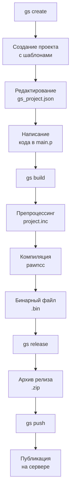

# GS Tool - инструмент для разработки телеметрических скриптов

GS Tool - это утилита командной строки для создания, сборки и публикации телеметрических скриптов, написанных на языке Pawn. Инструмент автоматизирует процесс разработки от создания проекта до публикации готовых скриптов на сервере.

## Оглавление

- [Возможности](#возможности)
- [Требования](#требования)
- [Установка](#установка)
- [Быстрый старт](#быстрый-старт)
- [Использование во время разработки](#использование-во-время-разработки)
- [Команды](#команды)
- [Конфигурация](#конфигурация)
- [Структура проекта](#структура-проекта)
- [Рабочий процесс](#рабочий-процесс)
- [Сборка пакета](#сборка-пакета)
- [Решение проблем](#решение-проблем)

## Возможности

- ✨ Создание проектов по шаблону
- 🔧 Валидация конфигурации и препроцессинг
- 📦 Компиляция Pawn скриптов встроенным компилятором
- 🚀 Создание релизов с версионированием
- 📤 Публикация скриптов на сервере
- 🛠️ Автоматическая генерация кода из JSON конфигурации

## Требования

- Python 3.7+
- pip (менеджер пакетов Python)
- Jinja2 (устанавливается автоматически)
- Click (устанавливается автоматически)
- Requests (устанавливается автоматически)

## Установка

### Установка из исходников

1. Клонируйте репозиторий:
```bash
git clone git@gl.7gis.ru:ng/gs_tools.git
cd gs_tools
```

2. Установите пакет в режиме разработки:
```bash
pip install -e .
```

Или для обычной установки:
```bash
pip install .
```

### Установка из PyPI (если опубликован)

```bash
pip install gs-tool
```

## Быстрый старт

1. **Создайте новый проект:**
```bash
gs create my_telemetry_script
cd my_telemetry_script
```

2. **Отредактируйте конфигурацию** в файле `gs_project.json`

3. **Напишите логику скрипта** в файле `main.p`

4. **Соберите проект:**
```bash
gs build
```

5. **Создайте релиз:**
```bash
gs release
```

6. **Опубликуйте на сервере:**
```bash
gs push
```

## Использование во время разработки

Если вы работаете с исходным кодом пакета и хотите тестировать изменения без переустановки:

1. Установите пакет в режиме разработки:
```bash
pip install -e .
```

2. Теперь любые изменения в исходном коде будут сразу доступны при вызове команды `gs`

3. Для отладки можно запускать напрямую через Python:
```bash
python -m gs_tool.cli create test_project
```

## Команды

### `gs create <name>`
Создает новый проект с указанным именем. Создается папка проекта со всеми необходимыми файлами:
- `gs_project.json` - конфигурация проекта
- `main.p` - основной файл скрипта
- `gs_natives.inc` - файл с нативными функциями
- `.gs_history/` - папка для хранения релизов

**Пример:**
```bash
gs create speed_monitor
```

### `gs preprocess`
Выполняет только препроцессинг: валидацию конфигурации и генерацию файла `project.inc`.

**Пример:**
```bash
gs preprocess
```

### `gs build`
Выполняет полную сборку проекта:
1. Препроцессинг (валидация + генерация кода)
2. Компиляция Pawn кода
3. Создание бинарного файла с заголовком

**Пример:**
```bash
gs build
```

Результаты:
- `main.amx` — результат компиляции Pawn
- локальный артефакт `<script_id>` (заголовок + AMX) для проверки
- при `gs release` формируется `<script_id>.bin` и попадает в архив

### `gs release`
Создает zip-архив текущей версии проекта для последующей публикации. Архив сохраняется в папке `.gs_history/`.

**Пример:**
```bash
gs release
```

### `gs push`
Публикует все созданные релизы на сервере. Использует настройки из конфигурационного файла.

**Пример:**
```bash
gs push
```

### `gs token`
Управление персональными токенами доступа (PAT):

- `gs token create` — выпуск токена (интерактивный вход по email/паролю, выбор компании, сохранение в `~/.gs_tool/config.json`).

  Примеры:
  ```bash
  gs token create --email you@example.com
  gs token create --name ci-bot --scope scripts:write --scope descriptors:write --never-expires --email you@example.com
  ```

- `gs token list` — список токенов текущего пользователя.

  ```bash
  gs token list
  ```

- `gs token revoke <token_id>` — отзыв токена.

  ```bash
  gs token revoke abcdef0123456789
  ```

## Конфигурация

### Глобальная конфигурация

Файл конфигурации находится в `~/.gs_tool/config.json`:

```json
{
  "server_url": "http://127.0.0.1:8000",
  "company_id": "your_company_id",
  "api_key": "your_api_key_here"
}
```

- `server_url` - адрес сервера для публикации скриптов
- `company_id` - идентификатор компании по умолчанию для заголовка `X-Company-ID`
- `api_key` - персональный токен (PAT) для авторизации (можно выпустить через `gs token create`)

### Конфигурация проекта

Файл `gs_project.json` содержит всю информацию о проекте:

```json
{
  "script_id": "uuid-проекта",
  "project_name": "имя_проекта",
  "version": "0.0.1",
  "description": "Описание скрипта",
  "config": {
    "uuid": "uuid-конфигурации",
    "fields": [
      {
        "name": "speed_limit",
        "type": "INT32",
        "default": 60,
        "min": "0",
        "max": "200",
        "ui": {
          "category": "limits",
          "widget": "spinbox",
          "name": {"ru": "Ограничение скорости", "en": "Speed limit"},
          "hint": {"ru": "Максимальная скорость", "en": "Maximum speed"},
          "dimension": {"ru": "км/ч", "en": "km/h"}
        }
      }
    ]
  },
  "datasources": [
    {
      "name": "telemetry",
      "uuid": "uuid-датасорса",
      "fields": [
        {"name": "speed", "type": "UINT32"},
        {"name": "voltage", "type": "FLOAT"}
      ]
    }
  ],
  "subscriptions": [
    {
      "path": "/system/start",
      "function": "start"
    }
  ],
  "api": {
    "uuid": "uuid-api",
    "endpoints": [
      {
        "name": "start",
        "signature": [{"type": "FST_CELL"}]
      }
    ]
  }
}
```

### Поддерживаемые типы данных

- `INT8`, `INT16`, `INT32` - знаковые целые
- `UINT8`, `UINT16`, `UINT32` - беззнаковые целые
- `FLOAT` - число с плавающей точкой
- `STRING` - строка
- `ENUM` - перечисление
- `ARRAY` - массив
- `BOOL` - логическое значение

## Структура проекта

После создания проект имеет следующую структуру:

```
my_telemetry_script/
├── gs_project.json      # Конфигурация проекта
├── main.p              # Основной файл скрипта
├── gs_natives.inc      # Нативные функции
├── project.inc         # Сгенерированный файл (после препроцессинга)
├── main.amx           # Скомпилированный байткод (после сборки)
└── .gs_history/       # История релизов
    └── release_v0.0.1.zip
```

## Рабочий процесс



## Сборка пакета

Для создания дистрибутива пакета:

1. Убедитесь, что у вас установлены необходимые инструменты:
```bash
pip install build twine
```

2. Создайте дистрибутивы:
```bash
python -m build
```

3. Для публикации на PyPI:
```bash
python -m twine upload dist/*
```

### Структура пакета

```
gs_tool/
├── __init__.py
├── cli.py              # Основной CLI модуль
├── config.py           # Работа с конфигурацией
├── project_template.json  # Шаблон проекта
├── bin/                # Встроенный компилятор
│   ├── pawncc.exe
│   └── include/        # Include файлы компилятора
├── templates/          # Шаблоны для генерации кода
│   ├── gs_natives.inc
│   ├── main.p.j2
│   └── project.inc.j2
├── setup.py            # Конфигурация установки
├── README.md           # Этот файл
└── requirements.txt    # Зависимости
```

## Решение проблем

### Ошибка "pawncc не найден"

Убедитесь, что:
1. Пакет установлен правильно и содержит `bin/pawncc.exe`
2. Или установите pawncc отдельно и добавьте его в PATH

### Ошибка компиляции

1. Проверьте синтаксис в `main.p`
2. Убедитесь, что все используемые функции объявлены в `gs_natives.inc`
3. Проверьте вывод компилятора на наличие конкретных ошибок

### Ошибка публикации

1. Проверьте настройки сервера в `~/.gs_tool/config.json`
2. Убедитесь, что API ключ актуален
3. Проверьте доступность сервера

### Отладка

Для отладки можно использовать функцию `Diagnostics()` в Pawn коде:
```pawn
Diagnostics("Debug message: %d", value);
```

## Лицензия

[Укажите вашу лицензию]

## Вклад в проект

[Инструкции для контрибьюторов]

## Контакты

[Контактная информация] 
