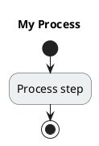
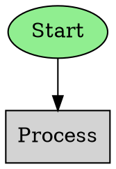

# Phase 2 Features - Bidirectional Conversion & Multiple Formats

Phase 2 adds bidirectional conversion capabilities and support for multiple diagram formats: PlantUML, D2, and Graphviz.

## New Features

### 1. Mermaid Parser (Bidirectional Conversion)

Parse Mermaid diagrams back into DiagramIR, enabling true bidirectional editing.

```python
from ij.parsers import MermaidParser

mermaid_text = """
flowchart TD
    n1([Start])
    n2[Process]
    n3([End])
    n1 --> n2
    n2 --> n3
"""

parser = MermaidParser()
diagram = parser.parse(mermaid_text)

# Now you can manipulate the diagram or convert to other formats
```

**Roundtrip Conversion:**

```python
from ij.renderers import MermaidRenderer
from ij.parsers import MermaidParser

# Mermaid -> DiagramIR -> Mermaid
parser = MermaidParser()
diagram = parser.parse(original_mermaid)

renderer = MermaidRenderer()
regenerated = renderer.render(diagram)
```

### 2. PlantUML Renderer

Export diagrams to PlantUML format, the enterprise standard for comprehensive UML.

```python
from ij.renderers import PlantUMLRenderer

renderer = PlantUMLRenderer(use_skinparam=True)
plantuml_output = renderer.render(diagram)
print(plantuml_output)
```

**Output:**


### 3. D2 Renderer

Export to D2 (Terrastruct), a modern diagram language with excellent aesthetics.

```python
from ij.renderers import D2Renderer

renderer = D2Renderer(layout="dagre")
d2_output = renderer.render(diagram)
```

**Output:**
```d2
# My Process

direction: down

n1: "Start" {
  shape: oval
  style.fill: '#90EE90'
  style.stroke: '#228B22'
}
n2: "Process" {
  shape: rectangle
}
n1 -> n2
```

**Features:**
- Multiple layout engines (dagre, elk, tala)
- Beautiful default styling
- Direction support
- Shape customization

### 4. Graphviz/DOT Renderer

Export to Graphviz DOT format, the 30-year-old foundation of graph visualization.

```python
from ij.renderers import GraphvizRenderer

renderer = GraphvizRenderer(layout="dot")
dot_output = renderer.render(diagram)

# Or render directly to image
renderer.render_to_image(diagram, "output", format="png")
```

**Output:**


**Supported layouts:**
- `dot`: Hierarchical layouts
- `neato`: Spring model layouts
- `fdp`: Force-directed placement
- `circo`: Circular layouts
- `twopi`: Radial layouts

### 5. Enhanced Text Converter

More sophisticated natural language processing with support for conditionals, parallel flows, and loops.

#### Conditional Branches

```python
from ij.converters import EnhancedTextConverter

converter = EnhancedTextConverter()
text = "Start -> Check user. If authenticated: Show dashboard, else: Show login"
diagram = converter.convert(text)
```

Creates a decision node with Yes/No branches automatically.

#### Parallel Flows

```python
text = "Start -> [parallel: Send email, Update database, Log event] -> End"
diagram = converter.convert(text)
```

Creates parallel execution paths that converge.

#### Loops

```python
text = "Start while data available: Process item"
diagram = converter.convert(text)
```

Creates a loop with decision point and back edge.

## Multi-Format Workflow

Convert diagrams between any supported format:

```python
from ij.parsers import MermaidParser
from ij.renderers import PlantUMLRenderer, D2Renderer, GraphvizRenderer

# Start with Mermaid
mermaid_source = """
flowchart TD
    A[Input] --> B[Process]
    B --> C[Output]
"""

# Parse
parser = MermaidParser()
diagram = parser.parse(mermaid_source)

# Export to multiple formats
plantuml = PlantUMLRenderer().render(diagram)
d2 = D2Renderer().render(diagram)
graphviz = GraphvizRenderer().render(diagram)

# Save all formats
renderers = {
    "diagram.mmd": MermaidRenderer(),
    "diagram.puml": PlantUMLRenderer(),
    "diagram.d2": D2Renderer(),
    "diagram.dot": GraphvizRenderer(),
}

for filename, renderer in renderers.items():
    renderer.render_to_file(diagram, filename)
```

## Format Comparison

| Format | Strengths | Best For | Output |
|--------|-----------|----------|--------|
| **Mermaid** | GitHub native, simple syntax, 84K stars | Documentation, README files | SVG, PNG |
| **PlantUML** | Comprehensive UML, 25+ types, enterprise | Detailed UML diagrams | SVG, PNG |
| **D2** | Modern, beautiful, bidirectional editing | Presentations, architecture | SVG, PNG, PPT |
| **Graphviz** | Foundation, maximum control, 30 years | Complex graphs, custom layouts | Any format |

## Complete Example

```python
from ij import (
    SimpleTextConverter,
    EnhancedTextConverter,
    MermaidParser,
    MermaidRenderer,
    PlantUMLRenderer,
    D2Renderer,
    GraphvizRenderer,
)

# Method 1: Simple text conversion
converter = SimpleTextConverter()
diagram = converter.convert("Start -> Process -> End")

# Method 2: Enhanced text with conditionals
enhanced = EnhancedTextConverter()
diagram = enhanced.convert(
    "Start -> Check data. If valid: Process, else: Reject"
)

# Method 3: Parse existing Mermaid
parser = MermaidParser()
diagram = parser.parse(existing_mermaid_diagram)

# Render to any format
mermaid = MermaidRenderer().render(diagram)
plantuml = PlantUMLRenderer().render(diagram)
d2 = D2Renderer().render(diagram)
graphviz = GraphvizRenderer().render(diagram)

# Save to files
MermaidRenderer().render_to_file(diagram, "output.mmd")
PlantUMLRenderer().render_to_file(diagram, "output.puml")
D2Renderer().render_to_file(diagram, "output.d2")
GraphvizRenderer().render_to_file(diagram, "output.dot")
```

## Running Examples

```bash
# Phase 2 examples
python examples/phase2_features.py

# Specific examples
python -c "from examples.phase2_features import example1_bidirectional_conversion; example1_bidirectional_conversion()"
```

## Testing

All Phase 2 features are fully tested:

```bash
pytest tests/test_parsers.py -v         # Parser tests
pytest tests/test_new_renderers.py -v   # New renderer tests
pytest tests/test_enhanced_converter.py -v  # Enhanced converter tests
```

**Test Coverage:**
- 52 tests total (26 from Phase 1 + 26 from Phase 2)
- 100% pass rate
- Roundtrip conversion validated

## Next Steps (Phase 3)

- AI/LLM integration for natural language understanding
- Visual editor integration
- Real-time collaboration (CRDT-based)
- Code-to-diagram reverse engineering
- Multiple diagram views from single source

## See Also

- [Main README](README.md) - Overview and Phase 1 features
- [examples/phase2_features.py](examples/phase2_features.py) - Complete examples
- [Research Document](misc/REASEARCH.md) - Background research
