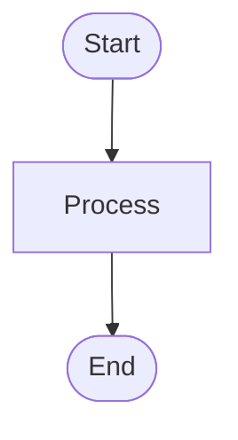
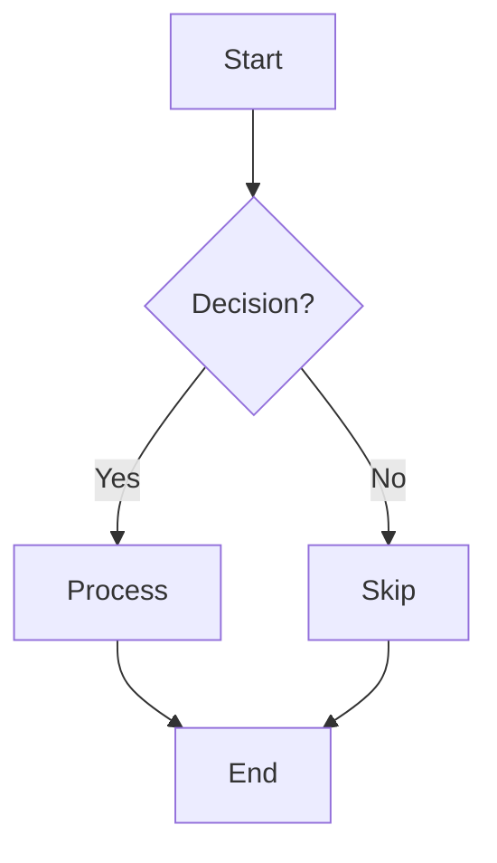

# ij - Idea Junction

**Connect vague ideas and evolve them to fully functional systems**

Idea Junction (ij) is a bidirectional diagramming system that enables seamless movement between natural language, visual diagrams, and code. Built on research into modern diagramming tools and best practices, it provides a foundation for transforming ideas into structured, analyzable diagrams.

## Features

### Phase 1 (Core) ✅
- **Text-to-Diagram Conversion**: Convert simple text descriptions into diagrams
- **Intermediate Representation (IR)**: AST-like structure for bidirectional conversion
- **Graph Analysis**: Powered by NetworkX for path finding, cycle detection, and graph manipulation
- **Mermaid Support**: Full rendering support for GitHub-native diagrams
- **CLI & Python API**: Use as a command-line tool or integrate into your Python projects
- **Type-Safe**: Full type hints and validation

### Phase 2 (Bidirectional & Multi-Format) ✅
- **Mermaid Parser**: Parse Mermaid diagrams back to IR (true bidirectional conversion)
- **PlantUML Renderer**: Export to PlantUML for enterprise UML diagrams
- **D2 Renderer**: Export to D2 (Terrastruct) for modern, beautiful diagrams
- **Graphviz Renderer**: Export to DOT format with multiple layout engines
- **Enhanced Text Converter**: Support for conditionals, parallel flows, and loops
- **Format Conversion**: Convert between Mermaid, PlantUML, D2, and Graphviz

### Phase 3 (AI & Code Analysis) ✅
- **AI/LLM Integration**: Natural language to diagrams using OpenAI API (10-20x faster)
- **Python Code Analysis**: Reverse engineer flowcharts from Python functions
- **Call Graph Generation**: Visualize function dependencies
- **Class Diagrams**: Generate from Python classes with inheritance
- **Iterative Refinement**: Conversational diagram improvement with AI
- **Hybrid Workflows**: Combine code analysis with AI enhancement

### Phase 4 (Advanced Features) ✅
- **Bidirectional D2**: Parse and render D2 diagrams (complete format support)
- **Sequence Diagrams**: Generate Mermaid sequence diagrams for interactions
- **Interaction Analysis**: Extract sequence diagrams from code and text
- **Diagram Transformations**: Simplify, filter, merge, and optimize diagrams
- **Cycle Detection**: Find circular dependencies and loops
- **Subgraph Extraction**: Extract relevant portions of large diagrams
- **Multi-Format Workflows**: Seamlessly convert between all supported formats
- **Statistics & Analysis**: Comprehensive diagram metrics and insights

## Installation

```bash
pip install ij
```

Or install from source:

```bash
git clone https://github.com/i2mint/ij
cd ij
pip install -e .
```

## Quick Start

### Command Line

```bash
# Convert text to Mermaid diagram
ij "Start -> Process data -> Make decision -> End"

# Save to file
ij "Step 1 -> Step 2 -> Step 3" -o diagram.mmd

# Specify direction
ij "A -> B -> C" -d LR -o horizontal.mmd

# Read from file
ij -f process.txt -o output.mmd
```

### Python API

```python
from ij import text_to_mermaid

# Simple conversion
mermaid = text_to_mermaid("Start -> Process -> End")
print(mermaid)
```

Output:


### Manual Diagram Creation

```python
from ij import DiagramIR, Node, Edge, NodeType, MermaidRenderer

# Create diagram programmatically
diagram = DiagramIR(metadata={"title": "My Process"})

diagram.add_node(Node(id="start", label="Start", node_type=NodeType.START))
diagram.add_node(Node(id="process", label="Do work", node_type=NodeType.PROCESS))
diagram.add_node(Node(id="end", label="End", node_type=NodeType.END))

diagram.add_edge(Edge(source="start", target="process"))
diagram.add_edge(Edge(source="process", target="end"))

# Render to Mermaid
renderer = MermaidRenderer(direction="LR")
print(renderer.render(diagram))
```

### Graph Analysis

```python
from ij import DiagramIR, Node, Edge
from ij.graph_ops import GraphOperations

# Create a workflow
diagram = DiagramIR()
diagram.add_node(Node(id="a", label="Start"))
diagram.add_node(Node(id="b", label="Task 1"))
diagram.add_node(Node(id="c", label="Task 2"))
diagram.add_node(Node(id="d", label="End"))

diagram.add_edge(Edge(source="a", target="b"))
diagram.add_edge(Edge(source="b", target="c"))
diagram.add_edge(Edge(source="c", target="d"))
diagram.add_edge(Edge(source="a", target="d"))  # Shortcut path

# Find all paths
paths = GraphOperations.find_paths(diagram, "a", "d")
print(f"Found {len(paths)} paths")  # Output: Found 2 paths

# Get topological order
order = GraphOperations.topological_sort(diagram)
print(order)  # Output: ['a', 'b', 'c', 'd']

# Simplify (remove redundant edges)
simplified = GraphOperations.simplify_diagram(diagram)
```

## Architecture

Based on comprehensive research into bidirectional diagramming systems, ij uses:

- **AST-based IR**: Core data structure for diagram representation
- **Graph Model**: NetworkX for analysis and transformation
- **Extensible Renderers**: Pluggable output formats (Mermaid, PlantUML, D2, etc.)
- **Text-based DSL**: Git-friendly, version-controllable diagram source

```
Natural Language → DiagramIR → Mermaid/PlantUML/D2
                      ↓
                  NetworkX Graph
                      ↓
                Analysis & Transformation
```

## Node Types

ij supports several node types with automatic inference:

- `START`: Beginning of a process (stadium shape in Mermaid)
- `END`: End of a process (stadium shape)
- `PROCESS`: Processing step (rectangle)
- `DECISION`: Decision point (diamond)
- `DATA`: Data storage (cylinder)
- `SUBPROCESS`: Sub-process (double rectangle)

Keywords like "Start", "End", "decide", "database" automatically set the correct type.

## Examples

See the [examples/](examples/) directory for comprehensive usage examples:

```bash
# Phase 1: Basic features
python examples/basic_usage.py

# Phase 2: Bidirectional conversion and multiple formats
python examples/phase2_features.py
```

**Phase 1 Examples:**
- Simple text-to-diagram conversion
- Manual diagram creation
- Graph analysis (path finding, topological sort)
- Different diagram directions
- Natural language processing
- Saving diagrams to files

**Phase 2 Examples:**
- Bidirectional conversion (Mermaid ↔ IR)
- Multi-format rendering (Mermaid, PlantUML, D2, Graphviz)
- Enhanced text conversion with conditionals
- Parallel flows and loops
- Format conversion workflows
- Complex workflow examples

**Phase 3 Examples:**
- Python code → flowchart diagrams
- Call graph generation
- Class diagram generation
- AI-powered natural language → diagram
- Iterative refinement with AI
- Hybrid code + AI workflows

See [PHASE2.md](PHASE2.md) and [PHASE3.md](PHASE3.md) for complete documentation.

## Viewing Diagrams

Generated Mermaid diagrams can be viewed in:

1. **GitHub/GitLab** - Paste in markdown files (native support)
2. **Mermaid Live Editor** - https://mermaid.live/
3. **VS Code** - Install Mermaid preview extension
4. **Command line** - Use `mmdc` (Mermaid CLI)

Example in markdown:

````markdown

````

## Development

### Running Tests

```bash
pip install -e ".[dev]"
pytest tests/ -v
```

All tests should pass:
```
71 passed in 1.41s
```

Test breakdown:
- Phase 1: 26 tests (core, renderers, converters, graph operations)
- Phase 2: 26 tests (parsers, new renderers, enhanced converter)
- Phase 3: 19 tests (AI mocks, Python analyzer, +2 optional real API tests)

**Note:** AI tests use mocks by default. For real OpenAI API tests:
```bash
export OPENAI_API_KEY=your-key
pytest tests/test_llm_converter.py -v  # Includes real API tests
```

### Code Quality

```bash
# Run linter
ruff check ij/

# Format code
ruff format ij/
```

## Roadmap

### Phase 1 (Core Foundation) ✅
- [x] Core DiagramIR architecture
- [x] Mermaid renderer
- [x] NetworkX integration
- [x] CLI interface
- [x] Basic text-to-diagram conversion
- [x] Comprehensive tests (26 tests)

### Phase 2 (Bidirectional & Multi-Format) ✅
- [x] Mermaid parser (Mermaid → IR bidirectional)
- [x] PlantUML renderer
- [x] D2 renderer
- [x] Graphviz/DOT renderer
- [x] Enhanced text converter (conditionals, parallel, loops)
- [x] Comprehensive tests (52 total tests)
- [x] Multi-format examples

### Phase 3 (AI & Code Analysis) ✅
- [x] AI/LLM integration with OpenAI API
- [x] Python code-to-diagram reverse engineering
- [x] Function flowchart generation
- [x] Call graph visualization
- [x] Class diagram generation
- [x] Iterative refinement with AI
- [x] Comprehensive tests (71 total tests, including AI mocks)
- [x] Optional real API tests

### Phase 4 (Future)
- [ ] Visual editor integration
- [ ] Real-time collaboration (CRDT-based)
- [ ] Java/JavaScript code analysis
- [ ] Additional parsers (PlantUML, D2 → IR)
- [ ] Web-based interactive editor
- [ ] Local LLM support (Ollama, etc.)
- [ ] Sequence diagram generation

## Research Foundation

This project is built on comprehensive research into:

- Diagram-as-code languages (Mermaid, PlantUML, D2, Graphviz)
- Python libraries (NetworkX, diagrams, graphviz)
- JavaScript frameworks (React Flow, Cytoscape.js)
- Bidirectional editing patterns
- AI-powered generation
- Technical architecture patterns

See [misc/REASEARCH.md](misc/REASEARCH.md) for the full research report.

## Contributing

Contributions are welcome! Please:

1. Fork the repository
2. Create a feature branch
3. Add tests for new functionality
4. Ensure all tests pass
5. Submit a pull request

## License

MIT License - see LICENSE file for details

## Links

- **Repository**: https://github.com/i2mint/ij
- **Issues**: https://github.com/i2mint/ij/issues
- **Mermaid Docs**: https://mermaid.js.org
- **NetworkX Docs**: https://networkx.org

---

**Idea Junction** - From vague ideas to fully functional systems
