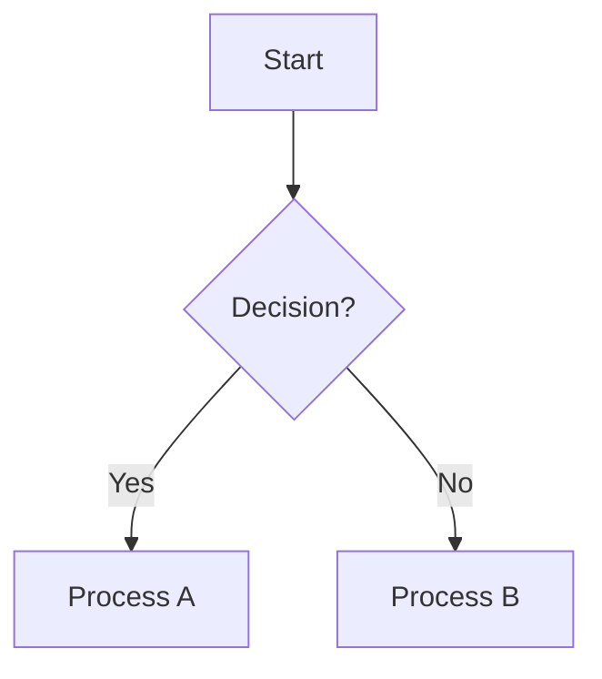
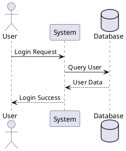

# Building Bidirectional Diagramming Systems: A Comprehensive Research Report

**A bidirectional revolution is underway.** Modern diagramming systems now enable seamless movement between natural language, visual diagrams, and code—with tools like Terrastruct D2 achieving true bidirectional editing, Mermaid.js reaching 84,000 GitHub stars through markdown integration, and AI-powered generators like Eraser.io creating diagrams 10-20x faster. This convergence of text-based diagram languages, interactive editors, and AI assistance makes it possible to build systems where users start from any entry point and iteratively develop ideas across representations.

The technology is production-ready. Companies report 30% productivity increases, GitHub and GitLab natively render Mermaid diagrams, and React Flow powers thousands of node-based applications. The question isn't whether to build these systems—it's how to architect them effectively using proven patterns, established libraries, and battle-tested approaches.

This report synthesizes research across diagramming languages, Python and JavaScript ecosystems, bidirectional tools, technical architectures, UX patterns, datasets, and accessibility considerations. **For each area, you'll find specific tool recommendations, links to documentation, comparison tables, and practical implementation guidance.**

## Diagramming languages dominate the text-to-visual landscape

Eight major diagram-as-code languages define the current ecosystem, each optimized for different use cases. **Mermaid** leads in adoption with 84,100 GitHub stars and native GitHub/GitLab support, offering 15+ diagram types through markdown-like syntax. Its commercial backing ($7.5M funding in 2024) signals long-term viability, while its simplicity enables non-technical users to create flowcharts, sequence diagrams, and ER diagrams in minutes.

**PlantUML** remains the enterprise standard for comprehensive UML with 12,300 stars and support for 25+ diagram types including use cases, deployment diagrams, and even JSON/YAML visualization. Its Java-based architecture and Graphviz dependency create deployment friction but enable fine-grained control and extensive customization through preprocessing, skinning, and sprite libraries for AWS, Azure, and GCP icons. PlantUML excels when strict UML compliance matters or complex systems require detailed modeling.

**D2 (Terrastruct)** represents the modern aesthetic approach with 22,500 stars and multiple layout engines including ELK (open source) and TALA (commercial). Written in Go, D2 delivers fast CLI performance without dependencies, supports PowerPoint export for presentations, and offers sketch mode for hand-drawn styling. Its declarative syntax balances simplicity and power, though its youth (launched 2022) means a smaller plugin ecosystem than established alternatives.

**Graphviz/DOT** serves as the foundation—a 30-year-old C library that underpins PlantUML, Structurizr, and countless other tools. Its multiple layout algorithms (dot, neato, fdp, sfdp, twopi, circo) provide sophisticated graph visualization but require understanding graph theory concepts. Graphviz works best when you need maximum control or serve as a rendering backend for higher-level tools.

**Structurizr DSL** targets software architecture specifically through the C4 Model (Context, Container, Component, Code). Its model-based approach generates multiple abstraction levels from a single source, enforcing DRY principles while supporting Architecture Decision Records (ADRs) and documentation embedding. ThoughtWorks includes it on their Technology Radar's "Adopt" list, signaling enterprise readiness.

**Specialized languages** address niche needs: **Pikchr** (500+ stars) provides a lightweight single-file C implementation used by SQLite for syntax diagrams; **Nomnoml** (2,800 stars) offers "sassy UML" for quick sketches; **DBML** enables database schema design with SQL generation; **WaveDrom** (3,300 stars) dominates digital circuit timing diagrams; **Bytefield** visualizes packet structures and binary formats.

### Comparison: When to use each language

| Language | Syntax Complexity | Diagram Types | GitHub Native | Best For | Active Maintenance |
|----------|-------------------|---------------|---------------|----------|-------------------|
| **Mermaid** | ⭐ Simple | 15+ types | ✅ Yes | Documentation, general-purpose | Very Active (2025) |
| **PlantUML** | ⭐⭐⭐ Complex | 25+ types | ❌ No | Enterprise UML, comprehensive | Very Active (2025) |
| **D2** | ⭐⭐ Moderate | 8+ types | ❌ No | Modern architecture, presentations | Very Active (2024) |
| **Graphviz** | ⭐⭐⭐ Moderate | Graph-focused | ❌ No | Foundation, maximum control | Active (2024) |
| **Structurizr** | ⭐⭐ Moderate | C4 Model | ❌ No | Software architecture (C4) | Active (2025) |

**Choose Mermaid** for GitHub documentation, quick iteration, and maximum community support. **Choose PlantUML** when comprehensive UML coverage or enterprise features matter more than simplicity. **Choose D2** when aesthetics justify learning a newer tool and PowerPoint export adds value. **Choose Structurizr DSL** when practicing the C4 Model or needing multiple architecture views from a single source.

### Syntax examples reveal philosophical differences

Mermaid prioritizes readability with markdown-inspired syntax that reads almost like natural language:



PlantUML offers comprehensive control through explicit directives:



D2 embraces declarative simplicity with nested structures:

```d2
network: {
  cell tower: {
    satellites: {shape: stored_data}
    transmitter
    satellites -> transmitter: send
  }
}
user: {shape: person}
user -> network.cell tower: make call
```

Official resources: [Mermaid](https://mermaid.js.org), [PlantUML](https://plantuml.com), [D2](https://d2lang.com), [Graphviz](https://graphviz.org), [Structurizr](https://structurizr.com)

## Python libraries enable programmatic diagram generation

The Python ecosystem offers 30+ libraries across parsing, generation, rendering, and manipulation. **NetworkX** (15,000 stars) dominates graph analysis as the industry standard with 500+ algorithms and multiple acceleration backends. Version 3.6 (November 2025) supports Python 3.11-3.13, making it the foundation for any graph-based diagramming system. [NetworkX on PyPI](https://pypi.org/project/networkx/)

**diagrams** (39,000 stars) leads cloud architecture visualization through Python code, automatically laying out AWS, Azure, GCP, and Kubernetes components using Graphviz. Apache Airflow uses it for documentation architecture, demonstrating production readiness:

```python
from diagrams import Diagram
from diagrams.aws.compute import EC2
from diagrams.aws.network import ELB

with Diagram("Web Service", show=False):
    ELB("lb") >> EC2("web") >> EC2("db")
```

Install: `pip install diagrams` (requires Graphviz binaries). [diagrams on PyPI](https://pypi.org/project/diagrams/)

**Mermaid ecosystem** provides multiple Python interfaces: **mermaid-py** (300 stars, actively maintained) offers the most recent updates (v0.8.0, May 2025) and renders via mermaid.ink service. **python_mermaid** creates diagrams using Python objects (Node, Link, MermaidDiagram). **networkx-mermaid** bridges NetworkX graphs to Mermaid output. [mermaid-py on PyPI](https://pypi.org/project/mermaid-py/)

**PlantUML integrations** include **plantuml** (remote client, last updated 2019), **plantweb** (actively maintained with Sphinx integration and local caching), and **py2puml** (generates PlantUML class diagrams from Python code with 2024 updates). [plantweb on PyPI](https://pypi.org/project/plantweb/)

**D2 support** comes through **py-d2** (100 stars) for building .d2 files with full typing, and **d2-python-wrapper** (actively maintained 2024-2025) which bundles D2 binaries for rendering without manual installation:

```python
from d2_python import D2
d2 = D2()
d2.render("x -> y", "output.svg")
d2.render("diagram.d2", "output.pdf", format="pdf", theme="dark")
```

[d2-python-wrapper on PyPI](https://pypi.org/project/d2-python-wrapper/)

**Graphviz Python bindings** include **graphviz** (1,700 stars, pure Python interface requiring Graphviz binaries), **pydot** (3,200 stars, pure Python DOT parser using pyparsing), and **pygraphviz** (800 stars, C bindings via SWIG offering full Graphviz access). [graphviz on PyPI](https://pypi.org/project/graphviz/)

**Specialized libraries** serve specific diagram types: **schemdraw** (1,500 stars) produces high-quality circuit schematics and timing diagrams; **blockdiag/seqdiag/actdiag/nwdiag** provide simple text-to-diagram conversion for various types; **igraph** (1,300 stars) offers high-performance graph operations through C implementation.

### Production-ready Python recommendations

**For cloud architecture diagrams:** Use **diagrams** (39K stars, MIT license, active 2024-2025). Requires Graphviz installation but provides the richest icon libraries and automatic layouts.

**For Mermaid generation:** Use **mermaid-py** (most recent updates, v0.8.0 May 2025). Supports Python 3.9-3.13. [Documentation](https://mermaidpy.vercel.app/)

**For graph analysis:** Use **NetworkX** (industry standard, 20+ years development, version 3.6 November 2025). Essential for any system manipulating graph structures.

**For high performance:** Use **igraph** (C-backed, version 1.0.0 in 2025). 10-100x faster than pure Python for large graphs.

**For PlantUML:** Use **plantweb** over older alternatives. Includes caching, Sphinx integration, and active maintenance.

**For D2:** Use **d2-python-wrapper** for convenience (includes binaries) or **py-d2** for programmatic file generation.

Installation commands for core libraries:

```bash
pip install networkx          # Graph analysis foundation
pip install diagrams          # Cloud architecture (requires Graphviz)
pip install mermaid-py        # Mermaid generation
pip install igraph            # High-performance graphs
pip install graphviz          # Pure Python Graphviz interface
pip install pydot             # DOT parsing
pip install d2-python-wrapper # D2 rendering with bundled binaries
pip install schemdraw         # Circuit diagrams
```

## JavaScript libraries power interactive diagram experiences

React dominates modern diagram editors while rendering libraries serve diverse visualization needs. **Mermaid.js** (84,100 stars, 1.74M weekly npm downloads) leads text-to-diagram conversion with zero-installation web use and native GitHub/GitLab rendering. Its JavaScript-based approach eliminates server dependencies, rendering via Dagre layout to SVG with support for 15+ diagram types. [mermaid on npm](https://www.npmjs.com/package/mermaid) | [Live Editor](https://mermaid.live/)

**Cytoscape.js** (10,631 stars, 1.77M weekly downloads) provides comprehensive network analysis with graph theory algorithms built-in (BFS, DFS, Dijkstra, centrality measures). Canvas-based rendering handles thousands of nodes efficiently, making it ideal for bioinformatics, social networks, and knowledge graphs. Strong academic backing (University of Toronto) ensures ongoing development. [cytoscape on npm](https://www.npmjs.com/package/cytoscape) | [Documentation](https://js.cytoscape.org/)

**vis-network** (7,832 stars) offers physics-based layout simulation creating organic-looking force-directed graphs. Dual license (Apache 2.0 OR MIT) provides flexibility, while clustering support enables handling larger datasets (up to a few thousand nodes). Canvas rendering with HTML5 provides good performance for typical network visualizations. [vis-network on npm](https://www.npmjs.com/package/vis-network)

**D3.js** (108,000+ stars, millions of weekly downloads) remains the ultimate flexibility choice, offering complete control over every visualization aspect. Its modular architecture allows importing only needed components, reducing bundle size. The trade-off: significant development time for custom diagrams. D3 powers The New York Times, Financial Times, and Bloomberg visualizations. [d3 on npm](https://www.npmjs.com/package/d3) | [Observable Gallery](https://observablehq.com/@d3/gallery)

**JointJS** (5,133 stars, 19,543 weekly downloads) provides professional diagramming with pre-built UML, ERD, BPMN, and Petri Net shapes. MVC architecture supports clean code organization, while JSON serialization enables diagram persistence. MPL-2.0 open source version has limitations; commercial JointJS+/Rappid (~$2,000+) unlocks advanced features and support. Used by Appmixer (iPaaS platform) in production. [jointjs on npm](https://www.npmjs.com/package/jointjs) | [Demos](https://www.jointjs.com/demos)

**Layout algorithms** drive many higher-level tools: **Dagre** (5,368 stars, 910,386 weekly downloads) implements Sugiyama-style hierarchical layouts used internally by Mermaid, JointJS, and TensorBoard. **Elk.js** (2,282 stars, 932,005 weekly downloads) ports Eclipse Layout Kernel to JavaScript, providing advanced algorithms for complex layouts. Both provide coordinates only, requiring separate rendering. [dagre on npm](https://www.npmjs.com/package/dagre) | [elkjs on npm](https://www.npmjs.com/package/elkjs)

**GoJS** (commercial, $3,995+ per developer) delivers the most comprehensive feature set with 200+ samples, excellent performance (thousands of nodes), and professional documentation. Canvas-based rendering, extensive diagram types (flowcharts, BPMN, UML, SCADA, Sankey), and 25+ years development make it enterprise-ready. Used by NASA, Cisco, AWS CloudFormation, and industrial SCADA systems. License restrictions prevent use in open source projects. [GoJS Website](https://gojs.net/) | [Samples](https://gojs.net/latest/samples/)

### React Flow leads the interactive editor category

**React Flow** (25,000+ stars, @xyflow/react package) emerged as the dominant React solution for node-based UIs. TypeScript-first design, virtualization for handling thousands of nodes, and extensive customization through custom node types and edges make it production-ready. MIT license permits free personal use; Pro tier ($129/month) removes attribution watermark and provides advanced examples for commercial projects. Svelte Flow (@xyflow/svelte) extends to Svelte framework. Powers visual workflow editors, no-code platforms, and AI agent builders. [React Flow on npm](https://www.npmjs.com/package/@xyflow/react) | [Documentation](https://reactflow.dev/)

**Excalidraw** (87,000+ stars, MIT license) dominates collaborative whiteboarding with beautiful hand-drawn aesthetics. Completely free and open source with real-time collaboration built-in, extensive shape library, and excellent performance through Canvas rendering. Used by Google Cloud, Meta, CodeSandbox, Obsidian, Replit, Notion, and HackerRank. React-only limitation and specific aesthetic may not suit all use cases. [Excalidraw on npm](https://www.npmjs.com/package/@excalidraw/excalidraw) | [Demo](https://excalidraw.com/)

**tldraw** (25,000+ stars) provides polished infinite canvas SDK with AI features including "make real" (converts hand-drawn sketches to functional components). Real-time collaboration built-in, extensive JavaScript API, and smooth Canvas-based performance. Custom license requires business subscription to remove watermark for production use. [tldraw on npm](https://www.npmjs.com/package/tldraw) | [Website](https://tldraw.dev/)

**draw.io/diagrams.net** (40,000+ stars, Apache 2.0) offers full-featured standalone application with extensive shape libraries, cloud storage integration, and offline capability. Built on mxGraph (no longer actively maintained), making it complex to embed in custom applications but excellent as standalone tool. [draw.io GitHub](https://github.com/jgraph/drawio) | [App](https://app.diagrams.net/)

### JavaScript library comparison: Choose by use case

| Use Case | Primary Choice | Alternative | Reasoning |
|----------|---------------|-------------|-----------|
| Documentation diagrams | Mermaid.js | Markmap (mind maps) | Zero installation, GitHub native, 1.74M weekly downloads |
| Network visualization | Cytoscape.js | vis-network | Graph algorithms built-in, 1.77M weekly downloads, academic backing |
| React node-based UIs | React Flow | Excalidraw | 25K stars, TypeScript-first, virtualization, MIT license |
| Collaborative whiteboard | Excalidraw | tldraw | 87K stars, completely free, MIT license, used by Google/Meta |
| Enterprise applications | GoJS | JointJS+ | $3,995 but most comprehensive features, 25+ years development |
| Maximum flexibility | D3.js | N/A | 108K stars, industry standard, requires development time |

**Performance characteristics** vary by rendering technology: Canvas-based libraries (GoJS, Excalidraw, tldraw, Cytoscape.js) excel with large datasets and smooth animations. SVG-based libraries (React Flow, JointJS, D3.js) enable CSS styling and accessibility but face performance limits around 1,000+ elements. WebGL acceleration (available in some Cytoscape.js configurations) handles 10,000+ nodes.

**Bundle size considerations:** Dagre and Markmap (<100KB) suit size-sensitive applications. Medium-sized libraries (100KB-1MB) include Mermaid.js, React Flow, Cytoscape.js, JointJS, GoJS. Large bundles (1MB+) like vis-network (~15MB) require careful optimization or lazy loading.

Official package managers: [npm registry](https://www.npmjs.com/) | [npm trends comparison tool](https://npmtrends.com/)

## Interactive editing achieves true bidirectional synchronization

The holy grail of diagram-code synchronization—seamless bidirectional editing where changes in either representation update the other—now exists in production tools. **Terrastruct D2** achieves full bidirectionality through IDE mode (syntax-highlighted code) and GUI mode (drag-and-drop editing) with instant switching. Changes in visual editor automatically update D2 code syntax; text edits immediately reflect in diagram. Multi-layered support enables zooming to different abstraction levels while defining scenarios per layer (e.g., "normal operation" vs "error condition"). [D2 Website](https://terrastruct.com) | [Playground](https://play.d2lang.com)

**Eraser.io** demonstrates three-way synchronization across diagram-as-code, visual editor, and AI prompts. Users edit proprietary diagram-as-code syntax OR use visual editor OR prompt DiagramGPT—all modes stay synchronized. GitHub sync maintains version control with bidirectional updates. Fortune 100 companies report 30% productivity increases, with one company growing from 4 to 110 technical documents in 6 months. Professional plan required for API access. [Eraser.io](https://www.eraser.io) | [DiagramGPT](https://www.eraser.io/ai)

**IcePanel** takes a model-based approach for C4 architecture diagrams with real-time collaborative editing, interactive zooming through three abstraction levels (System Context → Container → Component), and tag-based perspective overlays. Flow visualization animates sequences on static diagrams. Browser-based platform enables multiplayer editing, commenting, and design branching for exploring future states. [IcePanel](https://icepanel.io)

### The IcePanel article defines leading diagram-as-code tools

IcePanel's [definitive article](https://icepanel.io/blog/2023-02-07-top-7-diagrams-as-code-tools-for-software-architecture) identifies seven critical tools:

1. **Structurizr** (Apache 2.0): C4 Model with Structurizr DSL, generates multiple views from single model, stores in source control, includes Architectural Decision Records
2. **PlantUML** (GPL 3.0): 25+ diagram types, C4 plugin, used by Apache Airflow documentation
3. **Terrastruct D2** (MPL 2.0 + paid platform): TALA automatic layout, full bidirectional editing between code and GUI, interactive tooltips, layers and scenarios
4. **Mermaid.js** (MIT): Native GitHub preview, 15+ types, powers Scratch and Code.org (tens of millions of users)
5. **Ilograph** (YAML-based): Interactive diagrams with perspective-based views, dynamic layout changes
6. **Diagrams** (Python, MIT): Cloud architectures, used by Apache Airflow and Cloudiscovery
7. **Graphviz** (CPL 1.0): Foundation for complex graph-based information, custom shapes

**Bidirectional capabilities breakdown:**
- **Full bidirectional:** Terrastruct D2 (GUI ↔ code), Altova UModel (model ↔ code), Enterprise Architect (model ↔ code), Eraser.io (visual ↔ code ↔ AI)
- **One-way multi-view:** Structurizr (model → multiple diagram views), Ilograph (YAML → perspective-based views)
- **Code-to-diagram only:** Most diagram-as-code tools (Mermaid, PlantUML, Graphviz, Diagrams)

### AI-powered natural language to diagram generation

**DiagramGPT (Eraser.io)** accepts natural language, code snippets, images, PDF/CSV files and outputs flowcharts, ER diagrams, cloud architecture, and sequence diagrams. GPT-4 based generation enables iterative refinement through AI chat OR manual code editing OR visual editor. API available on Professional plan. [DiagramGPT](https://www.eraser.io/ai)

**Lucidchart AI** integrates ChatGPT for generating diagrams from text prompts with real-time editing and Jira/Confluence/Slack/Teams integration. Workflow: ChatGPT prompt → Lucidchart diagram → manual refinement. [Lucidchart](https://lucidchart.com)

**Diagramming AI** converts natural language to Mermaid/PlantUML/Graphviz with V-Edit feature converting text-based diagrams to Excalidraw for visual editing—achieving bidirectional text ↔ visual editing. LLM-based generation includes automatic error correction. [Diagramming AI](https://diagrammingai.com)

**Common AI workflow pattern:**
1. Natural language prompt → structured diagram code
2. Iterative refinement through conversational AI
3. Multiple output formats (visual, code, PNG/SVG/PDF)
4. Integration with documentation tools
5. Limitation: LLM variability and occasional hallucination requiring human review

AI generation proves production-ready for initial drafts, accelerating diagram creation 10-20x. Human refinement remains essential for accuracy and polish.

### Reverse engineering generates diagrams from code

**Visual Paradigm** reverse engineers Java, Python, C++, C#, Visual Basic to UML class diagrams, package diagrams, and ERD. Unique capability: recognizes Python instance attributes beyond class attributes. Supports both forward (model→code) and reverse (code→model) engineering with synchronization. [Visual Paradigm](https://www.visual-paradigm.com)

**Enterprise Architect** (Sparx Systems) imports Java, C++, C#, VB.NET plus .jar/.NET PE files, generating UML class/component/deployment diagrams. "Insert Related Elements" enables incremental building. Synchronizes code and model changes regardless of edit location. Professional, Corporate, Unified, Ultimate editions available. [Enterprise Architect](https://sparxsystems.com)

**GitUML** innovates with "Literate Code Maps" combining class and sequence diagrams with numbered steps, narrative, and code fragments. Auto-updates diagrams on git push. Consulting service reports $60-120K cost savings on turnover through rapid onboarding and knowledge preservation. [GitUML](https://gituml.com)

**Altova UModel** provides full round-tripping for Java, C++, C#, Visual Basic .NET—generates code from sequence diagrams and state machines, reverse engineers to UML, synchronizes changes bidirectionally. State machine diagrams generate fully executable code. [Altova UModel](https://www.altova.com/umodel)

Python-specific tools include **Pynsource** for UML generation and **py2puml** (200+ stars, 2024 updates) generating PlantUML class diagrams from Python code with support for advanced syntax (Python 3.10+).

### Round-tripping challenges and solutions

**Common challenges:**
- Layout loss: Visual positioning not preserved in code representation
- Comment preservation: Code comments may not survive transformations
- Custom styling: Visual customizations lost on regeneration
- Merge conflicts: Concurrent edits need manual resolution
- One-way optimizations: Many tools optimize single direction

**Best practices:**
- Use version control for both representations
- Establish "source of truth" for specific attributes (e.g., layout in code, documentation in visual)
- Implement conflict resolution strategies (last-write-wins for simple properties, manual for structural changes)
- Test round-trip scenarios early in development
- Accept that perfect round-tripping may be impossible—design for graceful degradation

**Successful approaches:**
- **Terrastruct D2:** Maintains position and styling through code annotations
- **Eraser.io:** Proprietary syntax designed for bidirectional editing from inception
- **Altova UModel:** Separate model layer abstracts from both code and visual representations
- **Visual Paradigm:** Incremental consistency preserves manually added information after regeneration

## Technical architecture patterns enable robust implementations

Building bidirectional systems requires multiple intermediate representation layers. **ASTs (Abstract Syntax Trees)** serve as fundamental IR for diagram languages, representing structural/semantic content without rendering details. Diagrams naturally map to graph structures (nodes, edges, properties), enabling visual programming paradigms. Domain-specific formats like BPMN 2.0 XML, Mermaid text DSL, and D2 provide extensibility through well-defined extension mechanisms.

**Standard rendering pipeline:**
1. **Text Parsing:** Tokenization → Syntax Analysis → AST Construction
2. **Semantic Analysis:** Validation, type checking, symbol resolution
3. **Layout Calculation:** Constraint solving, auto-layout algorithms (Dagre, ELK)
4. **Rendering:** SVG/Canvas generation with styling

**Mermaid rendering pipeline** (detailed example): Detection stage identifies diagram type via detector registry → Parse stage creates DiagramDefinition with db/parser/renderer → Layout stage applies pluggable algorithms → Render stage generates SVG with error handling. Functions: `detectType()` → `Diagram.fromText()` → `render()`.

**Real-time rendering optimizations:** Incremental parsing for live updates, dirty region tracking to avoid full re-renders, debouncing text changes (typically 100-300ms), GPU acceleration via WebGL for graphs exceeding 1,000 elements.

### Metadata storage strategies balance extensibility and compatibility

**BPMN approach:** XML extension points (`extensionElements`) with namespace-based isolation maintain BPMN 2.0 compliance while adding vendor-specific data. Example: Camunda adds execution properties without breaking standard validators.

**Annotation/comment strategy:** Store metadata as code comments, JSON blocks in markdown-style comments. Challenge: preserving during AST transformations requires explicit comment attachment to AST nodes.

**Parallel storage:** Diagram source file + separate metadata JSON sidecar with same basename. Trade-off: synchronization complexity vs. clean separation of concerns. Suitable when native format lacks extensibility.

**Property bags:** Each diagram element maintains extensible properties map with schema validation. Examples: Visio custom properties, draw.io metadata. Enables arbitrary attribute storage without format changes.

### Version control patterns favor text-based formats

**Text-based diagrams** (Mermaid, PlantUML, D2, Graphviz DOT) enable line-based diffs, native merge tool support, and conflict resolution. Store as pure text (.mmd, .puml, .d2) in Git. Example workflow: Developer A edits text → commit → push; Developer B pulls → merge conflicts in text → resolve → push.

**Binary/XML diagrams** face difficult diffs and merge conflicts. Solutions: Export to text-based format for storage, use diagram-specific diff tools (EMF Compare for models), store both binary (for tool) and text export (for VCS).

**Hybrid approach:** Primary text-based DSL in Git, generated binary/image artifacts gitignored or in separate branch. Pre-commit hooks generate images, CI/CD pipelines validate diagram syntax. GitHub/GitLab render common formats natively (Mermaid, ASCII diagrams).

### Real-time collaboration architectures handle concurrent editing

**CRDTs (Conflict-Free Replicated Data Types)** automatically merge concurrent changes. **Yjs** dominates for diagram collaboration with each client maintaining local state and automatic merging. Architecture: Client A ↔ Yjs Document ↔ WebSocket Server ↔ Yjs Document ↔ Client B. Used by many production collaborative editors.

**Eclipse GLSP real-time collaboration** (case study): VS Code LiveShare for session management, GLSP Coordinator orchestrates collaboration, Collaborative GLSP Server Extension manages command stacks. Individual command stacks per participant maintain local undo/redo while shared model state synchronizes across clients. Viewport/cursor position sharing, guest edits flow through coordinator to server to broadcast.

**Operational Transformation (OT)** transforms concurrent operations for consistency (Google Docs style). Challenge: complexity increases with operation types, requiring careful design of transformation functions.

**Performance considerations:** Throttle cursor position updates (60Hz max), batch small operations, implement optimistic updates with rollback on conflict, use presence awareness showing active users with colored cursors.

## UX patterns create intuitive multi-representation editing

**Bidirectional LSP architecture** represents cutting-edge synchronization: Language Server Protocol mediates between text editor and GUI. LSP Server maintains shared state, text editor sends `textDocument/didChange` to update GUI, GUI changes trigger `workspace/applyEdit` to update text. Benefits: Works with any LSP-capable editor (VS Code, Neovim, etc.), real-time bidirectional updates, preserves user's editor preferences/plugins. Source: Novel approach from codeCAD/Zoo (kcl-language-server) exploration.

**Blockly-style synchronization** demonstrates block ↔ text patterns: Custom code generators translate blocks to text, AST parser converts text back to blocks. Challenge: preserving comments requires attaching them to AST nodes via metadata. Solution demonstrated in IS-EUD 2025 paper on BDD scenario synchronization.

**Conflict resolution strategies:**
- **Last-Write-Wins:** Simple, works for non-overlapping edits, risk of losing work
- **Operation Transformation:** Transform concurrent operations for consistency, requires careful design
- **Lock-Based:** Explicit locks on elements, reduces concurrent flexibility
- **Merge Strategies:** Automatic for simple properties, semi-automatic for text (standard diff/merge), manual for structural changes

**Entry point conflict patterns:**
- Text edit → Visual change: Parse → validate → update visual
- Visual edit → Text change: Serialize → format → update text
- Conflict: Queue operations, resolve via merge strategy
- Best practice: Show "out of sync" indicator when conflicts occur

### Progressive complexity reduces cognitive load

**Accordion/collapsible sections:** Basic properties shown by default, "Advanced" section expands on demand. Example: Shape properties panel with advanced styling hidden initially.

**Tabbed interfaces:** Organize by category—"Basic" vs "Advanced" tabs, "Properties" vs "Code" vs "Preview" tabs. Reduces visual clutter while maintaining access.

**Contextual disclosure:** Show relevant options based on user action. Example: Selecting connector reveals connection-specific properties. Nielsen Norman Group research: Improves 3 of 5 usability components (learnability, efficiency, error rate).

**Wizard/stepped flows:** Multi-step diagram creation (Choose type → Basic properties → Advanced customization). Example: Miro's template selection → customization flow.

**Progressive enhancement:** Start with basic diagram, add detail incrementally (simple shapes → styling → annotations). Example: Box diagram converts to detailed architecture.

### Accessibility ensures inclusive diagram experiences

**Alternative text requirements:** Simple diagrams need concise alt text describing structure. Complex diagrams require two-part approach—short description (diagram type and key insight) plus long description (detailed textual representation) linked via `aria-describedby`. Example: "Bar chart showing Q1 2024 visitors" + data table.

**Color and contrast:** Don't rely solely on color. Add patterns (stripes, dots) to distinguish elements, use line styles (solid, dashed) for different connections. Minimum contrast ratios: 4.5:1 for text, 3:1 for graphics (WCAG 2.0).

**Keyboard navigation:** Tab order matches logical flow, arrow keys for spatial navigation, Enter/Space for activation/selection, Escape to close modals/cancel operations. Screen readers require semantic HTML structure, ARIA labels for interactive elements, announced state changes.

**Flowchart accessibility:** Provide both visual and text versions. Text version as ordered list or heading structure, alt text summarizes relationships. Consider text version in appendix for complex charts (Harvard guidance). Microsoft Visio includes Accessibility Checker, Narrator support, high-contrast mode, navigation order customization.

## Data repositories enable training and benchmarking

**AI2D Dataset** (4,907 diagrams) from Allen Institute provides grade-school science diagrams with dense annotations including object segmentations, diagrammatic elements, text elements, and semantic relations. Available on AWS Open Data Registry with high-quality expert annotations. Forms basis for AI2D-RST corpus (1,000 diagrams with Rhetorical Structure Theory enhanced annotations). [AI2D on Allen Institute](https://allenai.org/data/diagrams) | [AI2D-RST on GitHub](https://github.com/thiippal/AI2D-RST) | [Hugging Face: lmms-lab/ai2d](https://huggingface.co/datasets/lmms-lab/ai2d)

**FlowLearn Dataset** (13,858 flowcharts) combines 3,858 scientific flowcharts from ArXiv papers with 10,000 simulated diagrams. Includes Mermaid code, VQA pairs, OCR annotations via PaddleOCR, visual component annotations (node locations, arrows). Evaluated with GPT-4V, Claude, Gemini, LLaVA showing benchmark capabilities. [FlowLearn on arXiv](https://arxiv.org/html/2407.05183v1) | [Hugging Face: jopan/FlowLearn](https://huggingface.co/datasets/jopan/FlowLearn)

**CASIA-OHFC** (2,957 handwritten flowcharts) from 600 templates and 205 writers provides InkML standard format with stroke-level annotations (x,y coordinates, time, pressure, pen state), semantic class labels (31 symbol classes), instance IDs. Train/Validation/Test splits: 143/20/42 writers. Free for academic research, commercial license available. [CASIA-OHFC Database](https://nlpr.ia.ac.cn/databases/CASIA-OHFC/)

**GitHub example repositories:**

**terrastruct/awesome-diagrams** (90+ curated diagrams) provides high-quality software architecture diagrams on mature and frontier technologies—Redis, LLMs, RAG, Kubernetes, Docker, AWS, serverless, databases. Sourced from company blogs, technologists, and technology platforms with descriptions. [GitHub: terrastruct/awesome-diagrams](https://github.com/terrastruct/awesome-diagrams)

**joelparkerhenderson/plantuml-examples** offers extensive PlantUML examples for UML, ERD, wireframes, mind maps, JSON, YAML, WBS, ASCII art, Gantt, C4 models. .puml files with rendered images, coding hints, styling tips. High quality with explanations. [GitHub: plantuml-examples](https://github.com/joelparkerhenderson/plantuml-examples)

**Mermaid examples:** Official repository (80K+ stars) includes comprehensive examples. Community repositories like rudolfolah/mermaid-diagram-examples and ChristopherA's gist provide additional patterns. [GitHub: mermaid-js/mermaid](https://github.com/mermaid-js/mermaid) | [Christopher gist](https://gist.github.com/ChristopherA/bffddfdf7b1502215e44cec9fb766dfd)

**rickkk856/ArchitectureDesign-DataSources** catalogs 40+ datasets including architectural styles (10K+ images, 25 styles), building facades (506 images), floor plans (CubiCasa5k: 5,000 images, 80 categories), interior design (4,147 images), 3D models, Japanese property data (83M images). [GitHub: ArchitectureDesign-DataSources](https://github.com/rickkk856/ArchitectureDesign-DataSources)

**Hugging Face diagram datasets:** rakitha/mermaid-flowchart-transformer (336 downloads), MananSuri27/flowchartseg (1K-10K images), MananSuri27/Flowchart2Mermaid (image-to-Mermaid pairs), Slapping/FlowCharts (MIT licensed), ajibawa-2023/Software-Architecture (~450,000 lines in JSONL). [Search Hugging Face](https://huggingface.co/datasets?search=diagram)

**Kaggle/Roboflow flowchart datasets:** Flowchart 3b (handwritten shapes/connectors), Roboflow flowchart (774 open source images with YOLO annotations), ML Architecture Diagrams dataset. [Kaggle Datasets](https://www.kaggle.com/datasets?search=flowchart)

### Dataset recommendations by use case

**For AI training on flowcharts:** FlowLearn (13,858 flowcharts with Mermaid code and VQA pairs) provides largest annotated collection with code-diagram pairs.

**For educational diagram understanding:** AI2D (4,907 science diagrams) with expert annotations and semantic relations.

**For handwriting recognition:** CASIA-OHFC (2,957 handwritten flowcharts) with stroke-level InkML annotations.

**For learning and templates:** terrastruct/awesome-diagrams (90+ curated examples), joelparkerhenderson/plantuml-examples (comprehensive PlantUML), official Mermaid examples (80K+ stars).

**For benchmarking:** FlowLearn (includes LVLM evaluation results), AI2D-RST (expert-annotated with clear metrics), CASIA-OHFC (established train/val/test splits).

**Licensing summary:** AI2D-RST (CC-BY-4.0), CASIA-OHFC (free academic/paid commercial), FlowLearn (Hugging Face), most GitHub awesome lists (MIT or similar). Always verify license terms for commercial use and cite original sources.

## Business and non-technical users require simplified approaches

**BPMN (Business Process Model and Notation)** bridges business and technical users as OMG industry standard. Version 2.0 widely adopted with XML-based storage (good for version control) and interoperability between tools. **bpmn.io ecosystem** (open source) provides bpmn-js (BPMN 2.0 viewer/modeler), dmn-js (Decision Model and Notation), form-js (form builder). Modular, embeddable, extensible via plugins. Used by Camunda and various BPMN tools. [bpmn.io](https://bpmn.io) | [GitHub: bpmn-js](https://github.com/bpmn-io/bpmn-js)

**Camunda Modeler** (desktop BPMN editor) supports BPMN, DMN, Forms with free open source licensing and Camunda BPM platform integration. [Camunda Modeler](https://camunda.com/download/modeler/)

**Open-BPMN** (Eclipse GLSP-based) provides VS Code extension and web integration with open-source free licensing. [Open-BPMN GitHub](https://github.com/imixs/open-bpmn)

**Commercial BPMN tools:** Microsoft Visio (BPMN templates), Lucidchart (BPMN support), draw.io/diagrams.net (BPMN library). BPMN extension mechanisms via custom XML attributes maintain standard compliance while enabling vendor-specific enhancements.

### Flowcharts, mind maps, and org charts serve business needs

**Flowcharts** visualize processes, decisions, workflows for business analysts, process managers, operations teams. Tools: Miro, Visio, Lucidchart, Canva, Figma. Requirements: Simple intuitive shapes (rectangles, diamonds, ovals), clear connector routing, swimlanes for role-based processes, PDF/image export for reports.

**Mind maps** enable brainstorming, idea organization, planning. Tools: MindManager, Miro, Whimsical. Features: Radial/tree layout, easy node addition/reorganization, visual hierarchy (colors, sizes), export for presentations.

**Org charts** visualize organizational structure for HR, management, onboarding. Tools: Visio, Lucidchart, Miro. Considerations: Auto-layout for large organizations, drill-down for nested teams, photo/contact information integration, privacy/access controls.

**Process diagrams** (workflow diagrams, swimlane diagrams, value stream maps) map manufacturing, logistics, customer journeys. Requirements: Role/department separation (swimlanes), time/sequence indicators, decision points and branches.

### Collaboration patterns for mixed technical/non-technical teams

**View/edit permission levels:** Viewer (see diagrams, add comments), Editor (modify content), Admin (manage access/settings). Allows different engagement levels.

**Presentation modes:** Full-screen view for stakeholders, hide technical details for business reviews, focus mode (spotlight specific areas). Example: Miro's presentation mode.

**Commenting and feedback:** Contextual comments on elements, threaded discussions, resolved/unresolved state, email notifications for updates.

**Approval workflows:** Draft → Review → Approved states, version comparison views, change notifications. Example: Business analysts draft, architects approve.

**Terminology bridges:** Glossary/legend for technical terms, mouse-over explanations, separate "business view" and "technical view". Example: BPMN process (business) vs technical implementation.

### Natural language interfaces reduce learning curves

**Low-code/no-code approaches:** Drag-and-drop interfaces, pre-built components/templates, visual configuration (no coding), smart defaults with customization. Examples: Miro templates, Lucidchart wizards.

**AI-powered generation:** "Create a process flowchart for customer onboarding" → diagram. Tools: Mermaid Chart with AI, Miro AI Canvas, Eraser DiagramGPT. Reduces learning curve significantly.

**Guided experiences:** Wizard-based creation, contextual suggestions, inline help and tooltips, video tutorials embedded in UI. Example: Lucidchart's tutorial mode.

**Simplified notation:** Limit shape types for clarity, use recognizable icons/metaphors, consistent visual language, labels over symbols when possible.

## Key findings shape implementation strategy

**Three forces transform the landscape:** AI integration (natural language to diagram generation production-ready, 10-20x faster initial drafts), bidirectional synchronization (Terrastruct D2 and Eraser.io demonstrate seamless visual ↔ code), real-time collaboration (Google Docs-like multiplayer now table stakes with cursor tracking, auto-save, conflict resolution as baseline).

**The convergence:** Hybrid systems combine AI for rapid generation, visual editing for intuitive refinement, code representation for version control, real-time collaboration for distributed teams, multi-view rendering for different audiences. **Winners** offer multiple input methods (AI, visual, code), bidirectional synchronization, developer workflow integration (GitHub, CI/CD), real-time collaboration, progressive disclosure for complexity management.

**Tool selection guide:**

For **code-first teams:** Structurizr (C4 focus), PlantUML (flexibility), Mermaid (GitHub integration). Add Eraser.io for AI-assisted initial generation.

For **visual-first teams:** Lucidchart (enterprise), IcePanel (architecture), Miro (workshops). Add Eraser.io or draw.io for collaboration.

For **bidirectional needs:** Terrastruct D2 (diagrams), Altova UModel (code-model). Alternative: Eraser.io (with AI boost).

For **reverse engineering:** Visual Paradigm, Enterprise Architect (enterprise). GitUML (onboarding focus), Pynsource (Python-specific).

For **Python development:** NetworkX (graph analysis foundation), diagrams (cloud architecture, 39K stars), mermaid-py (Mermaid generation), igraph (high performance).

For **JavaScript/React:** React Flow (node-based UIs, 25K stars), Excalidraw (collaborative whiteboarding, 87K stars, MIT), Mermaid.js (documentation, 84K stars), Cytoscape.js (network analysis, 1.77M weekly downloads).

For **enterprise budgets:** GoJS ($3,995 per developer, most comprehensive), JointJS+ (~$2,000+, professional features).

**Architecture recommendations:**
- Use AST as primary IR for parsing/validation
- Separate graph model for layout algorithms
- Render-specific format (SVG/Canvas) as final stage
- Store metadata in extension mechanism of chosen format
- Text-based DSL whenever possible (PlantUML/Mermaid/D2 for Git-friendly)
- Implement diagram validation in CI/CD
- Use Yjs (CRDT) for most collaboration cases—proven, scalable
- Individual undo stacks per user (major UX win)

**UX pattern recommendations:**
- LSP-based bidirectional editing represents cutting edge
- Provide both visual and code views with real-time sync
- Use conflict indicators when representations diverge
- Support "edit in preferred environment" philosophy
- Start with basic shapes/templates, reveal advanced features contextually
- Use accordion/tab patterns for property panels
- Mandatory alt text for all diagrams, data table alternatives for complex diagrams
- Keyboard navigation with logical tab order, high contrast mode support

**Implementation strategy:**

**Phase 1 (Quick Wins):** Start with AI generation (Eraser AI, ChatGPT + Lucidchart) for rapid prototyping. Export to version control (Git) for tracking. Establish collaboration norms using real-time tools.

**Phase 2 (Process Integration):** Adopt diagram-as-code for critical architecture docs (Structurizr, D2, Mermaid). Integrate with development workflow (GitHub, CI/CD, documentation sites). Implement progressive disclosure for complex systems.

**Phase 3 (Advanced Capabilities):** Explore bidirectional tools (Terrastruct D2, Eraser.io) for maintained docs. Apply reverse engineering to legacy systems. Scale with automation (API-driven diagram generation).

Organizations can now generate diagrams 10-20x faster with AI, maintain diagrams in version control like code, collaborate in real-time across distributed teams, automatically update docs from code changes, and scale technical documentation systematically. The technology is ready—the opportunity is organizational adoption.