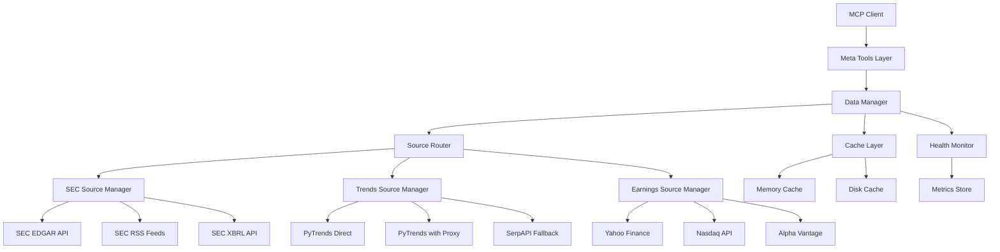

# Design Document

## Overview

Ce document décrit l'architecture et la conception détaillée pour améliorer la fiabilité et la disponibilité des sources de données financières dans IsoFinancial-MCP. La solution implémente un système de fallback multi-sources, une gestion intelligente du cache, et des stratégies de retry adaptatives pour garantir une disponibilité maximale des données malgré les limitations des APIs externes.

## Architecture

### Architecture Globale



### Composants Principaux

1. **Data Manager**: Orchestrateur central qui coordonne les appels aux sources
2. **Source Router**: Sélectionne la meilleure source basée sur le health status
3. **Cache Layer**: Gestion du cache à deux niveaux (mémoire + disque)
4. **Health Monitor**: Surveillance de la santé des sources et métriques
5. **Source Managers**: Gestionnaires spécialisés pour chaque type de données

## Components and Interfaces

### 1. Data Manager

**Responsabilité**: Coordonner les requêtes de données avec fallback automatique

```python
class DataManager:
    """
    Gestionnaire central pour toutes les sources de données avec fallback.
    """
    
    async def fetch_with_fallback(
        self,
        ticker: str,
        data_type: str,
        sources: List[DataSource],
        **kwargs
    ) -> DataResult:
        """
        Tente de récupérer les données depuis plusieurs sources avec fallback.
        
        Args:
            ticker: Symbole du ticker
            data_type: Type de données (sec_filings, trends, earnings)
            sources: Liste ordonnée de sources à essayer
            **kwargs: Paramètres spécifiques à la source
            
        Returns:
            DataResult avec données, métadonnées, et statut
        """
        pass
```

**Interface DataResult**:
```python
@dataclass
class DataResult:
    data: Any
    source_used: str
    is_cached: bool
    cache_age_seconds: Optional[int]
    is_stale: bool
    attempted_sources: List[str]
    errors: List[ErrorInfo]
    timestamp: datetime
    partial_data: bool
```

### 2. Source Router

**Responsabilité**: Sélectionner et ordonner les sources basées sur leur santé

```python
class SourceRouter:
    """
    Route les requêtes vers les sources les plus fiables.
    """
    
    def get_ordered_sources(
        self,
        data_type: str,
        health_monitor: HealthMonitor
    ) -> List[DataSource]:
        """
        Retourne les sources ordonnées par priorité basée sur la santé.
        
        Priorité:
        1. Sources avec success_rate > 70%
        2. Sources avec latency < 2s
        3. Sources avec dernière réussite < 1h
        """
        pass
```

### 3. Cache Layer

**Responsabilité**: Gestion du cache à deux niveaux avec fallback sur données expirées

```python
class CacheLayer:
    """
    Système de cache à deux niveaux (mémoire + disque).
    """
    
    def __init__(self):
        self.memory_cache = TTLCache(maxsize=1000, ttl=3600)  # 1h
        self.disk_cache = DiskCache(ttl=604800)  # 7 jours
        
    async def get(
        self,
        key: str,
        allow_stale: bool = False
    ) -> Optional[CachedData]:
        """
        Récupère depuis le cache avec support des données expirées.
        
        Args:
            key: Clé de cache
            allow_stale: Si True, retourne les données expirées si disponibles
            
        Returns:
            CachedData ou None
        """
        pass
        
    async def set(
        self,
        key: str,
        data: Any,
        ttl_memory: int = 3600,
        ttl_disk: int = 604800
    ):
        """
        Stocke dans les deux niveaux de cache.
        """
        pass
```

**Interface CachedData**:
```python
@dataclass
class CachedData:
    data: Any
    cached_at: datetime
    expires_at: datetime
    is_stale: bool
    source: str
```

### 4. Health Monitor

**Responsabilité**: Surveiller la santé des sources et collecter les métriques

```python
class HealthMonitor:
    """
    Monitore la santé de chaque source de données.
    """
    
    def record_request(
        self,
        source: str,
        success: bool,
        latency_ms: int,
        error_type: Optional[str] = None
    ):
        """
        Enregistre le résultat d'une requête.
        """
        pass
        
    def get_health_status(self, source: str) -> HealthStatus:
        """
        Retourne le statut de santé d'une source.
        
        Returns:
            HealthStatus avec success_rate, avg_latency, status
        """
        pass
        
    def get_all_health_status(self) -> Dict[str, HealthStatus]:
        """
        Retourne le statut de toutes les sources.
        """
        pass
```

**Interface HealthStatus**:
```python
@dataclass
class HealthStatus:
    source: str
    success_rate: float  # 0.0 to 1.0
    avg_latency_ms: int
    total_requests: int
    recent_errors: List[str]
    last_success: Optional[datetime]
    status: str  # "healthy", "degraded", "unhealthy"
```

### 5. Source Managers

#### SEC Source Manager

```python
class SECSourceManager:
    """
    Gère les multiples sources SEC avec fallback.
    """
    
    def __init__(self):
        self.sources = [
            SECEdgarAPI(),
            SECRSSFeed(),
            SECXBRLApi()
        ]
        
    async def fetch_filings(
        self,
        ticker: str,
        form_types: List[str],
        lookback_days: int
    ) -> DataResult:
        """
        Récupère les filings avec fallback automatique.
        
        Stratégie:
        1. Essayer EDGAR API
        2. Si échec ou 0 résultats, essayer RSS Feed
        3. Si toujours 0 résultats, étendre lookback_days à 90
        4. En dernier recours, retourner cache expiré
        """
        pass
```

#### Trends Source Manager

```python
class TrendsSourceManager:
    """
    Gère Google Trends avec retry intelligent et fallback.
    """
    
    def __init__(self):
        self.sources = [
            PyTrendsDirect(),
            PyTrendsWithProxy(),
            SerpAPIFallback()
        ]
        self.rate_limiter = AdaptiveRateLimiter(
            initial_delay=5.0,
            max_delay=30.0
        )
        
    async def fetch_trends(
        self,
        term: str,
        window_days: int
    ) -> DataResult:
        """
        Récupère les trends avec gestion des 429.
        
        Stratégie:
        1. Appliquer rate limiting adaptatif
        2. Si 429, backoff exponentiel (10s, 20s, 40s)
        3. Après 3 échecs, basculer sur proxy
        4. Si proxy échoue, utiliser SerpAPI
        5. En dernier recours, retourner cache expiré
        """
        pass
```

#### Earnings Source Manager

```python
class EarningsSourceManager:
    """
    Gère les multiples sources d'earnings avec fusion.
    """
    
    def __init__(self):
        self.sources = [
            YahooFinanceEarnings(),
            NasdaqEarnings(),
            AlphaVantageEarnings()
        ]
        
    async def fetch_earnings(
        self,
        ticker: str
    ) -> DataResult:
        """
        Récupère les earnings avec fusion de sources.
        
        Stratégie:
        1. Essayer Yahoo Finance
        2. En parallèle, essayer Nasdaq
        3. Fusionner les résultats (déduplication par date)
        4. Si aucune donnée, essayer Alpha Vantage
        5. Si toujours vide, estimer la prochaine date
        6. Valider qu'au moins une date future existe
        """
        pass
        
    def estimate_next_earnings(
        self,
        ticker: str,
        historical_data: List[Dict]
    ) -> Optional[Dict]:
        """
        Estime la prochaine date d'earnings basée sur les patterns.
        
        Logique:
        - Earnings typiquement 45 jours après fin de quarter
        - Quarters: Q1 (Mars 31), Q2 (Juin 30), Q3 (Sept 30), Q4 (Déc 31)
        """
        pass
```

## Data Models

### Configuration Model

```python
@dataclass
class SourceConfig:
    """Configuration pour une source de données."""
    name: str
    enabled: bool
    priority: int  # 1 = highest
    timeout_seconds: int
    max_retries: int
    retry_delay_seconds: float
    rate_limit_per_second: float
    requires_api_key: bool
    api_key_env_var: Optional[str]
```

### Retry Strategy Model

```python
@dataclass
class RetryStrategy:
    """Stratégie de retry pour une source."""
    max_attempts: int
    initial_delay: float
    max_delay: float
    exponential_base: float  # 2.0 pour doubler à chaque fois
    jitter_range: Tuple[float, float]  # (min, max) en secondes
    
    def get_next_delay(self, attempt: int) -> float:
        """Calcule le délai pour la prochaine tentative."""
        base_delay = min(
            self.initial_delay * (self.exponential_base ** attempt),
            self.max_delay
        )
        jitter = random.uniform(*self.jitter_range)
        return base_delay + jitter
```

### Error Model

```python
@dataclass
class ErrorInfo:
    """Information sur une erreur."""
    source: str
    error_type: str  # "rate_limit", "timeout", "not_found", "api_error"
    error_message: str
    is_temporary: bool
    suggested_action: str
    timestamp: datetime
```

## Error Handling

### Classification des Erreurs

1. **Erreurs Temporaires** (retry recommandé):
   - 429 Rate Limit
   - 503 Service Unavailable
   - Timeout
   - Network errors

2. **Erreurs Permanentes** (pas de retry):
   - 401 Unauthorized
   - 404 Not Found (ticker invalide)
   - 400 Bad Request (paramètres invalides)

### Stratégie de Gestion

```python
class ErrorHandler:
    """
    Gère les erreurs avec classification et actions appropriées.
    """
    
    def classify_error(self, error: Exception) -> ErrorInfo:
        """
        Classifie une erreur et détermine l'action appropriée.
        """
        if isinstance(error, aiohttp.ClientResponseError):
            if error.status == 429:
                return ErrorInfo(
                    error_type="rate_limit",
                    is_temporary=True,
                    suggested_action="Retry with exponential backoff"
                )
            elif error.status == 404:
                return ErrorInfo(
                    error_type="not_found",
                    is_temporary=False,
                    suggested_action="Verify ticker symbol"
                )
        # ... autres classifications
```

## Testing Strategy

### Tests Unitaires

1. **Cache Layer Tests**
   - Test du cache mémoire avec TTL
   - Test du cache disque avec persistance
   - Test du fallback sur données expirées
   - Test de la synchronisation entre les deux niveaux

2. **Source Manager Tests**
   - Test du fallback entre sources
   - Test du retry avec backoff
   - Test de la fusion de données (earnings)
   - Test de l'estimation d'earnings

3. **Health Monitor Tests**
   - Test du calcul du success rate
   - Test de la détection de sources unhealthy
   - Test des métriques de latence

### Tests d'Intégration

1. **End-to-End Flow Tests**
   - Test du flow complet avec toutes les sources qui échouent
   - Test du flow avec cache expiré
   - Test du flow avec données partielles

2. **Rate Limiting Tests**
   - Test de la gestion des 429 avec retry
   - Test du rate limiter adaptatif
   - Test du mode "slow" automatique

3. **Multi-Source Tests**
   - Test de la fusion de données de plusieurs sources
   - Test de la priorisation des sources basée sur la santé
   - Test du fallback en cascade

### Tests de Performance

1. **Cache Performance**
   - Mesurer le hit rate du cache
   - Mesurer la latence mémoire vs disque
   - Tester avec 1000+ tickers

2. **Parallel Requests**
   - Tester 10 requêtes parallèles
   - Vérifier que le rate limiting fonctionne
   - Mesurer le throughput

## Configuration

### Fichier de Configuration

```yaml
# config/datasources.yaml

sec:
  sources:
    - name: edgar_api
      enabled: true
      priority: 1
      timeout: 10
      max_retries: 2
      
    - name: rss_feed
      enabled: true
      priority: 2
      timeout: 5
      max_retries: 1
      
  lookback_extension:
    enabled: true
    initial_days: 30
    extended_days: 90

trends:
  sources:
    - name: pytrends_direct
      enabled: true
      priority: 1
      rate_limit: 0.2  # 1 req / 5 sec
      timeout: 15
      
    - name: pytrends_proxy
      enabled: true
      priority: 2
      requires_proxy: true
      
  retry_strategy:
    max_attempts: 3
    initial_delay: 10
    max_delay: 60
    exponential_base: 2.0
    
  adaptive_rate_limit:
    enabled: true
    error_threshold: 0.5  # 50% d'erreurs
    slow_mode_delay: 10

earnings:
  sources:
    - name: yahoo_finance
      enabled: true
      priority: 1
      
    - name: nasdaq_api
      enabled: true
      priority: 2
      
    - name: alpha_vantage
      enabled: true
      priority: 3
      requires_api_key: true
      api_key_env: ALPHA_VANTAGE_KEY
      
  merge_strategy: deduplicate_by_date
  estimate_fallback: true
  require_future_date: true

cache:
  memory:
    max_size: 1000
    ttl_seconds: 3600
    
  disk:
    enabled: true
    path: ~/.iso_financial_mcp/cache
    ttl_seconds: 604800
    max_size_mb: 500
    
  stale_fallback: true

health_monitor:
  enabled: true
  window_size: 100  # dernières 100 requêtes
  unhealthy_threshold: 0.3  # 30% d'échecs
  metrics_retention_days: 7
  log_path: ~/.iso_financial_mcp/health_metrics.jsonl
```

## Migration Strategy

### Phase 1: Infrastructure (Semaine 1)
- Implémenter Cache Layer
- Implémenter Health Monitor
- Implémenter Data Manager de base

### Phase 2: SEC Source (Semaine 2)
- Ajouter sources alternatives SEC
- Implémenter fallback et extension de lookback
- Tests et validation

### Phase 3: Trends Source (Semaine 2-3)
- Implémenter retry avec backoff
- Ajouter rate limiter adaptatif
- Ajouter sources alternatives (proxy, SerpAPI)

### Phase 4: Earnings Source (Semaine 3)
- Ajouter sources alternatives
- Implémenter fusion de données
- Implémenter estimation d'earnings

### Phase 5: Integration (Semaine 4)
- Intégrer avec meta_tools
- Tests end-to-end
- Documentation et monitoring

## Performance Considerations

### Optimisations

1. **Parallel Fetching**: Requêtes parallèles aux sources alternatives
2. **Cache Preloading**: Précharger les tickers populaires
3. **Connection Pooling**: Réutiliser les connexions HTTP
4. **Lazy Loading**: Charger les sources alternatives seulement si nécessaire

### Métriques à Surveiller

- Cache hit rate (objectif: >80%)
- Average latency par source (objectif: <2s)
- Success rate par source (objectif: >90%)
- Rate limit errors (objectif: <5%)

## Security Considerations

1. **API Keys**: Stocker dans variables d'environnement
2. **Rate Limiting**: Respecter les limites des APIs
3. **Data Validation**: Valider toutes les données externes
4. **Error Messages**: Ne pas exposer d'informations sensibles
5. **Cache Security**: Permissions appropriées sur le cache disque
