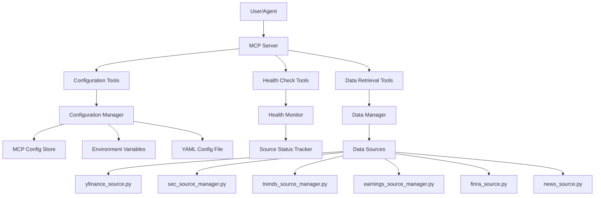

# Design Document

## Overview

Ce document décrit l'architecture et la conception détaillée pour transformer IsoFinancial-MCP en un package Python production-ready. La solution se concentre sur le refactoring du code existant, l'ajout d'outils MCP de configuration et diagnostic, et l'amélioration de la documentation. L'objectif est de créer un package professionnel, facile à utiliser et à maintenir.

## Architecture

### Architecture Globale



### Composants Principaux

1. **Configuration Manager**: Gère la configuration multi-source avec priorités
2. **MCP Configuration Tools**: Outils MCP pour configurer le serveur
3. **MCP Health Tools**: Outils MCP pour diagnostiquer les sources
4. **Refactored Data Sources**: Structure de code propre et cohérente
5. **Documentation Structure**: Documentation organisée et séparée du code

## Components and Interfaces

### 1. Configuration Manager

**Responsabilité**: Gérer la configuration avec support multi-source et priorités

```python
class ConfigurationManager:
    """
    Gestionnaire de configuration avec support multi-source.
    
    Ordre de priorité:
    1. MCP tools (runtime configuration)
    2. Environment variables
    3. YAML file (~/.iso_financial_mcp/config/datasources.yaml)
    4. Default values
    """
    
    def __init__(self):
        self.mcp_config = {}  # Runtime config from MCP tools
        self.env_config = self._load_env_config()
        self.yaml_config = self._load_yaml_config()
        self.default_config = self._load_default_config()
        
    def get(self, key: str, default: Any = None) -> Any:
        """
        Récupère une valeur de configuration avec priorités.
        
        Args:
            key: Clé de configuration (ex: "alpha_vantage.api_key")
            default: Valeur par défaut si non trouvée
            
        Returns:
            Valeur de configuration
        """
        # Check MCP config first (highest priority)
        if key in self.mcp_config:
            return self.mcp_config[key]
            
        # Check environment variables
        env_key = key.upper().replace('.', '_')
        if env_key in os.environ:
            return os.environ[env_key]
            
        # Check YAML config
        if key in self.yaml_config:
            return self.yaml_config[key]
            
        # Check defaults
        if key in self.default_config:
            return self.default_config[key]
            
        return default
        
    def set_mcp_config(self, key: str, value: Any):
        """
        Définit une configuration via MCP tools (priorité maximale).
        Persiste dans le fichier YAML pour la prochaine session.
        """
        self.mcp_config[key] = value
        self._persist_to_yaml(key, value)
        
    def get_all_config(self, mask_secrets: bool = True) -> Dict[str, Any]:
        """
        Retourne toute la configuration fusionnée.
        
        Args:
            mask_secrets: Si True, masque les clés API (affiche seulement les 4 derniers caractères)
        """
        pass
```

### 2. MCP Configuration Tools

**Responsabilité**: Exposer des outils MCP pour configurer le serveur

```python
@server.tool
async def configure_api_key(provider: str, api_key: str) -> str:
    """
    Configure une clé API pour un provider spécifique.
    
    :param provider: Provider name (alpha_vantage, serpapi)
    :param api_key: API key to configure
    :return: Confirmation message with validation status
    
    Example:
        configure_api_key("alpha_vantage", "YOUR_KEY_HERE")
    """
    # Validate provider
    valid_providers = ["alpha_vantage", "serpapi"]
    if provider not in valid_providers:
        return f"❌ Invalid provider. Valid providers: {', '.join(valid_providers)}"
    
    # Store in configuration manager
    config_manager.set_mcp_config(f"{provider}.api_key", api_key)
    
    # Validate the key by testing it
    is_valid = await _validate_api_key(provider, api_key)
    
    if is_valid:
        return f"✅ API key for {provider} configured and validated successfully"
    else:
        return f"⚠️ API key for {provider} configured but validation failed. Please check the key."

@server.tool
async def get_configuration() -> str:
    """
    Get current configuration (API keys are masked).
    
    :return: Current configuration as formatted string
    
    Example:
        get_configuration()
    """
    config = config_manager.get_all_config(mask_secrets=True)
    
    output = ["📋 Current Configuration:", ""]
    
    # API Keys section
    output.append("🔑 API Keys:")
    for provider in ["alpha_vantage", "serpapi"]:
        key = config.get(f"{provider}.api_key")
        if key:
            masked = f"...{key[-4:]}" if len(key) > 4 else "****"
            output.append(f"  • {provider}: {masked} ✓")
        else:
            output.append(f"  • {provider}: Not configured")
    
    output.append("")
    
    # Cache configuration
    output.append("💾 Cache:")
    output.append(f"  • Memory TTL: {config.get('cache.memory.ttl_seconds')}s")
    output.append(f"  • Disk TTL: {config.get('cache.disk.ttl_seconds')}s")
    output.append(f"  • Max size: {config.get('cache.disk.max_size_mb')}MB")
    
    return "\n".join(output)

@server.tool
async def list_data_sources() -> str:
    """
    List all available data sources with their status.
    
    :return: List of data sources with status (enabled/disabled, requires_key)
    
    Example:
        list_data_sources()
    """
    sources = [
        {
            "name": "Yahoo Finance",
            "enabled": True,
            "requires_key": False,
            "description": "Market data, financials, options"
        },
        {
            "name": "SEC EDGAR",
            "enabled": True,
            "requires_key": False,
            "description": "SEC filings (8-K, 10-Q, 10-K, etc.)"
        },
        {
            "name": "FINRA",
            "enabled": True,
            "requires_key": False,
            "description": "Short volume data"
        },
        {
            "name": "Google Trends",
            "enabled": True,
            "requires_key": False,
            "description": "Search volume trends"
        },
        {
            "name": "Alpha Vantage",
            "enabled": config_manager.get("alpha_vantage.api_key") is not None,
            "requires_key": True,
            "description": "Additional earnings data"
        },
        {
            "name": "SerpAPI",
            "enabled": config_manager.get("serpapi.api_key") is not None,
            "requires_key": True,
            "description": "Google Trends fallback"
        }
    ]
    
    output = ["📊 Available Data Sources:", ""]
    
    for source in sources:
        status = "✅" if source["enabled"] else "⚠️"
        key_req = " (requires API key)" if source["requires_key"] else ""
        output.append(f"{status} {source['name']}{key_req}")
        output.append(f"   {source['description']}")
        output.append("")
    
    return "\n".join(output)
```

### 3. MCP Health Check Tools

**Responsabilité**: Exposer des outils MCP pour diagnostiquer les sources

```python
@server.tool
async def get_health_status() -> str:
    """
    Get health status of all data sources.
    
    :return: Health status report for all sources
    
    Example:
        get_health_status()
    """
    health_monitor = HealthMonitor()
    all_status = health_monitor.get_all_health_status()
    
    output = ["🏥 Data Sources Health Status:", ""]
    
    for source_name, status in all_status.items():
        # Status emoji
        if status.status == "healthy":
            emoji = "✅"
        elif status.status == "degraded":
            emoji = "⚠️"
        else:
            emoji = "❌"
        
        output.append(f"{emoji} {source_name}")
        output.append(f"   Status: {status.status}")
        output.append(f"   Success Rate: {status.success_rate * 100:.1f}%")
        output.append(f"   Avg Latency: {status.avg_latency_ms}ms")
        output.append(f"   Total Requests: {status.total_requests}")
        
        if status.last_success:
            output.append(f"   Last Success: {status.last_success.strftime('%Y-%m-%d %H:%M:%S')}")
        
        if status.recent_errors:
            output.append(f"   Recent Errors: {', '.join(status.recent_errors[:3])}")
        
        output.append("")
    
    return "\n".join(output)

@server.tool
async def test_data_source(source_name: str, ticker: str = "AAPL") -> str:
    """
    Test a specific data source with a sample request.
    
    :param source_name: Name of the source to test (sec, trends, earnings, etc.)
    :param ticker: Ticker symbol to test with (default: AAPL)
    :return: Test result with timing and error details
    
    Example:
        test_data_source("sec", "AAPL")
    """
    import time
    
    output = [f"🧪 Testing {source_name} with ticker {ticker}...", ""]
    
    start_time = time.time()
    
    try:
        # Route to appropriate source
        if source_name == "sec":
            result = await get_sec_filings(ticker, "8-K", 30)
        elif source_name == "trends":
            result = await get_google_trends(ticker, 30)
        elif source_name == "earnings":
            result = await get_earnings_calendar(ticker)
        elif source_name == "finra":
            result = await get_finra_short_volume(ticker)
        elif source_name == "news":
            result = await get_news_headlines(ticker, 5, 3)
        else:
            return f"❌ Unknown source: {source_name}"
        
        elapsed = time.time() - start_time
        
        output.append(f"✅ Test successful!")
        output.append(f"⏱️  Response time: {elapsed:.2f}s")
        output.append(f"📊 Data preview:")
        output.append(result[:500] + "..." if len(result) > 500 else result)
        
    except Exception as e:
        elapsed = time.time() - start_time
        output.append(f"❌ Test failed!")
        output.append(f"⏱️  Time to failure: {elapsed:.2f}s")
        output.append(f"🔴 Error: {str(e)}")
    
    return "\n".join(output)
```

### 4. Refactored Data Sources Structure

**Responsabilité**: Structure de code propre et cohérente

#### Pattern de Nommage

```
datasources/
├── __init__.py
├── validation.py                    # Validation utilities
├── yfinance_source.py              # Simple source (no manager needed)
├── finra_source.py                 # Simple source
├── news_source.py                  # Simple source
├── sec_source_manager.py           # Manager with multiple sources
├── sec_rss_source.py               # SEC RSS fallback
├── sec_xbrl_source.py              # SEC XBRL fallback
├── trends_source_manager.py        # Manager with multiple sources
├── earnings_source_manager.py      # Manager with multiple sources
└── [REMOVED] earnings_sources.py   # ❌ Duplicate - to be removed
└── [REMOVED] trends_sources.py     # ❌ Duplicate - to be removed
```

#### Consolidation Strategy

**earnings_source.py vs earnings_sources.py:**
- Analyser le contenu des deux fichiers
- Identifier les fonctions uniques dans chaque fichier
- Consolider dans `earnings_source_manager.py`
- Supprimer les doublons

**trends_source.py vs trends_sources.py:**
- Analyser le contenu des deux fichiers
- Identifier les fonctions uniques dans chaque fichier
- Consolider dans `trends_source_manager.py`
- Supprimer les doublons

### 5. Documentation Structure

**Responsabilité**: Organisation propre de la documentation

#### Structure Cible

```
iso-financial-mcp/
├── README.md                        # Main documentation
├── CHANGELOG.md                     # Version history (dates corrigées)
├── LICENSE                          # MIT License
├── CONTRIBUTING.md                  # Contribution guidelines
├── docs/                            # Documentation directory
│   ├── ARCHITECTURE.md              # Architecture overview
│   ├── CONFIGURATION.md             # Configuration guide
│   ├── RELIABILITY.md               # Reliability features
│   └── API_REFERENCE.md             # API documentation
├── .kiro/
│   └── specs/                       # Feature specifications
│       ├── data-reliability-improvement/
│       └── production-ready-package/
└── iso_financial_mcp/
    └── reliability/                 # Code only, no MD files
        ├── __init__.py
        ├── cache_layer.py
        ├── health_monitor.py
        ├── data_manager.py
        ├── config_loader.py
        ├── error_handler.py
        ├── models.py
        ├── source_router.py
        ├── adaptive_rate_limiter.py
        └── default_config.yaml      # Config only
```

#### Fichiers à Déplacer

```
reliability/README.md                    → docs/RELIABILITY.md
reliability/SEC_SOURCE_IMPLEMENTATION.md → .kiro/specs/data-reliability-improvement/implementation/sec.md
reliability/TRENDS_IMPLEMENTATION.md     → .kiro/specs/data-reliability-improvement/implementation/trends.md
reliability/EARNINGS_IMPLEMENTATION.md   → .kiro/specs/data-reliability-improvement/implementation/earnings.md
reliability/ERROR_HANDLING_IMPLEMENTATION.md → .kiro/specs/data-reliability-improvement/implementation/errors.md
reliability/META_TOOLS_INTEGRATION.md    → .kiro/specs/data-reliability-improvement/implementation/meta_tools.md
```

## Data Models

### Configuration Model

```python
@dataclass
class ConfigurationState:
    """État de la configuration actuelle."""
    mcp_config: Dict[str, Any]
    env_config: Dict[str, Any]
    yaml_config: Dict[str, Any]
    default_config: Dict[str, Any]
    merged_config: Dict[str, Any]
    
@dataclass
class DataSourceInfo:
    """Information sur une source de données."""
    name: str
    enabled: bool
    requires_key: bool
    has_key_configured: bool
    description: str
    status: str  # "available", "requires_configuration", "disabled"
```

### Health Check Model

```python
@dataclass
class SourceTestResult:
    """Résultat d'un test de source."""
    source_name: str
    ticker_tested: str
    success: bool
    response_time_seconds: float
    error_message: Optional[str]
    data_preview: Optional[str]
    timestamp: datetime
```

## Error Handling

### Configuration Errors

```python
class ConfigurationError(Exception):
    """Erreur de configuration."""
    pass

class InvalidAPIKeyError(ConfigurationError):
    """Clé API invalide."""
    pass

class InvalidProviderError(ConfigurationError):
    """Provider inconnu."""
    pass
```

### Validation Strategy

```python
async def _validate_api_key(provider: str, api_key: str) -> bool:
    """
    Valide une clé API en faisant un appel de test.
    
    Args:
        provider: Nom du provider
        api_key: Clé API à valider
        
    Returns:
        True si la clé est valide, False sinon
    """
    try:
        if provider == "alpha_vantage":
            # Test avec un appel simple
            url = f"https://www.alphavantage.co/query?function=GLOBAL_QUOTE&symbol=AAPL&apikey={api_key}"
            async with aiohttp.ClientSession() as session:
                async with session.get(url) as response:
                    data = await response.json()
                    return "Global Quote" in data
                    
        elif provider == "serpapi":
            # Test avec un appel simple
            url = f"https://serpapi.com/search?q=test&api_key={api_key}"
            async with aiohttp.ClientSession() as session:
                async with session.get(url) as response:
                    return response.status == 200
                    
        return False
        
    except Exception:
        return False
```

## Testing Strategy

### Tests pour Configuration Manager

```python
def test_configuration_priority():
    """Test que les priorités de configuration sont respectées."""
    config = ConfigurationManager()
    
    # Set in different sources
    config.yaml_config["test.key"] = "yaml_value"
    os.environ["TEST_KEY"] = "env_value"
    config.set_mcp_config("test.key", "mcp_value")
    
    # MCP should win
    assert config.get("test.key") == "mcp_value"

def test_api_key_masking():
    """Test que les clés API sont masquées."""
    config = ConfigurationManager()
    config.set_mcp_config("alpha_vantage.api_key", "ABCDEFGHIJKLMNOP")
    
    all_config = config.get_all_config(mask_secrets=True)
    assert "...MNOP" in str(all_config)
    assert "ABCDEFGHIJKLMNOP" not in str(all_config)
```

### Tests pour MCP Tools

```python
@pytest.mark.asyncio
async def test_configure_api_key_valid():
    """Test configuration d'une clé API valide."""
    result = await configure_api_key("alpha_vantage", "valid_key")
    assert "✅" in result
    assert "configured and validated" in result

@pytest.mark.asyncio
async def test_configure_api_key_invalid_provider():
    """Test configuration avec provider invalide."""
    result = await configure_api_key("invalid_provider", "key")
    assert "❌" in result
    assert "Invalid provider" in result

@pytest.mark.asyncio
async def test_list_data_sources():
    """Test listage des sources."""
    result = await list_data_sources()
    assert "Yahoo Finance" in result
    assert "SEC EDGAR" in result
    assert "✅" in result or "⚠️" in result
```

### Tests pour Refactoring

```python
def test_no_duplicate_files():
    """Vérifie qu'il n'y a plus de fichiers en double."""
    datasources_dir = Path("iso_financial_mcp/datasources")
    files = [f.name for f in datasources_dir.glob("*.py")]
    
    # Ces fichiers ne doivent plus exister
    assert "earnings_sources.py" not in files
    assert "trends_sources.py" not in files
    
    # Ces fichiers doivent exister
    assert "earnings_source_manager.py" in files
    assert "trends_source_manager.py" in files

def test_no_md_in_reliability():
    """Vérifie qu'il n'y a plus de fichiers MD dans reliability/."""
    reliability_dir = Path("iso_financial_mcp/reliability")
    md_files = list(reliability_dir.glob("*.md"))
    
    assert len(md_files) == 0, f"Found MD files in reliability/: {md_files}"
```

## Import Management After Refactoring

### Problèmes Potentiels d'Imports

Après la suppression de `earnings_sources.py` et `trends_sources.py`, il faut vérifier et mettre à jour tous les imports dans:

1. **server.py** - Imports des datasources
2. **meta_tools.py** - Imports pour les snapshots
3. **reliability/data_manager.py** - Imports des source managers
4. **tests/** - Tous les fichiers de tests
5. **__init__.py** - Exports du package

### Stratégie de Migration des Imports

#### Avant Refactoring (État Actuel)

```python
# Imports potentiellement cassés après refactoring
from iso_financial_mcp.datasources.earnings_sources import get_earnings_data
from iso_financial_mcp.datasources.trends_sources import get_trends_data
```

#### Après Refactoring (État Cible)

```python
# Imports corrects après consolidation
from iso_financial_mcp.datasources.earnings_source_manager import EarningsSourceManager
from iso_financial_mcp.datasources.trends_source_manager import TrendsSourceManager
```

### Fichiers à Vérifier et Mettre à Jour

#### 1. datasources/__init__.py

**Avant:**
```python
from .earnings_source import *
from .earnings_sources import *  # ❌ Doublon à supprimer
from .trends_source import *
from .trends_sources import *    # ❌ Doublon à supprimer
```

**Après:**
```python
from .earnings_source_manager import EarningsSourceManager
from .trends_source_manager import TrendsSourceManager
from .sec_source_manager import SECSourceManager
from .yfinance_source import *
from .finra_source import *
from .news_source import *
from .validation import *
```

#### 2. server.py

Vérifier tous les imports de datasources et s'assurer qu'ils pointent vers les bons fichiers:

```python
# Imports à vérifier
from .datasources import (
    yfinance_source,
    sec_source_manager,
    trends_source_manager,  # ✓ Correct
    earnings_source_manager,  # ✓ Correct
    finra_source,
    news_source
)
```

#### 3. meta_tools.py

Vérifier les imports utilisés dans les snapshots:

```python
# Imports à vérifier
from .datasources.earnings_source_manager import EarningsSourceManager
from .datasources.trends_source_manager import TrendsSourceManager
```

#### 4. Tests

Mettre à jour tous les imports dans les tests:

```python
# tests/test_earnings.py
from iso_financial_mcp.datasources.earnings_source_manager import EarningsSourceManager

# tests/test_trends.py
from iso_financial_mcp.datasources.trends_source_manager import TrendsSourceManager
```

### Checklist de Vérification des Imports

```bash
# 1. Rechercher tous les imports des fichiers à supprimer
grep -r "from.*earnings_sources import" .
grep -r "from.*trends_sources import" .
grep -r "import.*earnings_sources" .
grep -r "import.*trends_sources" .

# 2. Vérifier les imports dans les fichiers clés
grep -n "import" iso_financial_mcp/server.py
grep -n "import" iso_financial_mcp/meta_tools.py
grep -n "import" iso_financial_mcp/datasources/__init__.py

# 3. Vérifier les imports dans les tests
grep -n "import" tests/test_*.py
```

### Plan de Migration des Imports

1. **Avant de supprimer les fichiers:**
   - Lister tous les imports des fichiers à supprimer
   - Identifier tous les fichiers qui les utilisent
   - Créer un mapping des anciens vers nouveaux imports

2. **Pendant la consolidation:**
   - Copier les fonctions nécessaires dans les managers
   - Maintenir les mêmes noms de fonctions si possible
   - Ajouter des alias si nécessaire pour compatibilité

3. **Après la consolidation:**
   - Mettre à jour tous les imports identifiés
   - Exécuter les tests pour vérifier
   - Supprimer les fichiers en double seulement après validation

4. **Validation finale:**
   - `uv run pytest` - Tous les tests doivent passer
   - `uv run python -m iso_financial_mcp` - Le serveur doit démarrer
   - `uv run mypy .` - Pas d'erreurs de type

### Backward Compatibility Strategy

Si des fonctions sont utilisées ailleurs, créer des alias temporaires:

```python
# earnings_source_manager.py
class EarningsSourceManager:
    async def fetch_earnings(self, ticker: str):
        # Implementation
        pass

# Alias pour compatibilité (si nécessaire)
get_earnings_data = EarningsSourceManager().fetch_earnings
```

## Migration Strategy

### Phase 1: Refactoring (Priorité Haute)
1. **Analyser les imports existants** - Lister tous les imports des fichiers à supprimer
2. Analyser earnings_source.py et earnings_sources.py
3. Consolider dans earnings_source_manager.py
4. Analyser trends_source.py et trends_sources.py
5. Consolider dans trends_source_manager.py
6. **Mettre à jour TOUS les imports** - server.py, meta_tools.py, tests/, __init__.py
7. **Valider avec tests** - pytest, mypy, démarrage serveur
8. Supprimer les fichiers en double seulement après validation complète

### Phase 2: Documentation (Priorité Haute)
1. Créer le répertoire docs/
2. Déplacer les fichiers MD de reliability/ vers docs/ ou .kiro/specs/
3. Créer docs/ARCHITECTURE.md
4. Créer docs/CONFIGURATION.md
5. Créer docs/RELIABILITY.md (consolidation)
6. Mettre à jour tous les liens

### Phase 3: Configuration Tools (Priorité Moyenne)
1. Implémenter ConfigurationManager
2. Ajouter les outils MCP de configuration
3. Ajouter la validation des clés API
4. Tester la persistance

### Phase 4: Health Check Tools (Priorité Moyenne)
1. Ajouter les outils MCP de health check
2. Implémenter test_data_source
3. Améliorer le formatage des résultats

### Phase 5: Welcome Message (Priorité Basse)
1. Personnaliser le message de bienvenue
2. Supprimer les références à FastMCP
3. Ajouter les informations de version

### Phase 6: CHANGELOG (Priorité Basse)
1. Extraire les dates réelles de Git
2. Corriger toutes les dates dans CHANGELOG.md
3. Vérifier l'ordre chronologique

## Performance Considerations

### Configuration Loading
- Charger la configuration une seule fois au démarrage
- Cacher les valeurs fusionnées
- Recharger seulement si modification via MCP tools

### API Key Validation
- Validation asynchrone pour ne pas bloquer
- Cache des résultats de validation (5 minutes)
- Timeout de 5 secondes maximum

### Health Checks
- Exécution asynchrone de tous les checks
- Timeout par source (10 secondes max)
- Cache des résultats (1 minute)

## Security Considerations

1. **API Keys Storage**: 
   - Jamais logger les clés complètes
   - Masquer dans les réponses MCP
   - Permissions appropriées sur les fichiers de config

2. **Validation**:
   - Valider tous les inputs des outils MCP
   - Sanitizer les noms de providers
   - Limiter la taille des clés API

3. **Error Messages**:
   - Ne pas exposer les clés dans les erreurs
   - Messages génériques pour les échecs de validation
   - Logger les détails seulement en mode DEBUG

## Documentation Requirements

### docs/CONFIGURATION.md

Doit inclure:
- Les 3 méthodes de configuration (MCP, env, YAML)
- Exemples pour chaque méthode
- Liste des clés API optionnelles avec liens d'inscription
- Ordre de priorité clairement expliqué
- Section troubleshooting

### docs/ARCHITECTURE.md

Doit inclure:
- Diagramme de l'architecture globale
- Explication des composants principaux
- Patterns de code utilisés
- Structure des répertoires
- Flow de données

### docs/RELIABILITY.md

Doit consolider:
- reliability/README.md
- Fonctionnalités de fiabilité
- Multi-source fallback
- Caching strategy
- Health monitoring
- Error handling

## Changelog Correction Strategy

### Extraction des Dates Réelles

```bash
# Extraire les dates des tags Git
git log --tags --simplify-by-decoration --pretty="format:%ai %d"

# Extraire les dates des commits importants
git log --all --grep="version\|release\|v0\." --pretty="format:%ai %s"
```

### Dates à Corriger

Basé sur l'historique Git fourni:
- v0.3.0: 2025-10-15 (commit 2913678)
- v0.2.2: 2025-09-23 (commit 1516e92)
- v0.2.1: 2025-09-17 (commit 54c0153)
- v0.2.0: 2025-08-20 (commit 95f37c6)
- v0.1.5: ~2025-08-01 (estimation)
- v0.1.0: 2025-07-30 (commit 841a30c)

Les dates dans le CHANGELOG actuel (2024-12-15, 2024-11-15, etc.) sont complètement fausses et doivent être corrigées.
