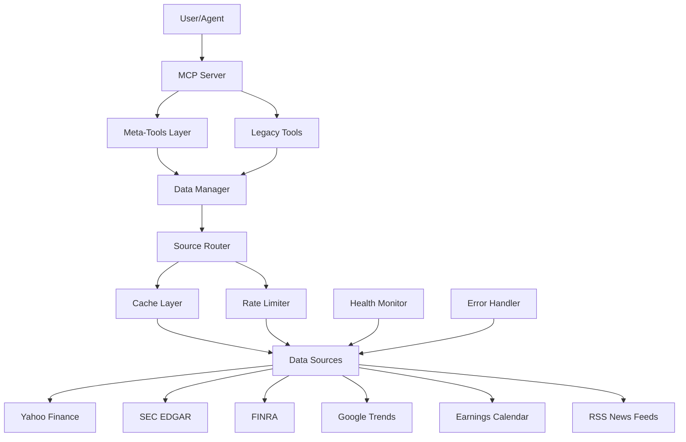
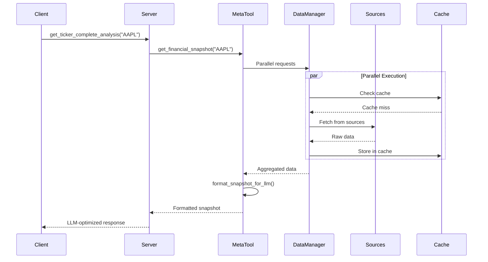
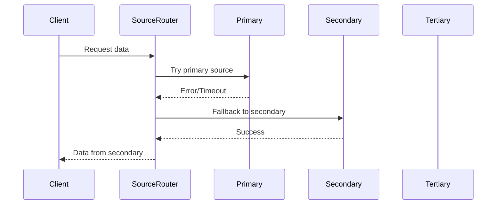

# IsoFinancial-MCP Architecture

## Overview

IsoFinancial-MCP is a Model Context Protocol (MCP) server that provides comprehensive financial market data through optimized meta-tools. The architecture is designed for high performance, reliability, and LLM-friendly data delivery.

## Architecture Diagram



## Core Components

### 1. MCP Server Layer (`server.py`)

The FastMCP server is the entry point for all client interactions. It exposes tools through the MCP protocol.

**Responsibilities:**
- Tool registration with `@server.tool` decorator
- Request routing to appropriate handlers
- Response formatting for LLM consumption
- Server lifecycle management

**Key Tools:**
- **Meta-tools**: `get_ticker_complete_analysis`, `get_multi_ticker_analysis`, `analyze_sector_companies`
- **Legacy tools**: Individual data source endpoints (maintained for backward compatibility)

### 2. Meta-Tools Layer (`meta_tools.py`)

Consolidated data retrieval functions that combine multiple data sources in parallel.

**Core Functions:**
- `get_financial_snapshot()`: Single ticker parallel data retrieval
- `get_multi_ticker_snapshot()`: Multi-ticker parallel analysis
- `format_snapshot_for_llm()`: Token-optimized formatting
- `format_multi_snapshot_for_llm()`: Multi-ticker formatting

**Key Features:**
- Parallel execution with `asyncio.gather()`
- Graceful degradation (partial failures don't break requests)
- Token optimization (70% reduction vs individual calls)
- 5-10x performance improvement over sequential calls

### 3. Data Sources Layer (`datasources/`)

Individual modules for each data provider, following consistent patterns.

**Modules:**
- `yfinance_source.py`: Market data, options, financials
- `sec_source_manager.py`: SEC filings with multi-source fallback
- `finra_source.py`: Short volume data with trend analysis
- `earnings_source_manager.py`: Earnings calendar with multi-source support
- `news_source.py`: RSS feed parsing with deduplication
- `trends_source_manager.py`: Google Trends with momentum analysis
- `validation.py`: Input validation and sanitization

**Common Patterns:**
- Async/await for all I/O operations
- Caching decorators (`@cached_request`)
- Rate limiting decorators (`@rate_limit`)
- Structured error handling
- Returns typed data structures

### 4. Reliability Layer (`reliability/`)

Infrastructure for robust data retrieval with fallback mechanisms.

**Components:**
- `data_manager.py`: Orchestrates multi-source data retrieval
- `source_router.py`: Routes requests to appropriate sources with fallback
- `cache_layer.py`: Multi-tier caching (memory + disk)
- `adaptive_rate_limiter.py`: Dynamic rate limiting per source
- `health_monitor.py`: Tracks source health and performance
- `error_handler.py`: Centralized error handling and recovery
- `config_loader.py`: Configuration management
- `models.py`: Data models for reliability components

## Data Flow

### Single Ticker Request Flow



### Multi-Source Fallback Flow



## Code Patterns

### 1. Async/Await Pattern

All I/O operations use async/await for non-blocking execution:

```python
async def get_data(ticker: str) -> Optional[Dict]:
    """Async data retrieval"""
    async with aiohttp.ClientSession() as session:
        async with session.get(url) as response:
            return await response.json()
```

### 2. Parallel Execution Pattern

Multiple data sources are queried concurrently:

```python
async def get_snapshot(ticker: str) -> Dict:
    """Parallel data retrieval"""
    tasks = [
        get_market_data(ticker),
        get_sec_filings(ticker),
        get_news(ticker),
        # ... more sources
    ]
    results = await asyncio.gather(*tasks, return_exceptions=True)
    return process_results(results)
```

### 3. Caching Pattern

Multi-tier caching with configurable TTL:

```python
@cached_request(ttl=3600)
async def get_data(ticker: str) -> Dict:
    """Cached data retrieval"""
    # Data fetching logic
    return data
```

### 4. Rate Limiting Pattern

Per-endpoint rate limiting with exponential backoff:

```python
@rate_limit('api_name', calls_per_minute=60)
async def get_data(ticker: str) -> Dict:
    """Rate-limited data retrieval"""
    # Data fetching logic
    return data
```

### 5. Error Handling Pattern

Graceful degradation with error collection:

```python
try:
    data = await fetch_data(ticker)
except Exception as e:
    logger.error(f"Error fetching data: {e}")
    errors.append(str(e))
    data = None
```

## Directory Structure

```
iso-financial-mcp/
├── iso_financial_mcp/          # Main package
│   ├── __init__.py              # Package initialization
│   ├── __main__.py              # Entry point
│   ├── server.py                # FastMCP server
│   ├── meta_tools.py            # Meta-tools implementation
│   ├── datasources/             # Data source modules
│   │   ├── __init__.py
│   │   ├── yfinance_source.py
│   │   ├── sec_source_manager.py
│   │   ├── finra_source.py
│   │   ├── earnings_source_manager.py
│   │   ├── news_source.py
│   │   ├── trends_source_manager.py
│   │   └── validation.py
│   └── reliability/             # Reliability infrastructure
│       ├── __init__.py
│       ├── data_manager.py
│       ├── source_router.py
│       ├── cache_layer.py
│       ├── adaptive_rate_limiter.py
│       ├── health_monitor.py
│       ├── error_handler.py
│       ├── config_loader.py
│       ├── models.py
│       └── default_config.yaml
├── tests/                       # Test suite
├── docs/                        # Documentation
├── .kiro/                       # Kiro IDE configuration
├── pyproject.toml               # Project metadata
└── README.md                    # Main documentation
```

## Performance Characteristics

### Caching Strategy

Multi-tier caching with source-specific TTL:

| Data Source | Memory TTL | Disk TTL | Rationale |
|-------------|-----------|----------|-----------|
| Market Data | 5 min | 15 min | High volatility |
| Options | 15 min | 1 hour | Moderate volatility |
| News | 2 hours | 6 hours | Updates periodically |
| SEC Filings | 6 hours | 24 hours | Infrequent updates |
| FINRA | 24 hours | 7 days | Daily updates |
| Earnings | 24 hours | 7 days | Quarterly updates |
| Trends | 24 hours | 7 days | Daily aggregates |

### Rate Limiting

Per-source rate limits to respect API constraints:

| Data Source | Calls/Minute | Calls/Day | Notes |
|-------------|--------------|-----------|-------|
| Yahoo Finance | 60 | Unlimited | No official limit |
| SEC EDGAR | 10 | Unlimited | 10 req/sec limit |
| FINRA | 30 | Unlimited | No official limit |
| Google Trends | 20 | 1000 | Unofficial limits |
| RSS Feeds | 30 | Unlimited | Respectful crawling |

### Parallel Execution

Meta-tools achieve 5-10x performance improvement:

- **Sequential**: 6-8 seconds for complete analysis
- **Parallel**: 1-2 seconds for complete analysis
- **Token Reduction**: 70% fewer tokens vs individual calls

## Scalability Considerations

### Horizontal Scaling

- Stateless server design allows multiple instances
- Shared cache layer (Redis) for distributed caching
- Load balancing across instances

### Vertical Scaling

- Async I/O maximizes single-instance throughput
- Connection pooling for HTTP clients
- Memory-efficient data structures

### Resource Management

- Configurable cache sizes
- Connection pool limits
- Rate limit budgets per source

## Security Considerations

### API Key Management

- No API keys required for core functionality
- Optional keys for enhanced features (Alpha Vantage, SerpAPI)
- Environment variable configuration
- Never log sensitive credentials

### Input Validation

- Ticker symbol validation (alphanumeric, length limits)
- Date range validation
- Parameter sanitization
- SQL injection prevention (not applicable - no SQL)

### Error Handling

- No sensitive data in error messages
- Generic error responses to clients
- Detailed logging for debugging (server-side only)

## Monitoring and Observability

### Health Monitoring

- Per-source health tracking
- Success rate calculation
- Latency monitoring
- Error rate tracking

### Logging

- Structured logging with context
- Log levels: DEBUG, INFO, WARNING, ERROR
- Request/response logging
- Performance metrics logging

### Metrics

- Request count per tool
- Response time percentiles
- Cache hit rates
- Error rates by source

## Extension Points

### Adding New Data Sources

1. Create new module in `datasources/`
2. Implement async fetch functions
3. Add caching and rate limiting decorators
4. Register in `data_manager.py`
5. Add health checks in `health_monitor.py`

### Adding New Meta-Tools

1. Define function in `meta_tools.py`
2. Use `asyncio.gather()` for parallel execution
3. Implement error handling and graceful degradation
4. Add formatting function for LLM output
5. Register tool in `server.py`

### Custom Caching Strategies

1. Extend `cache_layer.py`
2. Implement custom cache backend
3. Configure TTL per data type
4. Add cache invalidation logic

## Technology Stack

### Core Framework
- **FastMCP**: MCP server framework (0.2.0+)
- **Python**: 3.10+ (3.13+ recommended)
- **asyncio**: Async/await architecture

### Data Processing
- **pandas**: DataFrame operations (2.2.0+)
- **numpy**: Numerical computations (1.26.0+)

### HTTP Clients
- **httpx**: Modern async HTTP client (0.27.0+)
- **aiohttp**: Additional async HTTP support (3.9.0+)

### Data Sources
- **yfinance**: Yahoo Finance API (0.2.28+)
- **beautifulsoup4**: HTML/XML parsing
- **pytrends**: Google Trends API (4.9.0+)
- **feedparser**: RSS feed parsing (6.0.0+)

### Utilities
- **cachetools**: In-memory caching (5.3.0+)
- **asyncio-throttle**: Rate limiting (1.0.2+)
- **python-dotenv**: Environment configuration (1.0.0+)

## Design Principles

1. **Async-First**: All I/O operations use async/await
2. **Parallel Execution**: Concurrent operations with `asyncio.gather()`
3. **Graceful Degradation**: Partial failures don't break requests
4. **Token Optimization**: Compact formatting for LLM efficiency
5. **Type Safety**: Type hints throughout codebase
6. **Error Context**: Actionable error messages
7. **Backward Compatibility**: Legacy tools maintained alongside meta-tools
8. **Zero Configuration**: Works out-of-the-box with no API keys
9. **Extensibility**: Easy to add new sources and tools
10. **Observability**: Comprehensive logging and monitoring

## Future Architecture Considerations

### Planned Enhancements

1. **Configuration Management**: Multi-source config with MCP tools
2. **Health Check Tools**: MCP tools for diagnostics
3. **Custom Welcome Message**: Branded server startup
4. **Enhanced Monitoring**: Real-time health dashboard
5. **Distributed Caching**: Redis integration for multi-instance deployments

### Potential Improvements

1. **GraphQL API**: Alternative to MCP for web clients
2. **WebSocket Support**: Real-time data streaming
3. **Database Integration**: Historical data storage
4. **Machine Learning**: Predictive analytics integration
5. **Multi-Language Support**: Client libraries in other languages
