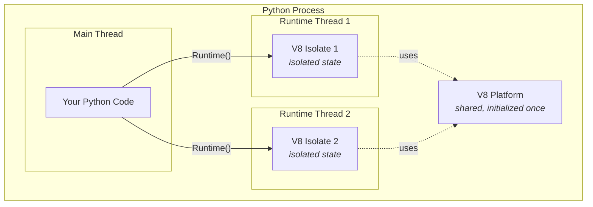

# Runtime

## What is a Runtime?

A [`Runtime`][jsrun.Runtime] is an isolated JavaScript execution environment. Think of it as a sandboxed JavaScript VM running inside your Python application.

Use a runtime when you need persistent JavaScript state, custom execution configuration, or safe parallel execution from Python.

- **Isolation** - Each runtime is completely independent
- **State persistence** - Variables and functions persist between calls
- **Parallel execution** - Multiple runtimes can run simultaneously
- **Safety** - JavaScript code runs in a controlled environment

When you create a [`Runtime`][jsrun.Runtime], `jsrun` starts a dedicated thread with its own JavaScript environment (V8 isolate). All runtimes share a single V8 platform that's initialized once per Python process.



Each runtime has its own isolated JavaScript environment and cannot access variables or functions from other runtimes. They run in parallel on separate threads.

## Creating and Using Runtime

### Basic Usage

```python
from jsrun import Runtime

# Create a runtime
runtime = Runtime()

# Run JavaScript code
result = runtime.eval("2 + 2")
print(result)  # 4

# Close when done to release resource
runtime.close()
```

!!! note
    A `Runtime` instance holds a V8 isolate in memory. If you don't call `close()`, the memory will not be released until the Python program exits.
    Using a `with Runtime()` context manager ensures cleanup happens automatically.

### Recommended Pattern: Context Manager

Use Python's `with` statement for automatic cleanup:

```python
with Runtime() as runtime:
    result = runtime.eval("Math.sqrt(16)")
    print(result)  # 4.0
# Runtime is automatically closed here
```

### Custom Configuration

You can customize runtime behavior via [`RuntimeConfig`][jsrun.RuntimeConfig]:

```python
from jsrun import Runtime, RuntimeConfig

config = RuntimeConfig(
    max_heap_size=10 * 1024 * 1024,  # Limit heap to 10MB
    bootstrap="const VERSION = '1.0.0';"  # Run code at startup
)

with Runtime(config) as runtime:
    result = runtime.eval("VERSION")
    print(result)  # 1.0.0
```

!!! warning "Heap Limit Considerations"
    - Exceeding the heap limit raises `RuntimeError` with "Heap limit exceeded"
    - Do not set the heap limit too low as it may prevent V8 from starting properly

### Memory Footprint

Each `Runtime` instance has a **~2.60 MB** memory overhead. Multiple runtimes scale efficiently (e.g., 16 concurrent isolates use ~42 MB total).

## Running JavaScript Code

### Synchronous Execution

Use `eval()` to run JavaScript and get the result:

```python
with Runtime() as runtime:
    result = runtime.eval("Math.sqrt(16)")
    print(result)  # 4.0

    # Call JavaScript functions
    greeting = runtime.eval("'Hello, ' + 'World!'")
    print(greeting)  # Hello, World!
```

### Asynchronous Execution

Use `eval_async()` to work with JavaScript async primitives:

!!! note
    [`eval_async()`][jsrun.Runtime.eval_async] is **recommended**, as it avoids blocking the Python event loop. Use `eval()` only for simple synchronous code.

```python
import asyncio

async def main():
    with Runtime() as runtime:
        # Await JavaScript promises
        result = await runtime.eval_async("Promise.resolve(42)")
        print(result)  # 42

        # Works with async/await in JavaScript
        result = await runtime.eval_async("""
            (async () => {
                await Promise.resolve();
                return 'done';
            })()
        """)
        print(result)  # done

asyncio.run(main())
```

## Stateful Execution

JavaScript state persists across evaluations within the same runtime:

```python
with Runtime() as runtime:
    # Define variables
    runtime.eval("let counter = 0")

    # Modify state
    runtime.eval("counter++")
    runtime.eval("counter++")

    # Read current value
    print(runtime.eval("counter"))  # 2
```

Common use cases include building stateful applications, caching computed values, managing session data, and running scripts incrementally.

## Runtime vs jsrun Module

[`jsrun`][jsrun] provides two ways to run JavaScript:

### Quick and Simple: `jsrun.eval()`

For simple JavaScript execution or scripting:

```python
import jsrun

# Just run JavaScript and get the result
result = jsrun.eval("Math.random()")
print(result)

# No setup or cleanup needed
```

Under the hood, `jsrun` manages the [`Runtime`][jsrun.Runtime] for you.

### Full Control: `Runtime` class

For more control and advanced features:

```python
from jsrun import Runtime, RuntimeConfig

config = RuntimeConfig(max_heap_size=50_000_000)
with Runtime(config) as runtime:
    # Your code here
    pass
```

Use this when you need custom configuration (like memory limits or timeouts), module loading, or advanced features such as snapshots and debugging.

## Thread Safety and Limitations

!!! warning "Runtime instance is not thread-safe"
    A [`Runtime`][jsrun.Runtime] instance cannot be safely passed between threads or used from multiple threads simultaneously. Each runtime is bound to the thread where it was created.

### What Won't Work

```python
import threading
from jsrun import Runtime

runtime = Runtime()

def worker():
    # This will cause issues - runtime used from different thread
    result = runtime.eval("2 + 2")
    print(result)

thread = threading.Thread(target=worker)
thread.start()
thread.join()

runtime.close()
```

Similarly, passing a runtime as a dependency in async frameworks can be problematic if the framework schedules tasks on different threads:

```python
@dataclass
class AppState:
    runtime: Runtime  # Risk: runtime may be accessed from different threads

# If your async framework uses thread pools, this can fail
```

### What Works

Create a new runtime in each thread or task:

```python
def worker():
    # Create runtime in the worker thread
    with Runtime() as runtime:
        result = runtime.eval("2 + 2")
        print(result)

thread = threading.Thread(target=worker)
thread.start()
thread.join()
```

For async applications, use context-local runtimes or create them per-request:

```python
import asyncio
from jsrun import Runtime

async def handle_request():
    # Create a new runtime for each request/task
    with Runtime() as runtime:
        result = await runtime.eval_async("Math.random()")
        return result
```

## Best Practices

- Prefer `with Runtime()` context manager to ensure memory is released.
- Create one runtime instance per session/task rather than sharing a single global runtime.
- Use [`eval_async()`][jsrun.Runtime.eval_async] to avoid blocking the Python event loop.
- For performance, avoid repeatedly reloading large scripts — load them once via [`RuntimeConfig`][jsrun.RuntimeConfig].
- Never pass [`Runtime`][jsrun.Runtime] instance across thread boundaries - create a new instance in each thread instead.

## JavaScript Environment

`jsrun` provides a **bare V8 runtime** with core JavaScript (ECMAScript) support. It does **not** include Node.js APIs or Web Platform APIs.

### What's Available

Core JavaScript features like `Math`, `Array`, `Promise`, `Date`, `JSON`, and all modern ECMAScript syntax work out of the box.

### What's Not Available

- **Node.js APIs** such as `fs`, `http`, `process`, `Buffer`, or `require()`
- **Web Platform APIs** such as `fetch`, `localStorage`, or DOM
- **`console` API** is disabled by default for security. Enable with `RuntimeConfig(enable_console=True)` if needed for debugging.

If you need these APIs, you can implement them yourself using the bindings system. See the [Bindings guide](../guides/bindings.md) for details.

## Next Steps

- Learn about [Type Conversion](types.md) between Python and JavaScript
- Explore [Evaluation](evaluation.md) to understand how to run JavaScript code
- See [Bindings](../guides/bindings.md) to expose Python functions to JavaScript
