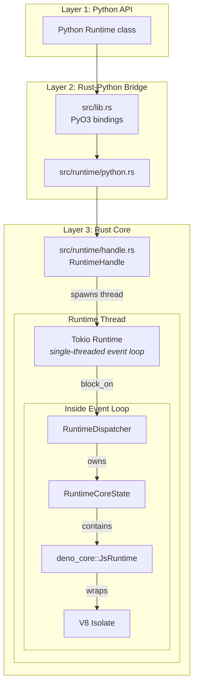
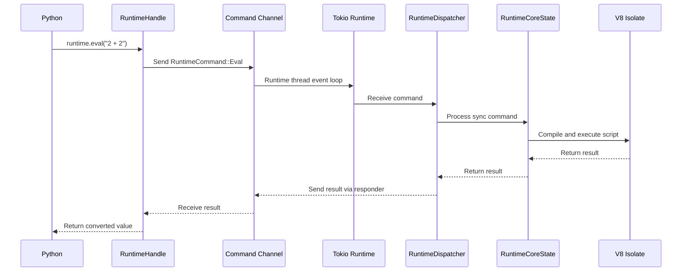
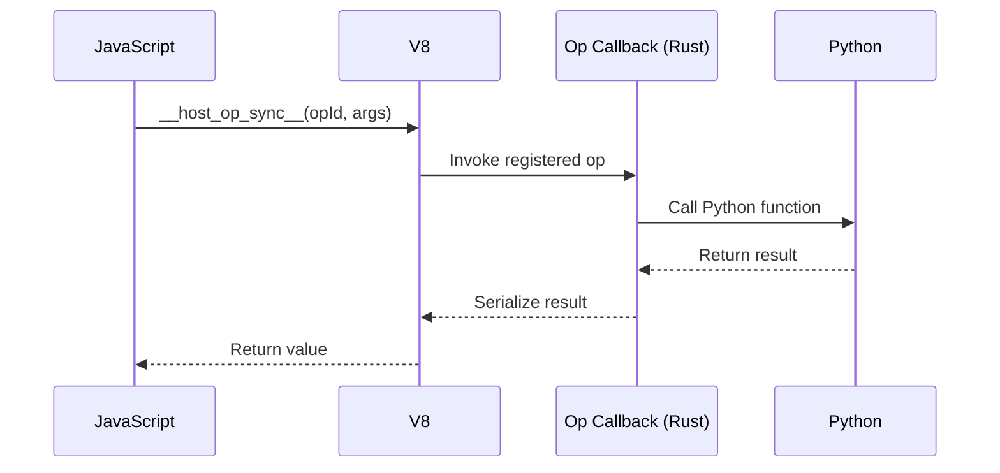
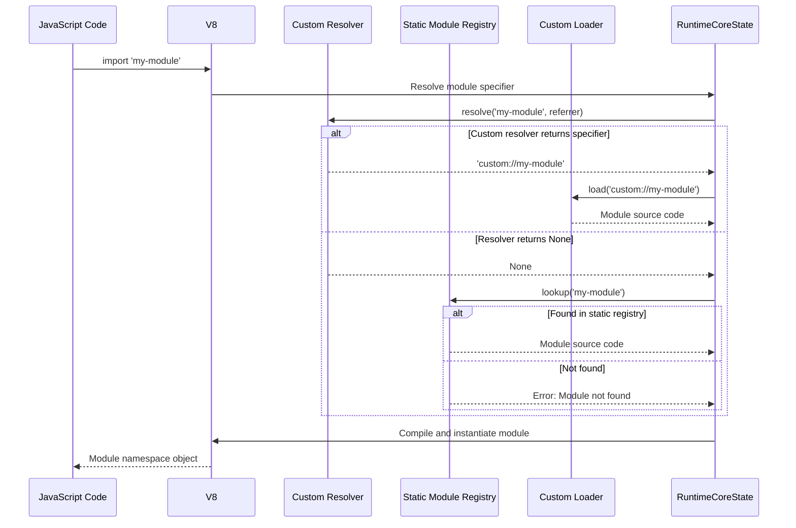

# Architecture Overview

!!! note "Advanced Technical Content"
    This section is intended for contributors, library developers, and users who need deep technical understanding of jsrun's internals. For general usage, see the [Concepts](../concepts/runtime.md) section.

## Multi-Layer Design

jsrun is built with three distinct layers that communicate via well-defined boundaries:



### Layer 1: Python API

**Location**: `python/jsrun/__init__.py`

The user-facing Python interface that provides:

- Convenience functions (`jsrun.eval()`, `jsrun.eval_async()`)
- High-level abstractions over the Rust runtime
- Pythonic API design

### Layer 2: Rust-Python Bridge

**Location**: `src/lib.rs`, `src/runtime/python.rs`

PyO3-based bindings that:

- Expose Rust types to Python (e.g., `Runtime`, `RuntimeConfig`, `JsFunction`)
- Handle Python GIL management
- Convert between Python and Rust types
- Define Python exceptions (`PyRuntimeError`)

Key classes:

- `Runtime` - Python wrapper around `RuntimeHandle`
- `JsFunction` - Python proxy for JavaScript functions
- `JsStream` - Python wrapper for JavaScript async iterators
- `JsUndefined` - Sentinel for JavaScript `undefined`

### Layer 3: Rust Core

**Location**: `src/runtime/`

The core JavaScript execution engine built on `deno_core` and V8:

- **RuntimeHandle** (`handle.rs`) - Thread-safe handle for communicating with runtime
- **RuntimeDispatcher** (`runner.rs`) - Multiplexes command processing with async job execution
- **RuntimeCoreState** (`runner.rs`) - Owns the V8 isolate and runtime state
- **RuntimeConfig** (`config.rs`) - Configuration options
- **PythonOpRegistry** (`ops.rs`) - Host function registry for Python-JavaScript bridge
- **PythonModuleLoader** (`loader.rs`) - Module resolution and loading
- **Context** (`context.rs`) - Isolated execution contexts

## Key Components

### RuntimeHandle

**Purpose**: Thread-safe communication between Python thread and runtime thread

```rust
pub struct RuntimeHandle {
    sender: mpsc::UnboundedSender<HostCommand>,
    shutdown_state: Arc<Mutex<ShutdownState>>,
    // ...
}
```

**Key characteristics**:

- Clone-safe (uses `Arc` internally)
- Sends commands via async channel (`mpsc::UnboundedSender`)
- Does NOT auto-shutdown on drop (explicit `close()` required)
- Thread-safe via `Arc<Mutex>` for shutdown state

**Lifetime**: The handle does not own the runtime thread. You can clone handles and they'll all point to the same runtime. The runtime only shuts down when `close()` is explicitly called.

### RuntimeCoreState

**Purpose**: Owns the V8 isolate and processes commands on the runtime thread

```rust
struct RuntimeCoreState {
    js_runtime: JsRuntime,
    registry: PythonOpRegistry,
    module_loader: Rc<PythonModuleLoader>,
    fn_registry: Rc<RefCell<HashMap<u32, StoredFunction>>>,
    termination: TerminationController,
    // ...
}
```

**Key characteristics**:

- Lives on the dedicated runtime thread
- NOT Send or Sync (V8 isolates are single-threaded)
- Owned by `RuntimeDispatcher` which processes `RuntimeCommand` messages from handle
- Uses `deno_core::JsRuntime` directly (not wrapped in a custom struct)
- Handles promise polling with microtask checkpoints via async jobs

**Thread model**: Each `RuntimeCoreState` runs on its own OS thread with:

- V8 isolate (single-threaded JavaScript execution)
- Tokio single-threaded runtime (for async operations)
- Command receiver loop managed by `RuntimeDispatcher`

### Command Flow

The communication between Python and JavaScript follows this pattern:



**Command types** (defined in `RuntimeCommand` enum):

- `Eval` / `EvalAsync` - Execute JavaScript code
- `BindObject` - Register Python object
- `CallFunctionSync` / `CallFunctionAsync` - Invoke JavaScript function
- `RegisterPythonOp` - Register Python function as JavaScript op
- `SetModuleResolver` / `SetModuleLoader` - Configure module system
- `AddStaticModule` - Register static module
- `GetStats` - Query runtime statistics
- `Terminate` / `Shutdown` - Close runtime

## Thread Safety Guarantees

### V8 Isolate Constraints

V8 isolates are **NOT thread-safe**:

- Cannot be moved between threads (not `Send`)
- Cannot be accessed from multiple threads (not `Sync`)
- All V8 operations must happen on the thread that created the isolate

jsrun handles this by:

1. Creating each isolate on a dedicated thread
2. Never moving the isolate
3. Using message passing for cross-thread communication

### RuntimeHandle Safety

At the Rust level, `RuntimeHandle` **IS thread-safe**:

- Uses `Arc` for shared ownership
- Commands sent via thread-safe channel
- Can be cloned and used from multiple threads
- Shutdown protected by `Arc<Mutex<ShutdownState>>`

However, the **Python `Runtime` class is NOT thread-safe**:

- Marked as `unsendable` in PyO3 (cannot be sent across threads)
- Uses `RefCell` internally (not thread-safe)
- Cannot be passed to another Python thread
- Each thread must create its own `Runtime` instance

This design choice prevents accidental misuse from Python while allowing the underlying Rust implementation to be efficient.

### GIL Release

Python's Global Interpreter Lock (GIL) is **released** during:

- JavaScript execution (`eval`, `eval_async`)
- Waiting for command responses
- Module evaluation

This enables true parallelism: Python threads can run while JavaScript executes.

## Data Flow and Type Conversion

### Python → JavaScript

1. Python object → `python_to_js_value()` → `JSValue` (Rust)
2. `JSValue` → `serde_json::to_value()` → `serde_json::Value`
3. Pass to `deno_core` → Converted to V8 value
4. V8 value available in JavaScript

### JavaScript → Python

1. V8 value → `deno_core` extraction → `serde_json::Value`
2. `serde_json::Value` → `js_value_to_python()` → Python object

### Special Cases

**Undefined**: JavaScript `undefined` uses a sentinel (`jsrun.undefined`) because Python has no native equivalent.

**Binary data**: 
- JS `Uint8Array`/`ArrayBuffer` → Python `bytes`
- Python `bytes`/`bytearray`/`memoryview` → JS `Uint8Array`

**Dates**: JS `Date` ↔ Python `datetime` (UTC normalized)

**Sets**: JS `Set` ↔ Python `set`

**BigInt**: JS `BigInt` ↔ Python `int` (arbitrary precision)

**Functions**: JS functions become `JsFunction` proxies in Python that send `CallFunction` commands when invoked.

## Ops System

The ops system allows Python functions to be called from JavaScript:



**Key features**:

- Permission-based (ops require specific permissions)
- Sync and async variants
- JSON serialization for arguments and results
- Automatic error propagation

## Performance Considerations

### Memory Management

- Each runtime has its own V8 heap (configured via `max_heap_size`)
- Serialization limits prevent OOM attacks (`max_depth`, `max_bytes`)
- Circular reference detection during conversion
- Automatic garbage collection by V8

### Promise Polling

Async evaluation (`eval_async`) polls promises by:

1. Checking if result is a promise
2. Running microtask checkpoint
3. Yielding to Tokio runtime
4. Repeating until promise settles or timeout

This can be CPU-intensive for long-running promises.

### Command Channel Overhead

Each Python API call involves:

- Serialization (Python → Rust)
- Channel send/receive
- Deserialization (Rust → V8)
- Reverse path for results

For tight loops, batch operations when possible.

## Module System Architecture

The module system handles JavaScript `import` statements through a multi-stage resolution and loading pipeline:



**Static modules**:

- Registered in `ModuleLoader` before evaluation via `add_static_module()`
- Resolved synchronously from in-memory map
- Checked after custom resolver returns `None`

**Custom loaders**:

- **Resolver**: Maps specifier → resolved specifier (e.g., `"math"` → `"file:///math.js"`)
- **Loader**: Loads module source code asynchronously (can fetch from network, database, etc.)
- Supports dynamic imports and top-level await

**Resolution order**:

1. Custom resolver (if set)
2. Static module registry (if resolver returns `None`)
3. Error if no match found


## References

- [deno_core documentation](https://docs.rs/deno_core/)
- [V8 Documentation](https://v8.dev/docs)
- [PyO3 guide](https://pyo3.rs/)
