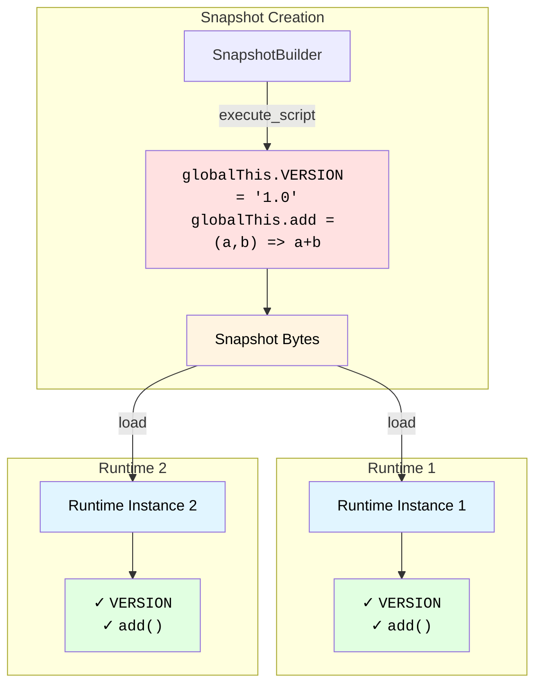

# Snapshots

Snapshots let you pre-initialize JavaScript state and reuse it across multiple runtimes. Think of them as save points: you load libraries and set up globals once, then create fresh runtimes from that state instantly.

!!! warning "Experimental Feature"
    Snapshot support is currently limited and experimental. Some advanced features may not work as expected.

## Why Use Snapshots?

Starting a runtime is fast, but loading libraries takes time. This becomes a bottleneck in cold-start scenarios where you create many short-lived runtimes:

```python
# Without snapshots - repeated overhead
for _ in range(100):
    with Runtime() as runtime:
        runtime.eval("/* Load lodash, moment, etc. */")  # Repeated work
        runtime.eval("/* Your actual code */")
```

With snapshots, you do the setup once:

```python
# With snapshots - setup once, reuse everywhere
snapshot = create_snapshot_with_libraries()

for _ in range(100):
    with Runtime(RuntimeConfig(snapshot=snapshot)) as runtime:
        runtime.eval("/* Your code - libraries already loaded! */")
```

**Benefits:**

- **Faster startup**: Skip repeated initialization
- **Consistent state**: All runtimes start with identical globals
- **Serverless-friendly**: Reduce cold-start times in lambda/functions
- **Multi-tenant**: Isolate users but share common setup



## Creating Snapshots

Use [`SnapshotBuilder`][jsrun.SnapshotBuilder] to create a snapshot:

```python
from jsrun import SnapshotBuilder

# Create a builder
builder = SnapshotBuilder()

# Execute initialization code
builder.execute_script("setup", """
    globalThis.VERSION = '1.0.0';
    globalThis.add = (a, b) => a + b;
""")

# Create the snapshot
snapshot = builder.build()
```

Now `snapshot` contains the V8 heap state with `VERSION` and `add` already defined.

## Using Snapshots

Pass the snapshot when creating runtimes:

```python
from jsrun import Runtime, RuntimeConfig

config = RuntimeConfig(snapshot=snapshot)

with Runtime(config) as runtime:
    # Globals from snapshot are already available
    result = runtime.eval("add(10, 20)")
    print(result)  # 30

    version = runtime.eval("VERSION")
    print(version)  # "1.0.0"
```

No need to re-execute the setup code. It's already baked in.

## Loading Libraries

Snapshots are perfect for pre-loading JavaScript libraries:

```python
import requests

builder = SnapshotBuilder()

# Load from local file
with open("./js_libs/utils.js") as f:
    builder.execute_script("utils", f.read())

snapshot = builder.build()

# Now every runtime has the libraries pre-loaded
with Runtime(RuntimeConfig(snapshot=snapshot)) as runtime:
    result = runtime.eval("utils.someFunction()")
    print(result)
```

### Preloading CDN Libraries

When you use `SnapshotBuilder`, the source is executed as a plain script via V8's `execute_script` API. That means it **does not** get the automatic `module` / `exports` shim that ES modules receive and any ECMAScript module syntax such as `import` / `export` will fail to parse.

!!! warning "Use CommonJS versions, not ES modules"
    Load the CommonJS version of libraries from CDN (e.g., `/index.js`), not ES module versions (e.g., `/+esm`). CommonJS code uses `module.exports` and can be wrapped in an IIFE to expose it on `globalThis`. If you fetch an ES module that contains `export` statements, it will raise `SyntaxError: Unexpected token 'export'` during snapshot creation.

```python
import requests
from jsrun import Runtime, RuntimeConfig, SnapshotBuilder

builder = SnapshotBuilder()

# Fetch CommonJS entry from unpkg (serves the raw npm file without ESM rewrites)
response = requests.get("https://unpkg.com/ms@2.1.3/index.js")

# Wrap in IIFE to expose on globalThis (CommonJS uses module.exports)
wrapped_code = f"""
(function() {{
    var module = {{ exports: {{}} }};
    {response.text}
    globalThis.ms = module.exports;
}})();
"""

builder.execute_script("ms", wrapped_code)
snapshot = builder.build()

with Runtime(RuntimeConfig(snapshot=snapshot)) as runtime:
    print(runtime.eval("ms('2 days')"))  # 172800000
```

## Snapshot Best Practices

- **Keep snapshots focused**: Don't include user-specific or request-specific data. Snapshots are shared across all runtimes
- **Optimize initialization order**: Load dependencies before code that uses them
- **Cache snapshots**: Create the snapshot once and reuse it across multiple runtime instances or function invocations
- **Serverless optimization**: In serverless environments (AWS Lambda, Google Cloud Functions), cache the snapshot globally and reuse it across invocations to minimize cold-start times

## Combining with Modules

You can use snapshots with static modules:

```python
import asyncio
from jsrun import Runtime, RuntimeConfig, SnapshotBuilder

async def main():
    # Create snapshot with core utilities
    builder = SnapshotBuilder()
    builder.execute_script("core", "globalThis.VERSION = '1.0';")
    snapshot = builder.build()

    # Add modules per runtime
    config = RuntimeConfig(snapshot=snapshot)
    with Runtime(config) as runtime:
        runtime.add_static_module("math", "export const PI = 3.14;")

        result = await runtime.eval_async("""
            (async () => {
                const { PI } = await import('math');
                return VERSION + ' - ' + PI;
            })()
        """)
        print(result)  # "1.0 - 3.14"

asyncio.run(main())
```

Snapshot provides globals, modules provide imports.

## Limitations

- **Immutable**: Once created, snapshots can't be modified. Create a new snapshot if you need changes
- **Binary format**: Snapshots are V8-specific binary data. They're not portable across V8 versions

## Next Steps

- Learn about [V8 Snapshot](https://v8.dev/blog/custom-startup-snapshots)
- Check out the [SnapshotBuilder][jsrun.SnapshotBuilder] for complete snapshot builder options
