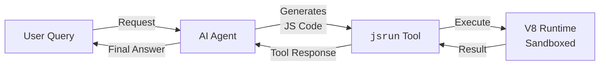

# AI Agent Sandbox

## Overview

AI agents often need to execute dynamic code generated during their reasoning process. `jsrun` provides an isolated sandbox for AI agents to run JavaScript code without compromising the host system.
When combined with agent frameworks like [Pydantic AI](https://ai.pydantic.dev/), [OpenAI Agents SDK][openai-agents-python], [LangGraph][langgraph], etc., you can build AI agents with safe code execution capabilities.

Key benefits:

- **Sandboxed execution** in isolated V8 contexts per agent interaction
- **Resource limits** for memory and CPU time to prevent runaway execution
- **Customizable runtime environment** - provide built-in JavaScript functions via bootstrap scripts and bind Python functions/objects that agents can use directly

This guide demonstrates how to build an AI agent that can safely execute JavaScript code using `jsrun` and [Pydantic AI][pydantic-ai] framework.

## Architecture



## Basic Implementation

In the following examples, we will use [Pydantic AI][pydantic-ai] to showcase the agent patterns.

### Simple Code Execution Agent

Create an AI agent with JavaScript execution capabilities:

```python title="agent.py"
import asyncio

from jsrun import JavaScriptError, Runtime, RuntimeConfig
from pydantic_ai import Agent, RunContext

# Define the agent with code execution tool
agent = Agent(
    "openai:gpt-5-mini",
    system_prompt="""You are a helpful assistant that can execute JavaScript code.
    When users ask you to perform calculations or data transformations,
    you can write and execute JavaScript code to get accurate results.
    Always explain what the code does before showing the result.""",
)


@agent.tool
async def execute_javascript(ctx: RunContext, code: str) -> str:
    """
    Execute JavaScript code in a sandboxed environment.

    Args:
        code: The JavaScript code to execute

    Returns:
        The result of the code execution as a string
    """
    # Log or audit the code being executed (for observability)
    print(f"[Executing JavaScript code] '{code}'")

    try:
        # Create a runtime with safety limits
        config = RuntimeConfig(
            max_heap_size=10 * 1024 * 1024,  # 10MB heap limit
        )

        with Runtime(config) as runtime:
            result = await runtime.eval_async(code, timeout=5.0)
            print(f"[Execution result] {result}")
            return f"Result: {result}"
    except TimeoutError:
        return "Error: Code execution timed out (exceeded 5 seconds)"
    except JavaScriptError as e:
        return f"JavaScript Error: {e}"
    except Exception as e:
        return f"Execution Error: {e}"


async def main():
    result = await agent.run("Calculate the sum of squares from 1 to 100")
    print(f"AGENT OUTPUT: {result.output}")


if __name__ == "__main__":
    asyncio.run(main())
```

Test the agent:

```bash
python agent.py
```

Example output:
```
[Executing JavaScript code] 'const n = 100;
const result = n*(n+1)*(2*n+1)/6;
result;'

[Execution result] 338350

AGENT OUTPUT: I'll compute it using the formula sum_{k=1}^n k^2 = n(n+1)(2n+1)/6. For n = 100 that gives:

100 * 101 * 201 / 6 = 338350

So the sum of squares from 1 to 100 is 338,350.
```

## Data Analysis Agent

Build an agent that can analyze data using JavaScript:

```python title="data_agent.py"
import asyncio
import json

from jsrun import Runtime
from pydantic_ai import Agent, RunContext

agent = Agent(
    "openai:gpt-5-mini",
    system_prompt="""You are a data analysis assistant.
    You can process and analyze data using JavaScript.
    Always show your analysis code and explain the results.""",
)


@agent.tool
async def analyze_data(
    ctx: RunContext,
    data: list[dict],
    code: str,
) -> str:
    """
    Analyze data using JavaScript.

    Args:
        data: Array of data objects to analyze
        code: JavaScript code that processes the data array
    """
    try:
        with Runtime() as runtime:
            # Bind the data as a JavaScript variable
            runtime.bind_object("items", {"data": data})

            # Execute analysis code
            analysis_code = f"const data = items.data; {code}"

            result = await runtime.eval_async(analysis_code, timeout=10.0)
            return f"Analysis result: {result}"
    except Exception as e:
        return f"Analysis error: {e}"


async def main():
    # Sample sales data
    sales_data = [
        {"product": "Widget", "quantity": 10, "price": 25.50},
        {"product": "Gadget", "quantity": 5, "price": 45.00},
        {"product": "Widget", "quantity": 8, "price": 25.50},
        {"product": "Gizmo", "quantity": 15, "price": 12.75},
    ]

    # Ask agent to analyze
    result = await agent.run(
        f"""Analyze this sales data and calculate:
        1. Total revenue
        2. Average order value
        3. Best selling product by quantity

        Data: {json.dumps(sales_data)}"""
    )
    print(result.output)


if __name__ == "__main__":
    asyncio.run(main())
```

## Security Best Practices

When building AI agents with code execution, always keep security in mind:

- **Set resource limits** - Use [`RuntimeConfig`][jsrun.RuntimeConfig] to limit memory ([`max_heap_size`][jsrun.RuntimeConfig.max_heap_size]) and always specify `timeout` in [`eval_async()`][jsrun.eval_async]
- **Create fresh runtimes** - Use a new [`Runtime`][jsrun.Runtime] instance for each execution or user session to ensure isolation
- **Validate code patterns** - Check generated code using LLM for dangerous patterns (infinite loops, excessive recursion) before execution
- **Monitor execution** - Log code being executed and track memory usage via [`runtime.get_stats()`][jsrun.Runtime.get_stats]

## Building on Top

Enhance your AI agent sandbox with additional features:

- **Custom JavaScript libraries**: Pre-load commonly-used libraries using [`RuntimeConfig.bootstrap`][jsrun.RuntimeConfig.bootstrap]
- **Host functions and objects**: Expose Python functions and data to JavaScript using [`runtime.bind_function()`][jsrun.Runtime.bind_function] and [`runtime.bind_object()`][jsrun.Runtime.bind_object], allowing agents to call safe host operations directly from generated code
- **TypeScript**: Use bundler like [esbuild][esbuild] to transform TypeScript to JavaScript code for evaluation

## Next Steps

- [Runtime Configuration][jsrun.RuntimeConfig] for security settings
- [Code Playground](playground.md) for interactive execution environments
- [Type Conversion](../concepts/types.md) for data exchange between Python and JavaScript

[pydantic-ai]: https://ai.pydantic.dev/
[openai-agents-python]: https://github.com/openai/openai-agents-python
[langgraph]: https://docs.langchain.com/oss/python/langgraph/overview
[esbuild]: https://esbuild.github.io/
