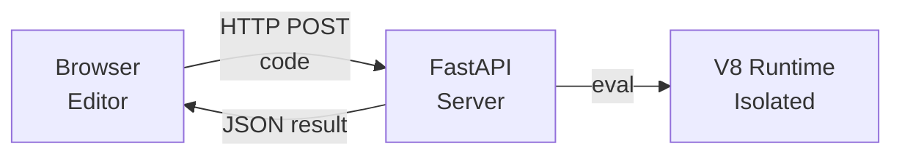

# Code Playground

## Overview

A code playground is a web application that allows users to write and execute JavaScript code in their browser with real-time results. `jsrun` provides the foundation for building such playgrounds with:

- Sandboxed execution in separate V8 isolates
- Resource limits for memory and execution time
- Async support for long-running computations
- Custom APIs for playground-specific features

This guide demonstrates how to build a code playground using `jsrun` with FastAPI.

## Architecture



## Basic Implementation

### Simple Playground Server

Start with a minimal FastAPI server that executes JavaScript code:

```python title="playground.py"
from fastapi import FastAPI
from jsrun import Runtime
from pydantic import BaseModel

app = FastAPI(title="JS Playground")


class CodeRequest(BaseModel):
    code: str
    timeout: float = 5.0


class ExecutionResponse(BaseModel):
    success: bool
    result: str | None = None
    error: str | None = None


@app.post("/execute")
async def execute_code(request: CodeRequest) -> ExecutionResponse:
    try:
        with Runtime() as runtime:
            result = await runtime.eval_async(
                request.code,
                timeout=request.timeout,
            )
            return ExecutionResponse(
                success=True,
                result=str(result),
            )
    except Exception as e:
        return ExecutionResponse(
            success=False,
            error=str(e),
        )

    return ExecutionResponse(
        success=False,
        error="Unknown error",
    )
```

Start the server and test:

```bash
uvicorn playground:app --reload

curl -X POST http://localhost:8000/execute \
  -H "Content-Type: application/json" \
  -d '{"code": "2 + 2"}'

# Response: {"success": true, "result": "4", "error": null}
```

## Building on Top

Once you have the basic playground working, here are tips for further enhancements:

- **Resource Limits**: Use [`RuntimeConfig`][jsrun.RuntimeConfig] to set [`max_heap_size`][jsrun.RuntimeConfig.max_heap_size] and cap [`timeout`][jsrun.RuntimeConfig.timeout] parameters to protect against malicious code
- **Custom APIs**: Use [`runtime.bind_function()`][jsrun.Runtime.bind_function] to expose safe Python functionality like database queries or HTTP requests
- **Error Handling**: Distinguish between [`TimeoutError`][TimeoutError], [`RuntimeError`][RuntimeError], and [`JavaScriptError`][jsrun.JavaScriptError] for better user feedback
- **Session Management**: Store [`Runtime`][jsrun.Runtime] instances keyed by session ID to maintain state across executions

## Next Steps

- Learn about [Snapshots](../guides/advanced/snapshots.md) to pre-load libraries for faster initialization
- Explore [Modules](../guides/modules.md) to allow users to import libraries
- See [Bindings](../guides/bindings.md) to expose safe Python APIs to user code

[TimeoutError]: https://docs.python.org/3/library/exceptions.html#TimeoutError
[RuntimeError]: https://docs.python.org/3/library/exceptions.html#RuntimeError
