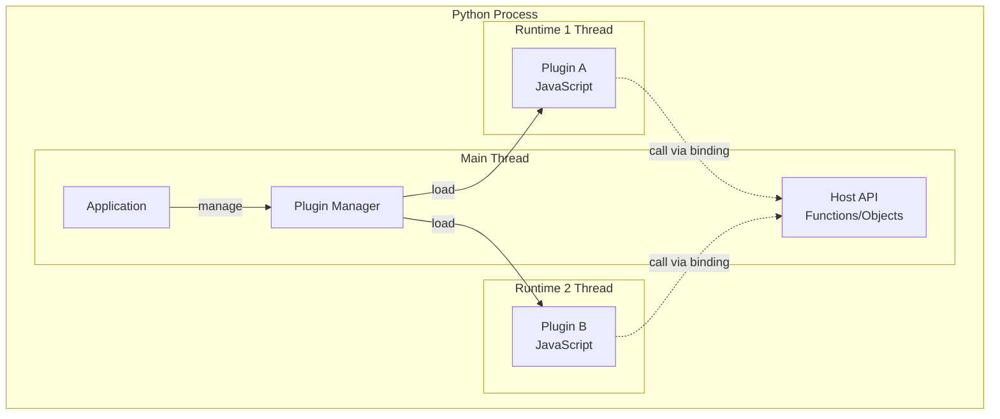

# Plugin System

## Overview

A plugin system allows users to extend application functionality with custom JavaScript code. With `jsrun`, plugins code could run in isolated V8 contexts with resource controls.

Key features:

- **Sandboxed execution** - Each plugin runs in its own isolated V8 context
- **Resource control** - Set memory and execution time limits per plugin
- **Host API exposure** - Expose Python functions/objects that plugins can use

This guide demonstrates how to build a plugin system using `jsrun`.

## Architecture



## Basic Implementation

### Simple Plugin Manager

Imagine you're building an application that needs to be extensible — users need be able to add their own features without modifying your core code. A plugin manager is the answer: it loads user-written JavaScript files, gives each plugin its own isolated sandbox, and provides a safe API for plugins to interact with your application.

Here's a minimal plugin manager that does exactly that. It reads JavaScript files from a directory, creates an isolated runtime for each plugin, exposes your chosen host functions, and lets you call plugin methods safely.

```python title="plugin_manager.py"
from pathlib import Path
from typing import Any

from jsrun import Runtime, RuntimeConfig


class PluginManager:
    """Manages plugin loading and execution."""

    def __init__(self, plugin_dir: Path):
        self.plugin_dir = plugin_dir
        self.plugins: dict[str, Runtime] = {}

    def load_plugin(self, plugin_name: str, host_api: dict) -> None:
        """Load a plugin and expose host API to it."""
        plugin_path = self.plugin_dir / f"{plugin_name}.js"
        plugin_code = plugin_path.read_text()

        # Create isolated runtime with limits
        config = RuntimeConfig(max_heap_size=50 * 1024 * 1024)
        runtime = Runtime(config)

        try:
            # Expose host API
            for name, value in host_api.items():
                if callable(value):
                    runtime.bind_function(name, value)
                else:
                    runtime.bind_object(name, value)

            # Execute plugin
            runtime.eval(plugin_code)
            self.plugins[plugin_name] = runtime

            print(f"Loaded plugin: {plugin_name}")

        except Exception as e:
            runtime.close()
            raise RuntimeError(f"Failed to load {plugin_name}: {e}")

    def call_hook(self, plugin_name: str, hook_name: str, *args) -> Any:
        """Call a plugin hook function."""
        runtime = self.plugins.get(plugin_name)
        if not runtime:
            raise ValueError(f"Plugin not loaded: {plugin_name}")

        # Call plugin hook
        return runtime.eval(f"plugin.{hook_name}(...{list(args)!r})")

    def unload(self, plugin_name: str) -> None:
        """Unload a plugin and free resources."""
        runtime = self.plugins.pop(plugin_name, None)
        if runtime:
            runtime.close()

    def close_all(self) -> None:
        """Close all plugins."""
        for runtime in self.plugins.values():
            runtime.close()
        self.plugins.clear()


# Example usage
if __name__ == "__main__":
    # Host function for plugins
    def log(message: str) -> None:
        print(f"[LOG] {message}")

    host_api = {
        "log": log,
        "config": {"version": "1.0.0"},
    }

    # Load and run plugin
    manager = PluginManager(plugin_dir=Path("./"))
    manager.load_plugin("greeter", host_api)
    result = manager.call_hook("greeter", "greet", "World")
    print(f"Result: {result}")
    result = manager.call_hook("greeter", "farewell", "John Doe")
    print(f"Result: {result}")
    manager.close_all()
```

### Example Plugin

This is an example JavaScript plugin that exposes `greet` and `farewell` interface, and uses the `log` provided by the host application.

```javascript title="plugins/greeter.js"
const plugin = {
  greet(name) {
    log(`Greeting ${name}`);
    return `Hello, ${name}! App version: ${config.version}`;
  },

  farewell(name) {
    return `Goodbye, ${name}!`;
  }
};
```

Run it:

```bash
python plugin_manager.py
```

Output:
```
Loaded plugin: greeter
[LOG] Greeting World
Result: Hello, World! App version: 1.0.0
Result: Goodbye, John Doe!
```

## Security Best Practices

When building plugin systems with user code:

- **Set resource limits** - Configure [`max_heap_size`][jsrun.RuntimeConfig.max_heap_size] and use `timeout` for plugin operations
- **Isolate plugins** - Each plugin gets its own [`Runtime`][jsrun.Runtime] instance
- **Whitelist host API** - Only expose necessary functions, never expose sensitive operations unless you trust them

## Next Steps

- [Runtime Configuration][jsrun.RuntimeConfig] for plugin isolation settings
- [Type Conversion](../concepts/types.md) for data exchange
- [Code Playground](playground.md) for plugin development
