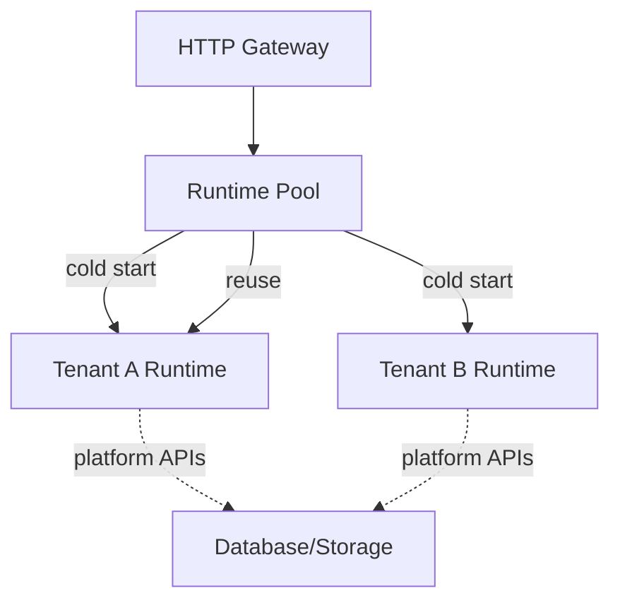

# Serverless Function Runtime

## Overview

A serverless function runtime allows users to deploy and execute JavaScript functions on-demand without managing infrastructure. `jsrun` provides the isolation and resource controls needed to run user-submitted code in a multi-tenant environment.

Key features:

- **Per-function isolation** - Each function runs in its own V8 isolate
- **Resource limits** - Memory and execution time controls per invocation
- **API bindings** - Expose platform APIs (database, storage, HTTP) to user functions

This guide demonstrates how to build a serverless function runtime using `jsrun`.

## Architecture



## Basic Implementation

### Serverless Function Runtime

Here's a minimal serverless function platform with runtime pooling and resource isolation:

```python title="serverless_runtime.py"
import asyncio
from collections.abc import Callable
from dataclasses import dataclass
from typing import Any

from jsrun import Runtime, RuntimeConfig


@dataclass
class FunctionSpec:
    """Deployed function specification."""

    name: str
    code: str  # JavaScript code
    tenant_id: str
    memory_mb: int = 5
    timeout: float = 5.0  # Seconds


class RuntimePool:
    """Pool of reusable runtimes for deployed functions."""

    def __init__(self, platform_api: dict[str, Callable]):
        self.platform_api = platform_api
        self.pool: dict[str, Runtime] = {}  # function_id -> runtime

    def get_or_create(self, func: FunctionSpec) -> Runtime:
        """Get existing runtime or create new one."""
        func_id = f"{func.tenant_id}:{func.name}"

        if func_id in self.pool:
            print(f"-> Reusing runtime for {func_id}")
            return self.pool[func_id]

        # Create new isolated runtime
        print(f">> Cold start: creating runtime for {func_id}")
        config = RuntimeConfig(max_heap_size=func.memory_mb * 1024 * 1024)
        runtime = Runtime(config)

        # Bind platform APIs
        for name, api_func in self.platform_api.items():
            runtime.bind_function(name, api_func)

        # Load function code
        runtime.eval(f"globalThis.__userFunction__ = {func.code}")

        self.pool[func_id] = runtime
        return runtime

    async def invoke(self, func: FunctionSpec, event: dict) -> Any:
        """Invoke a function with given event data."""
        runtime = self.get_or_create(func)

        # Bind event data
        runtime.bind_object("event", event)

        # Invoke function with timeout
        result = await runtime.eval_async(
            "__userFunction__(event)", timeout=func.timeout
        )

        return result

    def cleanup(self):
        """Close all runtimes."""
        for runtime in self.pool.values():
            runtime.close()
        self.pool.clear()


class ServerlessRuntime:
    """Serverless function platform."""

    def __init__(self, platform_api: dict[str, Callable]):
        self.pool = RuntimePool(platform_api)
        self.functions: dict[str, FunctionSpec] = {}

    def deploy(self, func: FunctionSpec):
        """Deploy a function."""
        func_id = f"{func.tenant_id}:{func.name}"
        self.functions[func_id] = func
        print(f"✓ Deployed {func_id}")

    async def invoke(self, tenant_id: str, function_name: str, event: dict) -> Any:
        """Invoke a deployed function."""
        func_id = f"{tenant_id}:{function_name}"
        func = self.functions.get(func_id)

        if not func:
            raise ValueError(f"Function not found: {func_id}")

        return await self.pool.invoke(func, event)

    def cleanup(self):
        """Cleanup all resources."""
        self.pool.cleanup()


# Example usage
async def main():
    # Platform APIs available to user functions
    async def fetch(url: str) -> dict:
        """Simulate HTTP fetch."""
        await asyncio.sleep(0.1)
        return {"status": 200, "data": f"Response from {url}"}

    async def db_query(query: str) -> list:
        """Simulate database query."""
        await asyncio.sleep(0.05)
        return [{"id": 1, "name": "Alice"}, {"id": 2, "name": "Bob"}]

    def log(message: str):
        """Platform logging."""
        print(f"  [LOG] {message}")

    platform_api = {"fetch": fetch, "db_query": db_query, "log": log}

    platform = ServerlessRuntime(platform_api)

    # Deploy functions for different tenants
    platform.deploy(
        FunctionSpec(
            name="process-webhook",
            tenant_id="tenant-a",
            code="""
            async (event) => {
                log('Processing webhook for tenant A');
                const resp = await fetch(event.url);
                return {
                    status: resp.status,
                    data: resp.data
                };
            }
            """,
        )
    )

    platform.deploy(
        FunctionSpec(
            name="user-lookup",
            tenant_id="tenant-b",
            code="""
            async (event) => {
                log('Looking up users for tenant B');
                const users = await db_query('SELECT * FROM users');
                return users.filter(u => u.id === event.userId);
            }
            """,
        )
    )

    print("\n--- Invoking functions ---")

    # First invocation (cold start)
    result1 = await platform.invoke(
        "tenant-a", "process-webhook", {"url": "https://api.example.com/data"}
    )
    print(f"  Result: {result1}\n")

    # Second invocation (warm start - reuses runtime)
    result2 = await platform.invoke(
        "tenant-a", "process-webhook", {"url": "https://api.example.com/other"}
    )
    print(f"  Result: {result2}\n")

    # Different tenant (isolated runtime)
    result3 = await platform.invoke("tenant-b", "user-lookup", {"userId": 1})
    print(f"  Result: {result3}")

    platform.cleanup()


if __name__ == "__main__":
    asyncio.run(main())
```

Run it:

```bash
python serverless_runtime.py
```

Output:
```
✓ Deployed tenant-a:process-webhook
✓ Deployed tenant-b:user-lookup

--- Invoking functions ---
>> Cold start: creating runtime for tenant-a:process-webhook
  [LOG] Processing webhook for tenant A
  Result: {'status': 200, 'data': 'Response from https://api.example.com/data'}

-> Reusing runtime for tenant-a:process-webhook
  [LOG] Processing webhook for tenant A
  Result: {'status': 200, 'data': 'Response from https://api.example.com/other'}

>> Cold start: creating runtime for tenant-b:user-lookup
  [LOG] Looking up users for tenant B
  Result: [{'id': 1, 'name': 'Alice'}]
```

## Optimization Strategies

- **Runtime pooling** - Keep runtimes warm between invocations, implement TTL-based eviction
- **Snapshotting** - Use [`SnapshotBuilder`][jsrun.SnapshotBuilder] to pre-initialize libraries (~50ms → ~5ms cold start)
- **Resource limits** - Configure [`max_heap_size`][jsrun.RuntimeConfig.max_heap_size] per tier, set aggressive timeouts
- **Per-tenant isolation** - Each tenant's functions run in separate V8 isolates

## Security Considerations

!!! warning "V8 Isolation Limitations"
    V8 isolates provide isolation but do not offer strong security guarantees against malicious code that could potentially utilize undiscovered V8 bugs. For production use, combine with additional hardening strategies: containerization (Docker/gVisor), separate processes, sandboxing (seccomp/AppArmor), or dedicated isolation VMs.

- **Validate function code** - Check code size, syntax, forbidden patterns before deployment
- **Rate limiting** - Limit invocations per tenant to prevent abuse
- **API allowlisting** - Only expose necessary platform APIs with input validation
- **Timeout enforcement** - Always set aggressive timeouts to prevent infinite loops
- **Memory limits** - Configure heap size limits per function

## Next Steps

- [Runtime Configuration][jsrun.RuntimeConfig] for resource limit tuning
- [Type Conversion](../concepts/types.md) for passing data between Python and JavaScript
- [Code Playground](playground.md) for an interactive function editor
