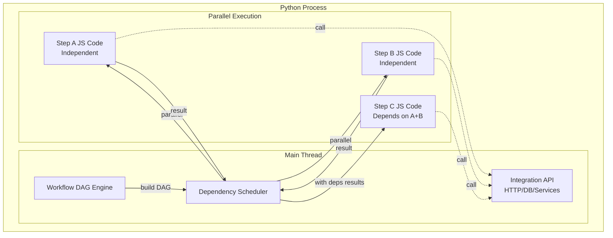

# Workflow Orchestration & Execution

## Overview

Workflow orchestration systems allow users to define and execute multi-step processes with dependencies as [Directed Acyclic Graphs (DAGs)][dag]. `jsrun` enables you to build workflow engines where users can define steps using JavaScript while your Python application orchestrates execution, handles dependencies, and provides integration with external systems.

Key features:

- **User-defined logic** - Users write JavaScript steps without deploying code
- **Safe execution** - Each workflow runs in an isolated V8 context with timeouts
- **Integration points** - Expose Python functions for external system access
- **Parallel execution** - Run independent steps concurrently for better performance

This guide demonstrates building a simple DAG-based workflow orchestration system using `jsrun`.

## Architecture



## Basic Implementation

### DAG-Based Workflow Engine

Here's a workflow engine with a decorator-based API that automatically handles dependencies and executes steps in parallel when possible:

```python title="workflow_dag.py"
import asyncio
from collections.abc import Callable
from typing import Any

from jsrun import Runtime, RuntimeConfig


class StepBuilder:
    """Example builder for defining workflow steps with dependencies."""

    def __init__(self, api: dict[str, Callable], context: dict[str, Any] | None = None):
        self.api = api
        self.context = context or {}
        self.steps = {}

    def do(self, name: str, depends: list[Callable] | None = None) -> Callable:
        """Decorator to define a step with optional dependencies."""
        depends = depends or []

        def decorator(func: Callable) -> Callable:
            code = func.__doc__

            async def execute():
                # Return cached result if already executed
                step_data = self.steps.get(func.__name__)
                if step_data and "result" in step_data:
                    return step_data["result"]

                # Resolve dependencies at execution time (not decoration time)
                dep_results = {}
                if depends:
                    dep_steps = [self.steps[d._func_name] for d in depends]
                    results = await asyncio.gather(*[d() for d in depends])
                    dep_results = {
                        d["name"]: r for d, r in zip(dep_steps, results, strict=False)
                    }

                # Execute this step
                print(f"  → {name}")
                with Runtime(RuntimeConfig(max_heap_size=50 * 1024 * 1024)) as runtime:
                    for k, v in self.api.items():
                        runtime.bind_function(k, v)  # Bind API functions

                    # Bind dependency results
                    runtime.bind_object("deps", dep_results)

                    # Bind workflow context (event, config, etc.)
                    runtime.bind_object("ctx", self.context)

                    result = await runtime.eval_async(
                        f"(async () => {{ {code} }})()", timeout=5.0
                    )

                self.steps[func.__name__]["result"] = result
                print(f"    ✓ {name}")
                return result

            # Store original function name for dependency resolution
            execute._func_name = func.__name__
            self.steps[func.__name__] = {"name": name, "execute": execute}
            return execute

        return decorator


class WorkflowDAG:
    """Base class for DAG-based workflows."""

    def __init__(self, api: dict[str, Callable]):
        self.api = api

    async def run(self, event: dict) -> Any:
        """Override this to define your workflow."""
        raise NotImplementedError


# Example usage
async def main():
    # API functions that workflows can call
    async def fetch_data(source: str) -> list[int]:
        await asyncio.sleep(0.1)
        return [1, 2, 3, 4, 5] if source == "a" else [10, 20, 30]

    api = {"fetch_data": fetch_data}

    # Define workflow
    class MyWorkflow(WorkflowDAG):
        async def run(self, event: dict) -> Any:
            # Pass event and any other context to steps via ctx
            step = StepBuilder(self.api, context={"event": event, "config": {"multiplier": 2}})

            @step.do("fetch_a")
            async def fetch_a():
                """
                // Access event data via ctx
                const source = ctx.event.source_a || 'foo';
                return await fetch_data(source);
                """

            @step.do("fetch_b")
            async def fetch_b():
                """
                const source = ctx.event.source_b || 'bar';
                return await fetch_data(source);
                """

            @step.do("combine", depends=[fetch_a, fetch_b])
            async def combine():
                """
                const a = deps.fetch_a;
                const b = deps.fetch_b;
                // Use multiplier from context
                const multiplier = ctx.config.multiplier;
                return [...a, ...b].map(x => x * multiplier);
                """

            @step.do("aggregate", depends=[combine])
            async def aggregate():
                """
                const data = deps.combine;
                return {
                    sum: data.reduce((a, b) => a + b, 0),
                    count: data.length,
                    event: ctx.event
                };
                """

            return await aggregate()

    # Run workflow with event data
    workflow = MyWorkflow(api)
    result = await workflow.run({"source_a": "a", "source_b": "b", "user_id": 123})
    print(f"Result: {result}")


if __name__ == "__main__":
    asyncio.run(main())
```

Run it:

```bash
python workflow_dag.py
```

Output:
```
→ fetch_a
→ fetch_b
  ✓ fetch_a
  ✓ fetch_b
→ combine
  ✓ combine
→ aggregate
  ✓ aggregate
Result: {'sum': 150, 'count': 8, 'event': {'source_a': 'a', 'source_b': 'b', 'user_id': 123}}
```

Note how `fetch_a` and `fetch_b` run in **parallel** (both start before either completes), while `combine` waits for both to finish.

## Example Use Cases

- **ETL pipelines** - Extract from multiple sources in parallel, transform independently, load combined results
- **Content moderation** - Run multiple AI checks concurrently, aggregate scores to make decisions
- **Order processing** - Validate, check inventory/shipping in parallel, process payment, fulfill
- **Data processing** - Fan-out to process chunks in parallel, apply user-defined transformations
- **API orchestration** - Chain API calls with dependencies, parallel branches for independent operations

## Next Steps

- [Type Conversion](../concepts/types.md) for passing complex data between Python and JavaScript
- [Runtime Configuration][jsrun.RuntimeConfig] for resource limits
- [AI Agent Sandbox](ai-agent.md) for another example of safe code execution

[dag]: https://en.wikipedia.org/wiki/Directed_acyclic_graph
