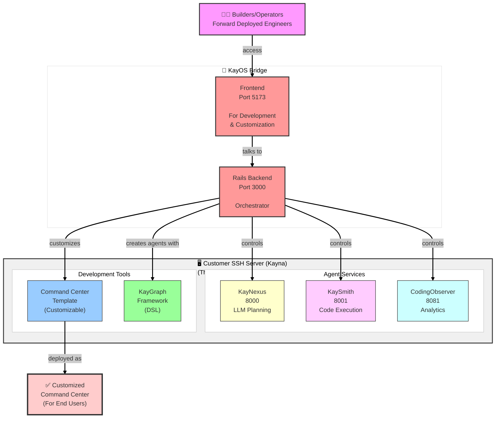

# KayOS Platform System Context

**Complete development guide for coding agents working across KayOS codebases**

> **Purpose**: Load this file when working on any KayOS component to understand the complete system architecture, how components communicate, and how to verify changes.

---

## Quick Reference

| Component | Location | Port | Purpose |
|-----------|----------|------|---------|
| **Rails Backend** | `/Users/yadkonrad/dev_dev/year24/dec24/MY_PIXEL_PILOT` | 3000 | Orchestrator & API |
| **Frontend** | `/Users/yadkonrad/dev_dev/year25/sep25/kayos-ai-frontend` | 5173 | Builder Interface |
| **KayNexus** | `/Users/yadkonrad/dev_dev/year24/dec24/MY_PIXEL_PILOT/kaygraph-agent-server` | 8000 | LLM Planning |
| **KaySmith** | `/Users/yadkonrad/dev_dev/year25/oct25/KayOS-BottomBun-CodingAgentController` | 8001 | Code Execution |
| **CodingObserver** | `/Users/yadkonrad/dev_dev/year25/oct25/kayos-codingobserver` | 8081 | Analytics |
| **KayGraph** | `/Users/yadkonrad/dev_dev/year25/nov25/KayGraph` | N/A | DSL Framework |
| **Command Center** | `/Users/yadkonrad/dev_dev/year25/nov25/KayOS-Comand-Center` | varies | Template App |

---

## System Architecture



---

## Component Details

### 1. Rails Backend / KayOS Bridge

**Path**: `/Users/yadkonrad/dev_dev/year24/dec24/MY_PIXEL_PILOT`

**Role**: Central orchestrator that controls all agent services

**Technology**:
- Ruby on Rails 7.x
- PostgreSQL (webapp-db)
- JWT authentication
- WebSocket support

**Key Responsibilities**:
- User authentication and authorization (CASBIN)
- Multi-tenant organization management
- Agent lifecycle management (create, execute, monitor)
- API gateway for all services
- Dispatching to KayNexus or KaySmith based on agent type

**Important Files**:
```
app/controllers/
  ├─ agents_controller.rb           # Agent CRUD and execution
  ├─ ssh_servers_controller.rb      # Customer server management
  └─ coding_conversations_controller.rb  # Chat interface

app/services/
  ├─ external_agent_service.rb      # Dispatches to KayNexus
  ├─ orchestrator_service.rb        # Dispatches to KaySmith
  └─ ssh_pty_streaming_service.rb   # SSH connection handling

config/
  └─ routes.rb                      # API endpoints
```

**API Endpoints**:
```ruby
# Agent Management
POST   /api/v1/agents/execute
GET    /api/v1/agents/:id
DELETE /api/v1/agents/:id

# Coding Conversations (Chat)
GET    /api/v1/coding_conversations
POST   /api/v1/coding_conversations/:id/messages
GET    /api/v1/coding_conversations/:id/stream

# SSH Servers (Customer Servers)
GET    /api/v1/ssh_servers
POST   /api/v1/ssh_servers
PATCH  /api/v1/ssh_servers/:id
```

**How to Start**:
```bash
cd /Users/yadkonrad/dev_dev/year24/dec24/MY_PIXEL_PILOT
bundle install
rails db:migrate
rails server -p 3000
```

**How to Test**:
```bash
# Check if Rails is running
curl http://localhost:3000/api/v1/health

# Test with auth token
TOKEN="your_jwt_token"
curl -H "Authorization: Bearer $TOKEN" http://localhost:3000/api/v1/agents
```

---

### 2. Frontend / UI Bridge Interface

**Path**: `/Users/yadkonrad/dev_dev/year25/sep25/kayos-ai-frontend`

**Role**: Web interface for builders/operators to manage agents and customize Command Centers

**Technology**:
- React 18 + TypeScript
- Vite (dev server)
- TanStack Router (file-based routing)
- TanStack Query (server state)
- Chakra UI 3 (components)

**Key Responsibilities**:
- Builder authentication and UI
- Agent creation and management interface
- Real-time chat with coding agents
- SSH server configuration UI
- Command Center customization tools

**Important Files**:
```
src/
  ├─ client/
  │   ├─ railsApi.ts               # Rails API client
  │   └─ openapi/                  # Generated API types
  ├─ components/
  │   ├─ CodingConversations/      # Chat interface
  │   ├─ Agents/                   # Agent management
  │   └─ SshServers/               # Server management
  ├─ routes/
  │   ├─ _layout/
  │   │   ├─ coding-conversations.tsx
  │   │   └─ agents.tsx
  └─ hooks/
      └─ useAuth.ts                # Authentication
```

**Environment Variables**:
```bash
# .env
VITE_API_URL=http://localhost:3000
```

**How to Start**:
```bash
cd /Users/yadkonrad/dev_dev/year25/sep25/kayos-ai-frontend
npm install
npm run dev  # Starts on http://localhost:5173
```

**How to Test**:
```bash
# Check if frontend is running
curl http://localhost:5173

# Build for production
npm run build
npm run preview
```

**Communication with Rails**:
```typescript
// src/client/railsApi.ts
const api = axios.create({
  baseURL: 'http://localhost:3000',
  headers: {
    'Authorization': `Bearer ${getToken()}`
  }
});

// Example: Fetch coding conversations
const conversations = await api.get('/api/v1/coding_conversations');
```

---

### 3. KayNexus (LLM Planning Agent)

**Path**: `/Users/yadkonrad/dev_dev/year24/dec24/MY_PIXEL_PILOT/kaygraph-agent-server`

**Role**: LLM-powered planning service that generates execution plans using Claude

**Technology**:
- Python 3.11
- FastAPI
- Anthropic Claude SDK
- Tortoise ORM
- PostgreSQL (backend-db)

**Key Responsibilities**:
- Conversational agent interactions
- Planning agent for complex tasks
- Complete planner for autonomous execution
- Streaming responses to Rails
- KayGraph agent orchestration

**Important Files**:
```
kaygraph_agent_server/
  ├─ api/
  │   ├─ agents.py                 # Agent endpoints
  │   └─ streaming.py              # SSE streaming
  ├─ services/
  │   ├─ claude_service.py         # Claude API integration
  │   ├─ planner_service.py        # Planning logic
  │   └─ kaygraph_executor.py      # KayGraph execution
  ├─ models/
  │   ├─ agent.py                  # Agent model
  │   └─ conversation.py           # Conversation model
  └─ main.py                       # FastAPI app
```

**API Endpoints**:
```python
# Agent Execution
POST   /api/v1/agents/execute
GET    /api/v1/agents/{id}/stream
POST   /api/v1/agents/{id}/stop

# Conversations
POST   /api/v1/conversations
POST   /api/v1/conversations/{id}/message
```

**How to Start**:
```bash
cd /Users/yadkonrad/dev_dev/year24/dec24/MY_PIXEL_PILOT/kaygraph-agent-server
python -m venv venv
source venv/bin/activate
pip install -r requirements.txt
aerich upgrade  # Run migrations
uvicorn main:app --host 0.0.0.0 --port 8000 --reload
```

**How to Test**:
```bash
# Health check
curl http://localhost:8000/health

# Test agent execution
curl -X POST http://localhost:8000/api/v1/agents/execute \
  -H "Content-Type: application/json" \
  -d '{
    "agent_type": "claude-conversational",
    "prompt": "Hello, how are you?"
  }'
```

**Communication with Rails**:
```ruby
# Rails dispatches to KayNexus
class ExternalAgentService
  def execute
    response = HTTParty.post(
      "http://localhost:8000/api/v1/agents/execute",
      body: {
        agent_type: @agent_state.agent_type,
        prompt: @agent_state.prompt,
        context: @agent_state.context
      }.to_json,
      headers: { 'Content-Type' => 'application/json' }
    )
  end
end
```

---

### 4. KaySmith (Code Execution Agent)

**Path**: `/Users/yadkonrad/dev_dev/year25/oct25/KayOS-BottomBun-CodingAgentController`

**Role**: Executes code via tmux sessions, runs Claude Code CLI or custom agents

**Technology**:
- Python 3.11
- FastAPI
- tmux (terminal multiplexer)
- File watchers (watchdog)
- Docker support

**Key Responsibilities**:
- Create and manage tmux sessions
- Spawn Claude Code CLI processes
- Watch file changes in workspaces
- Execute shell commands safely
- Stream output back to Rails

**Important Files**:
```
app/
  ├─ api/
  │   ├─ sessions.py               # tmux session management
  │   ├─ execute.py                # Command execution
  │   └─ files.py                  # File operations
  ├─ services/
  │   ├─ tmux_manager.py           # tmux wrapper
  │   ├─ file_watcher.py           # File change detection
  │   └─ claude_code_runner.py    # Claude Code CLI
  ├─ models/
  │   └─ session.py                # Session state
  └─ main.py                       # FastAPI app
```

**API Endpoints**:
```python
# Session Management
POST   /api/v1/sessions/create
GET    /api/v1/sessions/{id}
POST   /api/v1/sessions/{id}/execute
POST   /api/v1/sessions/{id}/stop
DELETE /api/v1/sessions/{id}

# File Operations
GET    /api/v1/files/watch/{session_id}
POST   /api/v1/files/read
POST   /api/v1/files/write
```

**How to Start**:
```bash
cd /Users/yadkonrad/dev_dev/year25/oct25/KayOS-BottomBun-CodingAgentController
python -m venv venv
source venv/bin/activate
pip install -r requirements.txt
uvicorn main:app --host 0.0.0.0 --port 8001 --reload
```

**How to Test**:
```bash
# Health check
curl http://localhost:8001/health

# Create tmux session
curl -X POST http://localhost:8001/api/v1/sessions/create \
  -H "Content-Type: application/json" \
  -d '{
    "workspace": "/tmp/test-workspace",
    "agent_type": "claude-code"
  }'

# Execute command in session
curl -X POST http://localhost:8001/api/v1/sessions/{session_id}/execute \
  -H "Content-Type: application/json" \
  -d '{
    "command": "echo Hello World"
  }'
```

**Communication with Rails**:
```ruby
# Rails dispatches to KaySmith
class OrchestratorService
  def execute
    # Create session
    session = HTTParty.post(
      "http://localhost:8001/api/v1/sessions/create",
      body: { workspace: workspace_path }.to_json
    )

    # Execute code
    HTTParty.post(
      "http://localhost:8001/api/v1/sessions/#{session['id']}/execute",
      body: { command: "claude code run" }.to_json
    )
  end
end
```

---

### 5. CodingObserver (Analytics & Monitoring)

**Path**: `/Users/yadkonrad/dev_dev/year25/oct25/kayos-codingobserver`

**Role**: Collects and analyzes execution data from KaySmith and other agents

**Technology**:
- Python 3.11
- FastAPI
- PostgreSQL (analytics database)
- Pandas (data analysis)
- Plotly (visualizations)

**Key Responsibilities**:
- Collect agent execution logs
- Parse Claude logs and API usage
- Store snapshots of code changes
- Generate analytics dashboards
- Report metrics to Rails

**Important Files**:
```
kayos_codingobserver/
  ├─ api/
  │   ├─ logs.py                   # Log ingestion
  │   ├─ snapshots.py              # Code snapshots
  │   └─ analytics.py              # Dashboard API
  ├─ services/
  │   ├─ log_parser.py             # Parse Claude logs
  │   ├─ snapshot_manager.py       # Snapshot storage
  │   └─ metrics_calculator.py     # Compute metrics
  ├─ models/
  │   ├─ log_entry.py              # Log model
  │   └─ snapshot.py               # Snapshot model
  └─ main.py                       # FastAPI app
```

**API Endpoints**:
```python
# Log Management
POST   /api/v1/logs/ingest
GET    /api/v1/logs/session/{session_id}

# Snapshots
POST   /api/v1/snapshots/create
GET    /api/v1/snapshots/{snapshot_id}

# Analytics
GET    /api/v1/analytics/dashboard
GET    /api/v1/analytics/metrics/{session_id}
```

**How to Start**:
```bash
cd /Users/yadkonrad/dev_dev/year25/oct25/kayos-codingobserver
python -m venv venv
source venv/bin/activate
pip install -r requirements.txt
aerich upgrade  # Run migrations
uvicorn kayos_codingobserver.main:app --host 0.0.0.0 --port 8081 --reload
```

**How to Test**:
```bash
# Health check
curl http://localhost:8081/health

# Ingest a log
curl -X POST http://localhost:8081/api/v1/logs/ingest \
  -H "Content-Type: application/json" \
  -d '{
    "session_id": "123",
    "log_line": "INFO: Task completed successfully",
    "timestamp": "2025-11-03T12:00:00Z"
  }'

# Get analytics
curl http://localhost:8081/api/v1/analytics/metrics/123
```

**Communication with KaySmith**:
```python
# KaySmith sends logs to CodingObserver
import httpx

async def report_log(session_id, log_line):
    async with httpx.AsyncClient() as client:
        await client.post(
            "http://localhost:8081/api/v1/logs/ingest",
            json={
                "session_id": session_id,
                "log_line": log_line,
                "timestamp": datetime.utcnow().isoformat()
            }
        )
```

---

### 6. KayGraph (DSL Framework)

**Path**: `/Users/yadkonrad/dev_dev/year25/nov25/KayGraph`

**Role**: Zero-dependency Python DSL for defining agents as Nodes and Graphs

**Technology**:
- Pure Python 3.11
- No external dependencies
- Async/await support

**Key Concepts**:
- **Node**: prep → exec → post lifecycle
- **Graph**: Orchestrates multiple nodes with routing
- **Shared**: Dictionary for context passing

**Important Files**:
```
kaygraph/
  ├─ node.py                       # Node base class
  ├─ graph.py                      # Graph orchestrator
  ├─ shared.py                     # Shared context
  └─ examples/
      ├─ csv_import_agent.py       # Example agent
      └─ file_processor_agent.py   # Example agent
```

**Example Usage**:
```python
from kaygraph import Node, Graph

class DataFetchNode(Node):
    def prep(self, shared):
        # Read from shared context
        return {'url': shared.get('api_url')}

    def exec(self, prep_result):
        # Do the work
        import requests
        return requests.get(prep_result['url']).json()

    def post(self, shared, prep_result, exec_result):
        # Write to shared context
        shared['data'] = exec_result

class ProcessNode(Node):
    def prep(self, shared):
        return {'data': shared.get('data')}

    def exec(self, prep_result):
        # Process data
        return [row['id'] for row in prep_result['data']]

    def post(self, shared, prep_result, exec_result):
        shared['ids'] = exec_result

# Create graph
graph = Graph()
graph.add_node('fetch', DataFetchNode())
graph.add_node('process', ProcessNode())
graph.add_edge('fetch', 'process')

# Execute
shared = {'api_url': 'https://api.example.com/data'}
graph.run(shared)
print(shared['ids'])  # Output: processed IDs
```

**How KayNexus Uses KayGraph**:
```python
# KayNexus generates KayGraph definitions
def generate_agent(prompt):
    # LLM generates this code
    graph_code = claude.generate(
        f"Create a KayGraph agent for: {prompt}"
    )

    # Execute the graph
    exec(graph_code)
    return graph
```

---

### 7. Command Center Template

**Path**: `/Users/yadkonrad/dev_dev/year25/nov25/KayOS-Comand-Center`

**Role**: Customizable FastAPI + React template that gets deployed for end users

**Technology**:
- FastAPI backend
- React frontend
- Multi-tenant architecture
- Agent adapters (KayGraph, DeepAgent, Custom)

**Key Responsibilities**:
- Host custom agents for end users
- Provide user-facing UI
- Integrate with deployed agents
- Multi-tenant data isolation

**Important Files**:
```
backend/
  ├─ api/
  │   └─ agents.py                 # Agent registry
  ├─ adapters/
  │   ├─ kaygraph_adapter.py       # KayGraph integration
  │   └─ deepagent_adapter.py      # DeepAgent integration
  └─ models/
      └─ tenant.py                 # Multi-tenant model

frontend/
  ├─ src/
  │   ├─ components/
  │   │   └─ AgentInterface.tsx    # Agent UI
  │   └─ api/
  │       └─ client.ts             # Backend API client
```

**How Rails Customizes Command Center**:
```ruby
# Rails generates customized Command Center
class CommandCenterCustomizer
  def customize(organization)
    # Clone template
    template = `git clone /KayOS-Comand-Center /tmp/cc-#{organization.id}`

    # Customize agents
    agents = organization.agents.map do |agent|
      {
        name: agent.name,
        type: agent.agent_type,
        config: agent.config
      }
    end

    # Write config
    File.write("#{template}/config/agents.json", agents.to_json)

    # Deploy
    deploy_to_customer_server(organization.ssh_server, template)
  end
end
```

---

## Data Flow Examples

### Example 1: Builder Creates Conversational Agent

```
1. Builder uses Frontend (localhost:5173)
   ↓
2. Frontend → Rails (localhost:3000)
   POST /api/v1/agents/execute
   Body: { agent_type: "claude-conversational", prompt: "Hello" }
   ↓
3. Rails → AgentsController → ExternalAgentService
   Determines: agent_type = "claude-conversational" → route to KayNexus
   ↓
4. Rails → KayNexus (localhost:8000)
   POST /api/v1/agents/execute
   Body: { agent_type: "claude-conversational", prompt: "Hello" }
   ↓
5. KayNexus → Claude API
   Calls Claude with prompt
   ↓
6. KayNexus → Rails
   Streams response via SSE
   ↓
7. Rails → Frontend
   WebSocket or SSE stream
   ↓
8. Frontend displays response to builder
```

### Example 2: Builder Creates Code Execution Agent

```
1. Builder uses Frontend
   ↓
2. Frontend → Rails
   POST /api/v1/agents/execute
   Body: { agent_type: "claude_code", workspace: "/tmp/project" }
   ↓
3. Rails → AgentsController → OrchestratorService
   Determines: agent_type = "claude_code" → route to KaySmith
   ↓
4. Rails → KaySmith (localhost:8001)
   POST /api/v1/sessions/create
   Body: { workspace: "/tmp/project", agent_type: "claude_code" }
   ↓
5. KaySmith creates tmux session
   Spawns: claude code run
   ↓
6. KaySmith watches file changes
   Detects: File modified in /tmp/project
   ↓
7. KaySmith → CodingObserver (localhost:8081)
   POST /api/v1/logs/ingest
   Body: { session_id: "abc", log_line: "File changed: main.py" }
   ↓
8. CodingObserver stores log
   ↓
9. KaySmith → Rails
   Streams output via SSE
   ↓
10. Rails → Frontend
    WebSocket stream
    ↓
11. Frontend displays output to builder
```

### Example 3: Builder Views Analytics

```
1. Builder clicks "View Analytics" in Frontend
   ↓
2. Frontend → Rails
   GET /api/v1/analytics/session/{session_id}
   ↓
3. Rails → CodingObserver (localhost:8081)
   GET /api/v1/analytics/metrics/{session_id}
   ↓
4. CodingObserver queries database
   Calculates: tokens used, files changed, execution time
   ↓
5. CodingObserver → Rails
   JSON: { tokens: 1000, files: 5, duration: 120s }
   ↓
6. Rails → Frontend
   JSON response
   ↓
7. Frontend displays dashboard to builder
```

---

## Communication Protocols

### Rails ↔ Frontend

**Protocol**: HTTP/HTTPS + WebSocket
**Auth**: JWT tokens in Authorization header

```typescript
// Frontend sends request
const response = await fetch('http://localhost:3000/api/v1/agents', {
  headers: {
    'Authorization': `Bearer ${token}`,
    'Content-Type': 'application/json'
  }
});
```

### Rails ↔ KayNexus

**Protocol**: HTTP/HTTPS
**Format**: JSON
**Auth**: API key (optional)

```ruby
# Rails calls KayNexus
response = HTTParty.post(
  "http://localhost:8000/api/v1/agents/execute",
  body: { agent_type: "claude-conversational", prompt: "Hello" }.to_json,
  headers: { 'Content-Type' => 'application/json' }
)
```

### Rails ↔ KaySmith

**Protocol**: HTTP/HTTPS
**Format**: JSON
**Auth**: API key (optional)

```ruby
# Rails calls KaySmith
response = HTTParty.post(
  "http://localhost:8001/api/v1/sessions/create",
  body: { workspace: "/tmp/workspace" }.to_json,
  headers: { 'Content-Type' => 'application/json' }
)
```

### KaySmith ↔ CodingObserver

**Protocol**: HTTP/HTTPS
**Format**: JSON
**Auth**: Not required (internal network)

```python
# KaySmith reports to CodingObserver
async with httpx.AsyncClient() as client:
    await client.post(
        "http://localhost:8081/api/v1/logs/ingest",
        json={
            "session_id": session_id,
            "log_line": log_line,
            "timestamp": datetime.utcnow().isoformat()
        }
    )
```

---

## How to Verify Integration

### Step 1: Check All Services Are Running

```bash
# Rails
curl http://localhost:3000/api/v1/health
# Expected: { "status": "ok" }

# Frontend
curl http://localhost:5173
# Expected: HTML response

# KayNexus
curl http://localhost:8000/health
# Expected: { "status": "healthy" }

# KaySmith
curl http://localhost:8001/health
# Expected: { "status": "healthy" }

# CodingObserver
curl http://localhost:8081/health
# Expected: { "status": "healthy" }
```

### Step 2: Test End-to-End Flow

```bash
# 1. Get JWT token from Rails
TOKEN=$(curl -X POST http://localhost:3000/api/v1/auth/login \
  -H "Content-Type: application/json" \
  -d '{"email": "test@example.com", "password": "password"}' \
  | jq -r '.token')

# 2. Create a conversational agent (Rails → KayNexus)
curl -X POST http://localhost:3000/api/v1/agents/execute \
  -H "Authorization: Bearer $TOKEN" \
  -H "Content-Type: application/json" \
  -d '{
    "agent_type": "claude-conversational",
    "prompt": "Hello, how are you?"
  }'
# Expected: Streaming response from Claude

# 3. Create a code execution agent (Rails → KaySmith)
curl -X POST http://localhost:3000/api/v1/agents/execute \
  -H "Authorization: Bearer $TOKEN" \
  -H "Content-Type: application/json" \
  -d '{
    "agent_type": "claude_code",
    "workspace": "/tmp/test-workspace"
  }'
# Expected: Session ID and execution output

# 4. Check analytics (Rails → CodingObserver)
SESSION_ID="abc-123"  # Replace with actual session ID
curl http://localhost:3000/api/v1/analytics/session/$SESSION_ID \
  -H "Authorization: Bearer $TOKEN"
# Expected: Analytics JSON
```

### Step 3: Check Logs

```bash
# Rails logs
tail -f /Users/yadkonrad/dev_dev/year24/dec24/MY_PIXEL_PILOT/log/development.log

# KayNexus logs
# Check uvicorn output in terminal

# KaySmith logs
# Check uvicorn output in terminal

# CodingObserver logs
# Check uvicorn output in terminal

# Frontend logs
# Check vite output in terminal
```

---

## Common Development Workflows

### Workflow 1: Add New Agent Type

**Files to modify**:

1. **Rails Backend**:
   ```ruby
   # app/controllers/agents_controller.rb
   def execute
     case params[:agent_type]
     when 'new-agent-type'
       # Add routing logic
     end
   end
   ```

2. **KayNexus** (if LLM-powered):
   ```python
   # kaygraph_agent_server/services/agent_factory.py
   def create_agent(agent_type):
       if agent_type == 'new-agent-type':
           return NewAgentType()
   ```

3. **Frontend**:
   ```typescript
   // src/components/Agents/AgentCreator.tsx
   const agentTypes = [
     { value: 'new-agent-type', label: 'New Agent Type' }
   ];
   ```

**Testing**:
```bash
# Test from frontend
# Or test directly:
curl -X POST http://localhost:3000/api/v1/agents/execute \
  -H "Authorization: Bearer $TOKEN" \
  -d '{"agent_type": "new-agent-type"}'
```

### Workflow 2: Add New API Endpoint

**Files to modify**:

1. **Rails Backend**:
   ```ruby
   # config/routes.rb
   namespace :api do
     namespace :v1 do
       resources :new_resource
     end
   end

   # app/controllers/api/v1/new_resource_controller.rb
   class Api::V1::NewResourceController < ApplicationController
     def index
       # Implementation
     end
   end
   ```

2. **Frontend** (regenerate API client):
   ```bash
   cd /Users/yadkonrad/dev_dev/year25/sep25/kayos-ai-frontend
   npm run generate-client  # Regenerates from OpenAPI spec
   ```

3. **Use in Frontend**:
   ```typescript
   import { api } from '@/client/railsApi';
   const data = await api.get('/api/v1/new_resource');
   ```

### Workflow 3: Debug Agent Execution

**Steps**:

1. **Check Rails routing**:
   ```bash
   tail -f /Users/yadkonrad/dev_dev/year24/dec24/MY_PIXEL_PILOT/log/development.log
   # Look for: "Routing to KayNexus" or "Routing to KaySmith"
   ```

2. **Check KayNexus/KaySmith**:
   ```bash
   # KayNexus logs (in terminal where uvicorn is running)
   # Look for: "Received execute request"

   # Or check directly:
   curl http://localhost:8000/api/v1/agents/status/{agent_id}
   ```

3. **Check CodingObserver**:
   ```bash
   # Check logs were received
   curl http://localhost:8081/api/v1/logs/session/{session_id}
   ```

4. **Check tmux sessions** (for KaySmith):
   ```bash
   tmux ls  # List all sessions
   tmux attach -t session-id  # Attach to session
   ```

---

## Environment Setup

### Required Environment Variables

**Rails Backend** (`.env`):
```bash
DATABASE_URL=postgresql://localhost/kayos_development
REDIS_URL=redis://localhost:6379/0
JWT_SECRET=your-secret-key
KAYNEXUS_URL=http://localhost:8000
KAYSMITH_URL=http://localhost:8001
CODINGOBSERVER_URL=http://localhost:8081
```

**Frontend** (`.env`):
```bash
VITE_API_URL=http://localhost:3000
```

**KayNexus** (`.env`):
```bash
DATABASE_URL=postgresql://localhost/kaynexus_development
ANTHROPIC_API_KEY=your-claude-api-key
```

**KaySmith** (`.env`):
```bash
WORKSPACE_ROOT=/tmp/kaysmith-workspaces
TMUX_SOCKET_PATH=/tmp/kaysmith-tmux
CLAUDE_CODE_PATH=/usr/local/bin/claude
```

**CodingObserver** (`.env`):
```bash
DATABASE_URL=postgresql://localhost/codingobserver_development
```

---

## Quick Start (All Services)

```bash
#!/bin/bash
# start-all-services.sh

# Start Rails
cd /Users/yadkonrad/dev_dev/year24/dec24/MY_PIXEL_PILOT
rails server -p 3000 &

# Start KayNexus
cd /Users/yadkonrad/dev_dev/year24/dec24/MY_PIXEL_PILOT/kaygraph-agent-server
source venv/bin/activate
uvicorn main:app --port 8000 --reload &

# Start KaySmith
cd /Users/yadkonrad/dev_dev/year25/oct25/KayOS-BottomBun-CodingAgentController
source venv/bin/activate
uvicorn main:app --port 8001 --reload &

# Start CodingObserver
cd /Users/yadkonrad/dev_dev/year25/oct25/kayos-codingobserver
source venv/bin/activate
uvicorn kayos_codingobserver.main:app --port 8081 --reload &

# Start Frontend
cd /Users/yadkonrad/dev_dev/year25/sep25/kayos-ai-frontend
npm run dev &

echo "All services starting..."
echo "Rails:           http://localhost:3000"
echo "Frontend:        http://localhost:5173"
echo "KayNexus:        http://localhost:8000"
echo "KaySmith:        http://localhost:8001"
echo "CodingObserver:  http://localhost:8081"
```

---

## Troubleshooting

### Problem: Frontend can't connect to Rails

**Check**:
```bash
# Is Rails running?
curl http://localhost:3000/api/v1/health

# CORS issue?
# Check Rails config/initializers/cors.rb
```

**Fix**:
```ruby
# config/initializers/cors.rb
Rails.application.config.middleware.insert_before 0, Rack::Cors do
  allow do
    origins 'http://localhost:5173'
    resource '*', headers: :any, methods: [:get, :post, :put, :patch, :delete]
  end
end
```

### Problem: Rails can't connect to KayNexus

**Check**:
```bash
# Is KayNexus running?
curl http://localhost:8000/health

# Can Rails reach it?
cd /Users/yadkonrad/dev_dev/year24/dec24/MY_PIXEL_PILOT
rails console
> HTTParty.get("http://localhost:8000/health")
```

**Fix**:
```bash
# Check KayNexus logs
# Restart KayNexus
cd /Users/yadkonrad/dev_dev/year24/dec24/MY_PIXEL_PILOT/kaygraph-agent-server
uvicorn main:app --port 8000 --reload
```

### Problem: KaySmith tmux sessions not working

**Check**:
```bash
# Is tmux installed?
which tmux

# Can KaySmith create sessions?
curl -X POST http://localhost:8001/api/v1/sessions/create \
  -H "Content-Type: application/json" \
  -d '{"workspace": "/tmp/test"}'

# List tmux sessions
tmux ls
```

**Fix**:
```bash
# Install tmux if missing
brew install tmux  # macOS

# Check KaySmith permissions
ls -la /tmp/kaysmith-workspaces
```

### Problem: CodingObserver not receiving logs

**Check**:
```bash
# Is CodingObserver running?
curl http://localhost:8081/health

# Can KaySmith reach it?
cd /Users/yadkonrad/dev_dev/year25/oct25/KayOS-BottomBun-CodingAgentController
python -c "import httpx; print(httpx.get('http://localhost:8081/health').json())"
```

**Fix**:
```python
# Check KaySmith config
# Ensure CODINGOBSERVER_URL is set correctly
CODINGOBSERVER_URL=http://localhost:8081
```

---

## Database Schemas

### Rails (PostgreSQL - webapp-db)

```sql
-- Key tables
organizations          # Multi-tenant organizations
users                 # User accounts
ssh_servers           # Customer server connections
agents                # Agent configurations
coding_conversations  # Chat sessions
messages              # Chat messages
```

### KayNexus (PostgreSQL - backend-db)

```sql
-- Key tables
agents                # Agent instances
conversations         # Conversation state
kaygraph_definitions  # Stored KayGraph code
executions            # Execution history
```

### CodingObserver (PostgreSQL - analytics-db)

```sql
-- Key tables
log_entries           # Agent execution logs
snapshots             # Code snapshots
metrics               # Computed metrics
sessions              # Session tracking
```

---

## Summary for Coding Agents

**When working on this system:**

1. **Understand the flow**: Frontend → Rails → (KayNexus | KaySmith) → CodingObserver
2. **Check ports**: 3000 (Rails), 5173 (Frontend), 8000 (Nexus), 8001 (Smith), 8081 (Observer)
3. **Use health endpoints**: Always verify services are running first
4. **Follow routing logic**: Rails determines which agent service to call
5. **Test end-to-end**: Don't just test individual components
6. **Check logs**: Tail logs from all services when debugging
7. **Know the paths**: All 5 codebases are in specific directories
8. **Use the right tool**:
   - LLM planning? → KayNexus
   - Code execution? → KaySmith
   - Analytics? → CodingObserver
   - UI changes? → Frontend
   - Orchestration? → Rails

**This is a distributed system.** Changes in one component may require updates in others. Always verify integration after making changes.

---

**Last Updated**: 2025-11-03
**For**: Coding agents working across KayOS Platform repositories
