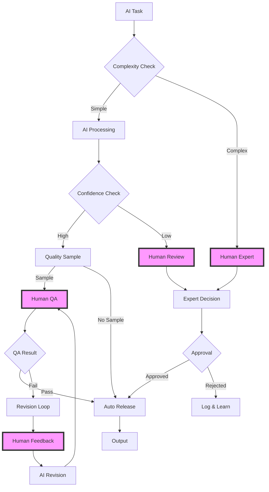

# Human-in-the-Loop Patterns

Human-in-the-Loop (HITL) patterns integrate human judgment, expertise, and oversight into AI workflows. These patterns are essential for high-stakes decisions, quality assurance, and maintaining human control over automated systems.

## Approval Workflow Pattern

Basic pattern for human approval of AI-generated content:

```python
from kaygraph import Node, Graph
import asyncio
from datetime import datetime, timedelta

class ApprovalRequestNode(Node):
    """Request human approval for AI decision"""
    def prep(self, shared):
        return {
            "decision": shared.get("ai_decision"),
            "context": shared.get("decision_context"),
            "requester": shared.get("requester_id")
        }
    
    def exec(self, prep_res):
        # Create approval request
        request = {
            "id": generate_request_id(),
            "timestamp": datetime.now(),
            "decision": prep_res["decision"],
            "context": prep_res["context"],
            "requester": prep_res["requester"],
            "status": "pending",
            "expires_at": datetime.now() + timedelta(hours=24)
        }
        
        # Send to approval queue
        send_approval_request(request)
        
        return request
    
    def post(self, shared, prep_res, exec_res):
        shared["approval_request"] = exec_res
        return "wait_approval"

class WaitApprovalNode(Node):
    """Wait for human response"""
    def __init__(self, timeout_minutes=60, poll_interval=30):
        super().__init__()
        self.timeout_minutes = timeout_minutes
        self.poll_interval = poll_interval
    
    def prep(self, shared):
        return shared["approval_request"]
    
    def exec(self, request):
        start_time = datetime.now()
        timeout = timedelta(minutes=self.timeout_minutes)
        
        while datetime.now() - start_time < timeout:
            # Check for response
            response = check_approval_status(request["id"])
            
            if response["status"] in ["approved", "rejected", "modified"]:
                return response
            
            # Wait before next check
            time.sleep(self.poll_interval)
        
        # Timeout reached
        return {
            "status": "timeout",
            "request_id": request["id"]
        }
    
    def post(self, shared, prep_res, exec_res):
        shared["approval_response"] = exec_res
        
        if exec_res["status"] == "approved":
            return "execute"
        elif exec_res["status"] == "rejected":
            return "handle_rejection"
        elif exec_res["status"] == "modified":
            return "process_modification"
        else:
            return "handle_timeout"
```

## Interactive Feedback Loop

Continuous improvement through human feedback:

```python
class FeedbackCollectorNode(Node):
    """Collect human feedback on AI output"""
    def prep(self, shared):
        return {
            "output": shared.get("ai_output"),
            "metadata": shared.get("output_metadata", {})
        }
    
    def exec(self, prep_res):
        # Present output for feedback
        feedback_request = {
            "id": generate_feedback_id(),
            "output": prep_res["output"],
            "metadata": prep_res["metadata"],
            "feedback_options": [
                "correct",
                "partially_correct",
                "incorrect",
                "needs_improvement"
            ],
            "allow_comments": True
        }
        
        # Get feedback (async in real implementation)
        feedback = collect_human_feedback(feedback_request)
        
        return feedback
    
    def post(self, shared, prep_res, exec_res):
        shared["feedback"] = exec_res
        
        # Route based on feedback
        if exec_res["rating"] == "correct":
            return "accept"
        elif exec_res["rating"] == "needs_improvement":
            return "improve"
        else:
            return "regenerate"

class ImprovementNode(Node):
    """Improve output based on feedback"""
    def prep(self, shared):
        return {
            "original_output": shared.get("ai_output"),
            "feedback": shared.get("feedback")
        }
    
    def exec(self, prep_res):
        # Use feedback to improve
        improvement_prompt = f"""
        Original output: {prep_res['original_output']}
        
        Human feedback:
        - Rating: {prep_res['feedback']['rating']}
        - Comments: {prep_res['feedback']['comments']}
        
        Please improve the output based on this feedback.
        """
        
        improved_output = call_llm(improvement_prompt)
        
        return {
            "improved_output": improved_output,
            "improvement_notes": "Applied human feedback"
        }
```

## Escalation Pattern

Route complex cases to human experts:

```python
class ComplexityAssessmentNode(Node):
    """Assess if human intervention needed"""
    def prep(self, shared):
        return shared.get("task")
    
    def exec(self, task):
        # Assess complexity
        complexity_factors = {
            "ambiguity": self.assess_ambiguity(task),
            "risk_level": self.assess_risk(task),
            "confidence": self.assess_ai_confidence(task),
            "precedent": self.check_precedent(task)
        }
        
        # Calculate overall complexity score
        complexity_score = sum(complexity_factors.values()) / len(complexity_factors)
        
        return {
            "task": task,
            "complexity_score": complexity_score,
            "factors": complexity_factors,
            "needs_human": complexity_score > 0.7
        }
    
    def post(self, shared, prep_res, exec_res):
        shared["complexity_assessment"] = exec_res
        
        if exec_res["needs_human"]:
            return "escalate_to_human"
        else:
            return "process_automatically"

class HumanExpertNode(Node):
    """Route to appropriate human expert"""
    def prep(self, shared):
        return {
            "task": shared.get("task"),
            "assessment": shared.get("complexity_assessment")
        }
    
    def exec(self, prep_res):
        # Determine expert type needed
        expert_type = self.determine_expert_type(prep_res["task"])
        
        # Find available expert
        expert = find_available_expert(expert_type)
        
        # Create expert request
        expert_request = {
            "expert_id": expert["id"],
            "task": prep_res["task"],
            "context": prep_res["assessment"],
            "priority": self.calculate_priority(prep_res["assessment"])
        }
        
        # Send to expert
        response = send_to_expert(expert_request)
        
        return response
```

## Collaborative Editing Pattern

Human and AI work together on content:

```python
class CollaborativeEditNode(Node):
    """Enable human-AI collaborative editing"""
    def __init__(self):
        super().__init__()
        self.edit_history = []
    
    def prep(self, shared):
        return {
            "document": shared.get("document"),
            "edit_mode": shared.get("edit_mode", "suggest")
        }
    
    def exec(self, prep_res):
        document = prep_res["document"]
        mode = prep_res["edit_mode"]
        
        if mode == "suggest":
            # AI suggests edits
            suggestions = self.generate_suggestions(document)
            return {
                "type": "suggestions",
                "original": document,
                "suggestions": suggestions
            }
        elif mode == "apply_human_edits":
            # Apply human's edits
            human_edits = get_human_edits()
            updated = self.apply_edits(document, human_edits)
            return {
                "type": "human_edited",
                "document": updated,
                "edits": human_edits
            }
        elif mode == "ai_revise":
            # AI revises based on human guidance
            guidance = get_human_guidance()
            revised = self.revise_with_guidance(document, guidance)
            return {
                "type": "ai_revised",
                "document": revised,
                "guidance_applied": guidance
            }
    
    def generate_suggestions(self, document):
        prompt = f"""
        Review this document and suggest improvements:
        {document}
        
        Provide specific, actionable suggestions.
        """
        
        suggestions = call_llm(prompt)
        return self.parse_suggestions(suggestions)
```

## Quality Assurance Pattern

Human review for quality control:

```python
class QualityCheckNode(Node):
    """Human quality assurance checkpoint"""
    def __init__(self, sample_rate=0.1):
        super().__init__()
        self.sample_rate = sample_rate
    
    def prep(self, shared):
        return {
            "output": shared.get("ai_output"),
            "metadata": shared.get("metadata", {})
        }
    
    def exec(self, prep_res):
        # Determine if this needs QA
        needs_qa = (
            random.random() < self.sample_rate or
            prep_res["metadata"].get("high_risk", False) or
            prep_res["metadata"].get("flagged_for_review", False)
        )
        
        if not needs_qa:
            return {"status": "auto_approved", "qa_skipped": True}
        
        # Send to QA queue
        qa_request = {
            "id": generate_qa_id(),
            "output": prep_res["output"],
            "criteria": self.get_qa_criteria(prep_res["metadata"]),
            "reviewer_level": self.determine_reviewer_level(prep_res)
        }
        
        qa_result = submit_for_qa(qa_request)
        
        return qa_result
    
    def post(self, shared, prep_res, exec_res):
        shared["qa_result"] = exec_res
        
        if exec_res["status"] == "approved":
            return "release"
        elif exec_res["status"] == "needs_revision":
            return "revise"
        else:
            return "reject"
```

## Human-in-the-Loop Workflow

Complete HITL workflow with multiple touchpoints:



## Implementation Example

```python
# Build HITL workflow
hitl_workflow = Graph()

# Create nodes
classifier = ComplexityAssessmentNode()
ai_processor = AIProcessingNode()
human_expert = HumanExpertNode()
qa_sampler = QualityCheckNode(sample_rate=0.1)
feedback_collector = FeedbackCollectorNode()
improver = ImprovementNode()
approver = ApprovalRequestNode()

# Add nodes
hitl_workflow.add(
    classifier, ai_processor, human_expert,
    qa_sampler, feedback_collector, improver, approver
)

# Connect workflow
hitl_workflow.set_start(classifier)

# Complexity routing
classifier >> ("process_automatically", ai_processor)
classifier >> ("escalate_to_human", human_expert)

# AI processing path
ai_processor >> qa_sampler
qa_sampler >> ("release", OutputNode())
qa_sampler >> ("revise", feedback_collector)

# Feedback loop
feedback_collector >> ("improve", improver)
improver >> qa_sampler

# Human expert path
human_expert >> approver
approver >> ("execute", OutputNode())
```

## Best Practices

1. **Clear Interfaces**: Design intuitive interfaces for human interaction
2. **Timeout Handling**: Always implement timeouts for human responses
3. **Escalation Paths**: Define clear escalation criteria and paths
4. **Audit Trail**: Log all human decisions and modifications
5. **Workload Balance**: Distribute human tasks fairly
6. **Training Data**: Use human feedback to improve AI models
7. **Emergency Override**: Always allow human override of AI decisions

## Advanced Patterns

### Crowd-Sourced Validation
```python
# Multiple humans validate AI output
ai_output >> crowd_distributor >> aggregate_responses >> consensus_checker
```

### Expert Committee
```python
# Complex decisions require multiple experts
high_stakes_decision >> expert_panel >> voting_aggregator >> final_approval
```

### Progressive Automation
```python
# Gradually reduce human involvement as confidence grows
new_task >> full_human_review >> partial_review >> spot_checks >> full_automation
```

## See Also

- [Approval Workflows](../production/validation.md) - Production approval systems
- [Agent Pattern](./agent.md) - Autonomous agent design
- [Cognitive Architecture](./cognitive.md) - AI reasoning patterns
- Examples: `kaygraph-human-in-the-loop`