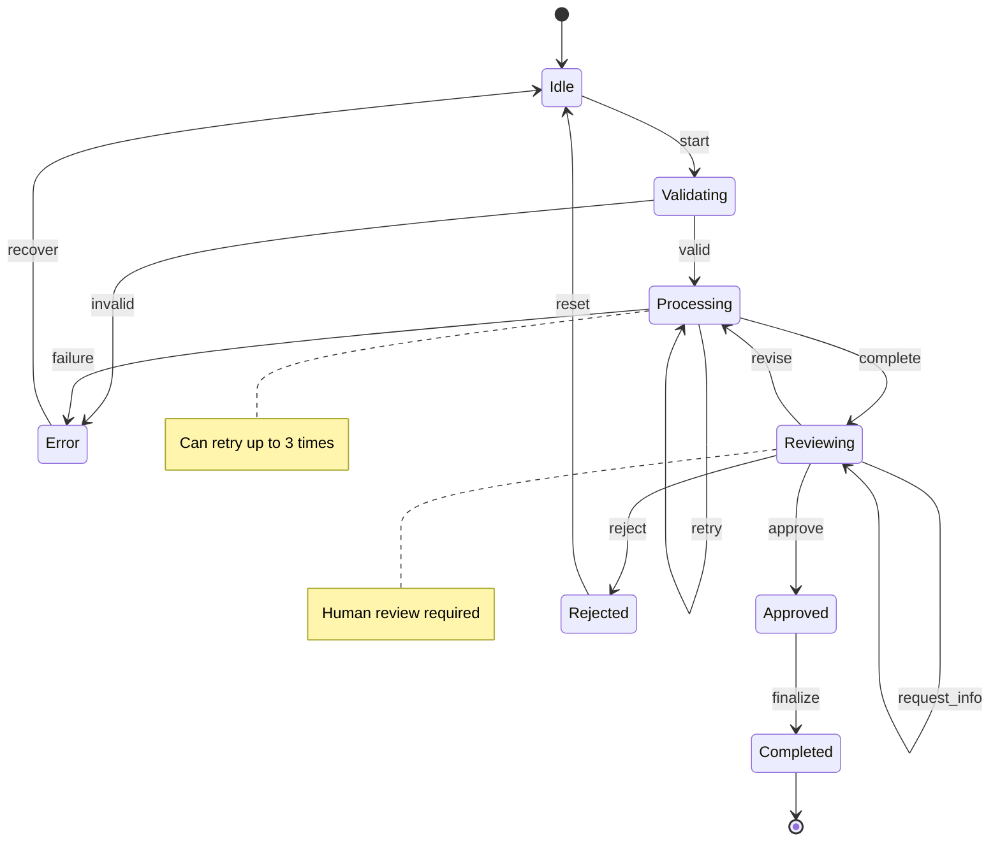

# State Machine Patterns

State machines provide structured control flow for complex workflows with well-defined states and transitions. KayGraph's graph structure naturally supports finite state machine (FSM) implementations, making it ideal for multi-step processes, user interactions, and workflow orchestration.

## Basic State Machine

Implement a simple FSM with nodes as states:

```python
from kaygraph import Node, Graph
from enum import Enum

class States(Enum):
    IDLE = "idle"
    PROCESSING = "processing"
    REVIEWING = "reviewing"
    COMPLETED = "completed"
    ERROR = "error"

class StateNode(Node):
    """Base class for state machine nodes"""
    def __init__(self, state: States):
        super().__init__()
        self.state = state
    
    def prep(self, shared):
        # Update current state
        shared["current_state"] = self.state
        shared["state_history"] = shared.get("state_history", [])
        shared["state_history"].append(self.state.value)
        
        return {
            "data": shared.get("data"),
            "context": shared.get("context", {})
        }
    
    def can_transition_to(self, next_state: States) -> bool:
        """Define valid state transitions"""
        valid_transitions = {
            States.IDLE: [States.PROCESSING, States.ERROR],
            States.PROCESSING: [States.REVIEWING, States.ERROR],
            States.REVIEWING: [States.COMPLETED, States.PROCESSING, States.ERROR],
            States.COMPLETED: [States.IDLE],
            States.ERROR: [States.IDLE]
        }
        
        return next_state in valid_transitions.get(self.state, [])

class IdleState(StateNode):
    """Initial idle state"""
    def __init__(self):
        super().__init__(States.IDLE)
    
    def exec(self, prep_res):
        # Check for new work
        if prep_res["data"]:
            return {"ready": True, "data": prep_res["data"]}
        else:
            return {"ready": False}
    
    def post(self, shared, prep_res, exec_res):
        if exec_res["ready"]:
            return "start_processing"
        else:
            return "wait"

class ProcessingState(StateNode):
    """Active processing state"""
    def __init__(self):
        super().__init__(States.PROCESSING)
    
    def exec(self, prep_res):
        try:
            # Process data
            result = process_data(prep_res["data"])
            return {"success": True, "result": result}
        except Exception as e:
            return {"success": False, "error": str(e)}
    
    def post(self, shared, prep_res, exec_res):
        shared["processing_result"] = exec_res
        
        if exec_res["success"]:
            return "review"
        else:
            return "error"
```

## Event-Driven State Machine

Handle external events and triggers:

```python
class EventDrivenFSM(Graph):
    """State machine that responds to events"""
    def __init__(self):
        super().__init__()
        self.event_queue = []
        self.event_handlers = {}
    
    def register_event_handler(self, event_type: str, handler):
        """Register handler for event type"""
        self.event_handlers[event_type] = handler
    
    def emit_event(self, event):
        """Add event to queue"""
        self.event_queue.append(event)
    
    def process_events(self, shared):
        """Process queued events"""
        while self.event_queue:
            event = self.event_queue.pop(0)
            handler = self.event_handlers.get(event["type"])
            
            if handler:
                next_state = handler(event, shared)
                if next_state:
                    shared["next_state"] = next_state

class EventAwareState(StateNode):
    """State that can handle events"""
    def prep(self, shared):
        base_prep = super().prep(shared)
        base_prep["pending_events"] = shared.get("event_queue", [])
        return base_prep
    
    def exec(self, prep_res):
        # Check for relevant events
        for event in prep_res["pending_events"]:
            if self.should_handle_event(event):
                return self.handle_event(event)
        
        # Normal state processing
        return self.process_state(prep_res)
    
    def should_handle_event(self, event):
        """Override to define which events this state handles"""
        return False
    
    def handle_event(self, event):
        """Override to handle specific events"""
        pass
```

## Hierarchical State Machine

Implement nested states and substates:

```python
class HierarchicalState(StateNode):
    """State that contains substates"""
    def __init__(self, state: States):
        super().__init__(state)
        self.subgraph = Graph()
        self.setup_substates()
    
    def setup_substates(self):
        """Override to define substates"""
        pass
    
    def exec(self, prep_res):
        # Run substate machine
        sub_shared = {
            "parent_data": prep_res["data"],
            "parent_context": prep_res["context"]
        }
        
        self.subgraph.run(sub_shared)
        
        return {
            "substate_result": sub_shared.get("result"),
            "final_substate": sub_shared.get("current_state")
        }

class ProcessingWithSubstates(HierarchicalState):
    """Processing state with validation and transformation substates"""
    def __init__(self):
        super().__init__(States.PROCESSING)
    
    def setup_substates(self):
        # Create substates
        validate = ValidationSubstate()
        transform = TransformSubstate()
        aggregate = AggregateSubstate()
        
        # Add to subgraph
        self.subgraph.add(validate, transform, aggregate)
        self.subgraph.set_start(validate)
        
        # Connect substates
        validate >> ("valid", transform)
        validate >> ("invalid", ErrorSubstate())
        transform >> aggregate
```

## Persistent State Machine

Save and restore state machine state:

```python
class PersistentStateMachine(Graph):
    """State machine with persistence"""
    def __init__(self, storage_backend):
        super().__init__()
        self.storage = storage_backend
    
    def save_state(self, session_id: str, shared: dict):
        """Persist current state"""
        state_data = {
            "session_id": session_id,
            "current_state": shared.get("current_state"),
            "state_history": shared.get("state_history", []),
            "data": shared.get("data"),
            "context": shared.get("context", {}),
            "timestamp": datetime.now()
        }
        
        self.storage.save(session_id, state_data)
    
    def load_state(self, session_id: str) -> dict:
        """Restore previous state"""
        state_data = self.storage.load(session_id)
        
        if state_data:
            return {
                "current_state": state_data["current_state"],
                "state_history": state_data["state_history"],
                "data": state_data["data"],
                "context": state_data["context"]
            }
        
        return None
    
    def run_with_persistence(self, session_id: str, shared: dict):
        """Run with automatic state persistence"""
        # Try to restore previous state
        restored = self.load_state(session_id)
        if restored:
            shared.update(restored)
        
        # Run normally
        result = self.run(shared)
        
        # Save state after each run
        self.save_state(session_id, shared)
        
        return result
```

## Timeout State Machine

Handle timeouts and time-based transitions:

```python
class TimeoutState(StateNode):
    """State with timeout handling"""
    def __init__(self, state: States, timeout_seconds: int):
        super().__init__(state)
        self.timeout_seconds = timeout_seconds
    
    def prep(self, shared):
        base_prep = super().prep(shared)
        
        # Track state entry time
        state_key = f"{self.state.value}_entered_at"
        if state_key not in shared:
            shared[state_key] = datetime.now()
        
        base_prep["entered_at"] = shared[state_key]
        return base_prep
    
    def exec(self, prep_res):
        # Check for timeout
        elapsed = datetime.now() - prep_res["entered_at"]
        
        if elapsed.total_seconds() > self.timeout_seconds:
            return {"timeout": True, "elapsed": elapsed.total_seconds()}
        
        # Normal processing
        return self.process_with_timeout(prep_res)
    
    def post(self, shared, prep_res, exec_res):
        if exec_res.get("timeout"):
            return "timeout"
        
        return self.normal_transition(shared, prep_res, exec_res)
```

## UI-Integrated State Machine

State machine for user interfaces (e.g., Streamlit):

```python
class UIStateMachine:
    """State machine for UI applications"""
    def __init__(self):
        self.graph = Graph()
        self.setup_states()
    
    def setup_states(self):
        # UI states
        welcome = WelcomeScreenState()
        input_form = InputFormState()
        processing = ProcessingScreenState()
        results = ResultsScreenState()
        error = ErrorScreenState()
        
        # Add states
        self.graph.add(welcome, input_form, processing, results, error)
        self.graph.set_start(welcome)
        
        # Define transitions
        welcome >> ("begin", input_form)
        input_form >> ("submit", processing)
        input_form >> ("cancel", welcome)
        processing >> ("success", results)
        processing >> ("error", error)
        results >> ("restart", welcome)
        error >> ("retry", input_form)
        error >> ("home", welcome)
    
    def render(self, session_state):
        """Render current state in UI"""
        current_state = session_state.get("current_state", "welcome")
        state_node = self.get_state_node(current_state)
        
        if state_node:
            return state_node.render_ui(session_state)

class InputFormState(StateNode):
    """Form input state for UI"""
    def __init__(self):
        super().__init__(States.IDLE)
    
    def render_ui(self, session_state):
        """Render form in Streamlit"""
        import streamlit as st
        
        st.title("Input Form")
        
        with st.form("input_form"):
            name = st.text_input("Name")
            email = st.text_input("Email")
            description = st.text_area("Description")
            
            submitted = st.form_submit_button("Submit")
            cancelled = st.form_submit_button("Cancel")
        
        if submitted:
            session_state["form_data"] = {
                "name": name,
                "email": email,
                "description": description
            }
            return "submit"
        elif cancelled:
            return "cancel"
        
        return None
```

## Complete State Machine Example

Full workflow with multiple states and transitions:



## Implementation

```python
# Build complete state machine
fsm = Graph()

# Create all states
idle = IdleState()
validating = ValidatingState()
processing = ProcessingState(max_retries=3)
reviewing = ReviewingState(timeout_seconds=3600)
approved = ApprovedState()
rejected = RejectedState()
completed = CompletedState()
error = ErrorState()

# Add states to graph
fsm.add(idle, validating, processing, reviewing, 
        approved, rejected, completed, error)

# Set initial state
fsm.set_start(idle)

# Define transitions
idle >> ("start", validating)
validating >> ("valid", processing)
validating >> ("invalid", error)
processing >> ("complete", reviewing)
processing >> ("failure", error)
processing >> ("retry", processing)
reviewing >> ("approve", approved)
reviewing >> ("revise", processing)
reviewing >> ("reject", rejected)
approved >> ("finalize", completed)
rejected >> ("reset", idle)
error >> ("recover", idle)

# Run state machine
shared = {
    "data": input_data,
    "context": {"user_id": "123", "session_id": "abc"}
}

result = fsm.run(shared)
```

## Best Practices

1. **Clear State Definitions**: Each state should have single responsibility
2. **Explicit Transitions**: Document all valid state transitions
3. **State History**: Track state transitions for debugging
4. **Timeout Handling**: Implement timeouts for long-running states
5. **Error States**: Always include error handling states
6. **Persistence**: Save state for long-running workflows
7. **Event Handling**: Support external events when needed

## Common Applications

### Order Processing
```python
# E-commerce order workflow
pending >> payment_processing >> fulfillment >> shipping >> delivered
```

### Document Approval
```python
# Document review workflow
draft >> review >> approval >> published
review >> ("changes_requested", draft)
```

### User Onboarding
```python
# Multi-step onboarding
welcome >> account_setup >> profile >> preferences >> tutorial >> active
```

## See Also

- [Human-in-the-Loop](./human_loop.md) - Human interaction patterns
- [Validation Patterns](./validation.md) - State validation
- [Workflow Patterns](./graph.md) - Complex workflows
- Examples: `kaygraph-streamlit-fsm`