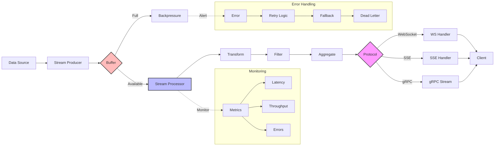

# Streaming Patterns

Streaming enables real-time data processing and progressive response generation, crucial for responsive AI applications. KayGraph supports streaming at multiple levels: LLM token streaming, data pipeline streaming, and WebSocket communication.

## LLM Token Streaming

Stream tokens as they're generated for immediate user feedback:

```python
from kaygraph import AsyncNode, AsyncGraph
import asyncio

class StreamingLLMNode(AsyncNode):
    """Stream LLM responses token by token"""
    async def prep_async(self, shared):
        return shared.get("prompt")
    
    async def exec_async(self, prep_res):
        # Collect full response while streaming
        full_response = []
        
        async for token in stream_llm(prep_res):
            full_response.append(token)
            # Stream token to client
            await self.stream_token(token, shared)
        
        return "".join(full_response)
    
    async def post_async(self, shared, prep_res, exec_res):
        shared["response"] = exec_res
        return None
    
    async def stream_token(self, token, shared):
        # Send token through streaming channel
        stream_queue = shared.get("stream_queue")
        if stream_queue:
            await stream_queue.put(token)
```

## WebSocket Streaming with FastAPI

Integrate with FastAPI for real-time web communication:

```python
from fastapi import FastAPI, WebSocket
from kaygraph import AsyncGraph
import asyncio

app = FastAPI()

class WebSocketStreamNode(AsyncNode):
    """Stream data through WebSocket"""
    def __init__(self, websocket: WebSocket):
        super().__init__()
        self.websocket = websocket
    
    async def prep_async(self, shared):
        return shared.get("data_to_stream")
    
    async def exec_async(self, prep_res):
        # Process and stream data
        for chunk in process_data(prep_res):
            await self.websocket.send_json({
                "type": "data",
                "content": chunk
            })
            await asyncio.sleep(0.01)  # Prevent flooding
        
        return {"chunks_sent": len(prep_res)}
    
    async def post_async(self, shared, prep_res, exec_res):
        await self.websocket.send_json({
            "type": "complete",
            "summary": exec_res
        })
        return None

@app.websocket("/ws/stream")
async def websocket_endpoint(websocket: WebSocket):
    await websocket.accept()
    
    try:
        # Create streaming graph
        graph = AsyncGraph()
        stream_node = WebSocketStreamNode(websocket)
        graph.add(stream_node)
        graph.set_start(stream_node)
        
        # Process incoming messages
        while True:
            data = await websocket.receive_json()
            shared = {"data_to_stream": data}
            await graph.run_async(shared)
            
    except Exception as e:
        await websocket.close()
```

## Progressive Data Processing

Stream results as they become available in batch operations:

```python
from kaygraph import AsyncBatchNode, AsyncBatchGraph

class StreamingBatchNode(AsyncBatchNode):
    """Process items in batches with streaming results"""
    async def prep_async(self, shared):
        # Return items to process
        return shared.get("items", [])
    
    async def exec_async(self, item):
        # Process individual item
        result = await process_item_async(item)
        
        # Stream intermediate result
        await self.stream_result(result)
        
        return result
    
    async def post_async(self, shared, prep_res, exec_res):
        # All results available
        shared["results"] = exec_res
        shared["total_processed"] = len(exec_res)
        return None
    
    async def stream_result(self, result):
        # Send through streaming channel
        if hasattr(self, '_stream_callback'):
            await self._stream_callback(result)

# Usage with streaming callback
async def handle_stream(result):
    print(f"Processed: {result}")

node = StreamingBatchNode()
node._stream_callback = handle_stream
```

## Server-Sent Events (SSE) Pattern

Alternative to WebSockets for simpler streaming:

```python
from fastapi import FastAPI
from fastapi.responses import StreamingResponse
import asyncio

class SSEStreamNode(AsyncNode):
    """Generate Server-Sent Events"""
    async def prep_async(self, shared):
        return shared.get("query")
    
    async def exec_async(self, prep_res):
        async def generate_events():
            # Stream processing updates
            yield f"data: {{'status': 'processing'}}\n\n"
            
            # Stream LLM tokens
            async for token in stream_llm(prep_res):
                yield f"data: {{'token': '{token}'}}\n\n"
                await asyncio.sleep(0.01)
            
            # Send completion
            yield f"data: {{'status': 'complete'}}\n\n"
        
        return generate_events
    
    async def post_async(self, shared, prep_res, exec_res):
        shared["event_generator"] = exec_res
        return None

@app.get("/stream/sse")
async def sse_endpoint(query: str):
    graph = AsyncGraph()
    node = SSEStreamNode()
    graph.add(node)
    graph.set_start(node)
    
    shared = {"query": query}
    await graph.run_async(shared)
    
    return StreamingResponse(
        shared["event_generator"](),
        media_type="text/event-stream"
    )
```

## Backpressure Management

Handle slow consumers gracefully:

```python
class BackpressureStreamNode(AsyncNode):
    """Stream with backpressure control"""
    def __init__(self, max_buffer_size=100):
        super().__init__()
        self.max_buffer_size = max_buffer_size
        self.buffer = asyncio.Queue(maxsize=max_buffer_size)
    
    async def exec_async(self, prep_res):
        producer_task = asyncio.create_task(
            self.produce_data(prep_res)
        )
        consumer_task = asyncio.create_task(
            self.consume_data()
        )
        
        # Wait for both to complete
        await asyncio.gather(producer_task, consumer_task)
        
        return {"processed": True}
    
    async def produce_data(self, data):
        for item in data:
            # Wait if buffer is full (backpressure)
            await self.buffer.put(item)
            
    async def consume_data(self):
        while True:
            try:
                item = await asyncio.wait_for(
                    self.buffer.get(), 
                    timeout=1.0
                )
                await self.process_item(item)
            except asyncio.TimeoutError:
                if self.buffer.empty():
                    break
```

## Streaming Pipeline Pattern

Chain streaming operations:

```python
class StreamPipelineNode(AsyncNode):
    """Part of a streaming pipeline"""
    def __init__(self, transform_fn):
        super().__init__()
        self.transform = transform_fn
    
    async def exec_async(self, prep_res):
        async for item in prep_res:
            # Transform and yield
            transformed = await self.transform(item)
            yield transformed

# Build streaming pipeline
async def create_pipeline():
    source = StreamSourceNode()
    transform1 = StreamPipelineNode(lambda x: x.upper())
    transform2 = StreamPipelineNode(lambda x: f"[{x}]")
    sink = StreamSinkNode()
    
    # Connect nodes
    source >> transform1 >> transform2 >> sink
```

## Best Practices

1. **Buffer Management**: Use bounded queues to prevent memory issues
2. **Error Handling**: Gracefully handle connection drops
3. **Heartbeats**: Send periodic keep-alive messages
4. **Rate Limiting**: Control streaming rate to prevent overwhelming clients
5. **Cancellation**: Support clean cancellation of streaming operations
6. **Reconnection**: Implement automatic reconnection logic
7. **Metrics**: Track streaming performance and failures

## Common Streaming Patterns

### Real-time Analytics
```python
# Stream analytics results as data arrives
data_source >> streaming_aggregator >> result_streamer
```

### Live Transcription
```python
# Stream transcription of audio
audio_chunks >> transcribe_stream >> text_formatter >> client_stream
```

### Progressive Rendering
```python
# Stream UI updates progressively
query >> content_generator >> markdown_streamer >> ui_updater
```

## Streaming Architecture

Complete streaming system design:



## Performance Considerations

- **Chunking**: Choose appropriate chunk sizes for your use case
- **Buffering**: Balance between latency and throughput
- **Compression**: Consider compression for large payloads
- **Protocol**: Choose between WebSocket, SSE, or HTTP/2 based on needs

## See Also

- [Async Basics](../fundamentals/async.md) - Async patterns in KayGraph
- [Batch Processing](../fundamentals/batch.md) - Batch operations
- [Production API](../production/api.md) - API integration patterns
- Examples: `kaygraph-streaming-llm`, `kaygraph-fastapi-websocket`