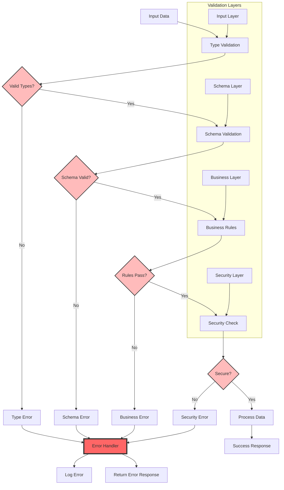

# Validation Patterns

Validation ensures data integrity, type safety, and security throughout your KayGraph applications. This pattern covers input validation, output verification, content safety, and type-safe operations.

## ValidatedNode Basics

KayGraph provides `ValidatedNode` for built-in validation:

```python
from kaygraph import ValidatedNode, ValidationError

class UserInputNode(ValidatedNode):
    """Validate user input before processing"""
    
    def validate_prep(self, shared):
        """Validate inputs before prep"""
        if "user_input" not in shared:
            raise ValidationError("user_input is required")
        
        user_input = shared["user_input"]
        if not isinstance(user_input, str):
            raise ValidationError("user_input must be a string")
        
        if len(user_input) > 1000:
            raise ValidationError("user_input exceeds maximum length")
        
        return True
    
    def validate_exec(self, prep_res, exec_res):
        """Validate execution results"""
        if not exec_res:
            raise ValidationError("Execution produced no result")
        
        if "status" not in exec_res:
            raise ValidationError("Result missing status field")
        
        return True
    
    def prep(self, shared):
        return shared["user_input"]
    
    def exec(self, prep_res):
        # Process validated input
        result = process_user_input(prep_res)
        return {
            "status": "success",
            "data": result
        }
```

## Schema Validation Pattern

Use schemas for complex data structures:

```python
from typing import Dict, List, Optional
import json

class SchemaValidator:
    """Validate data against JSON schema"""
    def __init__(self, schema: Dict):
        self.schema = schema
    
    def validate(self, data: Dict) -> bool:
        # Simple schema validation
        # In production, use jsonschema library
        for field, rules in self.schema.items():
            if rules.get("required") and field not in data:
                raise ValidationError(f"Missing required field: {field}")
            
            if field in data:
                value = data[field]
                expected_type = rules.get("type")
                
                if expected_type == "string" and not isinstance(value, str):
                    raise ValidationError(f"{field} must be string")
                elif expected_type == "number" and not isinstance(value, (int, float)):
                    raise ValidationError(f"{field} must be number")
                elif expected_type == "array" and not isinstance(value, list):
                    raise ValidationError(f"{field} must be array")
        
        return True

class SchemaValidatedNode(ValidatedNode):
    """Node with schema validation"""
    
    input_schema = {
        "name": {"type": "string", "required": True},
        "age": {"type": "number", "required": True},
        "email": {"type": "string", "required": False}
    }
    
    output_schema = {
        "user_id": {"type": "string", "required": True},
        "created_at": {"type": "string", "required": True}
    }
    
    def __init__(self):
        super().__init__()
        self.input_validator = SchemaValidator(self.input_schema)
        self.output_validator = SchemaValidator(self.output_schema)
    
    def validate_prep(self, shared):
        user_data = shared.get("user_data", {})
        self.input_validator.validate(user_data)
        return True
    
    def validate_exec(self, prep_res, exec_res):
        self.output_validator.validate(exec_res)
        return True
```

## Content Safety Validation

Implement safety checks for user-generated content:

```python
class ContentSafetyNode(ValidatedNode):
    """Validate content for safety issues"""
    
    def __init__(self):
        super().__init__()
        self.blocked_patterns = [
            r"(?i)(harm|dangerous|illegal)",
            r"(?i)(personal|private) information",
            r"(?i)password|api[_-]?key|secret"
        ]
        self.max_urls = 3
    
    def validate_prep(self, shared):
        content = shared.get("content", "")
        
        # Check blocked patterns
        import re
        for pattern in self.blocked_patterns:
            if re.search(pattern, content):
                raise ValidationError(f"Content contains blocked pattern: {pattern}")
        
        # Check URL limits
        url_pattern = r'https?://[^\s]+'
        urls = re.findall(url_pattern, content)
        if len(urls) > self.max_urls:
            raise ValidationError(f"Content contains too many URLs ({len(urls)} > {self.max_urls})")
        
        # Check content length
        if len(content) > 10000:
            raise ValidationError("Content exceeds maximum length")
        
        return True
    
    def prep(self, shared):
        return shared["content"]
    
    def exec(self, prep_res):
        # Additional safety check with LLM
        safety_check = check_content_safety_llm(prep_res)
        
        if not safety_check["is_safe"]:
            raise ValidationError(f"Content failed safety check: {safety_check['reason']}")
        
        return {
            "content": prep_res,
            "safety_score": safety_check["score"]
        }
```

## Type-Safe Structured Output

Ensure LLM outputs match expected structure:

```python
from typing import TypedDict, List

class StructuredOutputNode(ValidatedNode):
    """Generate and validate structured LLM output"""
    
    class OutputSchema(TypedDict):
        summary: str
        key_points: List[str]
        sentiment: str
        confidence: float
    
    def prep(self, shared):
        return shared["text_to_analyze"]
    
    def exec(self, prep_res):
        # Generate structured output
        prompt = f"""
        Analyze the following text and return a JSON object with:
        - summary: brief summary (string)
        - key_points: list of key points (array of strings)
        - sentiment: positive/negative/neutral (string)
        - confidence: confidence score 0-1 (number)
        
        Text: {prep_res}
        """
        
        response = call_llm(prompt)
        
        # Parse JSON response
        try:
            structured_output = json.loads(response)
        except json.JSONDecodeError:
            raise ValidationError("LLM did not return valid JSON")
        
        return structured_output
    
    def validate_exec(self, prep_res, exec_res):
        # Validate structure
        required_fields = ["summary", "key_points", "sentiment", "confidence"]
        for field in required_fields:
            if field not in exec_res:
                raise ValidationError(f"Missing required field: {field}")
        
        # Validate types
        if not isinstance(exec_res["summary"], str):
            raise ValidationError("summary must be string")
        
        if not isinstance(exec_res["key_points"], list):
            raise ValidationError("key_points must be array")
        
        if exec_res["sentiment"] not in ["positive", "negative", "neutral"]:
            raise ValidationError("sentiment must be positive/negative/neutral")
        
        if not (0 <= exec_res["confidence"] <= 1):
            raise ValidationError("confidence must be between 0 and 1")
        
        return True
```

## Pipeline Validation Pattern

Validate data flow through entire pipelines:

```python
class ValidationPipeline(Graph):
    """Graph with validation at each stage"""
    
    def __init__(self):
        super().__init__()
        
        # Create validated nodes
        self.input_validator = InputValidatorNode()
        self.processor = ProcessorNode()
        self.output_validator = OutputValidatorNode()
        
        # Add nodes
        self.add(self.input_validator)
        self.add(self.processor)
        self.add(self.output_validator)
        
        # Connect with validation flow
        self.set_start(self.input_validator)
        self.input_validator >> ("valid", self.processor)
        self.input_validator >> ("invalid", self.error_handler)
        self.processor >> self.output_validator
        
    def add_validation_middleware(self, node):
        """Wrap node with validation middleware"""
        class ValidatedWrapper(ValidatedNode):
            def __init__(self, wrapped_node):
                super().__init__()
                self.wrapped = wrapped_node
            
            def validate_prep(self, shared):
                # Pre-execution validation
                return self.wrapped.validate_input(shared)
            
            def prep(self, shared):
                return self.wrapped.prep(shared)
            
            def exec(self, prep_res):
                return self.wrapped.exec(prep_res)
            
            def validate_exec(self, prep_res, exec_res):
                # Post-execution validation
                return self.wrapped.validate_output(exec_res)
            
            def post(self, shared, prep_res, exec_res):
                return self.wrapped.post(shared, prep_res, exec_res)
        
        return ValidatedWrapper(node)
```

## Custom Validators

Create reusable validators:

```python
class EmailValidator:
    """Validate email addresses"""
    @staticmethod
    def validate(email: str) -> bool:
        import re
        pattern = r'^[a-zA-Z0-9._%+-]+@[a-zA-Z0-9.-]+\.[a-zA-Z]{2,}$'
        if not re.match(pattern, email):
            raise ValidationError(f"Invalid email format: {email}")
        return True

class PhoneValidator:
    """Validate phone numbers"""
    @staticmethod
    def validate(phone: str) -> bool:
        import re
        # Simple pattern for demonstration
        pattern = r'^\+?1?\d{9,15}$'
        if not re.match(pattern, phone.replace("-", "").replace(" ", "")):
            raise ValidationError(f"Invalid phone format: {phone}")
        return True

class RangeValidator:
    """Validate numeric ranges"""
    def __init__(self, min_val=None, max_val=None):
        self.min_val = min_val
        self.max_val = max_val
    
    def validate(self, value: float) -> bool:
        if self.min_val is not None and value < self.min_val:
            raise ValidationError(f"Value {value} below minimum {self.min_val}")
        if self.max_val is not None and value > self.max_val:
            raise ValidationError(f"Value {value} above maximum {self.max_val}")
        return True
```

## Best Practices

1. **Fail Fast**: Validate as early as possible in the pipeline
2. **Clear Errors**: Provide specific, actionable error messages
3. **Schema Evolution**: Version your schemas for backward compatibility
4. **Performance**: Cache validation results when appropriate
5. **Logging**: Log validation failures for monitoring
6. **Graceful Degradation**: Have fallback strategies for validation failures
7. **Security First**: Never trust user input, always validate

## Validation Pipeline Architecture

Comprehensive validation system:



## Common Validation Scenarios

### API Input Validation
```python
# Validate API requests before processing
api_input >> rate_limiter >> schema_validator >> auth_validator >> processor
```

### Data Pipeline Validation
```python
# Validate at each transformation stage
raw_data >> format_validator >> transformer >> quality_checker >> storage
```

### LLM Output Validation
```python
# Ensure LLM outputs meet requirements
prompt >> llm_call >> json_parser >> schema_validator >> business_rules
```

## See Also

- [Production Validation](../production/validation.md) - Production validation strategies
- [Chat Patterns](./chat.md) - Chat with guardrails
- [Structured Output](./structure.md) - Type-safe outputs
- Examples: `kaygraph-validated-pipeline`, `kaygraph-structured-output`, `kaygraph-chat-guardrail`