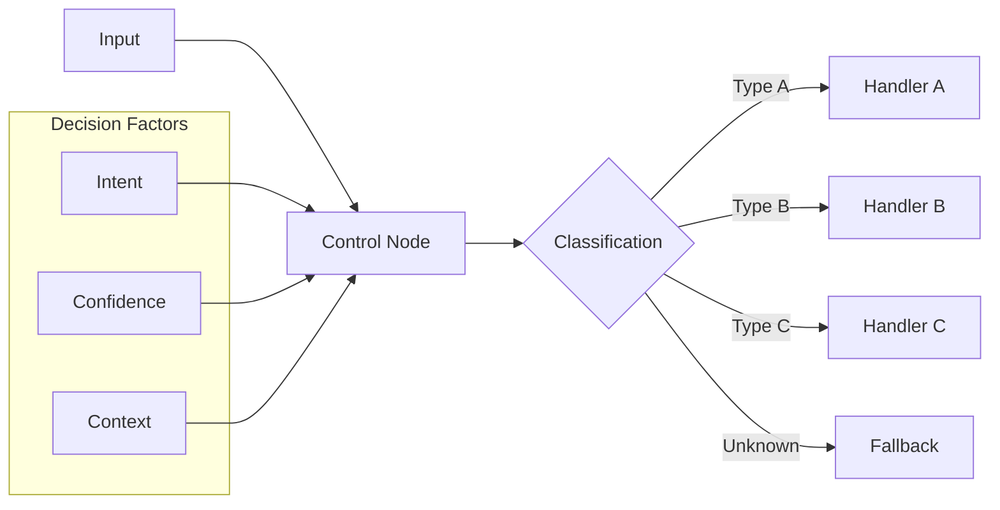

# KayGraph Agent Control

## Overview

This example demonstrates the "Control" building block - deterministic decision-making and process flow control. Control nodes handle routing based on conditions, intent classification, and orchestrate predictable behavior through if/then logic.

Based on the AI Cookbook's control pattern, this shows how to:
- Classify user intents with confidence scoring
- Route to specialized handlers based on classification
- Implement deterministic decision trees
- Control process flow with conditions
- Handle edge cases and fallbacks

## Key Concepts

**Control** provides predictable behavior by:
- Analyzing inputs to determine intent/category
- Making routing decisions based on rules
- Ensuring deterministic outcomes
- Handling all possible paths
- Providing confidence in decisions

Control is essential for building reliable AI systems that behave predictably.

## Usage

```bash
# Process single input
python main.py "What is machine learning?"

# Test routing examples
python main.py --example routing

# Test decision tree
python main.py --example decision-tree

# Test multi-criteria control
python main.py --example multi-criteria

# Run all examples
python main.py --example all

# Interactive mode
python main.py --interactive
```

## Examples

The workbook includes several control patterns:

1. **Intent Classification** - Route based on user intent (question/request/complaint)
2. **Decision Tree Control** - Multi-level decision making
3. **Priority-Based Routing** - Route based on priority/urgency
4. **Multi-Criteria Control** - Complex routing with multiple factors
5. **Threshold Control** - Route based on confidence thresholds

## Control Patterns

### Intent-Based Routing
```
User Input → Classify Intent → Route to Handler
                ├─ Question → Answer Node
                ├─ Request → Process Node
                └─ Complaint → Escalate Node
```

### Decision Tree
```
Input → Analyze
         ├─ Criteria A?
         │   ├─ Yes → Path 1
         │   └─ No → Check B
         └─ Criteria B?
             ├─ Yes → Path 2
             └─ No → Default Path
```

### Multi-Factor Control
```
Input → Evaluate Multiple Factors
         ├─ Intent
         ├─ Urgency
         ├─ Complexity
         └─ Sentiment
             ↓
         Route Decision
```

## Key Learnings

1. **Clear classification** - Define mutually exclusive categories
2. **Confidence thresholds** - Use confidence scores for reliability
3. **Handle all paths** - Every possible route must have a handler
4. **Fallback logic** - Always have a default path
5. **Log decisions** - Track routing for debugging

## Architecture



## Requirements

- Python 3.8+
- KayGraph framework
- pydantic>=2.0
- LLM provider (OpenAI, Anthropic, Groq, or Ollama)