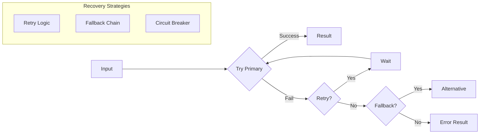

# KayGraph Agent Recovery

## Overview

This example demonstrates the "Recovery" building block - managing failures and exceptions gracefully in agent workflows. Recovery patterns ensure system resilience through retry logic, fallback processes, and intelligent error handling.

Based on the AI Cookbook's recovery pattern, this shows how to:
- Implement retry logic with exponential backoff
- Create fallback strategies for degraded functionality
- Handle partial failures gracefully
- Build circuit breakers for failing services
- Ensure workflows continue despite errors

## Key Concepts

**Recovery** ensures resilience by:
- Catching and handling exceptions appropriately
- Retrying transient failures automatically
- Falling back to alternative approaches
- Maintaining partial functionality
- Preventing cascade failures

Recovery is essential for production AI systems that must handle real-world unreliability.

## Usage

```bash
# Test basic recovery
python main.py "Process this with potential failures"

# Test retry patterns
python main.py --example retry

# Test fallback strategies
python main.py --example fallback

# Test circuit breaker
python main.py --example circuit-breaker

# Run all examples
python main.py --example all

# Interactive mode
python main.py --interactive
```

## Examples

The workbook includes several recovery patterns:

1. **Retry with Backoff** - Automatic retries with exponential delays
2. **Fallback Processing** - Alternative paths when primary fails
3. **Graceful Degradation** - Partial results instead of total failure
4. **Circuit Breaker** - Prevent cascading failures
5. **Error Aggregation** - Collect and handle multiple errors

## Recovery Patterns

### Retry Logic
```
Attempt 1 → Fail → Wait 1s
Attempt 2 → Fail → Wait 2s  
Attempt 3 → Fail → Wait 4s
Attempt 4 → Success/Fallback
```

### Fallback Chain
```
Primary Method → Fail
    ↓
Secondary Method → Fail
    ↓
Basic Fallback → Always Works
```

### Circuit Breaker
```
Closed (Normal) → Failures++ → Open (Block)
                                   ↓
                              Half-Open (Test)
                                   ↓
                              Reset if Success
```

## Key Learnings

1. **Fail fast, recover gracefully** - Don't hide errors, handle them
2. **Idempotent operations** - Retries must be safe
3. **Timeout everything** - Prevent infinite waits
4. **Log extensively** - Track failure patterns
5. **Test failure paths** - Recovery code needs testing too

## Architecture



## Requirements

- Python 3.8+
- KayGraph framework
- pydantic>=2.0
- LLM provider (OpenAI, Anthropic, Groq, or Ollama)