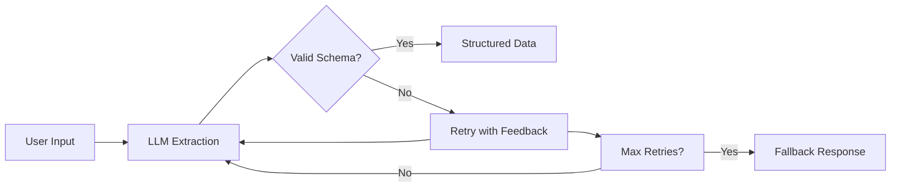

# KayGraph Agent Validation

## Overview

This example demonstrates the "Validation" building block - structured data enforcement and quality assurance. LLMs are probabilistic and can produce inconsistent outputs. Validation ensures the LLM returns data that matches your expected schema, enabling reliable downstream processing.

Based on the AI Cookbook's agent building blocks pattern, this shows how to:
- Define data schemas with Pydantic models
- Validate LLM outputs against schemas
- Retry on validation failures
- Handle complex nested structures
- Ensure type safety for downstream code

## Key Concepts

**Validation** ensures reliable data extraction by:
- Defining expected output structure
- Validating LLM responses match schema
- Retrying with feedback on failures
- Providing type-safe objects for code
- Preventing runtime errors from bad data

Without validation, LLM outputs are unpredictable strings. With validation, you get guaranteed structured data.

## Usage

```bash
# Basic validation example
python main.py "Schedule a meeting with John tomorrow at 2pm"

# Complex extraction
python main.py "Order 5 laptops, 3 monitors, and 10 keyboards for the office"

# Interactive mode
python main.py --interactive

# Test validation failures and retries
python main.py --example retry

# Test all examples
python main.py --example all
```

## Examples

The workbook includes several validation patterns:

1. **Basic Validation Node** - Simple schema validation
2. **Complex Schema Node** - Nested objects and lists
3. **Retry Validation Node** - Automatic retry on failure
4. **Custom Validator Node** - Business logic validation
5. **Fallback Validation Node** - Graceful degradation

## Schema Examples

### Task Extraction
```python
class TaskResult(BaseModel):
    task: str
    completed: bool
    priority: int
```

### Meeting Scheduling
```python
class Meeting(BaseModel):
    title: str
    attendees: List[str]
    date: str
    time: str
    duration_minutes: int
```

### Order Processing
```python
class OrderItem(BaseModel):
    product: str
    quantity: int
    unit_price: Optional[float]

class Order(BaseModel):
    items: List[OrderItem]
    total_items: int
    notes: Optional[str]
```

## Key Learnings

1. **Validation is critical** - Never trust raw LLM output
2. **Start simple** - Basic schemas are easier to validate
3. **Provide examples** - Help LLM understand format
4. **Retry intelligently** - Include error feedback
5. **Have fallbacks** - Not all extraction will succeed

## Architecture



## Requirements

- Python 3.8+
- KayGraph framework
- pydantic>=2.0
- LLM provider (OpenAI, Anthropic, Groq, or Ollama)