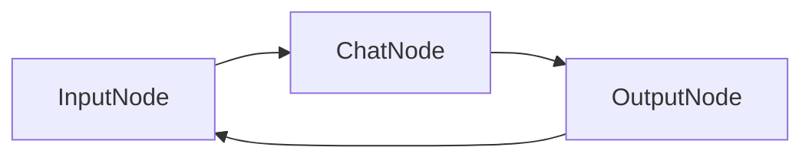

# KayGraph Chat Implementation

This workbook demonstrates how to build a conversational chatbot using KayGraph with conversation history management.

## Overview

A simple yet powerful chatbot that:
- Maintains conversation history
- Provides contextual responses
- Handles user input gracefully
- Can be extended with additional capabilities

## Design

### Graph Structure



### Node Descriptions

- **InputNode**: Captures user input and manages conversation flow
- **ChatNode**: Processes user input with conversation history
- **OutputNode**: Displays assistant response and decides whether to continue

### Key Features

1. **Conversation History**: Maintains full dialogue context
2. **Graceful Exit**: Users can type 'exit', 'quit', or 'bye' to end
3. **Error Handling**: Robust error recovery with retries
4. **Context Management**: Efficient handling of conversation state

### Shared State Structure

```python
{
    "messages": List[Dict[str, str]],  # Conversation history
    "user_input": str,                  # Current user input
    "assistant_response": str,          # Current assistant response
    "should_exit": bool                 # Exit flag
}
```

### KayGraph Features Used

- **Node**: Basic node with retry capabilities
- **Graph**: Orchestrates the conversation loop
- **Logging**: Tracks conversation flow
- **Error handling**: Graceful fallback for API failures