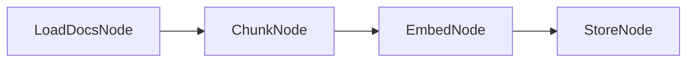
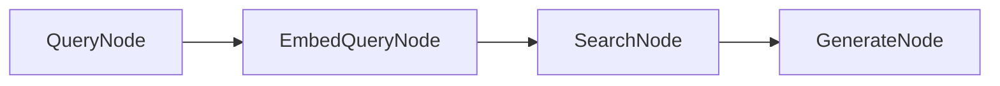

# KayGraph RAG Implementation

This workbook demonstrates how to build a Retrieval-Augmented Generation (RAG) system using KayGraph with separate indexing and retrieval graphs.

## Overview

A complete RAG system with:
- Document ingestion and chunking
- Embedding generation and vector storage
- Semantic search for relevant chunks
- Context-aware answer generation

## Design

### Indexing Graph



### Retrieval Graph



### Node Descriptions

**Indexing Pipeline:**
- **LoadDocsNode**: Loads documents from directory
- **ChunkNode**: Splits documents into manageable chunks
- **EmbedNode**: Generates embeddings for chunks
- **StoreNode**: Stores chunks and embeddings in vector DB

**Retrieval Pipeline:**
- **QueryNode**: Processes user query
- **EmbedQueryNode**: Generates query embedding
- **SearchNode**: Finds relevant chunks via similarity search
- **GenerateNode**: Generates answer using retrieved context

### Key Features

1. **Modular Design**: Separate indexing and retrieval workflows
2. **Batch Processing**: Efficient document processing
3. **Semantic Search**: Embedding-based similarity matching
4. **Context Window Management**: Smart chunk selection

### Shared State Structure

**Indexing State:**
```python
{
    "documents": List[Dict[str, str]],  # Raw documents
    "chunks": List[Dict[str, Any]],     # Document chunks
    "embeddings": List[List[float]],    # Chunk embeddings
    "vector_store": Dict[str, Any]      # Vector database
}
```

**Retrieval State:**
```python
{
    "query": str,                       # User query
    "query_embedding": List[float],     # Query embedding
    "relevant_chunks": List[Dict],      # Retrieved chunks
    "context": str,                     # Combined context
    "answer": str                       # Generated answer
}
```

### KayGraph Features Used

- **BatchNode**: Process multiple documents/chunks
- **Separate Graphs**: Indexing vs retrieval workflows
- **Error handling**: Robust document processing
- **Metrics tracking**: Performance monitoring