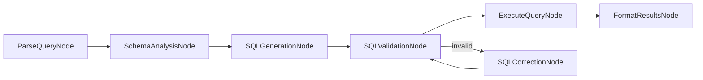

# KayGraph Text to SQL Design

## Overview
Build a text-to-SQL generation system that converts natural language queries into SQL statements using KayGraph's node-based architecture.

## Graph Structure

## Node Descriptions

1. **ParseQueryNode**: Extract intent and entities from natural language
2. **SchemaAnalysisNode**: Analyze database schema for relevant tables/columns
3. **SQLGenerationNode**: Generate SQL query from parsed intent
4. **SQLValidationNode**: Validate SQL syntax and safety
5. **ExecuteQueryNode**: Execute the query against database
6. **SQLCorrectionNode**: Fix invalid SQL queries
7. **FormatResultsNode**: Format query results for display

## Utility Functions

- `utils/sql_parser.py`: Parse and analyze natural language queries
- `utils/schema_analyzer.py`: Database schema introspection
- `utils/sql_generator.py`: SQL query generation logic
- `utils/database.py`: Database connection and execution