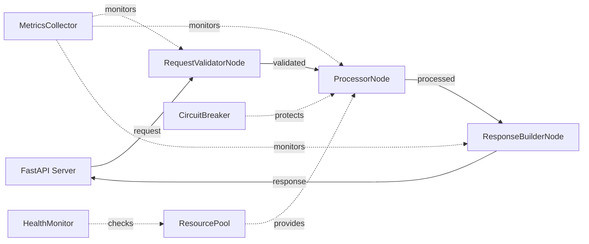

# Production-Ready API Design

## High-Level Requirements

Build a production-grade FastAPI application using KayGraph that demonstrates enterprise features: comprehensive validation, metrics collection, error handling, resource management, and monitoring capabilities.

## API Structure



## Node Descriptions

1. **RequestValidatorNode**: Validates incoming requests (ValidatedNode)
2. **ProcessorNode**: Main business logic with metrics (MetricsNode)
3. **ResponseBuilderNode**: Builds responses with validation (ValidatedNode)
4. **MetricsCollector**: Collects and exports API metrics
5. **HealthMonitor**: Monitors system and dependency health
6. **ResourcePool**: Manages database and external service connections
7. **CircuitBreaker**: Protects against external service failures

## API Endpoints

### Core Processing
```python
@app.post("/api/v1/process")
async def process_request(request: ProcessRequest):
    # KayGraph workflow with validation, metrics, and error handling
    result = await processing_workflow.run(request.dict())
    return ProcessResponse(**result)
```

### Health and Monitoring
```python
@app.get("/health")
async def health_check():
    # Comprehensive health check using KayGraph
    health_status = await health_workflow.run({})
    return HealthResponse(**health_status)

@app.get("/metrics")
async def get_metrics():
    # Prometheus-compatible metrics
    return metrics_collector.export_prometheus()
```

## Production Features

### Request Validation
- Schema validation with detailed error messages
- Rate limiting and authentication
- Input sanitization and security checks

### Performance Monitoring
- Request/response time tracking
- Throughput and error rate metrics
- Resource usage monitoring

### Error Handling
- Circuit breaker for external dependencies
- Graceful degradation patterns
- Structured error responses

### Resource Management
- Database connection pooling
- External service client management
- Memory and resource optimization