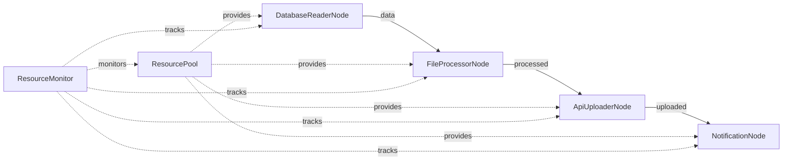

# Resource Management Design

## High-Level Requirements

Demonstrate KayGraph's context manager support and resource lifecycle management through a workflow that manages multiple types of resources (database connections, file handles, HTTP clients) with automatic cleanup and pooling.

## Graph Structure



## Node Descriptions

1. **DatabaseReaderNode**: Reads data using pooled database connections (context manager)
2. **FileProcessorNode**: Processes files with proper file handle management (context manager)
3. **ApiUploaderNode**: Uploads data using HTTP client sessions (context manager)
4. **NotificationNode**: Sends notifications with proper resource cleanup (context manager)
5. **ResourcePool**: Manages shared resources across the graph
6. **ResourceMonitor**: Tracks resource usage and health

## Resource Types

### Database Resources
- Connection pooling with automatic cleanup
- Transaction management
- Connection health monitoring

### File Resources
- File handle management
- Temporary file cleanup
- Large file streaming

### Network Resources
- HTTP session management
- Connection pooling
- Timeout and retry handling

### Memory Resources
- Large data structure management
- Buffer allocation and cleanup
- Memory leak prevention

## Context Manager Examples

```python
class DatabaseNode(Node):
    def setup_resources(self):
        self.db_pool = DatabasePool(max_connections=5)
        
    def cleanup_resources(self):
        if hasattr(self, 'db_pool'):
            self.db_pool.close_all()
    
    def exec(self, query):
        with self.db_pool.get_connection() as conn:
            return conn.execute(query)
```