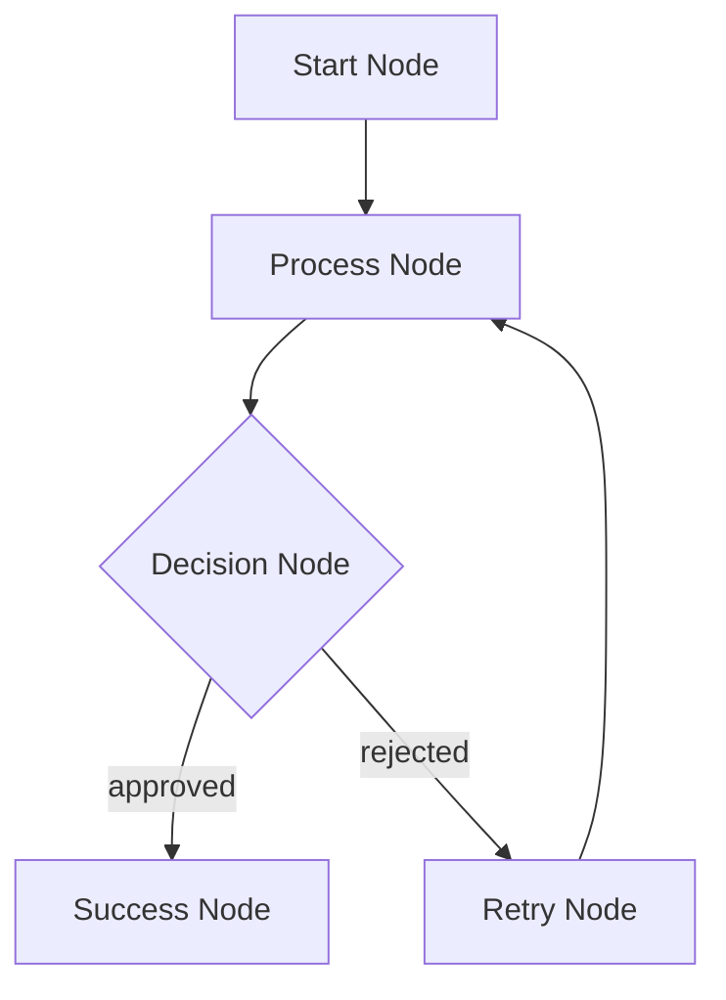

# KayGraph Visualization

This example demonstrates how to visualize KayGraph workflows for debugging and understanding complex graph structures. It provides multiple visualization formats and interactive debugging capabilities.

## Features Demonstrated

1. **Graph Structure Visualization**: Render workflow graphs as diagrams
2. **Execution Tracing**: Visualize execution flow in real-time
3. **State Inspection**: View shared state at each node
4. **Performance Profiling**: Visualize execution times and bottlenecks
5. **Interactive Debugging**: Step through execution with breakpoints

## Visualization Formats

### 1. Mermaid Diagrams (Text-based)


### 2. Graphviz DOT (Professional)
- High-quality PDF/SVG output
- Customizable node shapes and colors
- Execution path highlighting

### 3. HTML Interactive (Web-based)
- D3.js powered interactive graphs
- Zoom, pan, and node inspection
- Real-time execution animation

### 4. ASCII Art (Terminal)
```
┌─────────────┐     ┌─────────────┐     ┌─────────────┐
│ Start Node  │────▶│Process Node │────▶│Decision Node│
└─────────────┘     └─────────────┘     └─────────────┘
                            │                    │
                            │                    ▼
                            │            ┌─────────────┐
                            └───────────▶│ Retry Node  │
                                        └─────────────┘
```

## Usage

### Basic Visualization
```bash
# Visualize a graph structure
python visualize.py --graph my_workflow.py --format mermaid

# Generate multiple formats
python visualize.py --graph my_workflow.py --format all --output ./output/

# ASCII visualization for terminal
python visualize.py --graph my_workflow.py --format ascii
```

### Execution Tracing
```bash
# Trace execution with state snapshots
python trace_execution.py --workflow my_workflow.py --verbose

# Generate execution animation
python trace_execution.py --workflow my_workflow.py --animate --output execution.html
```

### Interactive Debugging
```bash
# Start interactive debugger
python debug_graph.py --workflow my_workflow.py

# With breakpoints
python debug_graph.py --workflow my_workflow.py --break "ProcessNode,DecisionNode"
```

## Examples

### 1. Simple Workflow Visualization
Shows how to visualize basic node connections and graph structure.

### 2. Complex Graph with Conditions
Visualizes conditional branches, loops, and parallel paths.

### 3. Performance Analysis
Generates heatmaps showing execution times and identifies bottlenecks.

### 4. State Flow Diagram
Tracks how shared state changes through the workflow.

## Integration

The visualization tools can be integrated into your KayGraph applications:

```python
from kaygraph_viz import GraphVisualizer, ExecutionTracer

# Enable visualization
viz = GraphVisualizer(graph)
viz.render("my_graph.html", format="interactive")

# Trace execution
with ExecutionTracer(graph) as tracer:
    graph.run(shared)
    tracer.save_trace("execution_trace.json")
```