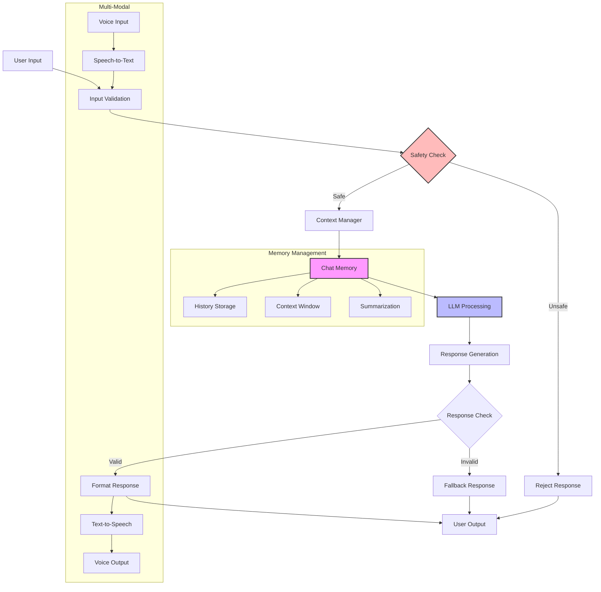

# Chat Patterns

Chat interfaces are fundamental to many AI applications. KayGraph provides several patterns for building conversational systems, from simple Q&A to complex multi-turn conversations with memory and safety features.

## Basic Chat Pattern

The simplest chat pattern handles single-turn conversations without context:

```python
from kaygraph import Graph, Node

class QueryNode(Node):
    def prep(self, shared):
        return shared.get("user_query")
    
    def exec(self, prep_res):
        # Process user query
        response = call_llm(prep_res)
        return response
    
    def post(self, shared, prep_res, exec_res):
        shared["response"] = exec_res
        return None

# Simple chat graph
chat_graph = Graph()
query_node = QueryNode()
chat_graph.add(query_node)
chat_graph.set_start(query_node)
```

## Chat with Memory

For multi-turn conversations, maintain conversation history:

```python
class ChatMemoryNode(Node):
    def prep(self, shared):
        history = shared.get("chat_history", [])
        current_query = shared.get("user_query")
        return {
            "history": history,
            "query": current_query
        }
    
    def exec(self, prep_res):
        # Build context from history
        context = "\n".join([
            f"User: {turn['user']}\nAssistant: {turn['assistant']}"
            for turn in prep_res["history"]
        ])
        
        # Generate response with context
        response = call_llm(
            context=context,
            query=prep_res["query"]
        )
        return response
    
    def post(self, shared, prep_res, exec_res):
        # Update chat history
        history = shared.get("chat_history", [])
        history.append({
            "user": prep_res["query"],
            "assistant": exec_res
        })
        shared["chat_history"] = history
        shared["response"] = exec_res
        return None
```

## Chat with Guardrails

Implement safety checks and content filtering:

```python
class GuardrailNode(Node):
    """Check user input for safety issues"""
    def prep(self, shared):
        return shared.get("user_query")
    
    def exec(self, prep_res):
        # Check for harmful content
        safety_check = check_content_safety(prep_res)
        return {
            "safe": safety_check["is_safe"],
            "reason": safety_check.get("reason"),
            "query": prep_res
        }
    
    def post(self, shared, prep_res, exec_res):
        shared["safety_check"] = exec_res
        if exec_res["safe"]:
            return "process"  # Continue to chat
        else:
            return "reject"   # Handle unsafe content

class RejectNode(Node):
    """Handle unsafe queries"""
    def prep(self, shared):
        return shared["safety_check"]["reason"]
    
    def exec(self, prep_res):
        return f"I cannot process this request because: {prep_res}"
    
    def post(self, shared, prep_res, exec_res):
        shared["response"] = exec_res
        return None

# Guardrail chat graph
safe_chat = Graph()
guardrail = GuardrailNode()
chat = ChatMemoryNode()
reject = RejectNode()

safe_chat.add(guardrail, chat, reject)
safe_chat.set_start(guardrail)
guardrail >> ("process", chat)
guardrail >> ("reject", reject)
```

## Voice Chat Pattern

Integrate speech-to-text and text-to-speech:

```python
class TranscribeNode(Node):
    """Convert speech to text"""
    def prep(self, shared):
        return shared.get("audio_input")
    
    def exec(self, prep_res):
        text = speech_to_text(prep_res)
        return text
    
    def post(self, shared, prep_res, exec_res):
        shared["user_query"] = exec_res
        return None

class SynthesizeNode(Node):
    """Convert text to speech"""
    def prep(self, shared):
        return shared.get("response")
    
    def exec(self, prep_res):
        audio = text_to_speech(prep_res)
        return audio
    
    def post(self, shared, prep_res, exec_res):
        shared["audio_response"] = exec_res
        return None

# Voice chat pipeline
voice_chat = Graph()
transcribe = TranscribeNode()
chat = ChatMemoryNode()
synthesize = SynthesizeNode()

voice_chat.add(transcribe, chat, synthesize)
voice_chat.set_start(transcribe)
transcribe >> chat >> synthesize
```

## Advanced Chat Features

### Context Window Management

Handle long conversations by summarizing older history:

```python
class ContextWindowNode(Node):
    """Manage conversation context within token limits"""
    def __init__(self, max_turns=10, max_tokens=2000):
        super().__init__()
        self.max_turns = max_turns
        self.max_tokens = max_tokens
    
    def prep(self, shared):
        history = shared.get("chat_history", [])
        
        # Keep only recent turns
        if len(history) > self.max_turns:
            # Summarize older conversation
            old_turns = history[:-self.max_turns]
            summary = self.summarize_history(old_turns)
            shared["conversation_summary"] = summary
            shared["chat_history"] = history[-self.max_turns:]
        
        return shared.get("chat_history", [])
    
    def summarize_history(self, turns):
        # Create summary of older conversation
        context = "\n".join([
            f"User: {t['user']}\nAssistant: {t['assistant']}"
            for t in turns
        ])
        return call_llm(
            prompt="Summarize this conversation concisely",
            context=context
        )
```

### Multi-Modal Chat

Support images and other media:

```python
class MultiModalChatNode(Node):
    """Handle text and image inputs"""
    def prep(self, shared):
        return {
            "text": shared.get("user_query"),
            "images": shared.get("images", []),
            "history": shared.get("chat_history", [])
        }
    
    def exec(self, prep_res):
        # Process with vision-language model
        response = call_vision_llm(
            text=prep_res["text"],
            images=prep_res["images"],
            history=prep_res["history"]
        )
        return response
```

## Best Practices

1. **State Management**: Use shared store for conversation history
2. **Error Handling**: Implement fallbacks for API failures
3. **Rate Limiting**: Prevent abuse with request throttling
4. **Context Pruning**: Manage token limits effectively
5. **Safety First**: Always validate user input
6. **Async Processing**: Use AsyncNode for I/O operations
7. **Logging**: Track conversations for debugging

## Chat Architecture

Complete chat system with multiple components:



## Example Configurations

### Customer Support Chat
```python
# Combines memory, guardrails, and knowledge base
support_chat = Graph()
guardrail >> context_retrieval >> chat_with_memory >> quality_check
```

### Interactive Assistant
```python
# Includes tool use and confirmation
assistant = Graph()
understand >> ("use_tool", tool_selector)
understand >> ("clarify", clarification)
tool_selector >> execute_tool >> format_response
```

### Educational Tutor
```python
# Adaptive responses based on student level
tutor = Graph()
assess_level >> generate_question >> evaluate_answer >> provide_feedback
evaluate_answer >> ("correct", next_topic)
evaluate_answer >> ("incorrect", explain_concept)
```

## See Also

- [Agent Pattern](./agent.md) - For more complex conversational agents
- [Human-in-the-Loop](./human_loop.md) - For chat with approvals
- [Validation Patterns](./validation.md) - For input safety
- Examples: `kaygraph-chat`, `kaygraph-chat-memory`, `kaygraph-chat-guardrail`, `kaygraph-voice-chat`