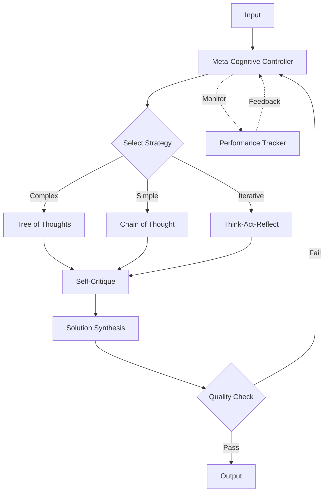

# Cognitive Architecture Patterns

Cognitive architectures implement structured thinking processes inspired by human cognition. These patterns enable AI systems to reason systematically, reflect on their actions, and improve through iterative thinking.

## Think-Act-Reflect (TAR) Pattern

TAR implements a cognitive loop for continuous improvement:

```python
from kaygraph import Node, Graph

class ThinkNode(Node):
    """Analyze situation and plan approach"""
    def prep(self, shared):
        return {
            "goal": shared.get("goal"),
            "context": shared.get("context", {}),
            "history": shared.get("action_history", [])
        }
    
    def exec(self, prep_res):
        # Analyze current situation
        analysis = call_llm(
            f"Goal: {prep_res['goal']}\n"
            f"Context: {prep_res['context']}\n"
            f"Previous actions: {prep_res['history']}\n"
            f"What should be the next action? Provide reasoning."
        )
        
        return {
            "reasoning": analysis,
            "proposed_action": self.extract_action(analysis)
        }
    
    def post(self, shared, prep_res, exec_res):
        shared["current_thinking"] = exec_res
        return None

class ActNode(Node):
    """Execute the planned action"""
    def prep(self, shared):
        return shared["current_thinking"]["proposed_action"]
    
    def exec(self, action):
        # Execute action (API call, tool use, etc.)
        result = execute_action(action)
        return {
            "action": action,
            "result": result,
            "success": result.get("status") == "success"
        }
    
    def post(self, shared, prep_res, exec_res):
        # Update action history
        history = shared.get("action_history", [])
        history.append(exec_res)
        shared["action_history"] = history
        shared["last_action_result"] = exec_res
        return None

class ReflectNode(Node):
    """Reflect on action outcomes"""
    def prep(self, shared):
        return {
            "goal": shared.get("goal"),
            "thinking": shared.get("current_thinking"),
            "result": shared.get("last_action_result")
        }
    
    def exec(self, prep_res):
        reflection = call_llm(
            f"Goal: {prep_res['goal']}\n"
            f"Reasoning: {prep_res['thinking']['reasoning']}\n"
            f"Action taken: {prep_res['result']['action']}\n"
            f"Result: {prep_res['result']['result']}\n"
            f"Reflect on this outcome. Is the goal achieved? What did we learn?"
        )
        
        return {
            "reflection": reflection,
            "goal_achieved": self.check_goal_completion(reflection),
            "lessons_learned": self.extract_lessons(reflection)
        }
    
    def post(self, shared, prep_res, exec_res):
        shared["reflections"] = shared.get("reflections", [])
        shared["reflections"].append(exec_res)
        
        if exec_res["goal_achieved"]:
            return "complete"
        else:
            # Update context with lessons learned
            shared["context"]["lessons"] = exec_res["lessons_learned"]
            return "continue"
```

## Chain of Thought (CoT) Pattern

Implement step-by-step reasoning:

```python
class ChainOfThoughtNode(Node):
    """Step-by-step reasoning process"""
    def prep(self, shared):
        return shared.get("problem")
    
    def exec(self, problem):
        # Generate chain of thought
        cot_prompt = f"""
        Problem: {problem}
        
        Let's think step by step:
        1. First, identify what we're asked to find
        2. List what information we have
        3. Determine the approach
        4. Work through each step
        5. Verify the answer
        
        Show your complete reasoning:
        """
        
        reasoning = call_llm(cot_prompt)
        
        # Extract steps and final answer
        steps = self.parse_reasoning_steps(reasoning)
        answer = self.extract_final_answer(reasoning)
        
        return {
            "problem": problem,
            "reasoning": reasoning,
            "steps": steps,
            "answer": answer
        }
    
    def parse_reasoning_steps(self, reasoning):
        # Extract numbered steps
        import re
        steps = re.findall(r'\d+\.\s*(.+?)(?=\d+\.|$)', reasoning, re.DOTALL)
        return [step.strip() for step in steps]
    
    def post(self, shared, prep_res, exec_res):
        shared["solution"] = exec_res
        
        # Confidence based on reasoning clarity
        if len(exec_res["steps"]) >= 3 and exec_res["answer"]:
            return "high_confidence"
        else:
            return "low_confidence"
```

## Tree of Thoughts (ToT) Pattern

Explore multiple reasoning paths:

```python
class TreeOfThoughtsNode(Node):
    """Explore multiple solution paths"""
    def __init__(self, branches=3, depth=3):
        super().__init__()
        self.branches = branches
        self.depth = depth
    
    def prep(self, shared):
        return {
            "problem": shared.get("problem"),
            "constraints": shared.get("constraints", [])
        }
    
    def exec(self, prep_res):
        # Build thought tree
        tree = self.build_thought_tree(
            prep_res["problem"], 
            prep_res["constraints"]
        )
        
        # Evaluate paths
        best_path = self.evaluate_paths(tree)
        
        return {
            "tree": tree,
            "best_path": best_path,
            "solution": best_path[-1]["solution"]
        }
    
    def build_thought_tree(self, problem, constraints, depth=0):
        if depth >= self.depth:
            return []
        
        # Generate multiple approaches
        prompt = f"""
        Problem: {problem}
        Constraints: {constraints}
        Current depth: {depth}
        
        Generate {self.branches} different approaches to solve this.
        """
        
        approaches = call_llm(prompt)
        branches = self.parse_approaches(approaches)
        
        # Recursively build tree
        tree = []
        for branch in branches:
            subtree = self.build_thought_tree(
                branch["subproblem"], 
                constraints, 
                depth + 1
            )
            tree.append({
                "approach": branch,
                "children": subtree
            })
        
        return tree
    
    def evaluate_paths(self, tree):
        # Find best path through tree
        # Implementation depends on evaluation criteria
        pass
```

## Self-Critique Pattern

Iterative self-improvement through critique:

```python
class SelfCritiqueNode(Node):
    """Generate and critique own outputs"""
    def __init__(self, max_iterations=3):
        super().__init__()
        self.max_iterations = max_iterations
    
    def prep(self, shared):
        return {
            "task": shared.get("task"),
            "requirements": shared.get("requirements", [])
        }
    
    def exec(self, prep_res):
        current_solution = None
        critiques = []
        
        for i in range(self.max_iterations):
            # Generate or improve solution
            if current_solution is None:
                current_solution = self.generate_initial_solution(prep_res)
            else:
                current_solution = self.improve_solution(
                    current_solution, 
                    critiques[-1]
                )
            
            # Critique solution
            critique = self.critique_solution(
                current_solution, 
                prep_res["requirements"]
            )
            critiques.append(critique)
            
            # Check if satisfactory
            if critique["score"] >= 0.9:
                break
        
        return {
            "final_solution": current_solution,
            "iterations": len(critiques),
            "critiques": critiques
        }
    
    def critique_solution(self, solution, requirements):
        critique_prompt = f"""
        Solution: {solution}
        Requirements: {requirements}
        
        Critically evaluate this solution:
        1. Does it meet all requirements?
        2. What are its strengths?
        3. What are its weaknesses?
        4. How could it be improved?
        5. Rate it from 0-1
        """
        
        critique = call_llm(critique_prompt)
        return self.parse_critique(critique)
```

## Meta-Cognitive Pattern

Monitor and control thinking processes:

```python
class MetaCognitiveNode(Node):
    """Monitor and adjust cognitive processes"""
    def prep(self, shared):
        return {
            "current_approach": shared.get("approach"),
            "progress": shared.get("progress", {}),
            "performance_history": shared.get("performance_history", [])
        }
    
    def exec(self, prep_res):
        # Evaluate current cognitive strategy
        evaluation = self.evaluate_strategy(prep_res)
        
        # Decide on adjustments
        if evaluation["effectiveness"] < 0.5:
            new_strategy = self.select_new_strategy(prep_res)
            adjustments = {
                "change_strategy": True,
                "new_strategy": new_strategy,
                "reason": evaluation["issues"]
            }
        else:
            adjustments = {
                "change_strategy": False,
                "optimizations": self.suggest_optimizations(evaluation)
            }
        
        return {
            "evaluation": evaluation,
            "adjustments": adjustments
        }
    
    def evaluate_strategy(self, context):
        # Analyze effectiveness of current approach
        return call_llm(
            f"Evaluate the effectiveness of approach: {context['current_approach']}\n"
            f"Given progress: {context['progress']}"
        )
```

## Complete Cognitive Architecture

Integrated cognitive system with multiple components:



## Implementation Example

```python
# Build cognitive architecture
cognitive_system = Graph()

# Create nodes
meta_controller = MetaCognitiveNode()
cot_reasoner = ChainOfThoughtNode()
tot_explorer = TreeOfThoughtsNode()
tar_loop = create_tar_subgraph()
critic = SelfCritiqueNode()
synthesizer = SolutionSynthesisNode()

# Add nodes
cognitive_system.add(
    meta_controller, cot_reasoner, tot_explorer,
    tar_loop, critic, synthesizer
)

# Connect based on strategy selection
cognitive_system.set_start(meta_controller)
meta_controller >> ("chain_of_thought", cot_reasoner)
meta_controller >> ("tree_of_thoughts", tot_explorer)
meta_controller >> ("think_act_reflect", tar_loop)

# All strategies go through critique
cot_reasoner >> critic
tot_explorer >> critic
tar_loop >> critic

# Final synthesis
critic >> synthesizer

def create_tar_subgraph():
    """Create Think-Act-Reflect subgraph"""
    tar = Graph()
    think = ThinkNode()
    act = ActNode()
    reflect = ReflectNode()
    
    tar.add(think, act, reflect)
    tar.set_start(think)
    
    think >> act >> reflect
    reflect >> ("continue", think)
    reflect >> ("complete", None)
    
    return tar
```

## Best Practices

1. **Clear Objectives**: Define clear goals for cognitive processes
2. **Iteration Limits**: Set maximum iterations to prevent infinite loops
3. **Progress Tracking**: Monitor progress to detect stuck states
4. **Strategy Selection**: Choose appropriate strategy based on problem type
5. **Memory Management**: Efficiently store and retrieve past experiences
6. **Explainability**: Make reasoning processes transparent
7. **Performance Metrics**: Track effectiveness of different strategies

## Advanced Applications

### Adaptive Learning System
```python
# System that improves its cognitive strategies over time
experience_db >> strategy_learner >> meta_controller >> executor
```

### Multi-Level Reasoning
```python
# Hierarchical reasoning with abstraction levels
high_level_planner >> mid_level_strategist >> low_level_executor
```

### Collaborative Cognition
```python
# Multiple cognitive agents working together
agent1_thinking >> shared_workspace << agent2_thinking
shared_workspace >> consensus_builder >> final_decision
```

## See Also

- [Agent Pattern](./agent.md) - Basic agent architecture
- [Multi-Agent Pattern](./multi_agent.md) - Multiple agents coordination
- [Human-in-the-Loop](./human_loop.md) - Human-AI collaboration
- Examples: `kaygraph-thinking`, `kaygraph-think-act-reflect`