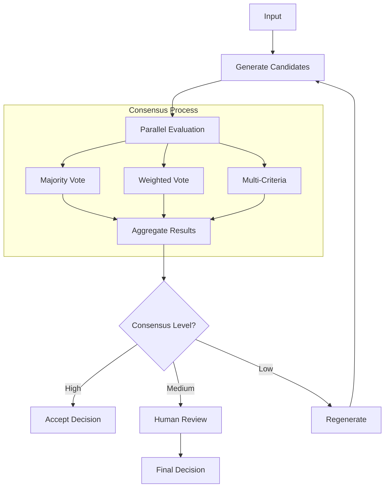

# Consensus & Voting Patterns

Consensus patterns enable robust decision-making by aggregating multiple opinions, models, or evaluation criteria. These patterns are essential for improving reliability, reducing bias, and ensuring quality in AI systems.

## Majority Vote Pattern

The simplest consensus mechanism aggregates multiple LLM responses:

```python
from kaygraph import ParallelBatchNode, Node, Graph
from collections import Counter

class MajorityVoteNode(ParallelBatchNode):
    """Get consensus from multiple LLM calls"""
    def __init__(self, num_voters=5):
        super().__init__(max_workers=num_voters)
        self.num_voters = num_voters
    
    def prep(self, shared):
        prompt = shared.get("prompt")
        # Create multiple voting instances
        return [prompt for _ in range(self.num_voters)]
    
    def exec(self, prompt):
        # Each worker makes independent decision
        response = call_llm(prompt)
        return self.extract_answer(response)
    
    def extract_answer(self, response):
        # Extract structured answer (e.g., yes/no, category)
        # This depends on your prompt design
        if "yes" in response.lower():
            return "yes"
        elif "no" in response.lower():
            return "no"
        else:
            return "uncertain"
    
    def post(self, shared, prep_res, exec_res):
        # Count votes
        vote_counts = Counter(exec_res)
        total_votes = len(exec_res)
        
        # Determine winner
        winner, count = vote_counts.most_common(1)[0]
        confidence = count / total_votes
        
        shared["consensus"] = {
            "decision": winner,
            "confidence": confidence,
            "votes": dict(vote_counts),
            "total_votes": total_votes
        }
        
        # Route based on confidence
        if confidence >= 0.8:
            return "high_confidence"
        elif confidence >= 0.6:
            return "medium_confidence"
        else:
            return "low_confidence"
```

## Weighted Voting Pattern

Assign different weights to voters based on expertise or performance:

```python
class WeightedVoteNode(ParallelBatchNode):
    """Weighted consensus from multiple sources"""
    def __init__(self, voters):
        super().__init__(max_workers=len(voters))
        self.voters = voters  # List of (model, weight) tuples
    
    def prep(self, shared):
        prompt = shared.get("prompt")
        # Prepare voter-specific prompts
        return [
            {"prompt": prompt, "model": model, "weight": weight}
            for model, weight in self.voters
        ]
    
    def exec(self, voter_info):
        # Call specific model
        response = call_llm(
            voter_info["prompt"],
            model=voter_info["model"]
        )
        return {
            "answer": self.extract_answer(response),
            "weight": voter_info["weight"],
            "model": voter_info["model"]
        }
    
    def post(self, shared, prep_res, exec_res):
        # Calculate weighted votes
        weighted_votes = {}
        total_weight = 0
        
        for result in exec_res:
            answer = result["answer"]
            weight = result["weight"]
            weighted_votes[answer] = weighted_votes.get(answer, 0) + weight
            total_weight += weight
        
        # Normalize and find winner
        normalized_votes = {
            k: v/total_weight for k, v in weighted_votes.items()
        }
        
        winner = max(normalized_votes.items(), key=lambda x: x[1])
        
        shared["weighted_consensus"] = {
            "decision": winner[0],
            "confidence": winner[1],
            "normalized_votes": normalized_votes,
            "raw_votes": exec_res
        }
        
        return None
```

## Multi-Criteria Consensus

Combine multiple evaluation criteria:

```python
class MultiCriteriaConsensusNode(Node):
    """Evaluate based on multiple criteria"""
    def __init__(self, criteria):
        super().__init__()
        self.criteria = criteria  # List of evaluation functions
    
    def prep(self, shared):
        return shared.get("candidate_solution")
    
    def exec(self, prep_res):
        # Evaluate against each criterion
        evaluations = {}
        
        for criterion_name, criterion_fn in self.criteria:
            score = criterion_fn(prep_res)
            evaluations[criterion_name] = score
        
        # Calculate overall score
        overall_score = sum(evaluations.values()) / len(evaluations)
        
        return {
            "solution": prep_res,
            "evaluations": evaluations,
            "overall_score": overall_score
        }
    
    def post(self, shared, prep_res, exec_res):
        shared["evaluation"] = exec_res
        
        # Route based on score
        if exec_res["overall_score"] >= 0.8:
            return "accept"
        elif exec_res["overall_score"] >= 0.5:
            return "review"
        else:
            return "reject"
```

## Ensemble Pattern

Combine different model types for robust predictions:

```python
class EnsembleNode(ParallelBatchNode):
    """Ensemble of different model types"""
    def __init__(self):
        super().__init__(max_workers=3)
        self.models = [
            ("gpt-4", self.gpt4_predict),
            ("claude", self.claude_predict),
            ("local_model", self.local_predict)
        ]
    
    def prep(self, shared):
        return [
            {"input": shared.get("input"), "model": model, "fn": fn}
            for model, fn in self.models
        ]
    
    def exec(self, model_info):
        # Call model-specific prediction
        prediction = model_info["fn"](model_info["input"])
        return {
            "model": model_info["model"],
            "prediction": prediction
        }
    
    def gpt4_predict(self, input_data):
        return call_llm(input_data, model="gpt-4")
    
    def claude_predict(self, input_data):
        return call_llm(input_data, model="claude")
    
    def local_predict(self, input_data):
        # Local model prediction
        return local_model.predict(input_data)
    
    def post(self, shared, prep_res, exec_res):
        # Aggregate predictions
        predictions = [r["prediction"] for r in exec_res]
        
        # Simple averaging for numeric predictions
        if all(isinstance(p, (int, float)) for p in predictions):
            ensemble_prediction = sum(predictions) / len(predictions)
        else:
            # For categorical, use majority vote
            ensemble_prediction = Counter(predictions).most_common(1)[0][0]
        
        shared["ensemble_result"] = {
            "prediction": ensemble_prediction,
            "individual_predictions": exec_res
        }
        
        return None
```

## Tournament Pattern

Run elimination rounds to find best solution:

```python
class TournamentNode(Node):
    """Tournament-style selection"""
    def prep(self, shared):
        return shared.get("candidates", [])
    
    def exec(self, candidates):
        # Run tournament rounds
        current_round = candidates
        round_num = 0
        
        while len(current_round) > 1:
            next_round = []
            
            # Pair up candidates
            for i in range(0, len(current_round), 2):
                if i + 1 < len(current_round):
                    winner = self.compare_pair(
                        current_round[i], 
                        current_round[i + 1]
                    )
                    next_round.append(winner)
                else:
                    # Odd candidate advances automatically
                    next_round.append(current_round[i])
            
            current_round = next_round
            round_num += 1
        
        return {
            "winner": current_round[0],
            "rounds": round_num
        }
    
    def compare_pair(self, candidate1, candidate2):
        # Compare two candidates
        comparison = call_llm(
            f"Compare these solutions and pick the better one:\n"
            f"Solution 1: {candidate1}\n"
            f"Solution 2: {candidate2}\n"
            f"Return '1' or '2'"
        )
        
        if "1" in comparison:
            return candidate1
        else:
            return candidate2
```

## Consensus Workflow

Complete consensus-based decision workflow:



## Implementation Example

```python
# Build consensus pipeline
consensus_graph = Graph()

# Nodes
generator = CandidateGeneratorNode()
majority = MajorityVoteNode(num_voters=5)
weighted = WeightedVoteNode([
    ("gpt-4", 0.4),
    ("claude", 0.4),
    ("llama", 0.2)
])
aggregator = ConsensusAggregatorNode()
decision = DecisionNode()

# Add nodes
consensus_graph.add(generator, majority, weighted, aggregator, decision)

# Connect
consensus_graph.set_start(generator)
generator >> majority
generator >> weighted
majority >> aggregator
weighted >> aggregator
aggregator >> decision

# Route based on consensus
decision >> ("accept", AcceptNode())
decision >> ("reject", RejectNode())
decision >> ("escalate", HumanReviewNode())
```

## Best Practices

1. **Diversity**: Use diverse models/prompts to avoid correlated errors
2. **Calibration**: Calibrate confidence scores with actual accuracy
3. **Efficiency**: Balance accuracy gains against computational cost
4. **Monitoring**: Track disagreement patterns to identify edge cases
5. **Thresholds**: Set appropriate confidence thresholds for your use case
6. **Fallbacks**: Have clear escalation paths for low-confidence decisions
7. **Transparency**: Log individual votes for debugging and auditing

## Advanced Techniques

### Dynamic Weight Adjustment
```python
# Adjust weights based on past performance
performance_tracker >> weight_calculator >> weighted_vote
```

### Hierarchical Consensus
```python
# Multi-level consensus for complex decisions
team_consensus >> department_consensus >> final_approval
```

### Conditional Consensus
```python
# Different consensus strategies based on input type
classifier >> ("technical", expert_panel)
classifier >> ("general", majority_vote)
```

## See Also

- [Multi-Agent Pattern](./multi_agent.md) - Coordinated agent systems
- [Validation Patterns](./validation.md) - Result validation
- [Agent Pattern](./agent.md) - Individual agent design
- Examples: `kaygraph-majority-vote`