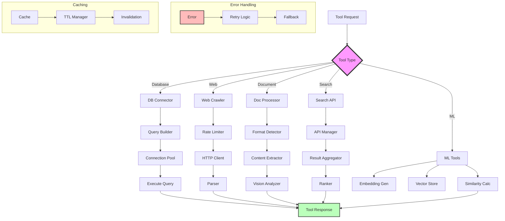

# Tool Integration Patterns

Tool integration patterns enable KayGraph applications to interact with external services, databases, APIs, and various data sources. These patterns provide structured approaches for web scraping, document processing, search integration, and database operations.

## Database Operations Pattern

Structured database interactions with connection management:

```python
from kaygraph import Node, Graph
import sqlite3
import psycopg2
from contextlib import closing

class DatabaseQueryNode(Node):
    """Execute database queries with proper resource management"""
    def __init__(self, connection_string):
        super().__init__()
        self.connection_string = connection_string
    
    def setup_resources(self):
        """Establish database connection"""
        if "postgresql" in self.connection_string:
            self.conn = psycopg2.connect(self.connection_string)
        else:
            self.conn = sqlite3.connect(self.connection_string)
        self.conn.row_factory = sqlite3.Row  # For SQLite
    
    def cleanup_resources(self):
        """Close database connection"""
        if hasattr(self, 'conn') and self.conn:
            self.conn.close()
    
    def prep(self, shared):
        return {
            "query": shared.get("query"),
            "params": shared.get("query_params", [])
        }
    
    def exec(self, prep_res):
        with closing(self.conn.cursor()) as cursor:
            cursor.execute(prep_res["query"], prep_res["params"])
            
            # Check if this is a SELECT query
            if prep_res["query"].strip().upper().startswith("SELECT"):
                results = cursor.fetchall()
                # Convert to list of dicts
                columns = [desc[0] for desc in cursor.description]
                return [dict(zip(columns, row)) for row in results]
            else:
                # For INSERT/UPDATE/DELETE
                self.conn.commit()
                return {"affected_rows": cursor.rowcount}
    
    def post(self, shared, prep_res, exec_res):
        shared["db_result"] = exec_res
        return None
```

## Web Crawler Pattern

Intelligent web scraping with rate limiting:

```python
import requests
from bs4 import BeautifulSoup
import time
from urllib.parse import urljoin, urlparse

class WebCrawlerNode(Node):
    """Web crawler with politeness and error handling"""
    def __init__(self, rate_limit=1.0, user_agent=None):
        super().__init__()
        self.rate_limit = rate_limit  # Seconds between requests
        self.last_request_time = 0
        self.session = requests.Session()
        self.session.headers.update({
            'User-Agent': user_agent or 'KayGraph-Crawler/1.0'
        })
    
    def prep(self, shared):
        return {
            "url": shared.get("url"),
            "max_depth": shared.get("max_depth", 1),
            "current_depth": shared.get("current_depth", 0),
            "visited_urls": shared.get("visited_urls", set())
        }
    
    def exec(self, prep_res):
        # Rate limiting
        time_since_last = time.time() - self.last_request_time
        if time_since_last < self.rate_limit:
            time.sleep(self.rate_limit - time_since_last)
        
        try:
            response = self.session.get(prep_res["url"], timeout=10)
            response.raise_for_status()
            self.last_request_time = time.time()
            
            # Parse content
            soup = BeautifulSoup(response.content, 'html.parser')
            
            # Extract data
            data = {
                "url": prep_res["url"],
                "title": soup.title.string if soup.title else None,
                "text": soup.get_text(strip=True),
                "links": [],
                "metadata": {
                    "status_code": response.status_code,
                    "content_type": response.headers.get('content-type'),
                    "size": len(response.content)
                }
            }
            
            # Extract links if not at max depth
            if prep_res["current_depth"] < prep_res["max_depth"]:
                base_url = response.url
                for link in soup.find_all('a', href=True):
                    absolute_url = urljoin(base_url, link['href'])
                    if absolute_url not in prep_res["visited_urls"]:
                        data["links"].append(absolute_url)
            
            return data
            
        except Exception as e:
            return {
                "url": prep_res["url"],
                "error": str(e),
                "status": "failed"
            }
    
    def post(self, shared, prep_res, exec_res):
        # Update visited URLs
        visited = shared.get("visited_urls", set())
        visited.add(prep_res["url"])
        shared["visited_urls"] = visited
        
        # Store crawled data
        crawled_data = shared.get("crawled_data", [])
        crawled_data.append(exec_res)
        shared["crawled_data"] = crawled_data
        
        # Queue new URLs for crawling
        if "links" in exec_res and exec_res["links"]:
            queue = shared.get("crawl_queue", [])
            for link in exec_res["links"][:10]:  # Limit to 10 links
                if link not in visited:
                    queue.append({
                        "url": link,
                        "depth": prep_res["current_depth"] + 1
                    })
            shared["crawl_queue"] = queue
        
        return None
```

## PDF Processing with Vision

Extract and analyze PDF content:

```python
import fitz  # PyMuPDF
from PIL import Image
import io

class PDFVisionNode(Node):
    """Process PDFs with text and image extraction"""
    def prep(self, shared):
        return {
            "pdf_path": shared.get("pdf_path"),
            "extract_images": shared.get("extract_images", True),
            "ocr_images": shared.get("ocr_images", False)
        }
    
    def exec(self, prep_res):
        doc = fitz.open(prep_res["pdf_path"])
        
        extracted_data = {
            "pages": [],
            "metadata": {
                "page_count": len(doc),
                "title": doc.metadata.get("title"),
                "author": doc.metadata.get("author"),
                "subject": doc.metadata.get("subject")
            }
        }
        
        for page_num, page in enumerate(doc):
            page_data = {
                "page_number": page_num + 1,
                "text": page.get_text(),
                "images": []
            }
            
            if prep_res["extract_images"]:
                # Extract images from page
                image_list = page.get_images()
                
                for img_index, img in enumerate(image_list):
                    # Get image data
                    xref = img[0]
                    base_image = doc.extract_image(xref)
                    image_bytes = base_image["image"]
                    
                    # Convert to PIL Image
                    image = Image.open(io.BytesIO(image_bytes))
                    
                    image_data = {
                        "index": img_index,
                        "size": image.size,
                        "mode": image.mode
                    }
                    
                    if prep_res["ocr_images"]:
                        # Perform OCR on image
                        ocr_text = perform_ocr(image)
                        image_data["ocr_text"] = ocr_text
                    
                    # Analyze image with vision model
                    vision_analysis = analyze_image_with_llm(image)
                    image_data["analysis"] = vision_analysis
                    
                    page_data["images"].append(image_data)
            
            extracted_data["pages"].append(page_data)
        
        doc.close()
        return extracted_data
    
    def post(self, shared, prep_res, exec_res):
        shared["pdf_data"] = exec_res
        
        # Create summary
        total_text = " ".join([
            page["text"] for page in exec_res["pages"]
        ])
        
        shared["pdf_summary"] = {
            "total_pages": exec_res["metadata"]["page_count"],
            "total_images": sum(len(p["images"]) for p in exec_res["pages"]),
            "text_length": len(total_text),
            "has_images": any(p["images"] for p in exec_res["pages"])
        }
        
        return None
```

## Search Integration Pattern

Integrate with search engines and APIs:

```python
class SearchNode(Node):
    """Multi-source search integration"""
    def __init__(self, search_providers=None):
        super().__init__()
        self.providers = search_providers or ["duckduckgo", "bing"]
    
    def prep(self, shared):
        return {
            "query": shared.get("search_query"),
            "max_results": shared.get("max_results", 10),
            "search_type": shared.get("search_type", "web")
        }
    
    def exec(self, prep_res):
        all_results = []
        
        for provider in self.providers:
            try:
                if provider == "duckduckgo":
                    results = self.search_duckduckgo(
                        prep_res["query"],
                        prep_res["max_results"]
                    )
                elif provider == "bing":
                    results = self.search_bing(
                        prep_res["query"],
                        prep_res["max_results"]
                    )
                elif provider == "google":
                    results = self.search_google_custom(
                        prep_res["query"],
                        prep_res["max_results"]
                    )
                
                all_results.extend(results)
                
            except Exception as e:
                print(f"Search failed for {provider}: {e}")
        
        # Deduplicate and rank results
        unique_results = self.deduplicate_results(all_results)
        ranked_results = self.rank_results(unique_results, prep_res["query"])
        
        return ranked_results[:prep_res["max_results"]]
    
    def search_duckduckgo(self, query, max_results):
        """Search using DuckDuckGo"""
        from duckduckgo_search import DDGS
        
        results = []
        with DDGS() as ddgs:
            for r in ddgs.text(query, max_results=max_results):
                results.append({
                    "title": r["title"],
                    "url": r["link"],
                    "snippet": r["body"],
                    "source": "duckduckgo"
                })
        
        return results
    
    def deduplicate_results(self, results):
        """Remove duplicate results by URL"""
        seen_urls = set()
        unique = []
        
        for result in results:
            if result["url"] not in seen_urls:
                seen_urls.add(result["url"])
                unique.append(result)
        
        return unique
    
    def rank_results(self, results, query):
        """Rank results by relevance"""
        # Simple ranking by query term presence
        query_terms = query.lower().split()
        
        for result in results:
            score = 0
            text = (result["title"] + " " + result["snippet"]).lower()
            
            for term in query_terms:
                score += text.count(term)
            
            result["relevance_score"] = score
        
        return sorted(results, key=lambda x: x["relevance_score"], reverse=True)
```

## Embeddings Operations

Work with vector embeddings:

```python
import numpy as np
from typing import List, Tuple

class EmbeddingNode(Node):
    """Generate and work with embeddings"""
    def __init__(self, model_name="text-embedding-ada-002"):
        super().__init__()
        self.model_name = model_name
        self.embedding_cache = {}
    
    def prep(self, shared):
        return {
            "texts": shared.get("texts", []),
            "operation": shared.get("embedding_operation", "generate")
        }
    
    def exec(self, prep_res):
        operation = prep_res["operation"]
        
        if operation == "generate":
            return self.generate_embeddings(prep_res["texts"])
        elif operation == "similarity":
            return self.calculate_similarity(prep_res["texts"])
        elif operation == "cluster":
            return self.cluster_embeddings(prep_res["texts"])
    
    def generate_embeddings(self, texts: List[str]) -> List[np.ndarray]:
        """Generate embeddings for texts"""
        embeddings = []
        
        for text in texts:
            # Check cache
            if text in self.embedding_cache:
                embeddings.append(self.embedding_cache[text])
            else:
                # Generate embedding
                embedding = call_embedding_api(text, self.model_name)
                self.embedding_cache[text] = embedding
                embeddings.append(embedding)
        
        return embeddings
    
    def calculate_similarity(self, texts: List[str]) -> np.ndarray:
        """Calculate pairwise similarities"""
        embeddings = self.generate_embeddings(texts)
        
        # Convert to numpy array
        embeddings_array = np.array(embeddings)
        
        # Calculate cosine similarity matrix
        similarity_matrix = np.zeros((len(texts), len(texts)))
        
        for i in range(len(texts)):
            for j in range(len(texts)):
                similarity = self.cosine_similarity(
                    embeddings_array[i],
                    embeddings_array[j]
                )
                similarity_matrix[i][j] = similarity
        
        return similarity_matrix
    
    def cosine_similarity(self, a: np.ndarray, b: np.ndarray) -> float:
        """Calculate cosine similarity between two vectors"""
        return np.dot(a, b) / (np.linalg.norm(a) * np.linalg.norm(b))
    
    def cluster_embeddings(self, texts: List[str]) -> dict:
        """Cluster texts based on embeddings"""
        from sklearn.cluster import KMeans
        
        embeddings = self.generate_embeddings(texts)
        embeddings_array = np.array(embeddings)
        
        # Determine optimal number of clusters
        n_clusters = min(5, len(texts) // 2)
        
        # Perform clustering
        kmeans = KMeans(n_clusters=n_clusters, random_state=42)
        clusters = kmeans.fit_predict(embeddings_array)
        
        # Group texts by cluster
        clustered_texts = {}
        for i, cluster_id in enumerate(clusters):
            if cluster_id not in clustered_texts:
                clustered_texts[cluster_id] = []
            clustered_texts[cluster_id].append({
                "text": texts[i],
                "distance_to_center": np.linalg.norm(
                    embeddings_array[i] - kmeans.cluster_centers_[cluster_id]
                )
            })
        
        return {
            "clusters": clustered_texts,
            "n_clusters": n_clusters,
            "inertia": kmeans.inertia_
        }
```

## Tool Integration Architecture

Complete tool integration system:



## Best Practices

1. **Connection Management**: Use connection pooling for databases
2. **Rate Limiting**: Respect API limits and robots.txt
3. **Error Handling**: Implement retries with exponential backoff
4. **Caching**: Cache expensive operations (embeddings, API calls)
5. **Resource Cleanup**: Always close connections and files
6. **Async Operations**: Use async for I/O-bound operations
7. **Security**: Validate inputs, sanitize outputs, use secure connections

## Tool Composition Example

```python
# Build multi-tool workflow
tool_graph = Graph()

# Create tool nodes
search = SearchNode()
crawler = WebCrawlerNode()
pdf_processor = PDFVisionNode()
db_writer = DatabaseQueryNode("postgresql://localhost/results")
embedder = EmbeddingNode()

# Add to graph
tool_graph.add(search, crawler, pdf_processor, db_writer, embedder)

# Connect workflow
tool_graph.set_start(search)
search >> crawler  # Crawl search results
crawler >> pdf_processor  # Process found PDFs
pdf_processor >> embedder  # Generate embeddings
embedder >> db_writer  # Store in database

# Run workflow
shared = {
    "search_query": "machine learning papers",
    "max_results": 5
}
tool_graph.run(shared)
```

## See Also

- [Resource Management](../production/resources.md) - Managing tool resources
- [External Services](../integrations/external.md) - Service integration
- [SQL Patterns](../integrations/sql.md) - Database patterns
- Examples: `kaygraph-tool-database`, `kaygraph-tool-crawler`, `kaygraph-tool-pdf-vision`, `kaygraph-tool-search`, `kaygraph-tool-embeddings`