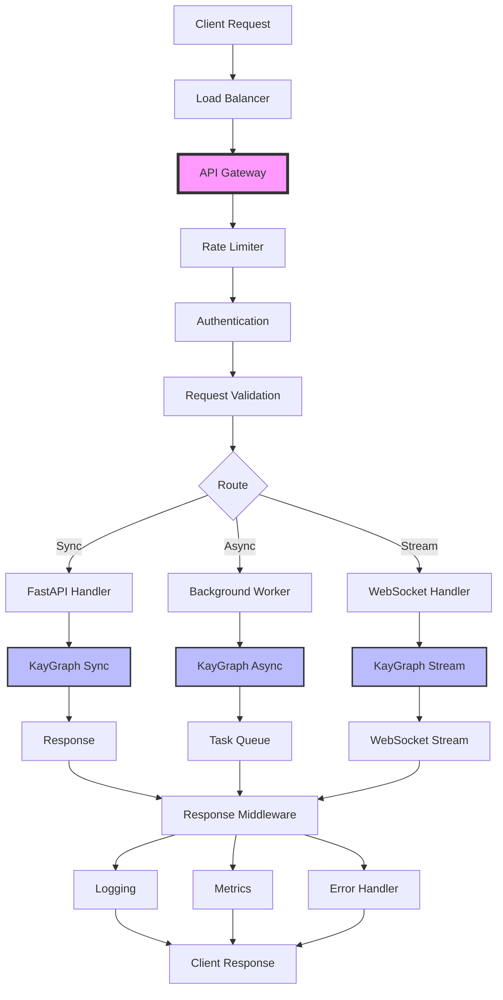

# Production API Integration

This guide covers building production-ready APIs with KayGraph, including FastAPI integration, background processing, WebSocket support, and enterprise features like authentication, rate limiting, and API versioning.

## FastAPI Integration

Basic FastAPI integration with KayGraph:

```python
from fastapi import FastAPI, HTTPException, BackgroundTasks
from kaygraph import Graph, Node
from pydantic import BaseModel
import uvicorn

# Request/Response models
class ProcessRequest(BaseModel):
    text: str
    options: dict = {}

class ProcessResponse(BaseModel):
    result: str
    metadata: dict

# Create FastAPI app
app = FastAPI(title="KayGraph API", version="1.0.0")

# Initialize KayGraph
class ProcessingNode(Node):
    def prep(self, shared):
        return shared.get("request_data")
    
    def exec(self, data):
        # Process the request
        result = process_text(data["text"], data["options"])
        return result
    
    def post(self, shared, prep_res, exec_res):
        shared["result"] = exec_res
        return None

# Create graph
processing_graph = Graph()
processor = ProcessingNode()
processing_graph.add(processor)
processing_graph.set_start(processor)

@app.post("/process", response_model=ProcessResponse)
async def process_endpoint(request: ProcessRequest):
    """Process text using KayGraph"""
    try:
        # Run graph
        shared = {"request_data": request.dict()}
        processing_graph.run(shared)
        
        return ProcessResponse(
            result=shared["result"]["text"],
            metadata=shared["result"]["metadata"]
        )
    except Exception as e:
        raise HTTPException(status_code=500, detail=str(e))

# Health check
@app.get("/health")
async def health_check():
    return {"status": "healthy", "service": "kaygraph-api"}
```

## Background Task Processing

Handle long-running tasks asynchronously:

```python
from fastapi import BackgroundTasks
from uuid import uuid4
import asyncio
from typing import Dict

# Task storage
tasks: Dict[str, dict] = {}

class AsyncProcessingNode(AsyncNode):
    """Long-running processing node"""
    async def exec_async(self, prep_res):
        # Simulate long processing
        await asyncio.sleep(10)
        result = await process_large_dataset_async(prep_res)
        return result

# Create async graph
async_graph = AsyncGraph()
async_processor = AsyncProcessingNode()
async_graph.add(async_processor)
async_graph.set_start(async_processor)

@app.post("/process/async")
async def process_async(
    request: ProcessRequest,
    background_tasks: BackgroundTasks
):
    """Start async processing task"""
    task_id = str(uuid4())
    
    # Initialize task status
    tasks[task_id] = {
        "id": task_id,
        "status": "pending",
        "created_at": datetime.now(),
        "result": None
    }
    
    # Add to background tasks
    background_tasks.add_task(
        run_async_processing,
        task_id,
        request.dict()
    )
    
    return {
        "task_id": task_id,
        "status": "accepted",
        "check_url": f"/tasks/{task_id}"
    }

async def run_async_processing(task_id: str, request_data: dict):
    """Background task runner"""
    try:
        tasks[task_id]["status"] = "processing"
        
        # Run async graph
        shared = {"request_data": request_data}
        await async_graph.run_async(shared)
        
        tasks[task_id]["status"] = "completed"
        tasks[task_id]["result"] = shared.get("result")
        tasks[task_id]["completed_at"] = datetime.now()
        
    except Exception as e:
        tasks[task_id]["status"] = "failed"
        tasks[task_id]["error"] = str(e)

@app.get("/tasks/{task_id}")
async def get_task_status(task_id: str):
    """Check task status"""
    if task_id not in tasks:
        raise HTTPException(status_code=404, detail="Task not found")
    
    return tasks[task_id]
```

## WebSocket Support

Real-time communication with WebSocket:

```python
from fastapi import WebSocket, WebSocketDisconnect
from kaygraph import AsyncNode, AsyncGraph
import json

class WebSocketManager:
    """Manage WebSocket connections"""
    def __init__(self):
        self.active_connections: List[WebSocket] = []
    
    async def connect(self, websocket: WebSocket):
        await websocket.accept()
        self.active_connections.append(websocket)
    
    def disconnect(self, websocket: WebSocket):
        self.active_connections.remove(websocket)
    
    async def send_personal_message(self, message: str, websocket: WebSocket):
        await websocket.send_text(message)
    
    async def broadcast(self, message: str):
        for connection in self.active_connections:
            await connection.send_text(message)

manager = WebSocketManager()

class StreamingProcessNode(AsyncNode):
    """Process and stream results"""
    def __init__(self, websocket: WebSocket):
        super().__init__()
        self.websocket = websocket
    
    async def exec_async(self, prep_res):
        # Process and stream results
        async for chunk in process_streaming(prep_res):
            await self.websocket.send_json({
                "type": "data",
                "chunk": chunk
            })
        
        return {"chunks_sent": True}

@app.websocket("/ws/{client_id}")
async def websocket_endpoint(websocket: WebSocket, client_id: str):
    await manager.connect(websocket)
    
    try:
        # Create streaming graph for this connection
        stream_graph = AsyncGraph()
        stream_node = StreamingProcessNode(websocket)
        stream_graph.add(stream_node)
        stream_graph.set_start(stream_node)
        
        while True:
            # Receive message
            data = await websocket.receive_text()
            message = json.loads(data)
            
            # Process with graph
            shared = {"message": message, "client_id": client_id}
            await stream_graph.run_async(shared)
            
    except WebSocketDisconnect:
        manager.disconnect(websocket)
        print(f"Client {client_id} disconnected")
```

## Authentication & Authorization

Secure API endpoints:

```python
from fastapi import Depends, HTTPException, status
from fastapi.security import HTTPBearer, HTTPAuthorizationCredentials
from jose import JWTError, jwt
from datetime import datetime, timedelta

# Security configuration
SECRET_KEY = "your-secret-key"
ALGORITHM = "HS256"
ACCESS_TOKEN_EXPIRE_MINUTES = 30

security = HTTPBearer()

def create_access_token(data: dict):
    """Create JWT token"""
    to_encode = data.copy()
    expire = datetime.utcnow() + timedelta(minutes=ACCESS_TOKEN_EXPIRE_MINUTES)
    to_encode.update({"exp": expire})
    encoded_jwt = jwt.encode(to_encode, SECRET_KEY, algorithm=ALGORITHM)
    return encoded_jwt

async def verify_token(credentials: HTTPAuthorizationCredentials = Depends(security)):
    """Verify JWT token"""
    token = credentials.credentials
    try:
        payload = jwt.decode(token, SECRET_KEY, algorithms=[ALGORITHM])
        username: str = payload.get("sub")
        if username is None:
            raise HTTPException(
                status_code=status.HTTP_401_UNAUTHORIZED,
                detail="Invalid authentication credentials"
            )
        return username
    except JWTError:
        raise HTTPException(
            status_code=status.HTTP_401_UNAUTHORIZED,
            detail="Invalid authentication credentials"
        )

# Protected endpoint
@app.post("/protected/process")
async def protected_process(
    request: ProcessRequest,
    current_user: str = Depends(verify_token)
):
    """Protected processing endpoint"""
    # Add user context to graph
    shared = {
        "request_data": request.dict(),
        "user": current_user,
        "timestamp": datetime.now()
    }
    
    processing_graph.run(shared)
    
    return {
        "result": shared["result"],
        "user": current_user
    }
```

## Rate Limiting

Implement API rate limiting:

```python
from fastapi import Request
from slowapi import Limiter, _rate_limit_exceeded_handler
from slowapi.util import get_remote_address
from slowapi.errors import RateLimitExceeded

# Create limiter
limiter = Limiter(key_func=get_remote_address)
app.state.limiter = limiter
app.add_exception_handler(RateLimitExceeded, _rate_limit_exceeded_handler)

@app.post("/process")
@limiter.limit("10/minute")
async def rate_limited_process(
    request: Request,
    process_request: ProcessRequest
):
    """Rate-limited processing endpoint"""
    shared = {"request_data": process_request.dict()}
    processing_graph.run(shared)
    return {"result": shared["result"]}

# Custom rate limiting based on user tier
class TieredRateLimiter:
    """Rate limiting based on user tier"""
    def __init__(self):
        self.limits = {
            "free": 10,
            "basic": 100,
            "premium": 1000
        }
    
    async def check_rate_limit(self, user_id: str, tier: str):
        """Check if user exceeded rate limit"""
        limit = self.limits.get(tier, 10)
        
        # Check Redis for current usage
        current = await redis_client.incr(f"rate:{user_id}")
        
        if current == 1:
            # Set expiration for the first request
            await redis_client.expire(f"rate:{user_id}", 60)
        
        if current > limit:
            raise HTTPException(
                status_code=429,
                detail=f"Rate limit exceeded. Limit: {limit}/minute"
            )
        
        return current

rate_limiter = TieredRateLimiter()

@app.post("/tiered/process")
async def tiered_process(
    request: ProcessRequest,
    current_user: dict = Depends(get_current_user)
):
    """Tiered rate limiting"""
    await rate_limiter.check_rate_limit(
        current_user["id"],
        current_user["tier"]
    )
    
    # Process request
    shared = {"request_data": request.dict()}
    processing_graph.run(shared)
    
    return {"result": shared["result"]}
```

## API Versioning

Support multiple API versions:

```python
from fastapi import APIRouter

# Version 1 router
v1_router = APIRouter(prefix="/api/v1", tags=["v1"])

@v1_router.post("/process")
async def process_v1(request: ProcessRequest):
    """Version 1 processing"""
    # Use v1 graph
    shared = {"request_data": request.dict()}
    v1_graph.run(shared)
    return {"result": shared["result"], "version": "1.0"}

# Version 2 router with new features
v2_router = APIRouter(prefix="/api/v2", tags=["v2"])

class ProcessRequestV2(ProcessRequest):
    advanced_options: dict = {}
    priority: str = "normal"

@v2_router.post("/process")
async def process_v2(request: ProcessRequestV2):
    """Version 2 processing with new features"""
    # Use v2 graph with advanced features
    shared = {
        "request_data": request.dict(),
        "priority": request.priority
    }
    v2_graph.run(shared)
    return {
        "result": shared["result"],
        "version": "2.0",
        "advanced_metrics": shared.get("metrics", {})
    }

# Register routers
app.include_router(v1_router)
app.include_router(v2_router)
```

## Error Handling & Logging

Comprehensive error handling:

```python
from fastapi import Request
from fastapi.responses import JSONResponse
import logging
import traceback

# Configure logging
logging.basicConfig(level=logging.INFO)
logger = logging.getLogger(__name__)

class APIError(Exception):
    """Custom API exception"""
    def __init__(self, status_code: int, detail: str, error_code: str = None):
        self.status_code = status_code
        self.detail = detail
        self.error_code = error_code

@app.exception_handler(APIError)
async def api_error_handler(request: Request, exc: APIError):
    """Handle custom API errors"""
    return JSONResponse(
        status_code=exc.status_code,
        content={
            "error": exc.detail,
            "error_code": exc.error_code,
            "request_id": request.state.request_id
        }
    )

@app.exception_handler(Exception)
async def general_exception_handler(request: Request, exc: Exception):
    """Handle unexpected errors"""
    logger.error(f"Unexpected error: {exc}", exc_info=True)
    
    return JSONResponse(
        status_code=500,
        content={
            "error": "Internal server error",
            "request_id": request.state.request_id,
            "detail": str(exc) if app.debug else None
        }
    )

@app.middleware("http")
async def add_request_id(request: Request, call_next):
    """Add request ID for tracking"""
    request_id = request.headers.get("X-Request-ID", str(uuid4()))
    request.state.request_id = request_id
    
    response = await call_next(request)
    response.headers["X-Request-ID"] = request_id
    
    return response

@app.middleware("http")
async def log_requests(request: Request, call_next):
    """Log all requests"""
    start_time = time.time()
    
    response = await call_next(request)
    
    process_time = time.time() - start_time
    logger.info(
        f"{request.method} {request.url.path} "
        f"status={response.status_code} "
        f"duration={process_time:.3f}s "
        f"request_id={request.state.request_id}"
    )
    
    return response
```

## Production Deployment

Complete production API setup:



## Production Configuration

```python
# Production API configuration
from pydantic import BaseSettings

class Settings(BaseSettings):
    # API Settings
    api_title: str = "KayGraph Production API"
    api_version: str = "1.0.0"
    api_prefix: str = "/api"
    
    # Security
    secret_key: str
    algorithm: str = "HS256"
    access_token_expire_minutes: int = 30
    
    # Rate Limiting
    rate_limit_default: str = "100/minute"
    rate_limit_burst: int = 10
    
    # Database
    database_url: str
    database_pool_size: int = 20
    
    # Redis
    redis_url: str
    redis_pool_size: int = 10
    
    # Monitoring
    sentry_dsn: str = None
    log_level: str = "INFO"
    
    # Performance
    worker_count: int = 4
    worker_timeout: int = 120
    keepalive: int = 5
    
    class Config:
        env_file = ".env"

settings = Settings()

# Production server startup
if __name__ == "__main__":
    uvicorn.run(
        "main:app",
        host="0.0.0.0",
        port=8000,
        workers=settings.worker_count,
        loop="uvloop",
        log_level=settings.log_level.lower(),
        access_log=True
    )
```

## Best Practices

1. **Use Async**: Leverage async/await for I/O operations
2. **Implement Timeouts**: Set reasonable timeouts for all operations
3. **Version Your API**: Plan for backward compatibility
4. **Monitor Everything**: Log requests, errors, and performance
5. **Secure by Default**: Always authenticate and validate
6. **Cache Wisely**: Cache expensive operations
7. **Document API**: Use OpenAPI/Swagger documentation

## See Also

- [Streaming Patterns](../patterns/streaming.md) - WebSocket streaming
- [Validation](../patterns/validation.md) - Request validation
- [Metrics](./metrics.md) - API metrics and monitoring
- Examples: `kaygraph-production-ready-api`, `kaygraph-fastapi-background`, `kaygraph-fastapi-websocket`