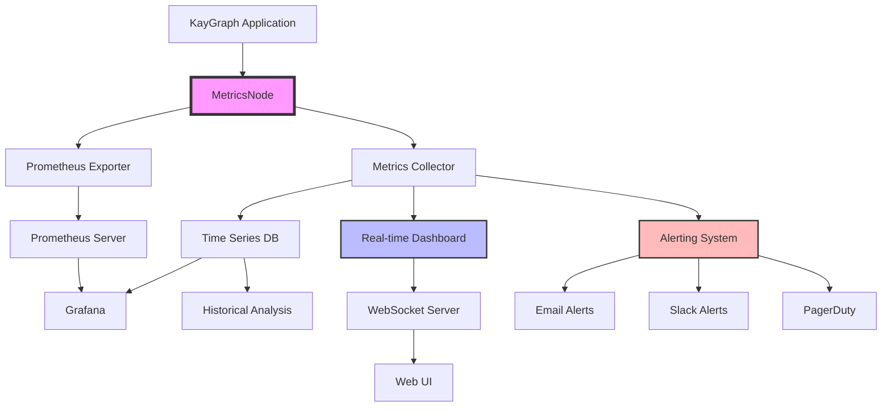

# Metrics & Monitoring

Production metrics and monitoring are essential for understanding system performance, identifying bottlenecks, and ensuring reliability. KayGraph provides built-in `MetricsNode` and patterns for comprehensive observability.

## MetricsNode Overview

The built-in `MetricsNode` automatically tracks execution metrics:

```python
from kaygraph import MetricsNode, Graph

class DataProcessingNode(MetricsNode):
    """Node with automatic metrics collection"""
    def prep(self, shared):
        return shared.get("data")
    
    def exec(self, data):
        # Process data - metrics tracked automatically
        result = process_large_dataset(data)
        return result
    
    def post(self, shared, prep_res, exec_res):
        shared["processed_data"] = exec_res
        
        # Access metrics
        stats = self.get_stats()
        print(f"Execution time: {stats['total_time']:.2f}s")
        print(f"Success rate: {stats['success_rate']:.2%}")
        
        return None

# Usage
node = DataProcessingNode()
graph = Graph()
graph.add(node)
graph.set_start(node)

# Run multiple times
for i in range(100):
    graph.run({"data": get_data(i)})

# Get comprehensive metrics
metrics = node.get_stats()
print(f"""
Node Metrics:
- Total executions: {metrics['total_count']}
- Success rate: {metrics['success_rate']:.2%}
- Average time: {metrics['avg_time']:.3f}s
- Min time: {metrics['min_time']:.3f}s
- Max time: {metrics['max_time']:.3f}s
- Total time: {metrics['total_time']:.2f}s
""")
```

## Custom Metrics Collection

Extend MetricsNode with custom metrics:

```python
class CustomMetricsNode(MetricsNode):
    """Node with custom metrics"""
    def __init__(self):
        super().__init__()
        self.custom_metrics = {
            "tokens_processed": 0,
            "cache_hits": 0,
            "cache_misses": 0,
            "api_calls": 0,
            "api_errors": 0
        }
    
    def exec(self, prep_res):
        result = None
        
        # Check cache
        cache_key = self.generate_cache_key(prep_res)
        cached = self.check_cache(cache_key)
        
        if cached:
            self.custom_metrics["cache_hits"] += 1
            result = cached
        else:
            self.custom_metrics["cache_misses"] += 1
            
            # Make API call
            try:
                self.custom_metrics["api_calls"] += 1
                result = call_external_api(prep_res)
                self.custom_metrics["tokens_processed"] += len(result.split())
            except Exception as e:
                self.custom_metrics["api_errors"] += 1
                raise
        
        return result
    
    def get_custom_stats(self):
        """Get custom metrics with rates"""
        total_cache_attempts = (
            self.custom_metrics["cache_hits"] + 
            self.custom_metrics["cache_misses"]
        )
        
        return {
            **self.custom_metrics,
            "cache_hit_rate": (
                self.custom_metrics["cache_hits"] / total_cache_attempts
                if total_cache_attempts > 0 else 0
            ),
            "api_error_rate": (
                self.custom_metrics["api_errors"] / self.custom_metrics["api_calls"]
                if self.custom_metrics["api_calls"] > 0 else 0
            ),
            "avg_tokens_per_call": (
                self.custom_metrics["tokens_processed"] / self.custom_metrics["api_calls"]
                if self.custom_metrics["api_calls"] > 0 else 0
            )
        }
```

## Real-Time Monitoring Dashboard

Create a monitoring dashboard with live metrics:

```python
import time
import threading
from collections import deque
from datetime import datetime, timedelta

class MetricsDashboard:
    """Real-time metrics dashboard"""
    def __init__(self, graph, window_minutes=5):
        self.graph = graph
        self.window_minutes = window_minutes
        self.metrics_history = deque(maxlen=1000)
        self.running = False
    
    def start_monitoring(self):
        """Start background monitoring"""
        self.running = True
        monitor_thread = threading.Thread(target=self._monitor_loop)
        monitor_thread.daemon = True
        monitor_thread.start()
    
    def _monitor_loop(self):
        """Background monitoring loop"""
        while self.running:
            # Collect metrics from all nodes
            metrics_snapshot = self.collect_metrics()
            self.metrics_history.append({
                "timestamp": datetime.now(),
                "metrics": metrics_snapshot
            })
            
            # Update dashboard
            self.update_dashboard()
            
            time.sleep(1)  # Update every second
    
    def collect_metrics(self):
        """Collect current metrics from all nodes"""
        metrics = {}
        
        for node_id, node in self.graph.nodes.items():
            if isinstance(node, MetricsNode):
                metrics[node_id] = {
                    "stats": node.get_stats(),
                    "custom": getattr(node, 'get_custom_stats', lambda: {})()
                }
        
        return metrics
    
    def get_recent_metrics(self):
        """Get metrics from recent window"""
        cutoff = datetime.now() - timedelta(minutes=self.window_minutes)
        return [
            m for m in self.metrics_history 
            if m["timestamp"] > cutoff
        ]
    
    def calculate_trends(self):
        """Calculate metric trends"""
        recent = self.get_recent_metrics()
        if len(recent) < 2:
            return {}
        
        # Calculate trends for each metric
        trends = {}
        first_metrics = recent[0]["metrics"]
        last_metrics = recent[-1]["metrics"]
        
        for node_id in first_metrics:
            if node_id in last_metrics:
                trends[node_id] = self._calculate_node_trends(
                    first_metrics[node_id],
                    last_metrics[node_id]
                )
        
        return trends
```

## Prometheus Integration

Export metrics for Prometheus monitoring:

```python
from prometheus_client import Counter, Histogram, Gauge, start_http_server

class PrometheusMetricsNode(MetricsNode):
    """Node with Prometheus metrics export"""
    
    # Define Prometheus metrics
    execution_counter = Counter(
        'kaygraph_node_executions_total',
        'Total number of node executions',
        ['node_name', 'status']
    )
    
    execution_duration = Histogram(
        'kaygraph_node_duration_seconds',
        'Node execution duration',
        ['node_name']
    )
    
    active_executions = Gauge(
        'kaygraph_node_active_executions',
        'Number of active node executions',
        ['node_name']
    )
    
    def __init__(self, name):
        super().__init__()
        self.name = name
    
    def exec(self, prep_res):
        # Track active executions
        self.active_executions.labels(node_name=self.name).inc()
        
        try:
            # Time execution
            with self.execution_duration.labels(node_name=self.name).time():
                result = self.process(prep_res)
            
            # Count success
            self.execution_counter.labels(
                node_name=self.name,
                status="success"
            ).inc()
            
            return result
            
        except Exception as e:
            # Count failure
            self.execution_counter.labels(
                node_name=self.name,
                status="failure"
            ).inc()
            raise
        finally:
            # Decrement active executions
            self.active_executions.labels(node_name=self.name).dec()

# Start Prometheus metrics server
start_http_server(8000)
```

## Performance Profiling

Profile node execution for optimization:

```python
import cProfile
import pstats
from io import StringIO

class ProfilingNode(MetricsNode):
    """Node with performance profiling"""
    def __init__(self, profile_enabled=True):
        super().__init__()
        self.profile_enabled = profile_enabled
        self.profiler = cProfile.Profile() if profile_enabled else None
    
    def exec(self, prep_res):
        if self.profile_enabled:
            self.profiler.enable()
        
        try:
            result = self.process(prep_res)
            return result
        finally:
            if self.profile_enabled:
                self.profiler.disable()
    
    def get_profile_stats(self, top_n=10):
        """Get profiling statistics"""
        if not self.profile_enabled:
            return "Profiling not enabled"
        
        s = StringIO()
        ps = pstats.Stats(self.profiler, stream=s).sort_stats('cumulative')
        ps.print_stats(top_n)
        
        return s.getvalue()
    
    def identify_bottlenecks(self):
        """Identify performance bottlenecks"""
        stats = pstats.Stats(self.profiler)
        stats.sort_stats('time')
        
        bottlenecks = []
        for func, (cc, nc, tt, ct, callers) in stats.stats.items():
            if tt > 0.1:  # Functions taking > 100ms
                bottlenecks.append({
                    "function": func,
                    "total_time": tt,
                    "calls": nc,
                    "time_per_call": tt / nc if nc > 0 else 0
                })
        
        return sorted(bottlenecks, key=lambda x: x["total_time"], reverse=True)
```

## Alerting System

Implement alerting based on metrics:

```python
class AlertingSystem:
    """Alert on metric thresholds"""
    def __init__(self):
        self.rules = []
        self.alert_handlers = []
    
    def add_rule(self, rule):
        """Add alerting rule"""
        self.rules.append(rule)
    
    def add_handler(self, handler):
        """Add alert handler"""
        self.alert_handlers.append(handler)
    
    def check_metrics(self, metrics):
        """Check metrics against rules"""
        for rule in self.rules:
            if rule.should_alert(metrics):
                alert = rule.create_alert(metrics)
                self.send_alert(alert)
    
    def send_alert(self, alert):
        """Send alert through all handlers"""
        for handler in self.alert_handlers:
            handler.send(alert)

class MetricRule:
    """Base class for metric rules"""
    def __init__(self, node_name, metric_name, threshold):
        self.node_name = node_name
        self.metric_name = metric_name
        self.threshold = threshold
    
    def should_alert(self, metrics):
        """Check if rule triggers alert"""
        node_metrics = metrics.get(self.node_name, {})
        value = node_metrics.get("stats", {}).get(self.metric_name, 0)
        return self.check_threshold(value)
    
    def check_threshold(self, value):
        """Override in subclasses"""
        raise NotImplementedError

class ErrorRateRule(MetricRule):
    """Alert on high error rate"""
    def __init__(self, node_name, threshold=0.05):
        super().__init__(node_name, "error_rate", threshold)
    
    def check_threshold(self, value):
        return value > self.threshold
    
    def create_alert(self, metrics):
        error_rate = metrics[self.node_name]["stats"]["error_rate"]
        return {
            "severity": "critical" if error_rate > 0.1 else "warning",
            "node": self.node_name,
            "message": f"High error rate: {error_rate:.2%}",
            "value": error_rate,
            "threshold": self.threshold
        }
```

## Metrics Aggregation

Aggregate metrics across multiple nodes:

```python
class MetricsAggregator:
    """Aggregate metrics from multiple sources"""
    def __init__(self):
        self.node_metrics = {}
    
    def update_metrics(self, node_id, metrics):
        """Update metrics for a node"""
        self.node_metrics[node_id] = metrics
    
    def get_aggregate_metrics(self):
        """Calculate aggregate metrics"""
        if not self.node_metrics:
            return {}
        
        aggregate = {
            "total_executions": 0,
            "total_errors": 0,
            "total_time": 0,
            "nodes_active": 0,
            "avg_success_rate": 0
        }
        
        success_rates = []
        
        for node_id, metrics in self.node_metrics.items():
            stats = metrics.get("stats", {})
            
            aggregate["total_executions"] += stats.get("total_count", 0)
            aggregate["total_errors"] += stats.get("error_count", 0)
            aggregate["total_time"] += stats.get("total_time", 0)
            
            if stats.get("total_count", 0) > 0:
                aggregate["nodes_active"] += 1
                success_rates.append(stats.get("success_rate", 0))
        
        if success_rates:
            aggregate["avg_success_rate"] = sum(success_rates) / len(success_rates)
        
        return aggregate
```

## Complete Monitoring Solution

Integrated monitoring system with dashboard:



## Best Practices

1. **Metric Selection**: Track metrics that matter for your use case
2. **Sampling Rate**: Balance detail with performance overhead
3. **Retention Policy**: Define how long to keep historical metrics
4. **Alert Fatigue**: Set meaningful thresholds to avoid noise
5. **Dashboard Design**: Create clear, actionable visualizations
6. **Performance Impact**: Minimize metrics collection overhead
7. **Privacy**: Don't log sensitive data in metrics

## Production Configuration

```python
# Production monitoring setup
monitoring_config = {
    "metrics": {
        "enabled": True,
        "export_interval": 60,  # seconds
        "retention_days": 30
    },
    "prometheus": {
        "enabled": True,
        "port": 8000,
        "path": "/metrics"
    },
    "alerting": {
        "enabled": True,
        "rules": [
            {"type": "error_rate", "threshold": 0.05},
            {"type": "latency", "threshold": 5.0},
            {"type": "throughput", "threshold": 10}
        ]
    },
    "dashboard": {
        "enabled": True,
        "update_interval": 1,  # seconds
        "port": 3000
    }
}
```

## See Also

- [Monitoring](./monitoring.md) - General monitoring strategies
- [Distributed Tracing](../patterns/tracing.md) - Request tracing
- [Performance Optimization](./troubleshooting.md) - Performance tuning
- Examples: `kaygraph-metrics-dashboard`, `kaygraph-realtime-monitoring`