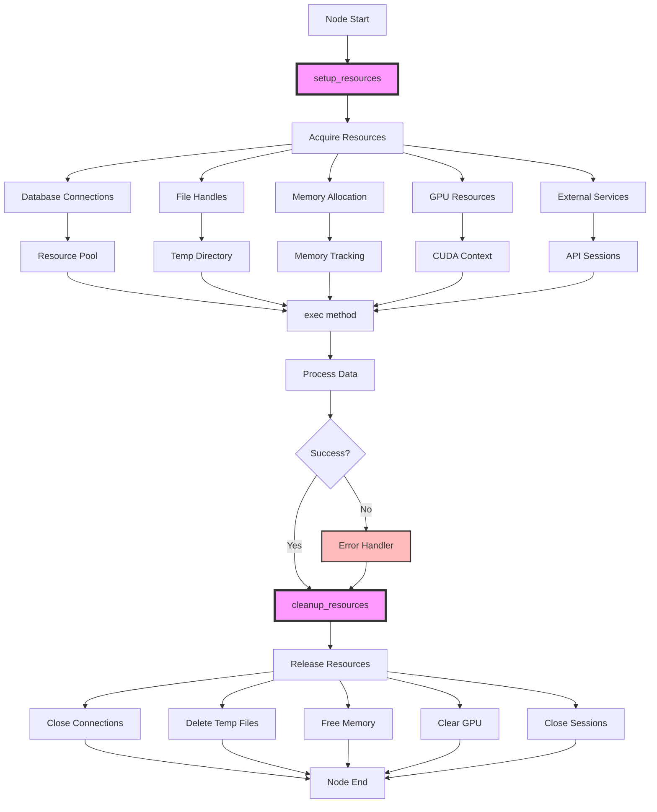

# Resource Management

Efficient resource management is crucial for production KayGraph applications. This guide covers context managers, cleanup patterns, connection pooling, and resource lifecycle management.

## Context Manager Support

KayGraph nodes support Python's context manager protocol for automatic resource management:

```python
from kaygraph import Node
import psycopg2
from contextlib import contextmanager

class DatabaseNode(Node):
    """Node with automatic database connection management"""
    def __init__(self, connection_string):
        super().__init__()
        self.connection_string = connection_string
        self.connection = None
        self.cursor = None
    
    def setup_resources(self):
        """Called when entering context (node execution starts)"""
        self.connection = psycopg2.connect(self.connection_string)
        self.cursor = self.connection.cursor()
        print("Database connection established")
    
    def cleanup_resources(self):
        """Called when exiting context (node execution ends)"""
        if self.cursor:
            self.cursor.close()
        if self.connection:
            self.connection.commit()
            self.connection.close()
        print("Database connection closed")
    
    def prep(self, shared):
        return shared.get("query")
    
    def exec(self, query):
        # Resources are automatically available
        self.cursor.execute(query)
        results = self.cursor.fetchall()
        return results
    
    def post(self, shared, prep_res, exec_res):
        shared["query_results"] = exec_res
        return None
```

## File Resource Management

Proper handling of file operations:

```python
class FileProcessingNode(Node):
    """Node with file resource management"""
    def __init__(self):
        super().__init__()
        self.temp_files = []
        self.open_files = []
    
    def setup_resources(self):
        """Prepare file handling resources"""
        import tempfile
        self.temp_dir = tempfile.mkdtemp()
        print(f"Created temp directory: {self.temp_dir}")
    
    def cleanup_resources(self):
        """Clean up all file resources"""
        # Close all open files
        for f in self.open_files:
            if not f.closed:
                f.close()
        
        # Remove temporary files
        import shutil
        if hasattr(self, 'temp_dir'):
            shutil.rmtree(self.temp_dir)
            print(f"Cleaned up temp directory: {self.temp_dir}")
    
    def exec(self, prep_res):
        # Create temporary file
        import os
        temp_file = os.path.join(self.temp_dir, "processing.tmp")
        
        # Process with automatic cleanup
        with open(temp_file, 'w') as f:
            f.write(prep_res["data"])
            self.temp_files.append(temp_file)
        
        # Read and process
        with open(temp_file, 'r') as f:
            processed = self.process_file(f)
        
        return processed
```

## Connection Pooling

Efficient management of expensive connections:

```python
from queue import Queue
import threading

class ConnectionPool:
    """Thread-safe connection pool"""
    def __init__(self, create_connection, max_connections=10):
        self.create_connection = create_connection
        self.max_connections = max_connections
        self.pool = Queue(maxsize=max_connections)
        self.all_connections = []
        self.lock = threading.Lock()
    
    def get_connection(self):
        """Get connection from pool or create new"""
        try:
            conn = self.pool.get_nowait()
        except:
            with self.lock:
                if len(self.all_connections) < self.max_connections:
                    conn = self.create_connection()
                    self.all_connections.append(conn)
                else:
                    conn = self.pool.get()  # Wait for available connection
        
        return conn
    
    def return_connection(self, conn):
        """Return connection to pool"""
        if conn and conn.is_valid():
            self.pool.put(conn)
    
    def close_all(self):
        """Close all connections"""
        with self.lock:
            for conn in self.all_connections:
                try:
                    conn.close()
                except:
                    pass
            self.all_connections.clear()

class PooledDatabaseNode(Node):
    """Node using connection pool"""
    # Class-level pool shared across instances
    _pool = None
    
    @classmethod
    def initialize_pool(cls, connection_string, max_connections=10):
        """Initialize the connection pool"""
        if cls._pool is None:
            cls._pool = ConnectionPool(
                lambda: psycopg2.connect(connection_string),
                max_connections
            )
    
    def exec(self, prep_res):
        conn = self._pool.get_connection()
        try:
            cursor = conn.cursor()
            cursor.execute(prep_res["query"])
            results = cursor.fetchall()
            cursor.close()
            return results
        finally:
            self._pool.return_connection(conn)
```

## Memory Management

Handle memory-intensive operations:

```python
import gc
import tracemalloc

class MemoryManagedNode(Node):
    """Node with memory management"""
    def __init__(self, memory_limit_mb=1024):
        super().__init__()
        self.memory_limit_mb = memory_limit_mb
        self.large_objects = []
    
    def setup_resources(self):
        """Start memory tracking"""
        tracemalloc.start()
        self.start_memory = tracemalloc.get_traced_memory()[0]
    
    def cleanup_resources(self):
        """Clean up memory"""
        # Clear large objects
        self.large_objects.clear()
        
        # Force garbage collection
        gc.collect()
        
        # Log memory usage
        current, peak = tracemalloc.get_traced_memory()
        tracemalloc.stop()
        
        print(f"Memory usage: {current / 1024 / 1024:.2f} MB")
        print(f"Peak memory: {peak / 1024 / 1024:.2f} MB")
    
    def exec(self, prep_res):
        # Monitor memory during execution
        current_memory = tracemalloc.get_traced_memory()[0]
        used_mb = (current_memory - self.start_memory) / 1024 / 1024
        
        if used_mb > self.memory_limit_mb:
            raise MemoryError(f"Memory limit exceeded: {used_mb:.2f} MB")
        
        # Process data in chunks to manage memory
        results = []
        for chunk in self.process_in_chunks(prep_res["data"]):
            result = self.process_chunk(chunk)
            results.append(result)
            
            # Clean up after each chunk
            del chunk
            if len(self.large_objects) > 10:
                self.large_objects = self.large_objects[-5:]
                gc.collect()
        
        return results
```

## GPU Resource Management

Handle GPU resources for ML workloads:

```python
class GPUNode(Node):
    """Node with GPU resource management"""
    def __init__(self, gpu_id=0):
        super().__init__()
        self.gpu_id = gpu_id
        self.model = None
    
    def setup_resources(self):
        """Allocate GPU resources"""
        import torch
        
        # Set GPU device
        self.device = torch.device(f"cuda:{self.gpu_id}" if torch.cuda.is_available() else "cpu")
        
        # Load model to GPU
        self.model = load_model().to(self.device)
        self.model.eval()
        
        # Log GPU memory
        if torch.cuda.is_available():
            allocated = torch.cuda.memory_allocated(self.device) / 1024**3
            print(f"GPU {self.gpu_id} memory allocated: {allocated:.2f} GB")
    
    def cleanup_resources(self):
        """Release GPU resources"""
        import torch
        
        # Clear model from GPU
        if self.model is not None:
            del self.model
        
        # Clear GPU cache
        if torch.cuda.is_available():
            torch.cuda.empty_cache()
            
        print(f"GPU {self.gpu_id} resources released")
    
    def exec(self, prep_res):
        import torch
        
        # Move data to GPU
        input_tensor = torch.tensor(prep_res["data"]).to(self.device)
        
        # Process on GPU
        with torch.no_grad():
            output = self.model(input_tensor)
        
        # Move result back to CPU
        result = output.cpu().numpy()
        
        return result
```

## External Service Management

Manage external API connections:

```python
class ExternalServiceNode(Node):
    """Node with external service management"""
    def __init__(self, api_key, rate_limit=100):
        super().__init__()
        self.api_key = api_key
        self.rate_limit = rate_limit
        self.session = None
        self.rate_limiter = None
    
    def setup_resources(self):
        """Initialize service connections"""
        import requests
        from ratelimit import RateLimiter
        
        # Create session with retry logic
        self.session = requests.Session()
        self.session.headers.update({
            "Authorization": f"Bearer {self.api_key}",
            "User-Agent": "KayGraph/1.0"
        })
        
        # Configure retries
        from requests.adapters import HTTPAdapter
        from requests.packages.urllib3.util.retry import Retry
        
        retry_strategy = Retry(
            total=3,
            backoff_factor=1,
            status_forcelist=[429, 500, 502, 503, 504]
        )
        adapter = HTTPAdapter(max_retries=retry_strategy)
        self.session.mount("https://", adapter)
        
        # Initialize rate limiter
        self.rate_limiter = RateLimiter(
            max_calls=self.rate_limit,
            period=60  # per minute
        )
    
    def cleanup_resources(self):
        """Close service connections"""
        if self.session:
            self.session.close()
    
    def exec(self, prep_res):
        # Apply rate limiting
        with self.rate_limiter:
            response = self.session.post(
                "https://api.example.com/process",
                json=prep_res,
                timeout=30
            )
        
        response.raise_for_status()
        return response.json()
```

## Resource Lifecycle Management

Comprehensive resource lifecycle handling:

```python
class ResourceLifecycleNode(Node):
    """Node with complete resource lifecycle management"""
    def __init__(self):
        super().__init__()
        self.resources = {}
        self.cleanup_registry = []
    
    def register_cleanup(self, cleanup_func):
        """Register cleanup function"""
        self.cleanup_registry.append(cleanup_func)
    
    def acquire_resource(self, name, create_func, cleanup_func):
        """Acquire and register a resource"""
        resource = create_func()
        self.resources[name] = resource
        self.register_cleanup(lambda: cleanup_func(resource))
        return resource
    
    def setup_resources(self):
        """Acquire all necessary resources"""
        # Database connection
        self.acquire_resource(
            "db",
            lambda: create_db_connection(),
            lambda conn: conn.close()
        )
        
        # Cache connection
        self.acquire_resource(
            "cache",
            lambda: create_redis_client(),
            lambda client: client.close()
        )
        
        # Thread pool
        self.acquire_resource(
            "executor",
            lambda: ThreadPoolExecutor(max_workers=4),
            lambda executor: executor.shutdown(wait=True)
        )
    
    def cleanup_resources(self):
        """Execute all cleanup functions"""
        errors = []
        
        # Run cleanup in reverse order
        for cleanup_func in reversed(self.cleanup_registry):
            try:
                cleanup_func()
            except Exception as e:
                errors.append(e)
        
        if errors:
            print(f"Cleanup errors: {errors}")
        
        self.resources.clear()
        self.cleanup_registry.clear()
```

## Production Resource Management Pattern

Complete resource management for production:



## Best Practices

1. **Always Use Context Managers**: Ensure cleanup even on errors
2. **Pool Expensive Resources**: Database connections, GPU contexts
3. **Monitor Resource Usage**: Track memory, connections, file handles
4. **Implement Timeouts**: Prevent resource leaks from hanging operations
5. **Graceful Degradation**: Handle resource exhaustion gracefully
6. **Test Cleanup**: Verify resources are properly released
7. **Log Resource Events**: Track acquisition and release for debugging

## Configuration Example

```python
# Production resource configuration
resource_config = {
    "database": {
        "pool_size": 20,
        "timeout": 30,
        "retry_attempts": 3
    },
    "memory": {
        "limit_mb": 4096,
        "gc_threshold": 0.8
    },
    "gpu": {
        "device_ids": [0, 1],
        "memory_fraction": 0.8
    },
    "files": {
        "temp_dir": "/mnt/fast-storage/temp",
        "cleanup_interval": 3600
    },
    "external_apis": {
        "rate_limit": 1000,
        "timeout": 60,
        "max_retries": 3
    }
}
```

## See Also

- [Metrics & Monitoring](./metrics.md) - Resource usage monitoring
- [Troubleshooting](./troubleshooting.md) - Resource leak debugging
- [Async Patterns](../fundamentals/async.md) - Async resource management
- Examples: `kaygraph-resource-management`